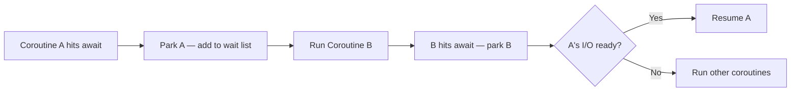
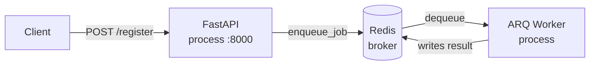

---
tags:
  - DE101
  - backend-6
  - queues
  - async
date: 2026-06-27
status: complete
domain: "6 of 8"
track: backend
---

# B6 — Async, Queues & Background Jobs

**Back to:** [[Backend/00 - Backend Track Roadmap|Backend Track Roadmap]]

> [!NOTE] Domain Overview
> You'll deepen your understanding of Python's async model, implement background task workers, and connect a FastAPI app to a real task queue using ARQ. Message brokers (RabbitMQ, NATS, Kafka) and scheduled jobs round out the production picture.

---

## 6.1 — Async Python Deep Dive

> [!NOTE] Scope
> This section goes beyond the brief intro in [[Backend/B2 - Web & API Fundamentals|B2 §2.0]]. There you learned the syntax — `async def`, `await`. Here you'll learn how the event loop actually schedules work, and how to run multiple things concurrently.

**Concurrency vs parallelism vs threading**

These three terms are frequently confused:

| Term | What it means | Python tool |
|------|--------------|-------------|
| **Concurrency** | Multiple tasks in progress at the same time — but not necessarily simultaneously | `asyncio` — tasks take turns on one thread |
| **Parallelism** | Multiple tasks running simultaneously on multiple CPU cores | `multiprocessing` — separate processes |
| **Threading** | Multiple threads sharing one process — subject to the GIL | `threading` / `ThreadPoolExecutor` |

For I/O-bound work (DB queries, HTTP calls, file reads) — use `asyncio`.
For CPU-bound work (image processing, ML inference, heavy computation) — use a task queue (covered in 6.3), not async.

**Event loop lifecycle**

The event loop is a scheduler that runs coroutines cooperatively. It parks a coroutine whenever it hits an `await`, runs other coroutines in the meantime, and resumes the parked one when its I/O is ready.



No threads. No OS context switches. The programmer explicitly yields control at every `await`.

**`asyncio.gather()` — run multiple coroutines concurrently**

`gather()` starts multiple coroutines at the same time and waits for all of them to finish:

```python
import asyncio
import httpx


async def fetch(client: httpx.AsyncClient, url: str) -> int:
    response = await client.get(url)
    return len(response.text)


async def main() -> None:
    async with httpx.AsyncClient() as client:
        # All three requests start immediately — not sequentially
        results = await asyncio.gather(
            fetch(client, "https://httpbin.org/get"),
            fetch(client, "https://httpbin.org/ip"),
            fetch(client, "https://httpbin.org/uuid"),
        )
    print(results)  # [length1, length2, length3]
```

Without `gather()`, these would run one after another — 3× slower.

If one coroutine raises an exception, `gather()` propagates it immediately — but other already-running tasks **continue running** in the background unless you cancel them manually. Pass `return_exceptions=True` to collect exceptions as values instead of raising.

> [!TIP] `asyncio.TaskGroup` — the Modern Alternative (Python 3.11+)
> `TaskGroup` provides structured concurrency: if any task fails, all others are cancelled automatically — no stray tasks left running.
> ```python
> async with asyncio.TaskGroup() as tg:
>     task_a = tg.create_task(fetch(client, url_a))
>     task_b = tg.create_task(fetch(client, url_b))
> # Both tasks are done here — or both cancelled if one failed
> ```
> Prefer `TaskGroup` in new Python 3.11+ code; use `gather()` when targeting older versions.

**`asyncio.create_task()` — fire and forget**

`create_task()` schedules a coroutine to run on the event loop without waiting for it:

```python
async def send_notification(user_id: int) -> None:
    await asyncio.sleep(1)  # simulate async work
    print(f"Notification sent to {user_id}")


async def handler() -> dict:
    asyncio.create_task(send_notification(user_id=42))  # starts immediately, not awaited
    return {"status": "ok"}  # returns before notification finishes
```

> [!WARNING] Hold a Reference to Tasks
> The event loop only keeps a weak reference to tasks. If you don't store the task object, it can be garbage-collected mid-execution — silently dropped.
> ```python
> # ❌ Task may vanish before it finishes
> asyncio.create_task(send_notification(42))
>
> # ✅ Hold a reference
> background_tasks = set()
> task = asyncio.create_task(send_notification(42))
> background_tasks.add(task)
> task.add_done_callback(background_tasks.discard)
> ```
> For anything that must reliably complete, use FastAPI's `BackgroundTasks` or a real task queue.

> [!WARNING] Don't Block the Event Loop
> The event loop runs on a single thread. Anything that doesn't `await` holds the thread and blocks every other request:
> ❌ `time.sleep(5)` — freezes the server for 5 seconds
> ❌ `requests.get(url)` — synchronous HTTP, blocks the loop
> ❌ A tight `for` loop over millions of items with no `await`
> ✅ `await asyncio.sleep(5)` — yields control
> ✅ `await httpx.AsyncClient().get(url)` — async HTTP
>
> For CPU-heavy work, don't fight the event loop — offload to a task queue (section 6.3).

---

## 6.2 — Background Tasks in FastAPI

> [!NOTE]
> FastAPI's `BackgroundTasks` runs a function after the response is sent — in the same process, on the same event loop. It's a lightweight tool for simple fire-and-forget work.

**Basic usage**

```python
# app/routers/auth.py
import asyncio

from fastapi import APIRouter, BackgroundTasks, Depends
from sqlalchemy.ext.asyncio import AsyncSession

from app.db.session import get_db
from app.schemas.auth import RegisterRequest
from app.core.security import hash_password
from app.models.user import User

router = APIRouter(prefix="/auth", tags=["auth"])


async def send_welcome_email(email: str) -> None:
    # Runs after the 201 response is already sent to the client
    await asyncio.sleep(0.5)  # simulate async email send
    print(f"Welcome email sent to {email}")


@router.post("/register", status_code=201)
async def register(
    body: RegisterRequest,
    background_tasks: BackgroundTasks,
    db: AsyncSession = Depends(get_db),
) -> dict:
    user = User(email=body.email, hashed_password=hash_password(body.password))
    db.add(user)
    await db.commit()

    background_tasks.add_task(send_welcome_email, body.email)  # queued, not awaited
    return {"email": body.email}
```

The client receives `201 Created` immediately. `send_welcome_email` runs afterward on the same event loop.

> [!WARNING] BackgroundTasks Fails Silently
> If `send_welcome_email` raises an unhandled exception, FastAPI logs the error but **the caller receives no indication of failure** — the 201 response was already sent. Never use `BackgroundTasks` for work where silent failure is unacceptable (sending critical emails, charging payments, writing to external systems).

**Limitations — when to graduate to a real task queue**

| Concern | `BackgroundTasks` | Real task queue (ARQ) |
|---------|-------------------|----------------------|
| Survives server restart | ❌ | ✅ |
| Retry on failure | ❌ | ✅ |
| Run on a separate process/server | ❌ | ✅ |
| Monitor job status | ❌ | ✅ |
| Handle CPU-heavy work | ❌ | ✅ |
| Zero setup overhead | ✅ | ❌ (needs Redis) |
| Good for | Short async I/O (analytics ping, non-critical notification) | Anything that must reliably complete |

---

## 6.3 — Task Queues & Workers (ARQ)

> [!NOTE]
> A task queue decouples work from the HTTP request cycle. The FastAPI app (producer) enqueues a job; a separate worker process (consumer) picks it up and runs it. Redis acts as the broker in between.

**Architecture**



The worker is a **separate process** — it runs alongside FastAPI but independently. If FastAPI restarts, jobs already in Redis are not lost. If the worker restarts mid-job, ARQ re-queues the job automatically.

**Install**

```bash
uv add arq
```

ARQ uses the same Redis connection already configured in B3. No new infrastructure needed.

**Define a task function**

```python
# app/worker.py
import httpx
from arq import Retry
from arq.connections import RedisSettings

from app.core.config import settings


async def send_welcome_email(ctx: dict, email: str) -> None:
    """Send a welcome email. Must be idempotent — may run more than once."""
    client: httpx.AsyncClient = ctx["http_client"]
    response = await client.post(
        "https://api.emailprovider.com/send",
        json={"to": email, "template": "welcome"},
    )
    if response.status_code != 200:
        raise Retry(defer=ctx["job_try"] * 5)  # retry with back-off: 5s, 10s, 15s...


async def startup(ctx: dict) -> None:
    """Create shared resources once when the worker starts."""
    ctx["http_client"] = httpx.AsyncClient()


async def shutdown(ctx: dict) -> None:
    """Clean up shared resources when the worker stops."""
    await ctx["http_client"].aclose()


class WorkerSettings:
    functions = [send_welcome_email]
    on_startup = startup
    on_shutdown = shutdown
    redis_settings = RedisSettings.from_dsn(settings.redis_url)
```

> [!IMPORTANT] Every ARQ Task Must Be Idempotent
> ARQ uses **pessimistic execution**: if a worker shuts down while a job is running, the job is cancelled and re-queued. It **will run again** when the worker restarts.
>
> Design every task to be safe when called multiple times:
> - ✅ `INSERT ... ON CONFLICT DO NOTHING` (upsert, not plain insert)
> - ✅ Check before acting: `if not already_sent(email): send()`
> - ✅ Use idempotency keys for external API calls (payment providers, email APIs)
> - ❌ Plain `INSERT` — creates duplicate rows on retry
> - ❌ Decrementing a counter without a guard — double-counted on retry

**`on_startup` / `on_shutdown` — shared resources**

The `ctx` dict is passed to every task function. Create expensive resources (DB sessions, HTTP clients, connection pools) once in `on_startup` — not inside each task call:

```python
# ❌ Opens a new HTTP client for every job — wasteful
async def send_email(ctx: dict, email: str) -> None:
    async with httpx.AsyncClient() as client:   # created and destroyed each time
        await client.post(...)

# ✅ Reuse the client created once at startup
async def send_email(ctx: dict, email: str) -> None:
    client: httpx.AsyncClient = ctx["http_client"]  # already open
    await client.post(...)
```

**Enqueue from a FastAPI route (producer)**

```python
# app/routers/auth.py
from arq.connections import ArqRedis
from fastapi import APIRouter, Depends
from fastapi import Request

from app.dependencies.arq import get_arq

router = APIRouter(prefix="/auth", tags=["auth"])


@router.post("/register", status_code=201)
async def register(
    body: RegisterRequest,
    db: AsyncSession = Depends(get_db),
    arq: ArqRedis = Depends(get_arq),
) -> dict:
    user = User(email=body.email, hashed_password=hash_password(body.password))
    db.add(user)
    await db.commit()

    await arq.enqueue_job("send_welcome_email", body.email)
    return {"email": body.email}
```

Wire the ARQ connection pool into FastAPI's lifespan:

```python
# app/dependencies/arq.py
from arq import create_pool
from arq.connections import ArqRedis, RedisSettings
from fastapi import Request

from app.core.config import settings


async def get_arq(request: Request) -> ArqRedis:
    return request.app.state.arq
```

```python
# app/main.py
from contextlib import asynccontextmanager
from arq import create_pool
from arq.connections import RedisSettings
from fastapi import FastAPI

from app.core.config import settings


@asynccontextmanager
async def lifespan(app: FastAPI):
    app.state.arq = await create_pool(RedisSettings.from_dsn(settings.redis_url))
    yield
    await app.state.arq.aclose()


app = FastAPI(lifespan=lifespan)
```

**Run the worker**

```bash
# In a separate terminal (or separate Docker container in production)
arq app.worker.WorkerSettings
```

> [!TIP] Job Deduplication with `_job_id`
> To prevent the same job from being enqueued twice (e.g., don't send two welcome emails to the same user), pass a stable `_job_id`. If a job with that ID is already queued or running, `enqueue_job` returns `None` silently:
> ```python
> await arq.enqueue_job("send_welcome_email", body.email, _job_id=f"welcome:{user.id}")
> ```

**Celery — the industry standard**

`Celery` is the most widely used Python task queue — you'll encounter it in most existing Python backends. It has a richer ecosystem (beat scheduler, Flower monitoring, multiple broker support) but uses synchronous workers by default and requires more configuration. ARQ is simpler for async-native FastAPI projects. Celery docs: https://docs.celeryq.dev

---

## 6.4 — Message Queues: RabbitMQ, NATS, Kafka (Conceptual)

> [!NOTE]
> Task queues (ARQ, Celery) are for running jobs in the background. Message queues are for **decoupling services** — one service publishes an event, multiple services consume it independently. No hands-on setup required; ARQ from 6.3 is the practical day-1 tool.

**What message queues solve**

A task queue is point-to-point: one producer, one worker per job. A message queue enables:

- **Fan-out**: one event → multiple independent consumers (e.g., `user.registered` → email service + analytics service + CRM)
- **Decoupling**: the publisher doesn't know or care who consumes
- **Replay**: consumers can reprocess past events (Kafka only)
- **Durability**: events survive consumer downtime

**Broker comparison**

| | RabbitMQ | NATS | Kafka |
|--|----------|------|-------|
| **Delivery guarantee** | At-least-once (with acks) | At-most-once (default) / at-least-once (JetStream) | At-least-once |
| **Message ordering** | Per-queue | Per-subject | Per-partition |
| **Persistence / replay** | Limited | JetStream only | ✅ Full log replay |
| **Throughput** | Medium | High | Very high |
| **Best for** | Task routing, RPC patterns | Lightweight pub/sub, microservices | High-volume event streaming, audit logs |
| **Complexity** | Medium | Low | High |

**When to pick each**

- **RabbitMQ** — you need flexible routing (exchanges, bindings), RPC-style request-reply, or you're in a .NET/Java ecosystem where it's already used
- **NATS** — you want simple pub/sub with minimal ops overhead; latency-sensitive internal services
- **Kafka** — you need event replay, audit trails, high-throughput pipelines, or you're connecting to a data engineering platform (see [[DataEngineering/D5 - Stream Processing|D5]] for the DE perspective)

> [!NOTE] What to Learn First
> Choose a broker based on your team's existing stack. In most intern-level backend roles, you'll encounter RabbitMQ or Redis pub/sub before Kafka. Kafka is a data engineering tool as much as a backend one — if your team uses it, read [[DataEngineering/D5 - Stream Processing|D5]] alongside this section.

---

## 6.5 — Scheduled Jobs

> [!NOTE]
> Scheduled jobs run on a timer rather than on demand. Common uses: sending weekly digest emails, purging expired sessions, generating nightly reports, retrying stale records.

**Option 1: ARQ cron jobs (if you're already using ARQ)**

ARQ has built-in cron support — no additional library needed:

```python
# app/worker.py
from arq import cron
from sqlalchemy.ext.asyncio import AsyncSession, create_async_engine, async_sessionmaker

from app.core.config import settings as app_settings


async def purge_expired_tokens(ctx: dict) -> None:
    """Delete expired JWT revocation records. Safe to run multiple times."""
    session: AsyncSession = ctx["db_session_factory"]()
    async with session:
        await session.execute(text("DELETE FROM revoked_tokens WHERE expires_at < NOW()"))
        await session.commit()


async def send_weekly_digest(ctx: dict) -> None:
    """Send weekly digest emails to all active users."""
    ...


async def startup(ctx: dict) -> None:
    """Create shared resources once when the worker starts."""
    import httpx
    ctx["http_client"] = httpx.AsyncClient()
    engine = create_async_engine(app_settings.database_url)
    ctx["db_session_factory"] = async_sessionmaker(engine, expire_on_commit=False)


async def shutdown(ctx: dict) -> None:
    """Clean up shared resources when the worker stops."""
    await ctx["http_client"].aclose()


class WorkerSettings:
    functions = [send_welcome_email]
    cron_jobs = [
        cron(purge_expired_tokens, hour=3, minute=0),          # 3:00 AM daily
        cron(send_weekly_digest, weekday=0, hour=9, minute=0), # Monday 9:00 AM
    ]
    on_startup = startup
    on_shutdown = shutdown
    redis_settings = RedisSettings.from_dsn(app_settings.redis_url)
```

ARQ cron runs inside the existing worker process — no extra service needed.

**Option 2: APScheduler (standalone scheduler, no task queue needed)**

If you're not using ARQ, `APScheduler` v3 runs inside the FastAPI process:

```bash
uv add "apscheduler>=3,<4"
```

> [!WARNING] APScheduler Version
> APScheduler v4 is a complete API rewrite — code written for v3 does not work on v4. Pin explicitly with `"apscheduler>=3,<4"`.

```python
# app/scheduler.py
from apscheduler.schedulers.asyncio import AsyncIOScheduler
from apscheduler.triggers.cron import CronTrigger
from apscheduler.triggers.interval import IntervalTrigger

scheduler = AsyncIOScheduler()


async def cleanup_old_sessions() -> None:
    print("Cleaning up expired sessions...")


async def health_ping() -> None:
    print("Service alive")


def start_scheduler() -> None:
    scheduler.add_job(cleanup_old_sessions, CronTrigger(hour=2, minute=30))  # 2:30 AM daily
    scheduler.add_job(health_ping, IntervalTrigger(minutes=5))
    scheduler.start()


def stop_scheduler() -> None:
    scheduler.shutdown()
```

```python
# app/main.py — wire into lifespan
@asynccontextmanager
async def lifespan(app: FastAPI):
    start_scheduler()
    app.state.arq = await create_pool(RedisSettings.from_dsn(settings.redis_url))
    yield
    stop_scheduler()
    await app.state.arq.aclose()
```

**Choosing a scheduling approach**

| | ARQ cron | APScheduler | System cron / ADF |
|--|----------|-------------|-------------------|
| Requires ARQ/Redis | ✅ Yes | ❌ No | ❌ No |
| Survives server restart | ✅ (Redis-backed) | ❌ (in-process) | ✅ |
| Visible in worker logs | ✅ | Partial | ✅ |
| Good for | Projects already using ARQ | Simple interval/cron without Redis | Production-critical schedules |

> [!WARNING] In-Process Schedulers Are Not Production-Critical
> APScheduler runs inside your FastAPI process. If the server crashes or restarts mid-schedule, the job may not run. For schedules that **must not be missed** (billing jobs, compliance reports), use an external orchestrator — Azure Data Factory (covered in [[DataEngineering/D6 - Cloud & Orchestration|D6]]) or a dedicated cron service.

---

## ✅ Practice Checklist

- [ ] Use `asyncio.gather()` to make 3 HTTP requests concurrently and compare the time to sequential requests
- [ ] Identify a slow endpoint in your app and refactor it to use `FastAPI.BackgroundTasks` — verify the response time improves
- [ ] Define an ARQ task function that sends a welcome email — make it idempotent (safe to run twice without side effects)
- [ ] Wire an ARQ connection pool into FastAPI's lifespan using `create_arq_pool` / `close_arq_pool`
- [ ] Enqueue a job from a FastAPI route and verify it appears in the ARQ worker logs
- [ ] Add `on_startup` and `on_shutdown` to `WorkerSettings` and share an `httpx.AsyncClient` via `ctx`
- [ ] Implement retry with `raise Retry(defer=ctx["job_try"] * 5)` and observe the back-off in worker logs
- [ ] Add a cron job to `WorkerSettings` that runs every minute — verify it fires in the worker logs
- [ ] Draw the producer → broker → worker architecture from memory, labeling which process runs where
- [ ] Explain to a colleague: why must every ARQ task be idempotent?

## 📚 Domain References

| Resource | Use For |
|----------|---------|
| https://docs.python.org/3/library/asyncio.html | asyncio — full reference |
| https://docs.python.org/3/library/asyncio-task.html | gather(), create_task(), TaskGroup |
| https://arq-docs.helpmanual.io | ARQ — task queue and cron docs |
| https://docs.celeryq.dev | Celery — industry-standard task queue |
| https://www.rabbitmq.com/documentation.html | RabbitMQ docs |
| https://nats.io/documentation/ | NATS docs |
| https://kafka.apache.org/documentation/ | Kafka docs |
| https://apscheduler.readthedocs.io/en/3.x/ | APScheduler v3 — scheduler reference |
| https://fastapi.tiangolo.com/tutorial/background-tasks/ | FastAPI BackgroundTasks docs |

## 🃏 Quick-Reference Flash Cards

**Q:** What is the difference between concurrency and parallelism?
**A:** Concurrency means multiple tasks are in progress at the same time but taking turns on one thread (asyncio). Parallelism means tasks run simultaneously on multiple CPU cores (multiprocessing). Async Python is concurrent, not parallel.

**Q:** What does `asyncio.gather()` do?
**A:** Starts multiple coroutines concurrently and waits for all of them to finish, returning their results as a list. Without it, coroutines run sequentially even inside an async function.

**Q:** What is the main limitation of FastAPI's `BackgroundTasks`?
**A:** It runs in the same process as FastAPI. Jobs are lost if the server restarts, there is no retry on failure, and exceptions fail silently — the caller already received a 200/201 response.

**Q:** What does "idempotent" mean for an ARQ task, and why does it matter?
**A:** An idempotent task produces the same result whether it runs once or many times. ARQ re-queues jobs if the worker restarts mid-execution — so every task may run more than once and must be safe to do so (upsert not insert, check before acting, use idempotency keys).

**Q:** What is the role of `on_startup` and `on_shutdown` in an ARQ `WorkerSettings`?
**A:** `on_startup` runs once when the worker process starts and populates `ctx` with shared resources (HTTP client, DB pool). `on_shutdown` cleans them up. Task functions access these via `ctx` instead of creating them per-job.

**Q:** How do you prevent the same ARQ job from being enqueued twice?
**A:** Pass a stable `_job_id` to `enqueue_job`. If a job with that ID is already queued or running, `enqueue_job` returns `None` without creating a duplicate.

**Q:** How do you retry a failed ARQ job with increasing back-off?
**A:** Raise `Retry(defer=ctx["job_try"] * 5)` inside the task function. `ctx["job_try"]` increments each attempt, producing delays of 5s, 10s, 15s... up to `max_tries` (default: 5).

**Q:** What is the difference between a task queue (ARQ) and a message queue (RabbitMQ/Kafka)?
**A:** A task queue is point-to-point: one producer enqueues a job, one worker runs it. A message queue enables fan-out (one event → multiple independent consumers), decoupling, and in Kafka's case, full event replay.

**Q:** When should you use ARQ cron vs APScheduler?
**A:** Use ARQ cron if you're already using ARQ — no extra library, runs inside the worker, Redis-backed so schedules survive restarts. Use APScheduler when you need scheduling without a Redis/task queue dependency.

**Q:** Why shouldn't you use `time.sleep()` inside an `async def` function?
**A:** `time.sleep()` is synchronous — it blocks the entire event loop thread, preventing all other requests from being processed for the sleep duration. Use `await asyncio.sleep()` instead, which yields control back to the loop.

*Checkpoint: [[Backend/Checkpoints/CB6 - Queue & Workers Running|CB6]]*

*Previous: [[Backend/B5 - Testing & Code Quality|B5]] | Next: [[Backend/B7 - Microservices & Containers|B7]]*
