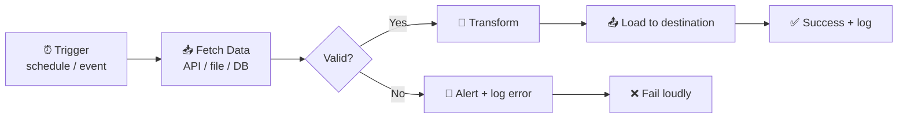
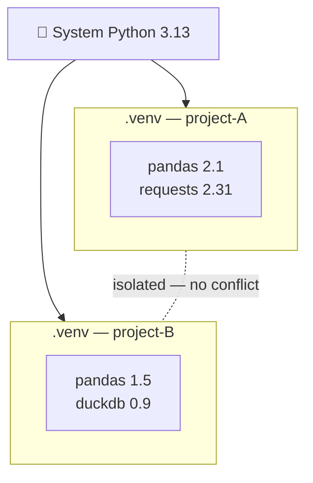
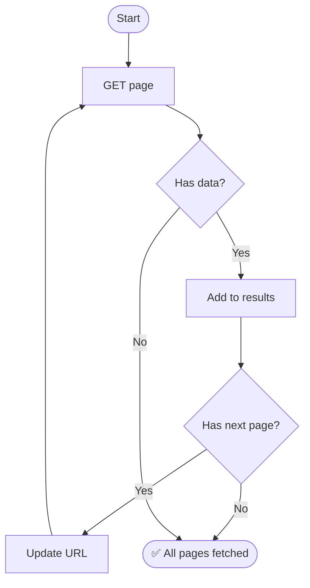
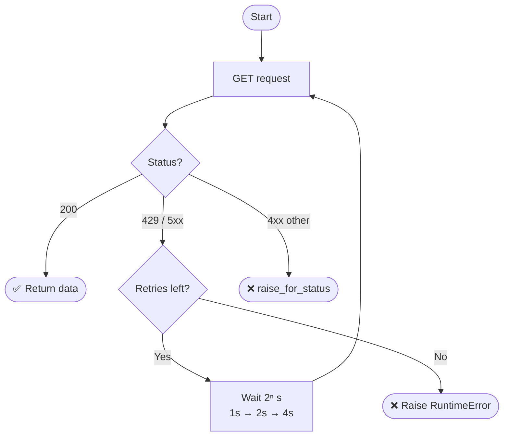
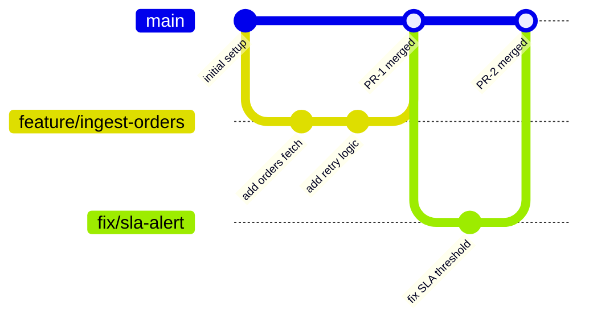

---
tags:
  - DE101
  - domain-1
  - foundations
date: 2026-06-20
status: complete
domain: "1 of 7"
track: data-engineering
---

# D1 — Foundations & Tooling

**Back to:** [[00 - Onboarding Roadmap]]

> [!NOTE] Domain Overview
> This domain bridges the gap from **Data Analyst → Data Engineer**. You'll shift from consuming data to building the systems that produce it, and pick up the core tooling every DE uses daily.

> [!TIP] Already completed B1?
> If you've completed [[Backend/B1 - Foundations & Dev Setup|B1 — Foundations & Dev Setup]] from the Backend track, you can skim §1.1–1.5. Focus on **§1.6 — Dev Environment & DuckDB Setup**, which covers DuckDB and tooling specific to the Data Engineering track.

---

## 1.1 — Analyst → Engineer Mindset

> [!IMPORTANT] The Core Shift
> As a Data Analyst, your job is to **answer questions** with data. As a Data Engineer, your job is to **build systems that can answer questions reliably, automatically, at scale** — even when data is late, malformed, or the team has 10× more users next year.
>
> You're moving from *consumer* to *producer* of data infrastructure.

### DA vs DE: Side-by-Side

| | Data Analyst | Data Engineer |
|---|---|---|
| **Primary question** | "What does the data say?" | "How do we get clean data, reliably?" |
| **Daily work** | Queries, dashboards, reports | Pipelines, ingestion, transformation code |
| **Tools** | SQL, Excel, Tableau, Power BI | Python, SQL, Spark, Docker, Azure Data Factory / Airflow *(orchestration)* |
| **Success metric** | Insight delivered | Pipeline uptime, data freshness, SLA *(Service Level Agreement — the freshness/uptime promise you commit to)* met |
| **Failure mode** | Wrong interpretation | Broken pipeline, stale data, silent data loss |
| **Thinks about** | What the data means | Where data comes from and where it goes |

### The 4 Key Mental Shifts

**1. Think in pipelines, not one-off queries**
An analyst runs a query. An engineer writes code that runs that query automatically, every hour, validates the output, and alerts when something goes wrong. Your work should run without you.



**2. Design for failure — data will be late, broken, or missing**
Upstream APIs go down. Files arrive with wrong column names. Timestamps are in the wrong timezone. A good pipeline expects this and handles it gracefully instead of silently producing wrong numbers.

**3. Automate everything — if it's manual, it's fragile**
If a step in your process requires a human to click a button or run a script manually, it *will* eventually be forgotten. Engineers automate the boring parts so humans only deal with the interesting problems.

**4. Scale your assumptions — design for 1000× today's data**
A loop through 1,000 rows works fine today. At 10 million rows next year, it breaks. Think early about whether your approach still holds at 10× or 100× scale.

> [!EXAMPLE] Before and After
> **Analyst:** "The weekly revenue report shows a dip on Tuesday. Let me investigate..."
>
> **Engineer:** "The revenue pipeline failed silently at 2 AM Tuesday because the upstream API returned a `429` (rate limit). We need retry logic, an alert, and a data freshness check so the dashboard shows 'stale' instead of wrong numbers."
>
> The analyst asks *what happened*. The engineer asks *why it broke* and *how to prevent it*.

> [!WARNING] Common Transition Anti-Patterns
> - ❌ **Writing one-off scripts** — your "quick script" becomes undocumented tech debt that only you can run. Write reusable, parameterized code from the start.
> - ❌ **Skipping error handling** — a silent catch-all `try/except` is as dangerous as no handling at all. Be explicit: log the failure, raise an alert, and let the pipeline fail loudly so bad data never flows downstream unnoticed.
> - ❌ **Thinking in single runs** — your code will run thousands of times. Make it **idempotent** *(safe to re-run — running your pipeline twice must produce the same result as running it once, no duplicate rows, no data corruption)*.

> [!TIP] 🏋️ Mini Exercise — Think Like an Engineer
> Pick any analyst task (a weekly report, a file you manually download and clean, a query you run on demand). Sketch how you'd turn it into a resilient pipeline:
> - What triggers it? (schedule, API event, file arrival?)
> - What can go wrong, and how does the pipeline *detect* it?
> - What tells you it ran successfully — or didn't?

---

## 1.2 — Python for Data Engineering

> [!NOTE] What This Section Covers
> Python is the primary language of data engineering — not for analysis, but for **building systems that move, transform, and validate data**. This section focuses on writing production-grade Python: parameterized, logged, and reproducible.

### Write Code That Can Run Without You

The biggest shift from analyst-style Python: moving from *"a script I run manually"* to *"a function that runs automatically, 100 times, and always produces the same result"*.

```python
# ❌ Analyst style — hardcoded, not reusable
input_file = "/Users/me/data/march_sales.csv"

# ✅ Engineer style — parameterized, reusable
import argparse

def process_sales(input_path: str, output_path: str) -> None:
    ...

if __name__ == "__main__":
    parser = argparse.ArgumentParser()
    parser.add_argument("--input", required=True)
    parser.add_argument("--output", required=True)
    args = parser.parse_args()
    process_sales(args.input, args.output)
```

### Use `pathlib` for File Paths

> [!IMPORTANT] `pathlib` over string paths
> `pathlib.Path` is the modern, cross-platform way to handle file paths — readable, chainable, and works the same on Windows and Linux.

```python
from pathlib import Path

data_dir = Path("data")
input_file = data_dir / "sales.csv"
output_file = data_dir / "output" / "cleaned.csv"

output_file.parent.mkdir(parents=True, exist_ok=True)  # create dirs if missing
```

### Log, Don't Print

> [!IMPORTANT] Structured Logging is Non-Negotiable
> `print()` disappears in production. Use Python's built-in `logging` module — it gives you timestamps, severity levels, and the ability to route logs to monitoring systems and alerting tools.

| Level | Use For |
|-------|---------|
| `DEBUG` | Detailed diagnostics — off in production |
| `INFO` | Normal progress — "Loaded 10,000 rows" |
| `WARNING` | Unexpected but recoverable |
| `ERROR` | A step failed — pipeline may still continue |
| `CRITICAL` | Fatal — pipeline cannot continue |

```python
import logging
from pathlib import Path

logging.basicConfig(
    level=logging.INFO,
    format="%(asctime)s %(levelname)s %(message)s"
)
logger = logging.getLogger(__name__)

def process_sales(input_path: str, output_path: str) -> None:
    logger.info(f"Reading from {input_path}")
    # ... processing logic ...
    logger.info(f"Wrote output to {output_path}")
```

### Virtual Environments — Always

> [!IMPORTANT] One Project, One Environment
> A virtual environment isolates your project's dependencies so they don't conflict with other projects or your system Python.

```bash
# Create
python -m venv .venv

# Activate (macOS/Linux)
source .venv/bin/activate

# Activate (Windows)
.venv\Scripts\activate

# Install and save dependencies
pip install -r requirements.txt
pip freeze > requirements.txt
```



> [!WARNING] Common Anti-Patterns
> - ❌ **Using `print()` in pipelines** — switch to `logging.info()` / `logging.error()`; `print()` is invisible to monitoring systems
> - ❌ **Hardcoding file paths as strings** — use `pathlib.Path` and parameterize inputs/outputs
> - ❌ **Skipping virtual environments** — dependency conflicts will silently break your pipeline on another machine or in production
> - ❌ **Magic strings** — avoid embedding raw string literals directly in logic. A typo in `"compelted"` vs `"completed"` silently breaks your pipeline with no error. Use named constants instead:
>
> ```python
> # ❌ Magic string — fragile and untraceable
> if status == "completed":
>     ...
>
> # ✅ Named constant — one place to change, easy to grep
> STATUS_COMPLETED = "completed"
>
> if status == STATUS_COMPLETED:
>     ...
> ```

---

## 1.3 — REST APIs for Data Ingestion

> [!TIP] Analyst Upgrade
> Analysts usually consume data from dashboards. Engineers often need to **pull data from APIs**. This is a key mindset shift.

### HTTP Basics

| Concept | What it means |
|---------|--------------|
| `GET` | Fetch data — no side effects |
| `POST` | Send data — creates or triggers something |
| `200 OK` | Success |
| `400 Bad Request` | Your request has an error |
| `401 / 403` | Auth failed / not authorized |
| `429 Too Many Requests` | Rate limited — slow down |
| `500 Server Error` | Their problem — retry with backoff |

### Calling APIs with `requests`

```python
import requests

response = requests.get(
    "https://api.example.com/v1/orders",
    headers={"Authorization": "Bearer YOUR_TOKEN"},
    params={"status": "completed", "limit": 100}
)

response.raise_for_status()  # raises an exception on 4xx/5xx — always include this
data = response.json()
```

> [!IMPORTANT] Always call `raise_for_status()`
> Without it, a `404` or `500` silently returns an empty or malformed result. `raise_for_status()` turns HTTP errors into Python exceptions you can catch and handle explicitly.

### Pagination

Most APIs don't return all records in one call. Two common patterns:

**Offset-based:**
```python
results = []
offset = 0
limit = 100

while True:
    response = requests.get(url, params={"limit": limit, "offset": offset})
    response.raise_for_status()
    page = response.json().get("data", [])
    if not page:
        break
    results.extend(page)
    offset += limit
```

**Cursor-based (follow `next` URL):**
```python
results = []
url = "https://api.example.com/v1/orders"

while url:
    response = requests.get(url, headers=headers)
    response.raise_for_status()
    body = response.json()
    results.extend(body["data"])
    url = body.get("next")  # None on last page
```



### Auth Patterns

| Pattern | How it works | Where you'll see it |
|---------|-------------|-------------------|
| **API Key in header** | `"X-Api-Key": "abc123"` | Simple REST APIs |
| **Bearer Token** | `"Authorization": "Bearer <token>"` | OAuth2, most modern APIs |
| **Basic Auth** | `requests.get(url, auth=("user", "pass"))` | Legacy systems |

### Retry with Exponential Backoff

> [!IMPORTANT] Exponential backoff
> A retry strategy where the wait time doubles after each failed attempt (1s → 2s → 4s). Prevents hammering a rate-limited API and gives transient failures time to recover.

```python
import time
import logging
import requests

logger = logging.getLogger(__name__)

def get_with_retry(url: str, headers: dict, max_retries: int = 3) -> dict:
    for attempt in range(max_retries):
        response = requests.get(url, headers=headers)
        if response.status_code == 429 or response.status_code >= 500:
            wait = 2 ** attempt  # 1s, 2s, 4s
            logger.warning(f"Status {response.status_code}. Retrying in {wait}s...")
            time.sleep(wait)
            continue
        response.raise_for_status()
        return response.json()
    raise RuntimeError(f"Failed after {max_retries} retries: {url}")
```



> [!WARNING] Common Anti-Patterns
> - ❌ **No retry on `429`/`5xx`** — transient failures silently drop data
> - ❌ **Hardcoding API keys in source code** — use environment variables: `os.environ["API_TOKEN"]` or a `.env` file (add `.env` to `.gitignore`)
> - ❌ **Not handling pagination** — you'll think you fetched all records but you've only seen page 1

---

## 1.4 — Git & Version Control

> [!IMPORTANT] Git is Non-Negotiable for Data Engineers
> Every pipeline, transformation, and config file you write lives in Git. Without it, you cannot roll back a breaking change, collaborate safely, or prove what code ran in production on a given day.

### Core Workflow

```bash
# Start a new project
git init my-pipeline && cd my-pipeline

# Or clone an existing repo
git clone https://github.com/org/repo.git

# Stage, review, commit
git add .
git status                             # review what's staged
git commit -m "feat: add CSV ingestion pipeline"

# Sync with remote
git push origin main
git pull origin main
```

### Branching — One Feature, One Branch

```bash
git checkout -b feature/ingest-orders    # create + switch
# ... make changes ...
git add .
git commit -m "feat: add orders ingestion with retry logic"
git push origin feature/ingest-orders
# → open a Pull Request on GitHub
```

### Enterprise Git Strategy — GitHub Flow

> [!IMPORTANT] GitHub Flow — The Recommended Standard
> **GitHub Flow** is the most widely used Git strategy in modern data and software engineering teams:
>
> 1. `main` is **always deployable** — no broken code on main, ever
> 2. All work happens on a **short-lived feature branch** (`feature/`, `fix/`, `chore/`)
> 3. Push the branch and open a **Pull Request** on GitHub
> 4. At least one teammate **reviews and approves** the PR
> 5. Branch is **merged into `main`** (squash merge recommended)
> 6. Feature branch is **deleted** after merge
>
> **Gitflow** (with `develop`, `release`, `hotfix` branches) is the heavier alternative used in orgs with formal release cycles — but GitHub Flow handles 90% of real-world DE team needs.



### `.gitignore` for DE Projects

Always create `.gitignore` before your first commit:

```gitignore
# Python
.venv/
__pycache__/
*.pyc

# Data files — never commit raw data
data/
*.csv
*.parquet
*.json

# Secrets
.env
*.key
credentials.json

# IDE
.vscode/
.idea/
```

> [!WARNING] Common Anti-Patterns
> - ❌ **Committing secrets or credentials** — once pushed, they're in git history forever; use `.env` + `.gitignore`
> - ❌ **Committing large data files** — git is not a data lake; store data in Azure Blob / ADLS Gen2
> - ❌ **Pushing directly to `main`** — always use a feature branch + PR, even when working alone

---

## 1.5 — Linux & Command Line

> [!NOTE] Why Linux for Data Engineers
> Cloud servers, Databricks clusters, Docker containers, and CI/CD pipelines all run Linux. Being comfortable on the command line means you can inspect, debug, and fix pipelines in any environment — not just your laptop.

### Navigation

```bash
pwd                       # where am I?
ls -la                    # list all files (including hidden)
cd /path/to/dir           # change directory
cd ..                     # go up one level
mkdir -p data/raw         # create nested directories
```

### File Operations

```bash
cp source.csv backup.csv          # copy
mv old_name.csv new_name.csv      # rename / move
rm processed.csv                  # delete file
rm -rf old_dir/                   # delete directory (careful!)
```

### Inspecting Data Files

```bash
cat data.csv              # print entire file
head -n 20 data.csv       # first 20 lines
tail -n 20 data.csv       # last 20 lines
wc -l data.csv            # count lines (≈ row count)
```

### Searching

```bash
grep "ERROR" pipeline.log           # find lines containing "ERROR"
grep -i "timeout" pipeline.log      # case-insensitive
grep -rn "api_key" ./src/           # recursive search in directory
find . -name "*.parquet"            # find files by pattern
find . -name "*.log" -mtime -1      # files modified in last 24h
```

### Pipes & Redirection

```bash
# Pipe: pass output of one command as input to the next
cat pipeline.log | grep "ERROR" | wc -l    # count error lines

# Redirect output to file
python run_pipeline.py > output.log 2>&1   # stdout + stderr to file
python run_pipeline.py >> output.log       # append (don't overwrite)
```

> [!TIP] The Pipe Operator is Your Swiss Army Knife
> `command1 | command2` chains tools together. Most DE debugging on a remote server is just combinations of `cat`, `grep`, `head`, `tail`, and `wc` piped together.

### Permissions Basics

```bash
ls -la           # shows: -rw-r--r-- (owner / group / others)
chmod +x run.sh  # make a script executable
./run.sh         # run it
```

> [!IMPORTANT] Reading the permission string
> `-rw-r--r--` means: owner can read+write, group can read, others can read. The `x` bit means executable — shell scripts need it to run as `./script.sh`.

> [!WARNING] Common Anti-Patterns
> - ❌ **`rm -rf` without verifying the path** — there is no undo; use `echo rm -rf <path>` first to preview
> - ❌ **Running everything as root** — use a non-root user; root mistakes are unrecoverable

---

## 1.6 — Dev Environment Setup

> [!TIP] Goal: Fully Working Environment in < 30 Minutes
> By the end of this section you'll have modern Python, isolated dependencies, Git configured, DuckDB for local SQL, and a container runtime ready to go.

### Step 1 — Python 3.13+

```bash
python3 --version   # check: should be 3.13.x or higher
```

If not installed, use `pyenv` (lets you manage multiple Python versions per project):

```bash
# macOS
brew install pyenv
pyenv install 3.13
pyenv global 3.13
```

Or download directly from [python.org](https://www.python.org/downloads/).

### Step 2 — Virtual Environment

```bash
cd my-de-project
python -m venv .venv
source .venv/bin/activate        # macOS/Linux
# .venv\Scripts\activate         # Windows

pip install --upgrade pip
pip install duckdb pandas requests
pip freeze > requirements.txt
```

### Step 3 — VS Code

Install from [code.visualstudio.com](https://code.visualstudio.com/). Recommended extensions:

| Extension | Purpose |
|-----------|---------|
| Python (Microsoft) | Linting, IntelliSense, debugger |
| Pylance | Fast type checking |
| DuckDB SQL Tools | Run SQL against DuckDB from VS Code |
| GitLens | Enhanced Git history and blame |

### Step 4 — Git Config

```bash
git config --global user.name "Your Name"
git config --global user.email "you@example.com"
git config --global init.defaultBranch main
```

### Step 5 — DuckDB First Query

```python
import duckdb

# Query a CSV file directly — no database server needed
result = duckdb.sql("SELECT * FROM 'data/sales.csv' LIMIT 5").df()
print(result)
```

> [!NOTE] Why DuckDB?
> DuckDB is an embedded analytical SQL engine — no server, no config, installs in seconds with `pip install duckdb`. It reads `.csv`, `.parquet`, and `.json` files directly with standard SQL. You'll use it throughout [[D2 - SQL & Data Modeling]] and [[D3 - Data Storage & Formats]].

### Step 6 — Container Runtime: Docker or Podman

**Docker Desktop** (easiest for beginners):
```bash
# Download: docker.com/products/docker-desktop
docker run hello-world    # verify it works
```

**Podman** (preferred in enterprise / Linux environments):
```bash
# macOS
brew install podman
podman machine init && podman machine start

podman run hello-world    # same syntax as docker
```

> [!TIP] Which should I use?
> Use **Docker Desktop** on a personal machine. Use **Podman** if your organization restricts the Docker daemon or you're on a corporate Linux machine. Podman is daemonless and rootless — no background service required.

> [!WARNING] Common Anti-Patterns
> - ❌ **Using system Python** — `pip install` into system Python causes dependency conflicts and can break OS tools
> - ❌ **Skipping virtual environments** — always activate `.venv` before installing anything
> - ❌ **Storing secrets in `.py` files** — use `.env` files + `python-dotenv`, and add `.env` to `.gitignore`

---

## ✅ Practice Checklist

- [ ] Write a Python script that reads a CSV using `pathlib`, processes rows, and logs progress and errors with the `logging` module — no `print()` allowed
- [ ] Fetch at least one paginated response from a public API (e.g., GitHub API, OpenLibrary API) using `requests`, iterating through all pages
- [ ] Create a GitHub repo, make a feature branch, commit meaningful changes, push, and open a Pull Request
- [ ] Use `grep` and pipes in the terminal to find all `ERROR` lines in a log file and count them with `wc -l`
- [ ] Set up a fresh project with a `.venv`, install DuckDB, and run a `SELECT` query on a local CSV file
- [ ] Verify your container runtime: `docker run hello-world` or `podman run hello-world`

---

## 📚 Domain References

| Resource | Use For |
|----------|---------|
| https://github.com/andkret/Cookbook/blob/master/sections/02-BasicSkills.md | Foundations overview: Git, Linux, Docker, Cloud |
| https://git-scm.com/book/en/v2 | Pro Git — free, comprehensive Git reference |
| https://docs.python.org/3/tutorial/ | Official Python tutorial |
| https://realpython.com/python-requests/ | REST APIs with Python `requests` library |
| https://linuxcommand.org/lc3_learning_the_shell.php | Linux command line basics |
| https://roadmap.sh/python | Python learning path |
| https://duckdb.org/docs/ | DuckDB — SQL on files, no setup |

---

## 🃏 Quick-Reference Flash Cards

**Q:** What is the difference between `logging.info()` and `print()` in a production pipeline?
**A:** `logging.info()` includes timestamps and severity levels, and can be routed to monitoring and alerting systems. `print()` only goes to stdout and is invisible to any observability tooling.

**Q:** What does idempotent mean for a data pipeline?
**A:** Running the pipeline twice produces the same result as running it once — no duplicate rows, no data corruption.

**Q:** What does `raise_for_status()` do when calling an API?
**A:** It raises a Python exception if the HTTP response was a `4xx` or `5xx` error, so you never silently process an empty or error response as valid data.

**Q:** What is exponential backoff?
**A:** A retry strategy where wait time doubles after each failure (1s → 2s → 4s). Used after `429` or `500` responses to avoid overwhelming an API.

**Q:** What is GitHub Flow?
**A:** A Git strategy where `main` is always deployable, all work goes on a feature branch, and every change requires a Pull Request review before merging.

**Q:** What files must always be in `.gitignore` for a DE project?
**A:** `.env` (secrets), `data/` + `*.csv`/`*.parquet` (raw data), `.venv/` (virtual environment), `__pycache__/`.

**Q:** Why use DuckDB instead of SQLite for data engineering?
**A:** DuckDB is an analytical (OLAP) engine optimized for columnar queries on large files. It reads `.csv`, `.parquet`, and `.json` directly with SQL — no server, no import step. SQLite is optimized for transactional (OLTP) row-level writes, not analytical workloads.

**Q:** What is `pyenv` and why use it?
**A:** `pyenv` is a Python version manager that lets you install and switch between multiple Python versions per project — so your project isn't locked to whatever version your OS ships with.

---

*Checkpoint: [[Checkpoints/CP1 - Tooling & Environment Ready|CP1 - Tooling & Environment Ready]]*

---

*Next: [[D2 - SQL & Data Modeling]]*
