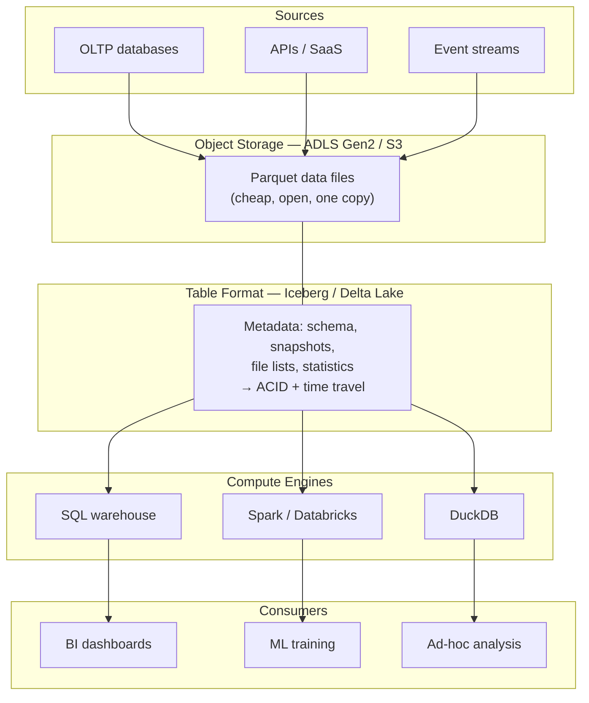
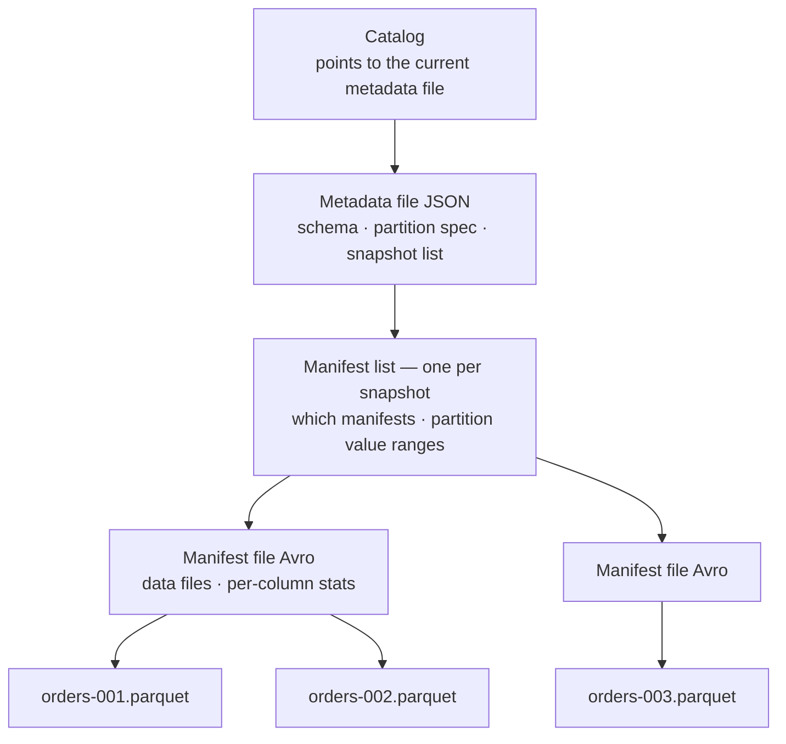
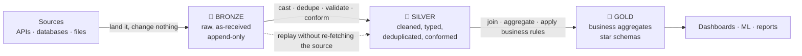

---
tags:
  - DE101
  - domain-3
  - storage
  - data-formats
date: 2026-06-20
status: complete
domain: "3 of 7"
track: data-engineering
---

# D3 — Data Storage & Formats

**Back to:** [[00 - Onboarding Roadmap]]

> [!NOTE] Domain Overview
> This domain covers **where data lives and how it's structured on disk**. You'll learn the fundamental OLTP vs OLAP split, common storage paradigms, and the file formats every DE works with daily. By the end you'll be able to look at a pile of files in cloud storage and say — with reasons — what format they should be in, how they should be laid out, and which engine should read them.

> [!TIP] How to Read This Domain
> Eight sections, and they are not equally important.
> - **§3.1 and §3.4 are the foundation** — row vs column, and Parquet. Everything else builds on these.
> - **§3.6 is the highest-value section for your first job.** File layout is the single biggest lever you'll have over query cost, and it's where new engineers most often get it wrong.
> - **§3.2 is orientation** — you'll read *from* these systems, not build them.
> - **§3.8 is optional.** Skip it unless you're heading toward AI workloads; [[D7 - AI-Ready Data Engineering]] covers it properly.

> [!TIP] Your Lab Bench for This Domain
> Every hands-on example below runs in DuckDB with no server and no cloud account. Five commands carry the whole domain — §3.7 explains them in depth, but you only need these to follow along:
> ```sql
> SELECT * FROM 'data.parquet';                      -- query a file directly
> DESCRIBE  SELECT * FROM 'data.parquet';            -- what columns/types are in it?
> SUMMARIZE SELECT * FROM 'data.parquet';            -- min/max/nulls/cardinality per column
> COPY (SELECT * FROM t) TO 'out.parquet' (FORMAT parquet);   -- write a file
> EXPLAIN ANALYZE SELECT ...;                        -- what did the engine actually read?
> ```
> All output in this note was produced on **DuckDB 1.4.5 LTS**. Install the current release (`pip install --upgrade duckdb`) — nothing here depends on a specific version, and any release from 1.4 onward behaves the same for these examples.

---

## 3.1 — OLTP vs OLAP

> [!IMPORTANT] Core Distinction
> This is the foundational split in data storage: **OLTP** (transactional, row-oriented, fast writes) vs **OLAP** (analytical, column-oriented, fast reads on large datasets). Every storage decision flows from this.

**OLTP** = *Online Transaction Processing* — the database behind a running application. **OLAP** = *Online Analytical Processing* — the system analysts and dashboards query. They are optimised for opposite things, and the reason comes down to how bytes are arranged on disk.

### Row-Oriented vs Column-Oriented Layout

Take a tiny orders table:

| order_id | customer_id | amount | status |
|---|---|---|---|
| 1 | 501 | 10.50 | completed |
| 2 | 502 | 20.75 | pending |
| 3 | 503 | 30.25 | completed |

A **row-oriented** engine stores all of row 1, then all of row 2:

```
[1|501|10.50|completed] [2|502|20.75|pending] [3|503|30.25|completed]
 └──── row 1 ────────┘  └──── row 2 ───────┘  └──── row 3 ────────┘
```

A **column-oriented** engine stores all of `order_id`, then all of `customer_id`, and so on:

```
[1|2|3] [501|502|503] [10.50|20.75|30.25] [completed|pending|completed]
 └ id ┘  └ customer ┘  └───── amount ────┘  └──────── status ─────────┘
```

Two consequences follow, and they explain almost everything about OLAP systems:

**1. You only read the columns you ask for.** `SELECT SUM(amount)` on the columnar layout touches one contiguous run of bytes and ignores the rest of the file. The row layout must read every row in full — including the customer IDs and statuses you didn't ask for — because the amounts are scattered across the whole file.

**2. Columns compress far better than rows.** A column holds one type with repetitive values; a row holds mixed types. `status` in the example is one of three strings repeated forever — a columnar engine stores the three distinct values once and then a compact list of references. Mixed-type row data has no such regularity.

Both effects are large in practice, not marginal. Here is the same 1,000,000-row table written both ways:

| Layout | Size on disk |
|---|---|
| CSV (row-oriented text) | 44.25 MB |
| Parquet, uncompressed (columnar) | 19.47 MB |
| Parquet, `zstd` (columnar + compression) | **2.61 MB** |

Same data, same row count, **17× smaller** — and a query reading one column reads a small fraction even of that.

> [!NOTE] Columnar Files, Minimally
> Three columnar formats matter, and you'll meet all of them in §3.4:
> - **Parquet** — columnar files *on disk*. The analytics default. When this note says "the data files", it means Parquet.
> - **ORC** — an older columnar file format, still common in Hive-era Hadoop estates.
> - **Arrow** — columnar data *in memory*, not on disk. It's what makes handing a query result to Python nearly free.
>
> You need nothing more than "Parquet is the columnar file format" to read §3.2 and §3.3. Full treatment in **§3.4**.

### OLTP vs OLAP Side-by-Side

| | OLTP | OLAP |
|---|---|---|
| **Purpose** | Run the application | Answer questions about the application |
| **Typical query** | `SELECT * FROM orders WHERE order_id = 4712` | `SELECT month, SUM(amount) … GROUP BY month` |
| **Rows touched per query** | One, or a handful | Millions |
| **Columns touched per query** | All of them | Two or three of fifty |
| **Write pattern** | Constant small inserts/updates | Bulk loads on a schedule |
| **Latency target** | Single-digit milliseconds | Seconds to minutes is fine |
| **Concurrency** | Thousands of simultaneous users | Dozens of analysts |
| **Storage layout** | Row-oriented | Column-oriented |
| **Schema design** | Normalised (3NF) | Denormalised (star schema) |
| **Examples** | PostgreSQL, MySQL, SQL Server | Snowflake, BigQuery, Databricks, DuckDB |

The schema-design row is the bridge to what you already know: normalisation for writes, denormalisation for reads, covered in [[D2 - SQL & Data Modeling#2.4 — Database Design & Normalization|D2 §2.4]] and [[D2 - SQL & Data Modeling#2.5 — Dimensional Modeling|D2 §2.5]]. **D3 is the physical half of that story** — D2 told you how to shape the tables, this domain tells you how the bytes land on disk.

> [!TIP] Where Each Lives in a Real Company
> **PostgreSQL** holds the live orders table — the checkout page writes to it all day. Every night (or every few minutes) a pipeline copies new rows into **cloud storage as Parquet**, where the warehouse reads them. Analysts query the warehouse. Nobody points a dashboard at PostgreSQL.
>
> You won't set up PostgreSQL in this roadmap, but it is the OLTP database you're most likely to read *from* in your first job. Recognise it.

### "Why Not One System for Both?"

The honest 2026 answer is not "one engine is rarely right" — vendors have been shipping **HTAP** (*Hybrid Transactional/Analytical Processing*) for years. The answer is that the industry solved the problem a different way: **you still run two engines, you just no longer hand-build the pipe between them.**

Managed replication now copies OLTP tables into analytical storage continuously, with no pipeline code from you:

| Approach | What it does |
|---|---|
| **Zero-ETL / mirroring** (Microsoft Fabric Mirroring, AWS Zero-ETL) | Continuously replicates an operational database into analytical storage |
| **Query federation** (Databricks Lakehouse Federation, Snowflake external tables) | Leaves data where it is and queries across systems |
| **CDC ingestion** (*Change Data Capture*) | Streams row-level changes out of the OLTP log into the lake — see [[D5 - Stream Processing]] |

So the split in this section is still real and still shapes your storage decisions. What's changed is that *crossing* the split is increasingly someone else's managed service.

### Real-World Example

> [!EXAMPLE] Airbnb — Two Engines, One Definition of Truth
> Airbnb's transactional systems (listings, bookings, users) are heavily normalised so that a host editing a listing can't corrupt anything. That data then flows into their analytics platform, where it is deliberately **denormalised into wide, pre-joined tables** — one row per booking, with the listing and user attributes already attached. Their metrics layer (**Minerva**) sits on top of those tables so that "bookings by country" resolves to one agreed definition across every team.
>
> The lesson for storage: the same business fact is stored **twice, in two different physical shapes**, because the two shapes serve queries that have nothing in common. That duplication is a deliberate design choice, not a failure to normalise. *(Source: Airbnb Engineering — Minerva, Spark+AI Summit 2021)*

> [!WARNING] OLTP/OLAP Boundary Mistakes
>
> ❌ **Running heavy analytics against the production application database** — a `GROUP BY` over the full orders table competes for the same locks, buffer pool, and CPU that checkout needs. Slow dashboards are the *good* outcome; a checkout outage is the bad one.
> ✅ Query a replica at minimum, and a warehouse or lake copy properly. Treat the OLTP database as a source you read from on a schedule.
>
> ❌ **Using an OLAP engine for single-row lookups or high-frequency writes** — `SELECT * FROM warehouse_orders WHERE order_id = 4712` in a columnar engine may scan a whole row group to return one row, and row-at-a-time `INSERT`s into columnar storage are pathologically slow.
> ✅ Point lookups and transactional writes belong in OLTP. Bulk reads and aggregations belong in OLAP.
>
> ❌ **Assuming "it's fast on my 10,000-row test table" transfers to production** — at 10,000 rows every layout is fast and every mistake is invisible. The row-vs-column difference only appears at scale.
> ✅ Test layout decisions on a realistic row count. The examples in this note use 1,000,000 rows for exactly this reason.

---

## 3.2 — Relational vs NoSQL Databases

> [!NOTE] What You'll Learn
> The databases in this section are mostly **sources you read from**, not systems you'll own. Your job is to recognise what each one is, know what shape the data arrives in, and understand what guarantees you do and don't get. This section is deliberately shorter than the rest of the domain.

### ACID vs BASE

**ACID** is the guarantee set classic relational databases provide:

| Property | Meaning |
|---|---|
| **A**tomicity | A transaction happens completely or not at all — no half-applied changes |
| **C**onsistency | Every committed transaction leaves the database satisfying all its constraints |
| **I**solation | Concurrent transactions don't see each other's partial work |
| **D**urability | Once committed, the change survives a crash |

**BASE** is the looser set many distributed stores offer instead — *Basically Available, Soft state, Eventually consistent*. In plain terms: the system stays up and accepts your write, but a read immediately afterward on a different node might not see it yet. It gets there "eventually", usually in milliseconds.

Why would anyone accept that? Because ACID across many machines requires coordination, and coordination costs latency. A shopping cart that's occasionally a second stale is a fine trade for never going down.

> [!IMPORTANT] What This Means for Your Pipelines
> If you extract from an eventually-consistent source, **a row you read may be stale, and reading twice may give two answers.** This is why ingestion pipelines record *when* they read (`_ingested_at`) and are built to be re-runnable rather than assumed correct on the first pass — the idempotency work from [[D2 - SQL & Data Modeling#2.2 — SQL for Data Engineering|D2 §2.2]].

On **CAP**: you'll hear that distributed systems "pick two of Consistency, Availability, Partition tolerance." The useful version is narrower — *when the network between nodes fails* (which you don't get to opt out of), a system must choose between refusing the request to stay consistent, or answering possibly-stale data to stay available. That's it. Don't over-apply it.

### The Four NoSQL Families

| Family | Data shape | Examples | What you'll typically ingest |
|---|---|---|---|
| **Key-value** | One value per key, opaque to the DB | Redis, DynamoDB | Session/cache data; usually a snapshot export |
| **Document** | Self-describing nested records (JSON-like) | MongoDB, Cosmos DB | Nested JSON needing flattening — see below |
| **Wide-column** | Rows with flexible, sparse column sets | Cassandra, HBase, Bigtable | High-volume event/time-series data |
| **Graph** | Nodes and edges as first-class objects | Neo4j, Neptune | Relationship data; usually pre-flattened for you |

### Schema-on-Write vs Schema-on-Read

| | Schema-on-Write | Schema-on-Read |
|---|---|---|
| **When structure is enforced** | At insert time — bad data is rejected | At query time — you impose structure when reading |
| **Cost of a bad record** | Write fails immediately, loudly | Write succeeds; the problem surfaces downstream, later |
| **Cost of a schema change** | Migration | Nothing, until a reader breaks |
| **Typical of** | Relational databases, warehouses | Document stores, data lakes |

This distinction is the seed of §3.3: a **data warehouse** is schema-on-write, a **data lake** is schema-on-read, and the **lakehouse** exists to get schema-on-write guarantees back without giving up the lake's flexibility.

> [!EXAMPLE] Schema-on-Read in Practice
> A document store exports two orders as newline-delimited JSON. Nothing declared the schema — DuckDB infers it at read time:
>
> ```sql
> -- api.json (one JSON object per line):
> -- {"id":1,"customer":{"name":"Alice","country":"VN"},
> --  "items":[{"sku":"A1","qty":2},{"sku":"B2","qty":1}]}
> -- {"id":2,"customer":{"name":"Bob","country":"SG"},
> --  "items":[{"sku":"C3","qty":5}]}
>
> DESCRIBE SELECT * FROM read_json('api.json');
> ```
> ```text
> id        BIGINT
> customer  STRUCT("name" VARCHAR, country VARCHAR)
> items     STRUCT(sku VARCHAR, qty BIGINT)[]
> ```
>
> Nested structures survive as real types — `STRUCT` for an object, `STRUCT[]` for an array of objects. Flatten to one row per line item with dot access and `unnest()`:
>
> ```sql
> SELECT
>     id,
>     customer.name    AS customer_name,
>     customer.country AS country,
>     unnest(items).sku AS sku,
>     unnest(items).qty AS qty
> FROM read_json('api.json');
> ```
> ```text
> ┌────┬───────────────┬─────────┬─────┬─────┐
> │ id │ customer_name │ country │ sku │ qty │
> ├────┼───────────────┼─────────┼─────┼─────┤
> │  1 │ Alice         │ VN      │ A1  │   2 │
> │  1 │ Alice         │ VN      │ B2  │   1 │
> │  2 │ Bob           │ SG      │ C3  │   5 │
> └────┴───────────────┴─────────┴─────┴─────┘
> ```
>
> Note what happened to the grain: one JSON document became **two rows** for Alice. Choosing that grain deliberately is [[D2 - SQL & Data Modeling#2.5 — Dimensional Modeling|D2 §2.5]]'s lesson, arriving here as a physical consequence of flattening.

> [!WARNING] Source-System Misconceptions
>
> ❌ **"NoSQL means no schema"** — there is always a schema. It has simply moved out of the database and into every piece of code that reads the data, where nothing enforces agreement.
> ✅ Treat the schema as real even when undeclared. Document it, and validate on ingest so violations fail in your pipeline rather than in a dashboard.
>
> ❌ **Choosing a document store to avoid data modelling** — the modelling work doesn't disappear, it just gets deferred until it's expensive and five services disagree about the shape.
> ✅ Model deliberately whatever the store. Flexible storage is for genuinely variable data, not for skipping design.
>
> ❌ **Assuming a read-after-write is visible in an eventually-consistent source** — extract logic that writes a watermark then immediately reads it back can silently skip rows.
> ✅ Use the source's own change feed or a timestamp watermark with deliberate overlap, and make the load idempotent so re-reading is harmless.

---

## 3.3 — Data Warehouse vs Data Lake vs Lakehouse

> [!NOTE] What You'll Learn
> Three architectures, in historical order — warehouse, lake, lakehouse — because each was invented to fix the previous one's specific failure. Understanding *what broke* is what makes the lakehouse make sense, rather than being a buzzword you nod at.

| | Data Warehouse | Data Lake | Lakehouse |
|---|---|---|---|
| **Stores** | Structured tables only | Any file — structured or not | Any file, with tables layered on top |
| **Schema** | On write (enforced) | On read (unenforced) | On write, enforced by the table format |
| **Storage** | Proprietary internal format | Open files in object storage | Open files in object storage |
| **Compute** | Historically bundled with storage | Separate engines | Separate engines |
| **Transactions** | ✅ ACID | ❌ None | ✅ ACID |
| **Cost per TB** | High | Very low | Very low |
| **Good for** | BI, reporting, finance-grade numbers | Raw retention, ML, semi-structured data | Both |
| **Failure mode** | Expensive; can't hold raw or unstructured data | **Data swamp** — nobody knows what's in it or trusts it | Complexity; more moving parts to understand |

### Object Storage as the Substrate

Both the lake and the lakehouse are built on **object storage** — Azure Blob Storage / ADLS Gen2, Amazon S3, Google Cloud Storage. It behaves differently from the filesystem on your laptop:

- **Objects, not files.** You `PUT` and `GET` whole objects by key. There's no "open a file and seek to byte 40,000" in the general case.
- **A flat key namespace.** `orders/y=2026/m=03/data.parquet` looks like nested folders but is usually just one long key. Directories are, in the base service, a naming convention.
- **Effectively unlimited and cheap**, with **per-request billing**. You pay for storage *and* for operations — and `LIST` operations over millions of keys are the ones that hurt.
- **Objects are replaced, not edited.** Changing one row means rewriting the whole object.

> [!NOTE] Azure Specifics — Hierarchical Namespace
> ADLS Gen2 is Blob Storage with the **hierarchical namespace** setting enabled, which makes directories real rather than a naming convention. Microsoft's docs are explicit that with it, *"renaming or deleting a directory become single atomic metadata operations."*
>
> This matters because a lot of writing about data lakes claims object storage "has no atomic rename." That was an S3-shaped argument, and it is **not true of ADLS Gen2 with hierarchical namespace enabled** — which is exactly what you'll be using. Don't carry that folklore into an Azure design review.

The URI shape you'll write in D4 and D6:

```text
abfss://<container>@<account>.dfs.core.windows.net/<path>

# Worked example, with a layout convention worth adopting:
abfss://lake@mycompany.dfs.core.windows.net/bronze/salesforce/orders/y=2026/m=03/
                                            └─ layer ┘└─ source ─┘└table┘└ partition ┘
```

Pick that `layer/source/table/partition` contract once and hold it everywhere. It makes access control, cost attribution, and "where does this table come from?" answerable by looking at a path. Account setup, authentication, and networking are [[D6 - Cloud & Orchestration]]'s job.

> [!TIP] Storage Tiers Are a Cost Lever
> Object storage bills by **access tier** — hot, cool, cold, archive — trading retrieval cost and latency for storage cost. Bronze data from three years ago that nothing queries does not belong in the hot tier. Lifecycle rules can move it automatically. Cost management in depth is [[D6 - Cloud & Orchestration]]; just know the lever exists and that "why Parquet with zstd" is partly a storage-bill argument.

### Separation of Storage and Compute

This is the architectural idea that reshaped the last decade of data engineering, and it deserves more than a bullet.

In a classic warehouse appliance, storage and compute were **one purchase**. Disks and CPUs came in the same box, sized together. Needing more query power meant buying more disk you didn't need; needing more space meant buying CPU you wouldn't use. Worse, the machine ran — and billed — whether anyone was querying or not.

When storage moved to object storage and compute became a separate engine pointed at it, three things followed:

1. **They scale independently.** Petabytes of history cost the same to keep whether you query it hourly or never.
2. **Compute scales to zero.** No queries, no compute bill. This is why a warehouse that costs a fortune during business hours can cost almost nothing overnight.
3. **Many engines, one copy of the data.** Spark for ML, a SQL warehouse for BI, and DuckDB on your laptop can all read the *same* Parquet files. No copies, no sync, no drift.

That third point is the real prize — and also the problem, because the moment several engines write to one pile of shared files, you need rules about what a "table" is. That is what the rest of this section is about.



### Why the Data Lake Needed a Table Format

Early data lakes tracked tables the way Hive did: **a table is a directory, and a partition is a subdirectory.** Everything inside is assumed to belong to the table. That convention breaks down badly at scale, for four reasons:

1. **Planning a query means listing the storage.** To know which files exist, the engine walks the directory tree. Across millions of keys that's slow *and* directly billed per request. The engine is spending real money to discover what it's about to read.
2. **There's no way to atomically swap a set of files.** Replacing a partition means deleting some objects and writing others. Between the first and last operation, any reader sees a **half-updated table** — some new files, some old, no error. This is the deepest problem, and note that it's about *sets* of files: even with atomic single-object operations and atomic directory rename, nothing makes "swap these 400 files for those 380" one indivisible act.
3. **No snapshot isolation, so no safe concurrent writers.** Two jobs writing the same table can interleave arbitrarily. There's no commit, so there's nothing to serialise.
4. **The layout is an unenforceable convention.** Nothing stops a job writing a file with the wrong schema, into the wrong partition, in the wrong format. The "schema" is a shared belief among the jobs that touch the directory.

A **table format** fixes all four by writing **metadata** alongside the data: an explicit list of exactly which files constitute the table right now, with their schemas and statistics, updated by **atomic commits**.

### Open Table Formats — Iceberg & Delta Lake

> [!IMPORTANT] What a Table Format Actually Is
> A table format is **not** a file format. Your data stays in ordinary Parquet files. The table format adds a metadata layer that answers: *which files are in this table, what is its schema, and what did it look like an hour ago?*
>
> Because that metadata is authoritative, the engine never lists storage to plan a query, commits become atomic, and readers get a consistent snapshot. **File format = how one file is encoded. Table format = which files make up a table.**

The two that matter are **Apache Iceberg** and **Delta Lake**. Iceberg tracks state through a tree of metadata files:



Reading that bottom-up: data files are plain Parquet. **Manifest files** list data files with per-column statistics. A **manifest list** names the manifests belonging to one **snapshot** — the complete state of the table at a point in time — and carries partition value ranges so the engine can skip whole manifests. The **metadata file** holds the schema and the snapshot history. The **catalog** records which metadata file is current, and *swapping that single pointer atomically is the commit.*

Time travel falls out for free: an old snapshot is still a valid file list, so querying yesterday's table is just reading an older manifest list.

**Delta Lake** reaches the same guarantees with a flatter design — a `_delta_log/` directory beside the data holding numbered JSON commits, each listing files added and removed, periodically rolled up into Parquet **checkpoints** so readers don't replay thousands of commits.

| | Apache Iceberg | Delta Lake |
|---|---|---|
| **Metadata design** | Tree of metadata → manifest list → manifests; commit = atomic catalog pointer swap | Ordered JSON commit log + periodic checkpoints |
| **Requires a catalog to write** | **Yes** — the catalog *is* the commit mechanism | No — the log lives next to the data |
| **Where you'll meet it** | Snowflake, BigQuery, Trino, AWS; the cross-engine default | Databricks and Microsoft Fabric, where it's native |

**The trade-off in one sentence** — and this is the one to have ready for [[Checkpoints/CP3 - Storage & Modeling|CP3]]: *Iceberg's catalog requirement is the price of being genuinely engine-neutral, while Delta's self-contained log is simpler to stand up and is deeply integrated where Databricks is your platform.*

> [!NOTE] The 2026 Picture — Convergence, Not a Winner
> Interoperability is no longer the story it was in 2023. Two things happened:
>
> **The specs converged.** Iceberg's v3 spec adopted features that originated in Delta — deletion vectors, row lineage, and a `VARIANT` type for semi-structured data. The formats are growing toward each other rather than apart, and both vendors have publicly floated a shared metadata structure for their next major versions.
>
> **Translation layers matured.** Delta's **UniForm** writes Iceberg metadata alongside Delta metadata, so one table is readable by both ecosystems. Read the caveats carefully before relying on it: Iceberg-client access is **read-only** (only recent Databricks runtimes can write), it requires Unity Catalog and column mapping, and it cannot be combined with deletion vectors. For the other direction, **Apache XTable** translates Iceberg metadata to Delta.
>
> The practical upshot: a real 2026 enterprise runs a **mixed estate**, and that is now manageable rather than painful. "Which format won?" is the wrong question — "which catalog governs my tables?" is the right one.

> [!IMPORTANT] Catalogs — Why the Table Format Isn't Enough
> A **catalog** maps a table name like `sales.orders` to its current metadata, and is where permissions, lineage, and discovery live. For Iceberg it's also load-bearing: **the atomic commit is a catalog operation**, so a catalog isn't optional infrastructure — without one you cannot write an Iceberg table at all.
>
> | Catalog | Context |
> |---|---|
> | **Unity Catalog** | Databricks-native; governs Delta and, increasingly, Iceberg |
> | **Iceberg REST Catalog** | An open *API spec*, not a product — lets any engine commit to Iceberg tables |
> | **AWS Glue / Snowflake Open Catalog / Polaris** | Cloud- and vendor-hosted implementations |
>
> Governance, access control, and lineage in depth belong to [[D6 - Cloud & Orchestration]]. What you need here: *the catalog is what makes a pile of Parquet files into a governed table.*

> [!WARNING] Time Travel Is Not Free
> Time travel works because old snapshots still reference their data files — which means **nothing is deleted when you delete rows.** Storage grows monotonically until someone runs maintenance:
>
> | | Delta Lake | Iceberg |
> |---|---|---|
> | Drop expired snapshots | `VACUUM` | `expire_snapshots` |
> | Compact small files | `OPTIMIZE` | `rewrite_data_files` |
> | Clean unreferenced files | (part of `VACUUM`) | `remove_orphan_files` |
>
> These are scheduled jobs someone owns. A lakehouse with no maintenance schedule is a storage bill that only goes up — and a query plan that gets slower every week. You'll wire these into pipelines in [[D4 - Batch Processing & ETL]].

> [!TIP] Also in the Family — Recognition Only
> **Apache Hudi** (upsert-heavy, streaming-oriented) and **Apache Paimon** (streaming-first, big in the Flink ecosystem) are the other two open table formats you'll see named. **DuckLake** reached 1.0 in April 2026 and takes a different approach — it keeps table metadata in a SQL database rather than in metadata files. Know the names; Iceberg and Delta are the pair worth actually learning.

> [!TIP] Reading Table Formats from DuckDB
> `iceberg` and `delta` are **core** DuckDB extensions — no `FROM community` needed:
> ```sql
> INSTALL iceberg; LOAD iceberg;   -- verified on DuckDB 1.4.5 LTS
> INSTALL delta;   LOAD delta;
> ```
> Know the boundaries before you plan around them: DuckDB **reads** Iceberg standalone, but **writing** Iceberg requires attaching a REST catalog (per the point above — the catalog *is* the commit). The `delta` extension is read plus limited blind-insert. Writing to these tables from a real pipeline is [[D4 - Batch Processing & ETL]] §4.4.

> [!NOTE] Platform Landscape (2026)
> Cloud DWH platforms you'll encounter: **Snowflake** (most common), **Google BigQuery**, **Databricks**, **Azure Synapse / Microsoft Fabric**. Know what they are — deep expertise comes later on the job.

### Real-World Example

> [!EXAMPLE] Netflix — Why Iceberg Exists
> Around 2017, Netflix was running Hive-format tables over petabytes on S3 and hitting every limit in the list above. Query planning meant listing millions of objects, which was slow and expensive. Changing a table's contents couldn't be made atomic, so readers could catch a table mid-update. Concurrent writers were unsafe.
>
> **Ryan Blue and Dan Weeks** designed Iceberg around three decisions that directly invert the Hive model: **track individual files rather than directories**, keep **file-level metadata with statistics** instead of relying on a central metastore plus storage listings, and require an **atomic commit** for every change. It was donated to the Apache Software Foundation as an incubating project in **November 2018** and graduated to a top-level project in **May 2020**.
>
> Worth noticing: this began as one company's scaling problem, and the fix became the industry's default table format. The "why" is more useful to you than the "what" — every feature in the metadata tree traces back to one of the four failures above. *(Source: [Apache Iceberg](https://iceberg.apache.org/), [project history](https://en.wikipedia.org/wiki/Apache_Iceberg))*

> [!WARNING] Lake & Table-Format Anti-Patterns
>
> ❌ **A "data lake" that's a dumping ground** — files land with no catalog, no ownership, no documented schema. This is the classic **data swamp**: storage is cheap, so nobody says no, and within a year nobody can tell which of `orders_final_v2_fixed.csv` and `orders_new.parquet` is real.
> ✅ Every dataset gets a registered table, an owner, and a documented schema before it's written. The medallion layers in §3.5 exist partly to make this enforceable.
>
> ❌ **Assuming raw Parquet in a bucket gives you ACID** — Parquet is a file format. It has no notion of a table, a transaction, or a snapshot. A job that crashes halfway through writing leaves a partially-updated table with no error anywhere.
> ✅ If you need atomic writes, concurrent writers, or time travel, you need a table format. That is precisely what it buys you.
>
> ❌ **Picking a table format before knowing which engines must read the table** — the choice is mostly determined by your engines and your catalog, not by a feature matrix.
> ✅ List the engines that must read it, then choose. On Databricks/Fabric, Delta is the path of least resistance; for a genuinely multi-engine estate, Iceberg.
>
> ❌ **Enabling time travel and never scheduling maintenance** — storage grows forever and query planning slowly degrades.
> ✅ Schedule `VACUUM`/`expire_snapshots` and compaction from day one, with an explicit retention window.

---

## 3.4 — File Formats

> [!NOTE] What You'll Learn
> The formats your data actually lives in, and why the choice matters more than it looks. By the end you'll know when each is right, what Parquet is doing internally to be so much faster, and — the part that bites people in production — exactly where your carefully-typed SQL data quietly loses precision on the way to disk.

| Format | Orientation | Schema | Compresses | Splittable | Nested types | Human-readable | Use it for |
|---|---|---|---|---|---|---|---|
| **CSV** | Row (text) | None | Poorly | Yes | ❌ | ✅ | Exchange with humans and spreadsheets |
| **JSON** | Row (text) | Self-describing | Poorly | Awkward | ✅ | ✅ | API payloads |
| **JSONL** | Row (text) | Self-describing | Poorly | ✅ | ✅ | ✅ | Streaming/raw ingest landing |
| **Avro** | **Row** (binary) | In-file, explicit | Well | ✅ | ✅ | ❌ | Streaming, row-by-row ingest, schema evolution |
| **Parquet** | **Column** (binary) | In-file, explicit | **Very well** | ✅ | ✅ | ❌ | **Analytics — the default** |
| **ORC** | **Column** (binary) | In-file, explicit | Very well | ✅ | ✅ | ❌ | Legacy Hive/Hadoop estates |
| **Arrow** | **Column** (in memory) | Explicit | n/a | n/a | ✅ | ❌ | Passing data between tools/processes |

> [!IMPORTANT] The One-Line Rule
> **Row-oriented for writing and moving records one at a time. Column-oriented for reading many rows and few columns.** Ingestion is row-shaped; analytics is column-shaped. That's why a mature pipeline often lands Avro or JSONL and *serves* Parquet.

### Text Formats — CSV and JSON

CSV's problem isn't that it's inefficient. It's that **it carries no type information and no reliable structure.**

- **No types.** `007` is a string, a number, or an error depending on who reads it. `2026-03-01` is a date only by convention. Every reader guesses, and readers guess differently.
- **Quoting, delimiters, encoding.** A comma inside a quoted field, a stray `"`, a European `;` delimiter, a file that's Latin-1 while everything assumes UTF-8, Windows line endings — each silently corrupts a different row.
- **No nesting.** Nested data must be flattened or stuffed into a string.
- **No column identity.** Without a header, a column is a *position* — see the schema-evolution demo below for how that goes wrong.

**JSON** fixes types and nesting but is verbose, and a single top-level `[...]` array must be parsed as one unit — awkward to split across parallel workers. **JSONL** (newline-delimited JSON, one object per line) fixes that: each line stands alone, so a reader can start anywhere and workers can split the file.

> [!TIP] Prefer JSONL Over JSON for Anything Pipeline-Shaped
> One object per line, no wrapping array, no trailing commas. Appendable, splittable, and a corrupt line costs you one record instead of the file. When a raw landing zone holds JSON, it should almost always hold JSONL.

### Parquet — The Analytics Default

Parquet is columnar, binary, self-describing, and built for exactly the query shape analytics produces. Its internal structure is what earns the performance:

```text
┌──────────────────────────────────────────────────────────┐
│ PAR1                                        (magic bytes)│
├──────────────────────────────────────────────────────────┤
│ Row Group 0        ~122,880 rows in our example          │
│  ├─ Column chunk: order_id     ──┐                       │
│  │    ├─ Page 0                  │ one contiguous run    │
│  │    └─ Page 1                  │ of bytes per column   │
│  ├─ Column chunk: amount       ──┘                       │
│  └─ Column chunk: status                                 │
├──────────────────────────────────────────────────────────┤
│ Row Group 1  … Row Group 8                               │
├──────────────────────────────────────────────────────────┤
│ Page Index (ColumnIndex + OffsetIndex)   ← optional      │
├──────────────────────────────────────────────────────────┤
│ File Metadata (footer)                                   │
│   schema · row group locations                           │
│   per-column-chunk statistics: min, max, null_count      │
├──────────────────────────────────────────────────────────┤
│ footer length (4 bytes) · PAR1                           │
└──────────────────────────────────────────────────────────┘
```

Three levels, worth keeping straight:

- A **row group** is a horizontal slice of rows — the unit of parallelism and of skipping.
- A **column chunk** is one column's data within one row group — one contiguous byte range, which is what makes reading a single column cheap.
- **Pages** subdivide a column chunk and are the unit of compression and encoding.

The **footer** is written last (so files can stream out in one pass) and read first. It holds the schema, where every column chunk lives, and **per-column-chunk statistics**.

> [!IMPORTANT] Statistics Are the Whole Trick
> Every column chunk records its **min, max, and null count** in the footer. So for `WHERE order_date >= '2026-06-01'`, the engine reads the footer, compares against each row group's min/max, and **skips entire row groups without reading them.**
>
> This is the same mechanism as the predicate pushdown you met in [[D2 - SQL & Data Modeling#2.3 — Query Performance|D2 §2.3]] — and the reason **SARGABLE** predicates matter so much on Parquet. `WHERE YEAR(order_date) = 2026` wraps the column in a function, so no min/max comparison is possible and every row group must be read. `WHERE order_date >= '2026-01-01' AND order_date < '2027-01-01'` skips on statistics. Same answer; wildly different work.
>
> Two finer-grained variants exist — an optional **Page Index** (stored near the footer, referenced from it, so full scans can ignore it) for per-page skipping, and optional **Bloom filters** for equality checks on high-cardinality columns. Recognise the names; the row-group statistics above are what you'll actually reason about. **§3.6 builds directly on this** — everything there is about arranging files so these statistics can do their job.

**Encoding and compression are two different steps**, applied in that order, and conflating them is a common confusion:

| Step | What it does | Examples |
|---|---|---|
| **1. Encoding** | Exploits structure *within* a column. Does most of the size reduction. | **Dictionary** (store distinct values once, then references), **RLE** (run-length: "`completed` × 4,000"), delta, byte-stream-split |
| **2. Compression codec** | General-purpose byte compression over the encoded pages | `snappy`, `zstd`, `gzip`, `lz4_raw`, `brotli` |

You can watch encoding work. Here is one row group of the 1,000,000-row orders table, read straight from the footer:

```sql
SELECT path_in_schema, type, num_values,
       stats_min, stats_max,
       total_uncompressed_size, total_compressed_size
FROM parquet_metadata('orders_zstd.parquet')
WHERE row_group_id = 0;
```

```text
┌──────────────┬────────────┬────────────┬─────────────┬─────────────┬──────────────┬────────────┐
│path_in_schema│    type    │ num_values │  stats_min  │  stats_max  │ uncompressed │ compressed │
├──────────────┼────────────┼────────────┼─────────────┼─────────────┼──────────────┼────────────┤
│ order_id     │ INT64      │     122880 │ 1           │ 122880      │       983071 │     162139 │
│ customer_id  │ INT64      │     122880 │ 1           │ 50000       │       983071 │      85047 │
│ order_date   │ INT32      │     122880 │ 2026-01-01  │ 2026-12-31  │       140227 │       6422 │
│ amount       │ INT64      │     122880 │ 0.01        │ 99.99       │       295563 │     103206 │
│ category     │ BYTE_ARRAY │     122880 │ books       │ toys        │        46645 │        119 │
│ status       │ BYTE_ARRAY │     122880 │ cancelled   │ pending     │        31280 │        128 │
└──────────────┴────────────┴────────────┴─────────────┴─────────────┴──────────────┴────────────┘
```

Notice the `type` column shows Parquet's **physical** types, not your SQL types. `order_date` is a `DATE` in SQL but an `INT32` on disk; `amount` is a `DECIMAL(10,2)` but an `INT64`. That translation is the subject of the type-mapping section below.

Read that `category` row again: **46,645 bytes down to 119.** There are only four distinct categories across 122,880 rows, so dictionary encoding stores four strings plus a dense list of tiny references, and the codec then squeezes the highly-repetitive result. No compression setting achieves that — the *encoding* did it.

Also note `num_values = 122880` on every column. That's DuckDB's default `ROW_GROUP_SIZE`, and it's why this file has 9 row groups for 1,000,000 rows.

**Choosing a codec** — measured on the same 1,000,000-row table:

| Codec | Size | Notes |
|---|---|---|
| none | 19.47 MB | Encoding alone already beat CSV's 44.25 MB |
| `snappy` | 10.06 MB | Historical default: fast, modest ratio |
| `gzip` | 4.90 MB | Good ratio, noticeably slower to decompress |
| **`zstd`** | **2.61 MB** | **Sensible modern default** — gzip-class ratio at snappy-class speed |

> [!TIP] Use `zstd`, and Watch Out for `lz4`
> `snappy` is Parquet's traditional default for historical reasons; **`zstd` is the better default in 2026** — here it produced a file 3.9× smaller than snappy with no meaningful decode penalty. Less data off disk usually means a faster query, not just a cheaper bill.
>
> One real interop trap: Parquet has both `lz4` and `lz4_raw`. **`lz4_raw` is the spec-conformant one**; files written with the legacy `lz4` are unreadable by some engines. If you must use LZ4, write `lz4_raw`.

**Projection pushdown** is the other half of the win — reading only the columns you asked for. On the same file:

```sql
SELECT sum(amount) FROM 'orders_zstd.parquet';   --   1.0 ms  (1 of 6 columns)
SELECT *          FROM 'orders_zstd.parquet';    -- 574.1 ms  (all 6 columns)
```

A **570× difference** on identical data. This is why `SELECT *` is a genuine performance mistake on columnar storage rather than a style preference — a lesson [[D2 - SQL & Data Modeling#2.3 — Query Performance|D2 §2.3]] introduced and Parquet makes brutally concrete.

Inspect any Parquet file's schema without reading its data:

```sql
SELECT name, type, converted_type FROM parquet_schema('orders_zstd.parquet');
SELECT num_rows, num_row_groups FROM parquet_file_metadata('orders_zstd.parquet');
-- 1000000 rows | 9 row groups
```

### Arrow — Columnar in Memory

**Apache Arrow** is a columnar layout for data **in memory**, where Parquet is columnar **on disk**. They were designed as a pair and solve different halves of one problem.

The problem Arrow solves: every tool historically had its own in-memory representation, so moving a table from a SQL engine to pandas meant serialising and re-parsing every value. Arrow makes it a shared standard, so tools that both speak Arrow can hand over a buffer with little or no conversion.

That's the mechanism behind §3.7's `.df()` being nearly free: DuckDB's internal layout is already columnar and Arrow-compatible, so producing a DataFrame is largely a matter of handing over pointers rather than copying values one at a time.

> [!TIP] The Three Columnar Formats
> Asked to name three columnar formats — the answer is **Parquet** (on disk, the default), **ORC** (on disk, legacy Hive estates), and **Arrow** (in memory, for moving data between tools). Avro is binary and efficient but **row**-oriented; CSV and JSON are row-oriented text.

### Avro — The Row-Oriented Companion

**Avro** is compact binary, row-oriented, and carries **its full schema as JSON in the file header**. That combination makes it the natural fit for ingestion: writers append records one at a time, and every file is self-describing, so a consumer can always tell how to decode what it received.

Its standout property is **schema resolution**. A reader states the schema it expects, the file states the schema it was written with, and Avro reconciles them by field *name* using declared defaults — so a reader written last year can consume a file written today with an extra field. This is why Avro is the traditional carrier for event streams; see [[D5 - Stream Processing]].

> [!TIP] DuckDB Reads and Writes Avro — With Real Limits
> `avro` is a **core** extension (no `FROM community`):
> ```sql
> INSTALL avro; LOAD avro;
> SELECT * FROM read_avro('events.avro');
> ```
> Writing works too — `COPY t TO 'out.avro' (FORMAT avro)` — but **only for a subset of types**, which turns out to be an unusually good lesson. See the type-mapping section below, where that limitation is the demo.

### ORC

**ORC** (Optimized Row Columnar) is a columnar format from the Hive ecosystem, technically close to Parquet: row groups (called *stripes*), per-stripe statistics, strong compression. It remains common in older Hadoop and Hive estates and is well supported by Spark. **Recognise it; choose Parquet for new work** — its tooling and cross-engine support are simply broader.

### Schema Evolution Across Formats

> [!IMPORTANT] The Question That Explains Everything Else
> Source systems change. A column is added, renamed, or widened — and nobody tells you. **How your format handles that change is the difference between a pipeline that keeps working and one that silently produces wrong numbers.**
>
> This is also the honest answer to "why does the table format in §3.3 keep its metadata separate from the data?" Watch what happens without it.

One story, four formats: an orders feed gains a `country` column, then renames `customer_name` to `cust_name`.

**CSV — positional, and silently wrong.** Without a header, a column is a position. Upstream reorders two string columns:

```sql
-- Week 1 file: 1,north,USD     Week 2 file: 3,EUR,west   (region/currency swapped)
SELECT * FROM read_csv('week2.csv', header=false,
    columns={'order_id':'INT','region':'VARCHAR','currency':'VARCHAR'});
```
```text
┌──────────┬────────┬──────────┐
│ order_id │ region │ currency │
├──────────┼────────┼──────────┤
│        3 │ EUR    │ west     │   ← region='EUR', currency='west'
└──────────┴────────┴──────────┘
```

Every value parsed cleanly. No error, no warning, and every downstream report about regional revenue is now wrong. **This is the worst failure mode in the domain** — not a crash, a lie.

> [!NOTE] Credit Where Due
> DuckDB's CSV reader is better than most: when a column is *added* so the count no longer matches, it raises `Error when sniffing file` rather than shifting values. The silent failure above needs the column *count* to stay plausible. Don't rely on the reader to save you — many tools shift without complaint in both cases.

**Parquet — column names exist, but nothing reconciles them.** Read two files positionally when the second has an extra column:

```sql
-- v1: (order_id, customer_name)   v2: (order_id, customer_name, country)
SELECT * FROM read_parquet(['v1.parquet','v2.parquet']);
```
```text
┌──────────┬───────────────┐
│ order_id │ customer_name │   ← `country` silently DROPPED, no error
├──────────┼───────────────┤
│        1 │ alice         │
│        2 │ bob           │
└──────────┴───────────────┘
```

`union_by_name=true` matches on names instead, and the new column arrives as `NULL` where it didn't exist:

```sql
SELECT * FROM read_parquet(['v1.parquet','v2.parquet'], union_by_name=true);
```
```text
┌──────────┬───────────────┬─────────┐
│ order_id │ customer_name │ country │
├──────────┼───────────────┼─────────┤
│        1 │ alice         │ NULL    │   ← correct: didn't exist yet
│        2 │ bob           │ VN      │
└──────────┴───────────────┴─────────┘
```

Now add `v3`, where `customer_name` was **renamed** to `cust_name`:

```sql
SELECT * FROM read_parquet(['v1.parquet','v2.parquet','v3.parquet'], union_by_name=true);
```
```text
┌──────────┬───────────────┬─────────┬───────────┐
│ order_id │ customer_name │ country │ cust_name │
├──────────┼───────────────┼─────────┼───────────┤
│        1 │ alice         │ NULL    │ NULL      │
│        2 │ bob           │ VN      │ NULL      │
│        3 │ NULL          │ SG      │ cara      │   ← same fact, two columns
└──────────┴───────────────┴─────────┴───────────┘
```

**A rename produced a fourth column, and every row is half-null.** Name-matching cannot know the two columns mean the same thing. `SELECT customer_name` now silently misses every new row.

**Avro** handles this case: reader and writer schemas are reconciled by name with declared defaults, so a renamed field with an alias, or an added field with a default, resolves cleanly instead of fracturing.

**Iceberg / Delta Lake** solve it properly, and here's the payoff for §3.3's metadata tree: the table format assigns every column a **stable integer ID** in its metadata. Data files are matched to the schema by **ID, not by name or position**. So:

| Change | Result in a table format |
|---|---|
| Rename a column | Metadata-only. ID unchanged → old files still resolve. No rewrite, no orphan column. |
| Add a column | Metadata-only. New ID; older files simply have no value for it → reads as `NULL`. |
| Drop a column | Metadata-only. ID retired. |
| Widen a type (`INT`→`BIGINT`) | Metadata-only, for safe promotions. |

> [!IMPORTANT] This Is Why Metadata Lives Apart From Data
> A rename in raw Parquet is an unfixable ambiguity; in Iceberg or Delta it's an `ALTER TABLE` that rewrites **no data at all** — just a commit. Every part of §3.3's metadata tree exists to make changes like this safe. That's the payoff for the extra machinery, and you'll do this for real in [[D4 - Batch Processing & ETL]]'s Silver layer.

### Type Mapping & Precision Loss

> [!NOTE] Delivering on a Promise From D2
> [[D2 - SQL & Data Modeling#2.6 — Data Types & Type Safety|D2 §2.6]] ended by pointing here: your SQL types are not the format's types, and the conversion is where precision quietly dies.

| SQL type | Parquet | Avro | JSON |
|---|---|---|---|
| `INTEGER` / `BIGINT` | `INT32` / `INT64` | `int` / `long` | number |
| `DOUBLE` | `DOUBLE` | `double` | number |
| `VARCHAR` | `BYTE_ARRAY` + UTF8 | `string` | string |
| `BOOLEAN` | `BOOLEAN` | `boolean` | bool |
| `DATE` | `INT32` (days since epoch) | `int` + `date` logical type | string (by convention) |
| `TIMESTAMP` | `INT64` (ms/µs/**ns**) | `long` + timestamp logical type | string (by convention) |
| **`DECIMAL(p,s)`** | `INT32` (p≤9), `INT64` (p≤18), `FIXED_LEN_BYTE_ARRAY` (p≥19) + decimal | `bytes` + decimal logical type | ⚠️ **`double`** |
| `STRUCT` / `LIST` | nested groups | record / array | object / array |

Two rows in that table cause most real incidents.

**1. `DECIMAL` through JSON is lost money.** JSON has one numeric type, and it's binary floating point. Sum 1,000 rows of `9.99` stored as `DECIMAL(10,2)`, round-tripped two ways:

```sql
CREATE TABLE money AS SELECT 9.99::DECIMAL(10,2) AS amt FROM range(1000);
SELECT sum(amt) FROM money;                       -- 9990.00       exact
COPY money TO 'm.parquet' (FORMAT parquet);
COPY money TO 'm.json'    (FORMAT json);
SELECT sum(amt), typeof(first(amt)) FROM 'm.parquet';        -- 9990.00              DECIMAL(10,2)
SELECT sum(amt), typeof(first(amt)) FROM read_json('m.json');-- 9989.999999999829    DOUBLE
```

**Parquet preserved `DECIMAL(10,2)` exactly. JSON silently degraded it to `DOUBLE` and lost 1.7 hundredths of a cent per thousand rows.** Scale that to millions of transactions and you have a reconciliation problem nobody can explain, caused entirely by a file format choice.

**2. Not every type survives every format — sometimes loudly, which is a gift.** DuckDB's Avro writer accepts some types and refuses others:

```sql
COPY (SELECT NULL::INTEGER       AS v) TO 'p.avro' (FORMAT avro);  -- ✅ OK
COPY (SELECT NULL::VARCHAR       AS v) TO 'p.avro' (FORMAT avro);  -- ✅ OK
COPY (SELECT NULL::DOUBLE        AS v) TO 'p.avro' (FORMAT avro);  -- ✅ OK
COPY (SELECT NULL::INTEGER[]     AS v) TO 'p.avro' (FORMAT avro);  -- ✅ OK
COPY (SELECT NULL::DECIMAL(10,2) AS v) TO 'p.avro' (FORMAT avro);
-- ❌ Not implemented Error: Can't convert logical type 'DECIMAL(10,2)' to Avro type
COPY (SELECT NULL::DATE          AS v) TO 'p.avro' (FORMAT avro);
-- ❌ Not implemented Error: Can't convert logical type 'DATE' to Avro type
COPY (SELECT NULL::TIMESTAMP     AS v) TO 'p.avro' (FORMAT avro);  -- ❌ same
COPY (SELECT NULL::UUID          AS v) TO 'p.avro' (FORMAT avro);  -- ❌ same
```

| Writes | Refuses |
|---|---|
| `INTEGER`, `BIGINT`, `VARCHAR`, `DOUBLE`, `BOOLEAN`, `LIST`, `STRUCT` | `DATE`, `TIMESTAMP`, `TIMESTAMPTZ`, `DECIMAL`, `UUID` |

*(Verified on DuckDB 1.4.5 LTS — a writer limitation, not an Avro-spec one; the Avro spec defines all these as logical types.)*

Prefer this failure to the JSON one. **A hard error at write time is infinitely better than a `DOUBLE` that looks right.** The lesson generalises: before trusting a format to carry your data, test your actual types through it — especially `DECIMAL` and timestamps.

**3. Timestamps: units, and the timezone trap.** Parquet stores timestamps as an integer with a declared unit — milliseconds, microseconds, or nanoseconds. Mismatch the unit on read and you get dates in 1970 or the year 55,000. Worse is the timezone question, because it produces answers that look completely reasonable:

```sql
INSTALL icu; LOAD icu;                -- required for named timezones
CREATE TABLE ev AS SELECT '2026-03-01 23:30:00+00'::TIMESTAMPTZ AS ts, 100 AS rev;

-- The SAME stored instant, bucketed into a revenue day:
SET TimeZone='UTC';                 SELECT ts::DATE AS revenue_day, sum(rev) FROM ev GROUP BY 1;
-- 2026-03-01 | 100
SET TimeZone='Asia/Ho_Chi_Minh';    SELECT ts::DATE AS revenue_day, sum(rev) FROM ev GROUP BY 1;
-- 2026-03-02 | 100      ← different day!
SET TimeZone='America/Los_Angeles'; SELECT ts::DATE AS revenue_day, sum(rev) FROM ev GROUP BY 1;
-- 2026-03-01 | 100
```

**One event, one stored value, and "which day did this revenue happen?" has two different answers** depending on the reader's session timezone. Nothing errors. Month-end totals disagree between two teams and nobody can find why.

> [!IMPORTANT] Timestamp Rules That Prevent This
> - Use **`TIMESTAMPTZ`** for anything that happened at a moment in time — events, logs, orders. It stores an unambiguous instant.
> - Use **`TIMESTAMP`** (no zone) only for genuinely zone-less wall-clock values, like "the store opens at 09:00".
> - **Store UTC**, convert at the presentation edge only.
> - **State the timezone explicitly** whenever you bucket timestamps into days — `ts AT TIME ZONE 'UTC'` — rather than inheriting whatever the session happens to be set to.
> - DuckDB needs `INSTALL icu; LOAD icu;` before named timezones work.

### Semi-Structured Data — Flatten or Keep Nested?

You'll constantly land JSON and have to decide: flatten into columns now, or store nested and extract later?

| | Flatten on ingest | Keep nested |
|---|---|---|
| **Query ergonomics** | Plain columns, fast, obvious | Requires path expressions |
| **Handles new fields** | Pipeline change needed | Automatically retained |
| **Risk** | Silently dropping fields you didn't map | Consumers each re-interpret the blob |

The usual answer, which maps onto §3.5's layers: **keep it nested in Bronze** so nothing is lost, and **flatten into Silver** where the shape is a contract. Parquet stores `STRUCT` and `LIST` natively, so nested Bronze is not a compromise.

The 2026 addition is a **`VARIANT`** type — one column holding arbitrary semi-structured values with the engine handling encoding, now in Iceberg v3, Delta, and recent DuckDB. It's the middle path: schema-flexible storage without falling back to an opaque string.

### Real-World Example

> [!EXAMPLE] Parquet's Origin — Built for Nested Data on Purpose
> Parquet came out of a **Twitter and Cloudera** collaboration, with an explicitly stated goal: make "compressed, efficient columnar data representation available to any project in the Hadoop ecosystem" — deliberately framed as framework-agnostic rather than tied to one engine, which is much of why it won.
>
> Its handling of nested data comes from Google's **Dremel** paper — the "record shredding and assembly" algorithm — and the project docs are explicit that they chose this over the easier route: they believed it superior to "simple flattening of nested name spaces." That decision is why the `STRUCT`/`LIST` support above is native rather than bolted on, and why Parquet could serve as the data layer for Iceberg and Delta a decade later. *(Source: [Parquet motivation](https://parquet.apache.org/docs/overview/motivation/))*

> [!WARNING] File Format Anti-Patterns
>
> ❌ **CSV as a pipeline interchange format** — no types, no schema, position-dependent columns, and the silent-corruption demo above.
> ✅ CSV only at the human boundary (a hand-off to someone's spreadsheet). Between pipeline stages, Parquet.
>
> ❌ **`SELECT *` on wide Parquet tables** — measured at **570× slower** than selecting the one column needed.
> ✅ Name your columns. On columnar storage this is a performance decision, not a style one.
>
> ❌ **`gzip` for interactively-queried data** — good ratio, but decompression cost is paid on every read by every query.
> ✅ `zstd` as the default; reserve `gzip` for cold archives. Never legacy `lz4` — use `lz4_raw`.
>
> ❌ **Round-tripping `DECIMAL` through JSON** — silently becomes `DOUBLE`; the demo above lost real money at 1,000 rows.
> ✅ Keep monetary values in Parquet or Avro with an explicit decimal type. If JSON is unavoidable, transport as a string or an integer count of minor units.
>
> ❌ **Naive `TIMESTAMP` for events** — the day boundary moves with the reader's session timezone.
> ✅ `TIMESTAMPTZ`, stored UTC, with the timezone named explicitly wherever you bucket by day.
>
> ❌ **Assuming a format carries every type you throw at it** — `DECIMAL` and `DATE` don't survive DuckDB's Avro writer at all.
> ✅ Round-trip your real schema through the format before adopting it, and check types on the way back with `typeof()`.

---

## 3.5 — Medallion Architecture

> [!NOTE] What You'll Learn
> A convention for organising a lakehouse into three layers, each with one job. This section covers **what each layer is for and what must be true of it**; building real pipelines across them is [[D4 - Batch Processing & ETL]] §4.3.

The **medallion architecture** progressively improves data quality through named layers — Bronze → Silver → Gold. Databricks, who popularised the term, define it as a pattern "to logically organize data in a lakehouse, with the goal of incrementally and progressively improving the structure and quality of data as it flows through each layer."



| | 🥉 Bronze | 🥈 Silver | 🥇 Gold |
|---|---|---|---|
| **Job** | Capture and keep everything | Make it correct and consistent | Make it answer business questions |
| **Schema** | Source's shape, all text if needed | Typed, conformed, documented | Denormalised — star schemas |
| **Allowed** | Add audit columns. **Nothing else.** | Cast, dedupe, filter invalid, standardise, conform keys | Join, aggregate, derive metrics, apply business rules |
| **Write pattern** | Append-only, immutable | Overwrite or merge per batch | Rebuild or incrementally refresh |
| **Grain** | Whatever arrived | One row per real-world entity/event | Whatever the question needs |
| **Who reads it** | Data engineers only | Engineers, analysts building models | Analysts, dashboards, executives |
| **Trust level** | None — it's raw | Correct but not business-interpreted | Business-approved |
| **Table naming** | `bronze_orders_raw` | `silver_orders` | `gold_daily_revenue` |

### Bronze — Keep Everything, Change Nothing

Bronze exists so you never have to ask a source system for the same data twice. That gives it one strict rule: **land the data as received and do not clean it.** If a value is malformed, that's a fact about your source and Bronze must preserve it.

What you *do* add is provenance:

| Audit column | Why it's there |
|---|---|
| `_ingested_at` | When *you* saw the row — distinct from any business timestamp |
| `_source_file` | Which file/endpoint it came from, for tracing a bad value back |
| `_batch_id` | **Which load produced it** |

> [!IMPORTANT] `_batch_id` Is What Makes "Just Reprocess It" True
> "Bronze lets you reprocess without re-fetching" is only true if you can *isolate* what one load wrote. `_batch_id` is that handle:
>
> ```sql
> -- A bad load happened. Remove exactly it, and nothing else:
> DELETE FROM bronze_orders_raw WHERE _batch_id = 'batch_2026_03_02';
> -- Now re-run that batch. No duplicates, no collateral damage.
> ```
>
> Without it, "undo yesterday's load" means guessing with timestamp ranges. With it, the load becomes idempotent in the sense [[D2 - SQL & Data Modeling#2.2 — SQL for Data Engineering|D2 §2.2]] defined — re-runnable with the same end state.

> [!WARNING] Immutable Bronze Meets the Right to Erasure
> Bronze is append-only and immutable — and then a GDPR deletion request arrives for a customer whose personal data sits in two years of Bronze files. "We never modify Bronze" is not a legal defence.
>
> This is a **storage-format problem**, and it's another thing table formats buy you: Iceberg and Delta support row-level deletes and deletion vectors, so a targeted erasure is a commit rather than a rewrite of two years of Parquet. Raw Parquet in a directory gives you no such option — your only move is rewriting whole files.
>
> Practical consequence: **if Bronze holds personal data, it should be a table-format table, not loose Parquet.** Policy, retention rules, and governance are [[D6 - Cloud & Orchestration]]'s subject; the storage consequence is D3's.

### Silver — Make It Correct

Silver is where cleaning happens, and each operation is deliberate: **cast** text to real types, **deduplicate** (sources redeliver), **filter** genuinely invalid rows, **standardise** (trim, lowercase emails, normalise country codes), and **conform** keys so `customer_id` means the same thing across sources. The result is what Databricks calls an "Enterprise view" of key business entities — correct and consistent, but not yet interpreted through any business lens.

### Gold — Make It Answer Questions

Gold is consumer-facing and deliberately **denormalised** — this is where [[D2 - SQL & Data Modeling#2.5 — Dimensional Modeling|D2 §2.5]]'s star schemas live. `fact_orders` with `dim_customer` and `dim_date`, or a purpose-built `gold_daily_revenue`. Business rules that require a decision ("revenue excludes cancelled orders and internal test accounts") belong here, where they're visible and owned.

### Why Three Layers?

1. **Reprocess without re-fetching.** Silver logic was wrong for a month? Rebuild from Bronze. The API you pulled from may not even offer that history any more.
2. **Isolate blame.** Wrong number on a dashboard: does Gold's aggregation disagree with Silver? Then it's business logic. Does Silver disagree with Bronze? A cleaning bug. Does Bronze disagree with the source? An ingestion bug. Each layer is a checkpoint you can diff against.
3. **Separate "correct" from "agreed."** Silver is a factual question with one right answer. Gold is a business question where reasonable people disagree. Different layers, different owners, different review processes.

> [!TIP] Name Tables After Their Layer
> `bronze_orders_raw` / `silver_orders` / `gold_daily_revenue`. When someone posts a number in Slack, the table name alone tells you how much to trust it. A table called `orders_v2` tells you nothing.

### Worked Example — Bronze → Silver → Gold in DuckDB

Four raw rows, containing every problem a real feed has: an untrimmed uppercase email, an exact duplicate, and a negative amount.

```sql
-- raw_orders.csv
-- order_id,customer_email,order_ts,amount,status
-- 1,ALICE@EX.COM ,2026-03-01 10:00:00,10.50,completed
-- 2,bob@ex.com,2026-03-01 11:30:00,20.75,completed
-- 2,bob@ex.com,2026-03-01 11:30:00,20.75,completed      ← duplicate delivery
-- 3,cara@ex.com,2026-03-02 09:15:00,-5.00,cancelled     ← invalid amount

-- 🥉 BRONZE: land it verbatim. all_varchar=true refuses to guess types,
--            so a malformed value can never be silently coerced on the way in.
CREATE OR REPLACE TABLE bronze_orders_raw AS
SELECT *,
       now()               AS _ingested_at,
       'raw_orders.csv'    AS _source_file,
       'batch_2026_03_02'  AS _batch_id
FROM read_csv('raw_orders.csv', all_varchar=true);
-- 4 rows — including the duplicate and the negative. Nothing cleaned.

-- 🥈 SILVER: cast, standardise, deduplicate, drop invalid
CREATE OR REPLACE TABLE silver_orders AS
WITH typed AS (
    SELECT
        order_id::INTEGER            AS order_id,
        lower(trim(customer_email))  AS customer_email,   -- standardise
        order_ts::TIMESTAMP          AS order_ts,         -- cast
        amount::DECIMAL(10,2)        AS amount,           -- DECIMAL, never FLOAT (D2 §2.6)
        status,
        _batch_id,
        ROW_NUMBER() OVER (PARTITION BY order_id ORDER BY order_ts) AS rn
    FROM bronze_orders_raw
)
SELECT * EXCLUDE (rn)
FROM typed
WHERE rn = 1          -- deduplicate: keep one row per order_id
  AND amount >= 0;    -- drop invalid amounts
-- 2 rows: order 2's duplicate collapsed, order 3 dropped as invalid

-- 🥇 GOLD: business rules + aggregation
CREATE OR REPLACE TABLE gold_daily_revenue AS
SELECT order_ts::DATE AS revenue_date,
       count(*)       AS orders,
       sum(amount)    AS revenue
FROM silver_orders
WHERE status = 'completed'    -- ← a business rule, stated where it's visible
GROUP BY 1
ORDER BY 1;
```

```text
bronze_orders_raw : 4 rows   (raw, untouched)
silver_orders     : 2 rows   (1 duplicate collapsed, 1 invalid dropped)
                     order_id 1 | alice@ex.com | 10.50 | completed
                     order_id 2 | bob@ex.com   | 20.75 | completed
gold_daily_revenue: 2026-03-01 | 2 orders | 31.25
```

Note that `ROW_NUMBER() OVER (PARTITION BY …)` from [[D2 - SQL & Data Modeling#2.1 — Window Functions & CTEs|D2 §2.1]] is doing the deduplication — the standard pattern for "keep one row per key" in a Silver model.

This illustration is deliberately a read-only sketch. Turning it into scheduled, tested, incremental pipelines — with `dbt` models, data quality tests, and orchestration — is exactly [[D4 - Batch Processing & ETL]].

### Real-World Example

> [!EXAMPLE] Why the Layers Get Named at All
> The medallion vocabulary spread because it solved an organisational problem as much as a technical one. Before it, "the orders table" could mean raw ingested rows or the finance-approved figure, and two analysts querying "orders" would produce different numbers in the same meeting — with no way to tell who was wrong.
>
> Naming layers makes trust explicit *in the table name*. `bronze_orders_raw` in a board deck is visibly a mistake; `orders_final` is not. Databricks' framing is that Gold tables are organised in consumption-ready, "project-specific" databases — the layer boundary is a contract about who may use what, not just a processing stage. *(Source: [Databricks — Medallion Architecture](https://www.databricks.com/glossary/medallion-architecture))*

> [!WARNING] Layer Discipline Mistakes
>
> ❌ **Cleaning data in Bronze** — dropping bad rows or fixing types on ingest destroys the evidence. When Silver produces a wrong number you can no longer tell whether the source sent it or your code broke it.
> ✅ Bronze is verbatim plus audit columns. `all_varchar=true` on read is a good instinct: it refuses to guess.
>
> ❌ **Business logic in Silver** — putting `WHERE status != 'cancelled'` in Silver means every downstream consumer silently inherits a definition of revenue they never agreed to and can't see.
> ✅ Silver is *correct*; Gold is *interpreted*. Business rules go where they're visible and owned.
>
> ❌ **Skipping Bronze because "we can always re-pull the API"** — most APIs page, rate-limit, retain 90 days, or change. The one time you need to reprocess is the time you can't.
> ✅ Always land raw. Storage is the cheapest thing in your stack.
>
> ❌ **Non-idempotent layer writes** — appending to Silver on every run, so a re-run doubles the rows.
> ✅ Rebuild or merge deterministically, keyed on `_batch_id` or the business key, so a re-run converges on the same state.
>
> ❌ **Letting Gold be read by nothing and Silver by everything** — if all consumers query Silver, you have no Gold layer, and each consumer reinvents the business rules slightly differently.
> ✅ Point dashboards at Gold. Divergent numbers across teams are the symptom of this failure.

---

## 3.6 — Partitioning, Indexing & Query Optimization

> [!NOTE] What You'll Learn
> The highest-leverage section in this domain. Identical data in a different **physical layout** can be hundreds of times cheaper to query — and this section's labs measure exactly that, including one result that contradicts what most people assume.
>
> This is the *storage-layout* half of query performance. The *query-authoring* half — indexes, `EXPLAIN`, SARGABLE predicates — is [[D2 - SQL & Data Modeling#2.3 — Query Performance|D2 §2.3]], and it's assumed here.

### Hive-Style Partitioning

**Partitioning** splits one logical table across directories named by column value:

```text
orders/
├── y=2026/
│   ├── m=1/data_0.parquet
│   ├── m=2/data_0.parquet
│   └── m=3/data_0.parquet
└── y=2025/
    └── m=12/data_0.parquet
```

The values are encoded in the *path* — `y=2026/m=3` — so an engine reading `WHERE y=2026 AND m=3` can discard every other directory **without opening a single file.** That's **partition pruning**, and unlike the row-group skipping in §3.4 it happens before any I/O at all.

Write one with `PARTITION_BY`:

```sql
COPY (SELECT *, year(order_date) AS y, month(order_date) AS m FROM orders)
TO 'part' (FORMAT parquet, PARTITION_BY (y, m), OVERWRITE_OR_IGNORE);
```

### Proving Pruning Happened

Don't trust a stopwatch — ask the engine what it read. DuckDB auto-detects Hive partitioning, so there's no flag to set; the evidence is in `EXPLAIN ANALYZE`:

```sql
EXPLAIN ANALYZE SELECT count(*) FROM 'part/**/*.parquet' WHERE y=2026 AND m=3;
```
```text
│         TABLE_SCAN        │
│        PARQUET_SCAN       │
│   File Filters: (m = 3)   │
│    Scanning Files: 1/12   │   ← pruned 11 of 12 files before reading anything
│    Total Files Read: 1    │
│        84,940 rows        │
```

Now a query whose filter *isn't* on a partition column:

```sql
EXPLAIN ANALYZE SELECT count(*) FROM 'part/**/*.parquet' WHERE category='books';
```
```text
│         TABLE_SCAN        │
│          Filters:         │
│      category='books'     │
│    Total Files Read: 12   │   ← no pruning possible; every file opened
│        250,000 rows       │
```

`File Filters` and `Scanning Files: 1/12` are your proof. **Partitioning only helps queries that filter on the partition columns** — which is why the choice of partition key is a prediction about how the table will be queried.

> [!IMPORTANT] An Honest Result: Partitioning Made This Query Slower
> Same aggregate, run both ways on our 1,000,000-row table:
>
> | Layout | Files read | Time |
> |---|---|---|
> | Partitioned by `(y, m)`, filtering `m=3` | 1 of 12 | **2.7 ms** |
> | Single unpartitioned file, filtering `month(order_date)=3` | 1 | **1.1 ms** |
>
> The partitioned layout read **11 fewer files and was still slower.** Both answers were identical (84,940 rows, same sum).
>
> Why: 1,000,000 rows is *small*. The single file's footer statistics already skip most row groups (§3.4), and opening directories plus 12 file footers costs more than it saves. Partitioning's win only materialises when the data is large enough that skipping files avoids real I/O.
>
> **This is the most useful number in the section**, because it directly justifies an anti-pattern below: partitioning a small table is pure overhead. Layout decisions must be measured on realistic data volumes, never assumed.

### Choosing a Partition Key

Three questions, in order:

1. **Will queries filter on it?** If not, partitioning by it buys nothing. Date is the usual answer because analytics is nearly always time-bounded.
2. **What's its cardinality?** Aim for *tens to thousands* of partitions, not millions. `order_date` at day granularity gives 365/year — fine. `customer_id` at 50,000 values — catastrophic, as measured below.
3. **How big is each resulting file?** Target roughly **128 MB to 1 GB** per file. Below ~10 MB, per-file overhead dominates.

> [!TIP] Two Settings People Confuse
> | Setting | Unit | Default | Controls |
> |---|---|---|---|
> | `ROW_GROUP_SIZE` | **rows** | 122,880 | Row groups *within* one file (§3.4's skipping granularity) |
> | `FILE_SIZE_BYTES` | **bytes** | — | When to roll over to a new output file |
>
> "Target 128 MB files" is about `FILE_SIZE_BYTES`. `ROW_GROUP_SIZE` is a different knob at a different level — the 122,880 default is why our 1,000,000-row file had 9 row groups.

### The Small File Problem

> [!IMPORTANT] The Most Common Real-World Lakehouse Failure
> Every file costs the engine a fixed amount of work: locate it, open it, read its footer, plan it. Thousands of tiny files means that fixed cost dominates and the query spends its life on bookkeeping. It also *inflates storage*, because each file carries its own footer and restarts its dictionaries — destroying the cross-row compression from §3.4.

Measured, on the same 1,000,000 rows. Partitioning on a 2,000-value key produced many files (parallel writers emit several files per partition):

| Layout | Files | Avg file size | Total on disk | Same query |
|---|---|---|---|---|
| Over-partitioned | **14,391** | 2,090 bytes | **28.68 MB** | **1,331.2 ms** |
| Compacted | **1** | 2.61 MB | **2.61 MB** | **1.7 ms** |

**11× more storage and roughly 760× slower — for byte-identical data and a verified-identical result.**

And it gets worse at higher cardinality. Partitioning the same table by all 50,000 `customer_id` values didn't produce a slow query; it **failed outright**:

```text
OutOfMemoryException: Out of Memory Error: could not allocate block of size 256.0 KiB (12.7 GiB/12.7 GiB used)
```

Over-partitioning isn't a gradual performance curve — past a point the write itself dies.

**The fix is compaction**: periodically rewrite many small files into fewer large ones. In DuckDB that's just a rewrite:

```sql
COPY (SELECT * FROM 'many/**/*.parquet') TO 'compacted.parquet'
     (FORMAT parquet, COMPRESSION zstd);
```

In production, table formats do it as a maintenance operation — Delta's `OPTIMIZE`, Iceberg's `rewrite_data_files` (the same jobs from §3.3's maintenance table). Streaming pipelines that commit every few seconds *inevitably* create small files, which is why compaction is a scheduled job and not an occasional cleanup.

### Sorting and Clustering

Partition pruning skips whole files; **statistics** skip row groups *within* a file. Statistics only help when related values sit near each other — so **sort order controls how well the min/max values from §3.4 actually work.**

Randomly-ordered data gives every row group nearly the full value range, so no row group can ever be skipped. Sorted data gives each a narrow range, so most are skipped instantly.

```sql
-- Sorting on the common filter column makes row-group statistics selective
COPY (SELECT * FROM orders ORDER BY order_date)
TO 'orders_sorted.parquet' (FORMAT parquet, COMPRESSION zstd);
```

You can see the effect directly in the footer statistics. Row-group ranges for `order_date`, before and after sorting:

```text
unsorted:  ('2026-01-01','2026-12-31')  ('2026-01-01','2026-12-31')  ('2026-01-01','2026-12-31')
sorted:    ('2026-01-01','2026-02-14')  ('2026-02-14','2026-03-31')  ('2026-03-31','2026-05-15')
```

Unsorted, **every** row group spans the whole year — the statistics are technically present and completely useless. Sorted, each covers about six weeks. The consequence for `WHERE order_date = '2026-03-15'`:

| Layout | Row groups that could contain the value |
|---|---|
| Unsorted | **9 of 9** — no skipping possible |
| Sorted by `order_date` | **1 of 9** |

> [!WARNING] Sorting Is Not a Free Compression Win
> It's widely repeated that sorting also shrinks files because similar values sit together. **Measured on our table, sorting by `order_date` made the file 2.6× *larger*** — 2.61 MB → 6.83 MB. Per column:
>
> | Column | Unsorted | Sorted by date | Change |
> |---|---|---|---|
> | `order_date` *(the sort column)* | 56,026 | 2,243 | **25× smaller** |
> | `order_id` | 1,053,149 | 2,255,232 | 2.1× larger |
> | `customer_id` | 631,681 | 2,251,707 | 3.6× larger |
> | `category` | 1,070 | 212,146 | **198× larger** |
>
> The sort column compressed 25× better — that part is true. But sorting **destroyed the ordering every other column depended on.** `order_id` was sequential (delta-encodes almost to nothing) and `category` was regular (run-length encodes to 1 KB); reordering rows scrambled both.
>
> *(The 198× on `category` is amplified by this table being synthetic, so its category pattern is unusually regular. The direction of the effect is real; the magnitude on your data will be smaller.)*
>
> **The honest rule: sort to make statistics selective, not to save space.** Sorting is a *skipping* optimisation that you pay for in compression on other columns. That's usually a good trade — skipping 8 of 9 row groups beats a smaller file — but it is a trade, and it's exactly why the choice of sort column matters and why Z-ordering exists.

The techniques form a ladder, in increasing sophistication:

| Technique | What it does | Where it lives |
|---|---|---|
| **Partitioning** | Skip whole files by directory value | Everywhere |
| **Sort order** | Narrow min/max per row group for one column | Everywhere |
| **Z-ordering** | Interleaves bits of *several* columns so multiple filter columns cluster together | Delta (`OPTIMIZE ZORDER BY`), Iceberg via Spark procedure |
| **Liquid clustering** | Same goal, using a Hilbert curve for better locality, and **incremental** — no full rewrite | **Delta / Databricks only** |

> [!TIP] What to Actually Do
> Sorting handles one column well. **Z-ordering** exists because sorting can only optimise for one column at a time — if queries filter on both `region` and `product`, sorting by `region` leaves `product` scattered. Z-ordering interleaves both so each clusters reasonably.
>
> **Liquid clustering** is Databricks' current recommendation and explicitly replaces both partitioning and Z-ordering for new Delta tables — declare `CLUSTER BY` and let the engine maintain layout incrementally, instead of choosing a partition scheme up front and rewriting when you get it wrong. It is **Delta-specific**; Iceberg's equivalent toolkit is sort orders plus hidden partitioning plus `rewrite_data_files`, which is not the same mechanism.
>
> Rule of thumb: on Databricks in 2026, prefer `CLUSTER BY` over `PARTITIONED BY` for new tables. Elsewhere, partition on date and sort on your next-most-common filter.

> [!TIP] Iceberg's Hidden Partitioning — Now That Partitioning Hurts
> Having seen the cost of getting a partition key wrong, here's what Iceberg does about it. In Hive-style partitioning you must materialise a partition column (`y`, `m`) and **every query must filter on it explicitly** — `WHERE m=3`, not `WHERE order_date …`. Miss it and you silently full-scan, as measured above.
>
> Iceberg records a **transform** in metadata instead (`days(order_date)`, `bucket(16, customer_id)`). Queries filter the *natural* column and Iceberg derives the pruning itself. Two things follow: nobody needs to know the physical layout to write a fast query, and **the layout can be changed later without rewriting the data or breaking existing queries.** Given that partition keys are a prediction about future query patterns, being able to revise the prediction is worth a great deal.

### Indexing in an Analytical World

[[D2 - SQL & Data Modeling#2.3 — Query Performance|D2 §2.3]] covered **B-tree indexes** — separate structures that make point lookups fast, at a write cost. Analytical storage barely uses them, because the workload is opposite: bulk scans, not point lookups, and bulk appends, not row updates.

Instead, columnar storage relies on the skipping structures from §3.4 — row-group min/max statistics (often called **zone maps**), the optional Page Index, and optional Bloom filters. The distinction that matters:

| | B-tree index (OLTP) | Zone maps / statistics (OLAP) |
|---|---|---|
| **Structure** | Separate, explicitly created | Embedded in the data file's footer |
| **Maintenance** | Updated on every write | Written once with the file |
| **Answers** | "Where is row X?" | "Can I skip this whole block?" |
| **Needs** | Selective predicates | Predicates plus **good sort order** |

That last row is the actionable difference: an index works regardless of physical order, while statistics are only as good as your data layout. **In analytics, layout *is* the index** — which is what this whole section has been about.

> [!TIP] Storage-Layout Optimisation Checklist
> Query still slow after the [[D2 - SQL & Data Modeling#2.3 — Query Performance|D2 §2.3]] checks (SARGABLE predicates, no `SELECT *`, filter before join)? Work down this list — layout only:
> 1. **Count your files.** Thousands of small ones? Compact. Biggest single win available.
> 2. **Check pruning actually happens** — `EXPLAIN ANALYZE`, look for `Scanning Files: n/N`. If `n == N`, either you're not filtering on the partition column or the layout is wrong.
> 3. **Verify partition granularity** — tens to thousands of partitions, files of 128 MB–1 GB.
> 4. **Sort on the most common filter column** so row-group statistics become selective.
> 5. **Multiple filter columns?** Z-order or cluster on them.
> 6. **Switch to `zstd`** if still on `snappy` — less I/O for free.
> 7. **Only now** consider more compute. Layout problems don't respond to a bigger cluster; they just cost more per query.

### Real-World Example

> [!EXAMPLE] Uber — Layout as the Difference Between Viable and Impossible
> Uber's Presto environment queries **100 TB+ of trip data in Parquet**. Their engineering team built a custom Parquet reader specifically to make predicate pushdown work — the row-group skipping mechanism from §3.4.
>
> At that scale the SARGABLE distinction stops being a micro-optimisation. `WHERE YEAR(trip_start) = 2023` wraps the column in a function, so no min/max comparison is possible and the engine reads **billions of rows**. The equivalent `WHERE trip_start >= '2023-01-01' AND trip_start < '2024-01-01'` lets the reader skip row groups on statistics.
>
> Same result, and at 100 TB the difference is whether the query is *possible*, not whether it's fast. Uber's raw tables are also deeply nested — their engineers note it's "not uncommon to see more than five levels of nesting" — which maps onto Parquet's native `STRUCT`/`LIST` support from §3.4. *(Source: [Uber Engineering — Presto](https://www.uber.com/us/en/blog/presto/))*

> [!WARNING] Partitioning Anti-Patterns
>
> ❌ **Partitioning on a high-cardinality column** — `customer_id`, a raw timestamp, an order ID. Measured above: 50,000 partitions **crashed the write with an out-of-memory error**.
> ✅ Partition on low-cardinality, query-relevant columns — date at day or month granularity. Tens to thousands of partitions, never millions.
>
> ❌ **Over-partitioning into tiny files** — measured at **11× the storage and ~760× the query time** for identical data.
> ✅ Target 128 MB–1 GB per file and schedule compaction. If average file size is under ~10 MB, you have a problem now.
>
> ❌ **Partitioning a table small enough to scan whole** — measured above: the partitioned layout read 11 fewer files and was *still slower*.
> ✅ Below a few GB, don't partition. One well-sorted file with good statistics beats a directory tree.
>
> ❌ **Partitioning by a column nobody filters on** — pays every cost of partitioning for none of the benefit.
> ✅ Check real query patterns first. Verify with `EXPLAIN ANALYZE` that `Scanning Files` is actually less than the total.
>
> ❌ **Assuming a bigger cluster fixes a layout problem** — it multiplies the cost of reading 14,391 files rather than avoiding it.
> ✅ Fix layout first. It's usually free and always cheaper than compute.

---

## 3.7 — DuckDB for Local Analytics

> [!TIP] Modern DE Essential
> DuckDB is an embedded, serverless analytical database that runs SQL directly on Parquet, CSV, and JSON files. No server to set up — just `pip install duckdb`. By 2026 it's a standard tool in every DE toolkit.

Installation and your first query are in [[D1 - Foundations & Tooling]] §1.6. This section is about using DuckDB as your everyday instrument for inspecting and converting data files.

### Querying Files In Place

There is no load step. Point SQL at a file:

```sql
SELECT * FROM 'orders.parquet';                       -- extension detected automatically
SELECT * FROM read_parquet('data.parq');              -- explicit, for odd extensions
SELECT * FROM 'orders/*.parquet';                     -- glob
SELECT * FROM 'orders/**/*.parquet';                  -- recursive glob
SELECT * FROM read_parquet(['jan.parquet','feb.parquet']);   -- explicit list

SELECT * FROM 'orders.csv';                           -- CSV: types and delimiter sniffed
SELECT * FROM read_csv('orders.csv', all_varchar=true);       -- refuse to guess (Bronze!)
SELECT * FROM read_json('events.jsonl');              -- JSON / JSONL

-- Files with drifting schemas — see §3.4 before relying on this
SELECT * FROM read_parquet('orders/*.parquet', union_by_name=true);
```

> [!TIP] Two Things You No Longer Need to Ask For
> `hive_partitioning` is **auto-detected** — a path like `y=2026/m=3/` prunes without any flag. And `filename` is added as a virtual column automatically, so `SELECT filename, * FROM 'orders/*.parquet'` just works. Older tutorials pass both explicitly; that's history, not a requirement.

### Inspecting Data You've Never Seen

The three commands to reach for when handed an unfamiliar file:

```sql
DESCRIBE  SELECT * FROM 'orders.parquet';   -- column names and types
SELECT * FROM 'orders.parquet' LIMIT 10;    -- eyeball actual values
SUMMARIZE SELECT * FROM 'orders.parquet';   -- full profile, one row per column
```

`SUMMARIZE` is the one people don't know about, and it's excellent — a profile of every column in one pass:

```text
column_name │ column_type │  min  │   max   │ approx_unique │   avg    │ … │ null_percentage
────────────┼─────────────┼───────┼─────────┼───────────────┼──────────┼───┼────────────────
order_id    │ BIGINT      │ 1     │ 1000000 │        953281 │ 500000.5 │ … │            0.0
category    │ VARCHAR     │ books │ toys    │             4 │ NULL     │ … │            0.0
amount      │ DECIMAL     │ 0.01  │ 99.99   │          7682 │ 50.00    │ … │            0.0
```

It returns `min`, `max`, `approx_unique`, `avg`, `std`, `q25`, `q50`, `q75`, `count`, and `null_percentage` per column. That's most of a data-profiling report from one keyword — cardinality for partition-key decisions (§3.6), null rates for quality checks, and min/max sanity for free.

### Writing Files

```sql
-- Basic
COPY (SELECT * FROM orders) TO 'out.parquet' (FORMAT parquet);

-- Recommended defaults for anything you keep
COPY (SELECT * FROM orders) TO 'out.parquet'
     (FORMAT parquet, COMPRESSION zstd);

-- Partitioned output (§3.6)
COPY (SELECT *, year(order_date) AS y, month(order_date) AS m FROM orders)
TO 'orders' (FORMAT parquet, PARTITION_BY (y, m), COMPRESSION zstd, OVERWRITE_OR_IGNORE);

-- Other formats
COPY (SELECT * FROM orders) TO 'out.csv'   (FORMAT csv, HEADER);
COPY (SELECT * FROM orders) TO 'out.jsonl' (FORMAT json);
```

### One-Line Format Conversion

The single most useful thing DuckDB does day to day:

```sql
COPY (SELECT * FROM 'orders.csv') TO 'orders.parquet' (FORMAT parquet, COMPRESSION zstd);
```

On our 1,000,000-row table that's **44.25 MB of CSV → 2.61 MB of Parquet**, a 17× reduction, with types now recorded in the file. Doing this as the first step of any pipeline that receives CSV is almost always correct.

### Persistent vs In-Memory

```bash
python -c "import duckdb; duckdb.connect()"                  # in-memory: dies with the process
python -c "import duckdb; duckdb.connect('analytics.duckdb')" # persistent: a single file on disk
```

In-memory is right for querying files. Create a persistent database when you want **tables that outlive the session** — the medallion example in §3.5 is a good case, since Bronze must survive to be reprocessed.

Querying files directly is usually fast enough. Materialise into a table when you'll query the same data many times, when you need indexes or constraints ([[D2 - SQL & Data Modeling#2.2 — SQL for Data Engineering|D2 §2.2]]), or when the data is larger than memory and you want DuckDB managing spill-to-disk.

### DuckDB vs pandas

Both do local analytics on tabular data. They fail differently:

| | pandas | DuckDB |
|---|---|---|
| **Interface** | Python method chains | SQL |
| **Memory model** | Loads everything into RAM | Streams; spills to disk as needed |
| **Larger than memory** | ❌ `MemoryError` | ✅ Handled |
| **Multi-core** | Mostly single-threaded | Parallel by default |
| **Reads Parquet directly** | Yes, whole file | Yes, **only needed columns/row groups** |
| **Best for** | Row-wise munging, plotting, ML prep | Filtering, joining, aggregating |

They're complementary, not rivals — the standard pattern is DuckDB to reduce, pandas to finish:

```python
import duckdb

# DuckDB does the heavy lifting over 200 files, returns a small DataFrame
df = duckdb.sql("""
    SELECT category, month(order_date) AS m, sum(amount) AS revenue
    FROM 'orders/**/*.parquet'
    WHERE order_date >= '2026-01-01'
    GROUP BY 1, 2
""").df()

# ...and pandas takes it from here (plotting, sklearn, etc.)
```

DuckDB also queries DataFrames directly — no conversion, just name the variable:

```python
import pandas as pd, duckdb
sales = pd.read_csv('sales.csv')
duckdb.sql("SELECT region, sum(amount) FROM sales GROUP BY 1").show()
```

> [!TIP] Why `.df()` Is Nearly Free
> This is §3.4's Arrow section paying off: DuckDB's internal representation is already columnar and Arrow-compatible, so handing a result to pandas is largely passing over column buffers rather than converting values one at a time. Same reason the reverse direction works — a DataFrame is already columnar, so DuckDB reads it in place.

### Extensions Worth Knowing

```sql
INSTALL httpfs;  LOAD httpfs;    -- read over HTTP(S) and S3-compatible storage
INSTALL azure;   LOAD azure;     -- read Azure Blob / ADLS Gen2 directly
INSTALL iceberg; LOAD iceberg;   -- read Iceberg tables      (writes need a catalog — §3.3)
INSTALL delta;   LOAD delta;     -- read Delta tables        (read + blind insert only)
INSTALL avro;    LOAD avro;      -- read/write Avro          (type limits — §3.4)
INSTALL icu;     LOAD icu;       -- named timezones          (required — §3.4)
```

All of these are **core** extensions. Credentials and secrets management for `azure`/`httpfs` are [[D6 - Cloud & Orchestration]]'s subject — the point here is that the same DuckDB you're running locally can read the lake directly once configured, which makes it a genuinely useful debugging tool against real cloud data.

> [!WARNING] DuckDB Misuse
>
> ❌ **Treating DuckDB as a multi-user database server** — it's embedded and single-writer. Pointing a shared BI tool at a `.duckdb` file over a network share will corrupt or lock it.
> ✅ DuckDB is for one process: your pipeline step, your notebook, your laptop. Concurrent multi-user serving is a warehouse's job.
>
> ❌ **`pandas.read_csv()` on a 10 GB file** — loads everything into RAM, then dies.
> ✅ Let DuckDB filter and aggregate first, then `.df()` the small result.
>
> ❌ **Committing `.duckdb` files or data files to git** — the [[D1 - Foundations & Tooling]] rule still applies: git is not a data lake.
> ✅ `.gitignore` both. Commit the SQL and Python that *build* the database, never the database.
>
> ❌ **Assuming DuckDB SQL is portable everywhere** — conveniences like `SELECT * EXCLUDE (col)`, `GROUP BY 1, 2`, and `SUMMARIZE` are not standard SQL.
> ✅ Enjoy them locally; check the dialect before shipping the same SQL to Spark or a warehouse.

---

## 3.8 — Vector Databases *(Optional — AI workloads)*

> [!TIP] Optional Section
> Only relevant if you'll be supporting AI/LLM workloads. See also [[D7 - AI-Ready Data Engineering]].

An **embedding** is a list of numbers — typically a few hundred to a few thousand — produced by a model from a piece of text, an image, or audio, positioned so that **similar meanings land close together**. "Refund policy" and "how do I get my money back" end up near each other despite sharing no words. That's the point: it enables search by *meaning* rather than keyword.

Searching them is the storage problem. Comparing a query embedding against every stored embedding is exact but linear — fine for thousands, hopeless for millions on every request. So vector databases use **ANN** (*Approximate Nearest Neighbour*) indexes — **HNSW** and **IVF** are the two names you'll see — which trade a small amount of recall for orders-of-magnitude speed. Practically: you may miss the occasional true match in exchange for answers in milliseconds.

Distance metrics decide what "close" means:

| Metric | Measures | Typical use |
|---|---|---|
| **Cosine similarity** | Angle between vectors, ignoring magnitude | Text embeddings — the usual default |
| **L2 / Euclidean** | Straight-line distance | Image embeddings |
| **Dot product** | Angle *and* magnitude | When the model is trained for it |

Use whichever metric the embedding model was trained with — that's a property of the model, not a preference.

| Option | Shape | Note |
|---|---|---|
| **pgvector** | Extension for PostgreSQL | Adds vectors to a database you may already run |
| **Pinecone** | Managed service | No infrastructure to operate |
| **Weaviate / Chroma** | Dedicated vector DB | Self-hosted or managed; Chroma is popular for prototyping |
| **Azure AI Search** | Managed Azure service | Fits an existing Azure estate |
| **Your warehouse** | Built-in vector types | Databricks, Snowflake, and BigQuery all have vector support — often enough |

One thing to carry forward: real retrieval always **filters on metadata as well as similarity** ("similar to this question, *and* from a current document, *and* one this user may see"). So a vector store holds the embedding plus enough metadata to filter and to trace each vector back to its source text. Chunking strategies, embedding pipelines, and end-to-end RAG are [[D7 - AI-Ready Data Engineering]].

> [!WARNING] Vector Storage Mistakes
>
> ❌ **Reaching for a dedicated vector database at prototype scale** — a new service to run, secure, and sync for data that fits comfortably in Postgres with `pgvector` or in your existing warehouse.
> ✅ Start with what you already operate. Move to a dedicated store when scale or latency actually demands it.
>
> ❌ **Storing embeddings without the source text or a chunk ID** — a vector alone is unusable: you can find that something is similar but not show the user what it was, and you can never re-embed with a better model.
> ✅ Always store the chunk ID, the source document reference, and the text (or a reliable pointer to it).
>
> ❌ **Mixing embeddings from different models in one index** — different models produce incompatible coordinate spaces. Distances between them are meaningless, and nothing errors.
> ✅ One model per index. Record the model name and version alongside the vectors, and re-embed everything when you change models.

---

## ✅ Practice Checklist

- [ ] Write 1,000,000 generated rows to CSV, then to Parquet with `uncompressed`, `snappy`, and `zstd`; record all four file sizes and state which codec you'd use for a table queried hourly, and why
- [ ] Run `SELECT * FROM parquet_metadata('yourfile.parquet') WHERE row_group_id = 0` and report, for each column, its `stats_min`/`stats_max` and its compressed vs uncompressed size — then explain which column compressed best and why
- [ ] Time `SELECT sum(amount) FROM 'f.parquet'` against `SELECT * FROM 'f.parquet'` on the same file and report the ratio
- [ ] Write three Parquet files where the second adds a column and the third renames one; read all three with `union_by_name=true` and show the resulting column set — then explain in one sentence why a table format's column IDs prevent this
- [ ] Sum 1,000 rows of `9.99::DECIMAL(10,2)` after round-tripping through Parquet and through JSON; report both sums and both `typeof()` results
- [ ] Load `icu`, create one `TIMESTAMPTZ` event at `23:30` UTC, and show that `ts::DATE` yields a different revenue day under two different `SET TimeZone` values
- [ ] Build the Bronze → Silver → Gold pipeline from §3.5 in a persistent `.duckdb` file; verify Bronze keeps 4 rows while Silver keeps 2, then delete one `_batch_id` from Bronze and confirm only those rows are removed
- [ ] Write the same table twice — once partitioned by `(year, month)`, once as a single file — and use `EXPLAIN ANALYZE` to show `Scanning Files: n/N` pruning in the partitioned version; report whether it was actually faster and explain the result
- [ ] Deliberately over-partition a table into 1,000+ small files, time an aggregate over them, compact to one file, time it again, and report both the total-bytes and the query-time ratio

---

## 📚 Domain References

| Resource | Use For |
|----------|---------|
| [Apache Parquet — File Format](https://parquet.apache.org/docs/file-format/) | Row groups, column chunks, pages, footer metadata — the authoritative structure |
| [Apache Parquet — Motivation](https://parquet.apache.org/docs/overview/motivation/) | Why Parquet exists; the Dremel nested-data approach |
| [DuckDB — Parquet](https://duckdb.org/docs/stable/data/parquet/overview) | `read_parquet`, globs, `union_by_name`, `parquet_metadata` |
| [DuckDB — `COPY` statement](https://duckdb.org/docs/stable/sql/statements/copy) | Writing files: `FORMAT`, `COMPRESSION`, `PARTITION_BY`, `FILE_SIZE_BYTES` |
| [DuckDB — Core Extensions](https://duckdb.org/docs/stable/core_extensions/overview) | `iceberg`, `delta`, `avro`, `azure`, `httpfs`, `icu` and their limits |
| [Apache Iceberg — Spec](https://iceberg.apache.org/spec/) | Snapshots, manifest lists, manifests; the metadata model |
| [Apache Iceberg — Terms](https://iceberg.apache.org/terms/) | Precise definitions of snapshot, manifest, partition spec |
| [Delta Lake — Introduction](https://docs.delta.io/latest/delta-intro.html) | The `_delta_log`, ACID guarantees, time travel |
| [Delta Lake — UniForm](https://docs.databricks.com/aws/en/delta/uniform) | Delta/Iceberg interoperability, and its read-only caveats |
| [Delta Lake — Liquid Clustering](https://docs.databricks.com/aws/en/delta/clustering) | `CLUSTER BY` vs partitioning and Z-ordering |
| [Databricks — Medallion Architecture](https://www.databricks.com/glossary/medallion-architecture) | Canonical Bronze/Silver/Gold definitions |
| [Azure Data Lake Storage — Overview](https://learn.microsoft.com/en-us/azure/storage/blobs/data-lake-storage-introduction) | Object storage, hierarchical namespace, `abfss://` |
| [Apache Avro — Specification](https://avro.apache.org/docs/current/specification/) | Schema resolution and logical types |
| [Apache Arrow — Overview](https://arrow.apache.org/overview/) | In-memory columnar format; why handoffs are cheap |
| [Cookbook — Storage section](https://github.com/andkret/Cookbook/blob/master/sections/03-AdvancedSkills.md#store) | Storage fundamentals in the broader DE context |

---

## 🃏 Quick-Reference Flash Cards

**Q:** What is the difference between OLTP and OLAP, physically?
**A:** OLTP stores data **row-oriented** — all of row 1, then all of row 2 — which suits reading or writing single complete records fast. OLAP stores data **column-oriented** — all of column A, then all of column B — so a query reads only the columns it needs and compresses far better. OLTP runs the application; OLAP answers questions about it.

---

**Q:** Why does columnar storage compress so much better than row storage?
**A:** A column contains a single data type with repetitive values, so encodings like dictionary and run-length are highly effective. A row contains mixed types with no such regularity. Measured example: a `category` column with 4 distinct values across 122,880 rows compressed from 46,645 bytes to **119 bytes**.

---

**Q:** Name three columnar formats and say why Parquet is preferred for analytics.
**A:** **Parquet** (columnar on disk), **ORC** (columnar on disk, legacy Hive estates), and **Arrow** (columnar in memory). Parquet wins for analytics because it's self-describing, splittable, natively supports nested types, and stores **per-column-chunk min/max statistics** enabling row-group skipping — plus it has the broadest cross-engine support. Avro is binary and efficient but **row**-oriented.

---

**Q:** What is the internal structure of a Parquet file?
**A:** A file contains **row groups** (horizontal slices of rows), each holding one **column chunk** per column (one contiguous byte range), each subdivided into **pages** (the compression unit). A **footer** written last holds the schema, column-chunk locations, and per-column-chunk statistics — min, max, and null count.

---

**Q:** How do Parquet statistics make a query faster?
**A:** For `WHERE order_date >= '2026-06-01'`, the engine reads the footer and compares the filter against each row group's min/max, **skipping entire row groups without reading them**. This is why SARGABLE predicates matter: `WHERE YEAR(order_date) = 2026` wraps the column in a function so no min/max comparison is possible, forcing a full read.

---

**Q:** What is the difference between encoding and compression in Parquet?
**A:** **Encoding** exploits structure within a column (dictionary, run-length, delta) and does most of the size reduction. **Compression** is a general-purpose codec (`zstd`, `snappy`, `gzip`) applied afterward to the encoded pages. They are separate steps — a well-encoded column may barely benefit from a heavier codec.

---

**Q:** What is a table format, and how does it differ from a file format?
**A:** A **file format** (Parquet) defines how one file is encoded. A **table format** (Iceberg, Delta Lake) is a **metadata layer over Parquet files** recording exactly which files constitute the table, its schema, and its history. That metadata gives you ACID commits, time travel, safe schema evolution, and query planning without listing storage.

---

**Q:** Give one trade-off between Apache Iceberg and Delta Lake.
**A:** Iceberg **requires a catalog to write**, because the atomic commit *is* the catalog pointer swap — that's the price of being genuinely engine-neutral across Snowflake, BigQuery, Trino and Spark. Delta keeps a self-contained `_delta_log` next to the data, so it's simpler to stand up and is deeply integrated on Databricks and Fabric, but it's most at home in that ecosystem.

---

**Q:** Why do table formats make renaming a column safe when raw Parquet doesn't?
**A:** Table formats assign each column a **stable integer ID** and match data files to the schema by ID, not name — so a rename is metadata-only, rewrites no data, and old files still resolve. With raw Parquet read by name, a rename produces **two half-null columns** for the same fact, with no error.

---

**Q:** What happens at each medallion layer?
**A:** **Bronze** lands data exactly as received, append-only, adding only audit columns (`_ingested_at`, `_source_file`, `_batch_id`) — no cleaning, so you can always reprocess. **Silver** casts types, deduplicates, drops invalid rows, and conforms keys to produce a correct enterprise view. **Gold** denormalises into star schemas and aggregates, applying business rules where they're visible and owned.

---

**Q:** Why keep a raw Bronze layer if the source system still has the data?
**A:** Because it usually won't. APIs page, rate-limit, retain only 90 days, and change their schemas. Bronze lets you rebuild Silver and Gold after fixing a logic bug **without re-fetching**, and gives you a diffable checkpoint for isolating whether a bad number came from the source, your cleaning, or your business logic.

---

**Q:** What is partition pruning and how do you prove it happened?
**A:** Partition values are encoded in directory paths (`y=2026/m=3/`), so the engine discards non-matching directories **before opening any file**. Prove it with `EXPLAIN ANALYZE` and look for `File Filters` and `Scanning Files: 1/12`. It only helps queries that filter on the partition columns.

---

**Q:** What is the small file problem?
**A:** Every file costs fixed overhead — locate, open, read footer, plan — and each carries its own footer and restarts its dictionaries. Thousands of tiny files means bookkeeping dominates. Measured: the same 1,000,000 rows across 14,391 small files took **11× the storage and ~760× the query time** versus one compacted file. Fix by compaction (`OPTIMIZE` / `rewrite_data_files`).

---

**Q:** When should you *not* partition a table?
**A:** When it's small enough to scan whole (below a few GB), when nothing filters on the candidate column, or when the column's cardinality is high. Measured: on 1,000,000 rows, a partitioned layout read 11 fewer files and was **still slower** than one unpartitioned file. Partitioning by 50,000 distinct values **crashed the write** with an out-of-memory error.

---

**Q:** Why does sort order determine how well statistics work?
**A:** Statistics only allow skipping when related values are physically near each other. Measured: unsorted, all **9 of 9** row groups spanned the full year, so nothing could be skipped; sorted by `order_date`, only **1 of 9** could contain a given date. Note the trade-off — sorting compressed the sort column 25× better but made the file 2.6× larger overall by scrambling other columns' ordering. Sort for **skipping**, not for size. In analytics, **layout is the index**.

---

**Q:** Why can round-tripping money through JSON lose data?
**A:** JSON has one numeric type: binary floating point. `DECIMAL(10,2)` degrades to `DOUBLE` on the way through. Measured: 1,000 rows of `9.99` summed to exactly `9990.00` via Parquet, but `9989.999999999829` via JSON — with no error. Keep monetary values in Parquet or Avro with a real decimal type, or transport as a string or integer minor units.

---

**Q:** Why prefer `TIMESTAMPTZ` over `TIMESTAMP` for event data?
**A:** `TIMESTAMP` has no timezone, so bucketing it into days depends on the reader's session timezone. Measured: one event at `23:30 UTC` bucketed to **2026-03-01** under `UTC` but **2026-03-02** under `Asia/Ho_Chi_Minh` — no error, just two different revenue days. Use `TIMESTAMPTZ`, store UTC, and name the timezone explicitly when bucketing.

---

*Checkpoint: [[Checkpoints/CP3 - Storage & Modeling|CP3]]*

---

*Previous: [[D2 - SQL & Data Modeling]] | Next: [[D4 - Batch Processing & ETL]]*
