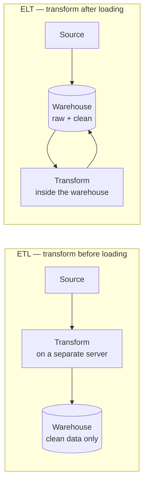
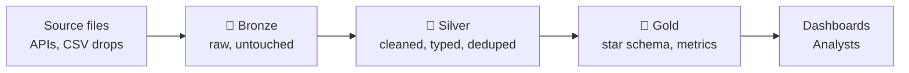
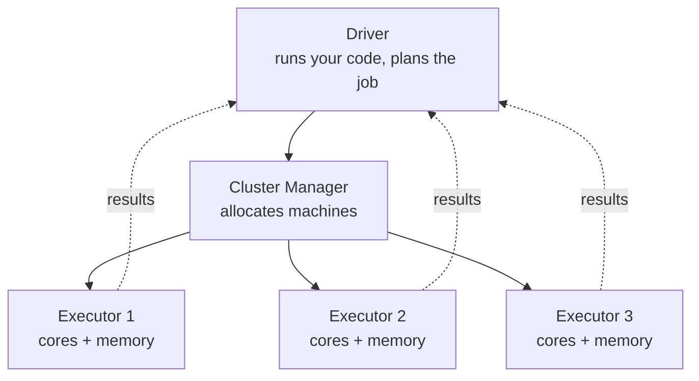

---
tags:
  - DE101
  - domain-4
  - batch
  - etl
  - dbt
date: 2026-06-20
status: complete
domain: "4 of 7"
track: data-engineering
---

# D4 — Batch Processing & ETL

**Back to:** [[00 - Onboarding Roadmap]]

> [!NOTE] Domain Overview
> This domain covers how data moves and transforms. The modern standard has shifted to **ELT** (load first, transform with dbt) over classic ETL. `dbt` is now table-stakes in every DE role.

> [!TIP] What This Domain Actually Builds
> By the end you will have a working pipeline: raw files land untouched, get cleaned and typed, and end as a star schema an analyst can query — with tests that fail loudly when the data is wrong. Everything up to now was preparation for this.

---

## 4.1 — ETL vs ELT

> [!NOTE] What You'll Learn
> Every data pipeline does the same three things: get data out of a source, put it somewhere, and reshape it. The order you do them in has a name — ETL or ELT — and the industry switched from the first to the second for reasons worth understanding.

### The Three Verbs

| Verb | What it means | Example |
|------|--------------|---------|
| **Extract** | Read data out of a source system | Call a REST API, read yesterday's CSV drop, query a replica database |
| **Load** | Write that data into your platform | Upload files to Azure Blob Storage, `INSERT` into a warehouse table |
| **Transform** | Reshape it into something analysts can use | Clean types, deduplicate, join, aggregate, build a star schema |

**ETL and ELT contain exactly the same three verbs.** The only difference is *where the T runs* — and that single choice changes your cost model, your debugging story, and how much you can recover from a mistake.

### ETL vs ELT



| | **ETL** | **ELT** |
|---|---|---|
| Where transform runs | A separate machine before loading | Inside the warehouse, after loading |
| Raw data kept? | ❌ Usually discarded | ✅ Retained permanently |
| Schema decided | **On write** — before data lands | **On read** — raw lands as-is, structure applied later |
| Transform language | Python / Java / a GUI tool | Mostly **SQL** |
| Fixing a transform bug | Re-extract from the source | Re-run the transform on data you already have |
| Compute cost | Dedicated server, always on | Warehouse compute, pay per query |
| Typical era | On-premise, 1990s–2010s | Cloud, 2015–present |

> [!IMPORTANT] Your Raw Layer Is Your Undo Button
> This is the real reason ELT won. In ETL, a bug in your transform means the wrong data landed and the correct data is *gone* — you must go back to the source, which may have changed, expired, or rate-limited you. In ELT, the untouched raw data is still sitting in your platform. You fix the SQL, re-run it, and the corrected tables rebuild themselves.
>
> Assume you will get transforms wrong. Design so that being wrong is cheap.

### Why ELT Won

Two things changed in the cloud:

**Object storage got extremely cheap.** *Object storage* means a service that stores files ("objects") by name, addressed like a giant key-value store rather than a filesystem — Azure Blob Storage and ADLS Gen2 are the ones you will use; AWS S3 and Google Cloud Storage are the equivalents elsewhere. It costs so little per gigabyte that keeping every raw file forever became an obvious choice rather than a luxury.

**Storage and compute got decoupled.** In an old on-premise warehouse, the disks and the CPUs were the same box — buying more query power meant buying more storage you did not need, and that box ran (and cost money) 24/7. Modern platforms separate the two: data sits in cheap storage, and you spin up compute only when a query runs, then release it. *Decoupled storage and compute* is that separation. It makes "load everything raw, transform on demand" affordable in a way it never was before.

Put those together and the ETL constraint disappears. You no longer need to transform data before loading it in order to save space or protect a fixed-capacity server.

> [!TIP] Schema-on-Write vs Schema-on-Read
> **Schema-on-write** — you must define the table structure *before* data can land. Anything that does not fit is rejected at the door. Safe, but a source adding a column breaks your ingestion tonight.
> **Schema-on-read** — data lands in whatever shape it arrived, and structure gets applied when you query or transform it. Nothing breaks at ingestion; the mess is handled downstream where you can see it.
> ELT leans on schema-on-read at the landing layer, then re-imposes strict schemas in the layers above. You will build exactly that in §4.3.

### When ETL Is Still Correct

ELT is the default, not a law. Transform-before-load is the right answer when:

- **Sensitive data must never land raw.** If a source contains credit card numbers or national ID numbers, you mask, hash, or drop those fields *before* they touch your storage. Loading them raw and cleaning later means the raw copy is a permanent liability.
- **Data residency or compliance rules apply.** Regulations may forbid personal data from leaving a region, so filtering happens at the source side.
- **You are on fixed on-premise capacity.** No elastic compute means no cheap "transform on demand".
- **The source is enormous and mostly irrelevant.** If 99% of a firehose is noise you will never query, filtering before load is simply cheaper.

> [!TIP] EtLT — The Pattern You'll Actually See
> Most real pipelines are **EtLT**: a *small* `t` before loading (mask PII, drop junk columns, standardise file encoding), then the heavy `T` inside the warehouse. The lowercase `t` is deliberate — it should stay small enough that you never need to re-run it to fix a business-logic bug.

### Where Raw Data Comes From

Extract and Load are usually the least glamorous and most fragile parts of a pipeline. Sources you will meet:

| Source type | How you extract | Watch out for |
|-------------|----------------|---------------|
| **Files dropped on storage** | Read the blob container on a schedule | Partial files still uploading; duplicate re-drops |
| **REST API** | Paginated HTTP requests | Rate limits, auth token expiry, silent pagination end |
| **Operational database** | Query a **read replica**, never the live primary | Long queries locking or slowing the production app |
| **Change Data Capture (CDC)** | Read the database's transaction log | Complex setup; covered conceptually in §4.5 |
| **Event stream** | Consume from a broker like Kafka | Out of scope here — see [[D5 - Stream Processing]] |

> [!IMPORTANT] Never Query the Production Primary Database
> A read replica is a continuously-updated copy of a database that exists to serve reads. Analytical queries scan far more rows than application queries do; pointing one at the primary database can slow or stall the app your company sells. If you are given credentials, confirm which host they point at before running anything large.

In production, teams rarely hand-write every extractor. The landscape:

| Tool | What it is | Model |
|------|-----------|-------|
| **Azure Data Factory** | Azure-native pipeline service with a visual Copy activity | Managed — you'll use this in [[D6 - Cloud & Orchestration]] |
| **`dlt`** | Open-source Python library for building extract-load pipelines | Code-first, self-hosted |
| **Airbyte** | Open-source connector platform, hundreds of pre-built sources | Self-hosted or cloud |
| **Fivetran** | Fully-managed commercial connectors | Paid, zero-maintenance |

The reason teams buy this rather than build it: a connector is easy to write and miserable to *maintain*. APIs change their pagination, add rate limits, and rotate auth schemes, and every one of those breaks at 3am. Paying someone to own that is often cheaper than owning it yourself. Write your own when the source is unusual, internal, or trivially simple.

### Batch, Micro-Batch, and Streaming

| | **Batch** | **Micro-batch** | **Streaming** |
|---|---|---|---|
| Processes | Large chunks on a schedule | Small chunks, very frequently | One event at a time |
| Typical latency | Minutes to hours | Seconds to minutes | Milliseconds to seconds |
| Triggered by | A schedule (e.g. 2am daily) | A short timer | Event arrival |
| Complexity | Lowest | Medium | Highest |
| Cost per record | Lowest | Medium | Highest |

**This domain is entirely about batch.** Batch is where every data engineer starts, it covers the large majority of real production workloads, and it is far easier to reason about and re-run. Streaming is [[D5 - Stream Processing]].

> [!TIP] Choose Batch Until Someone Proves You Need Streaming
> "Real-time" is requested far more often than it is needed. Ask what decision the data drives and how fast that decision actually gets made. A dashboard a manager checks each morning does not need sub-second latency — it needs to be *correct* at 8am. Batch delivers that with a fraction of the complexity.

> [!WARNING] Common Anti-Patterns
>
> ❌ **Transforming during ingestion with no raw copy kept** — the transform has a bug (it always does), and the original data is gone
> ✅ Land raw first, always. Transform in a separate, re-runnable step
>
> ❌ **"We do ELT, so we don't need data modeling"** — ELT changes *when* you model, not *whether* you model. Skipping it produces a warehouse of 400 raw tables no analyst can navigate
> ✅ Raw lands untouched, then you deliberately model it into the star schemas from [[D2 - SQL & Data Modeling#2.5 — Dimensional Modeling|D2 §2.5]]
>
> ❌ **Loading PII raw "to clean up later"** — the raw copy is a permanent compliance liability, and "later" never arrives
> ✅ Mask or hash sensitive fields before they land — the lowercase `t` in EtLT
>
> ❌ **Running analytical extracts against the production primary database** — your backfill becomes a customer-facing outage
> ✅ Extract from a read replica, an export, or a CDC stream

---

## 4.2 — dbt (Data Build Tool)

> [!IMPORTANT] Priority Subdomain
> `dbt` is now the standard SQL transformation layer. If you only learn one tool in this domain, it's this one.

> [!NOTE] What You'll Learn
> dbt turns a folder of loose `.sql` files into a real software project: dependencies it works out for itself, tests, documentation, and repeatable runs. You will install it, build a small project end to end on DuckDB, and deliberately make a test fail so you know what that looks like.

### What dbt Is — and Isn't

dbt is the **T** in ELT. You write `SELECT` statements; dbt wraps each one in the right `CREATE TABLE` or `CREATE VIEW`, works out what order they must run in, and executes them against your warehouse.

| dbt **is** | dbt **is not** |
|-----------|---------------|
| A SQL transformation framework | A database or query engine — it needs one to connect to |
| A dependency resolver and test runner | An ingestion/extract tool — data must already be loaded |
| A documentation and lineage generator | A scheduler — something else must trigger `dbt build` |

That last row matters: **dbt does not run itself on a schedule.** In production, an orchestrator invokes it. That is [[D6 - Cloud & Orchestration]].

### Why Not Just Write SQL Files?

You could keep a folder of `.sql` scripts and run them in order by hand. That works until it doesn't:

| Problem with loose SQL files | What dbt does instead |
|------------------------------|----------------------|
| You must remember run order, and it changes | `ref()` builds a dependency graph automatically |
| Table names hardcoded, so dev and prod need separate copies of every file | One codebase; the target environment is configuration |
| No tests — bad data is found by a stakeholder | Tests live beside the model and run every build |
| No documentation, and no way to see what feeds what | Generated docs with a clickable lineage graph |
| Copy-pasted logic drifts out of sync across files | Macros — write the logic once |

> [!IMPORTANT] `ref()` Is the Whole Point
> Instead of writing a real table name, you write `{{ ref('stg_orders') }}`. dbt replaces it with the correct fully-qualified name for whichever environment you are running against, **and** records that this model depends on `stg_orders`.
>
> From those `ref()` calls alone, dbt derives the entire **DAG** — a *directed acyclic graph*, meaning a set of steps with dependencies ("directed") and no circular loops ("acyclic"). Because dbt knows the graph, it knows the correct build order, what can run in parallel, and what to skip when something upstream fails. You never maintain a run order by hand.
>
> Everything else dbt offers is built on this one idea.

### Setup

dbt connects to a database through an **adapter**. Yours is `dbt-duckdb`, which installs dbt Core and the DuckDB adapter together.

```bash
# Work inside a virtual environment so this project's versions stay isolated
python3 -m venv .venv
source .venv/bin/activate          # macOS/Linux
# .venv\Scripts\activate           # Windows PowerShell

pip install dbt-duckdb

# Also needed later in this domain: the API extractor in §4.3 and the retry
# helper in §4.8 use these.
pip install requests tenacity

dbt --version                      # confirm it installed
```

> [!WARNING] Check Which dbt Version You Got
> `pip` resolves the newest dbt your **Python version** allows, so an older Python silently pins you to an older dbt. If `dbt --version` reports "Your version of dbt-core is out of date", you are on a deprecated release that no longer receives patches — including for known bugs.
>
> Install on Python 3.10 or newer to get a currently-supported dbt. The console output shown in this domain was captured on 1.10.x; your line numbers and log wording may differ slightly on a newer version, and that is expected.

> [!WARNING] Version Coupling
> `dbt-duckdb` pins which DuckDB versions it works with, and some features depend on the DuckDB version underneath (the `merge` incremental strategy in §4.5 needs DuckDB 1.4.0+). If a strategy or option errors unexpectedly, check `dbt --version` and your DuckDB version before assuming you wrote it wrong.

Scaffold a project:

```bash
dbt init jaffle_duck             # prompts for a project name and adapter
cd jaffle_duck
dbt debug                        # verifies the connection actually works
```

> [!TIP] `dbt debug` Is Your First Troubleshooting Step
> It checks that your config files parse, that the profile is found, and that dbt can genuinely connect. Run it any time something behaves strangely — it catches the majority of setup problems in one command, and it tells you exactly which `profiles.yml` it loaded.

### The Two Config Files

**`dbt_project.yml`** lives in your project and describes the project:

```yaml
name: jaffle_duck
version: '1.0.0'
profile: jaffle_duck          # which profile in profiles.yml to use

model-paths: ["models"]
seed-paths: ["seeds"]
snapshot-paths: ["snapshots"]
test-paths: ["tests"]

models:
  jaffle_duck:
    staging:
      +materialized: view     # everything in models/staging/ becomes a view
    marts:
      +materialized: table    # everything in models/marts/ becomes a table
```

**`profiles.yml`** holds connection details. By default it does **not** live in your project — `dbt init` writes it to `~/.dbt/profiles.yml`. It is kept outside the repo on purpose, because in real projects it holds credentials that must never be committed.

```yaml
jaffle_duck:
  target: dev                 # which output to use by default
  outputs:
    dev:
      type: duckdb
      path: jaffle_duck.duckdb   # the DuckDB file this project writes to
      threads: 4                 # how many models dbt builds in parallel
```

> [!TIP] Where Is My `profiles.yml`?
> `~/.dbt/profiles.yml` on macOS/Linux, `%USERPROFILE%\.dbt\profiles.yml` on Windows. `dbt debug` prints the exact path it used. This is the single most common source of "it works on my machine" confusion on a new project.

### Project Structure

```
jaffle_duck/
├── dbt_project.yml
├── packages.yml              # third-party dbt packages
├── models/
│   ├── staging/
│   │   ├── _sources.yml      # where raw data lives
│   │   ├── stg_orders.sql
│   │   └── _staging.yml      # tests + docs for staging models
│   └── marts/
│       ├── dim_customers.sql
│       ├── fct_orders.sql
│       └── _marts.yml
├── seeds/                    # small static CSVs
├── snapshots/                # SCD Type 2 history
├── tests/                    # custom one-off tests
└── target/                   # generated SQL + artifacts (git-ignored)
```

Files in `models/` are your models. **The filename is the model name**, and it becomes the table or view name in the database. `models/staging/stg_orders.sql` produces a relation called `stg_orders`.

The `staging` / `marts` folder split is a naming convention, not a dbt rule — dbt does not care. Why those particular layers exist and what belongs in each is §4.3.

| Prefix | Layer | Purpose |
|--------|-------|---------|
| `stg_` | staging | One model per source table: renamed, retyped, lightly cleaned |
| `int_` | intermediate | Multi-step logic too complex for one model |
| `dim_` | marts | A dimension table — descriptive context |
| `fct_` | marts | A fact table — measurements and events |

### Sources — Declaring Where Raw Data Lives

A **source** tells dbt about a table that already exists, which dbt did not create. Declaring them means your lineage graph starts at the real origin rather than appearing out of nowhere.

```yaml
# models/staging/_sources.yml
version: 2

sources:
  - name: raw                      # the source's logical name
    schema: main                   # the schema it actually lives in
    tables:
      - name: orders
        identifier: bronze_orders        # the real table name in the database
        description: "Raw order records, landed daily. One row per order."
      - name: customers
        identifier: bronze_customers
```

> [!IMPORTANT] `name` vs `identifier`
> `name` is what *you* call the table in dbt — what goes inside `source('raw', 'orders')`. `identifier` is the table's **actual** name in the database.
>
> You need `identifier` here because §4.3 lands the raw tables as `bronze_orders` and `bronze_customers` (the layer name makes them self-describing), while models refer to them by the shorter logical name. Without `identifier`, dbt looks for a table literally called `orders`, doesn't find it, and every staging model fails with a binder error.
>
> This is also how you cope with sources you don't control that have unpleasant names — `identifier: TBL_ORD_HIST_V2` maps once, and the rest of your project says `source('raw', 'orders')`.

Reference a source with `{{ source() }}` — note **two** arguments, source name then table name:

```sql
select * from {{ source('raw', 'orders') }}
```

> [!TIP] `source()` vs `ref()`
> `{{ source('raw', 'orders') }}` — a table dbt did **not** build. Two arguments. Only ever appears in staging models.
> `{{ ref('stg_orders') }}` — a table dbt **did** build. One argument. Everywhere else.
> If you find yourself calling `source()` outside a staging model, something has been skipped.

#### Source Freshness

dbt can check whether raw data is arriving on time. Add a timestamp column and thresholds:

```yaml
sources:
  - name: raw
    schema: main
    config:
      loaded_at_field: _ingested_at
      freshness:
        warn_after:  {count: 12, period: hour}
        error_after: {count: 24, period: hour}
    tables:
      - name: orders
      - name: customers
        config:
          freshness: null          # skip the check for this table
```

```bash
dbt source freshness
```

dbt takes `MAX(_ingested_at)` per table, compares it to now, and warns or errors. `loaded_at_field` is required to calculate freshness unless dbt can read it from warehouse metadata; and if neither `warn_after` nor `error_after` is provided, no freshness is calculated at all.

> [!TIP] These Keys Moved Into `config:`
> Both `freshness` and `loaded_at_field` used to sit directly under the source or table, not nested under `config:`. They moved into `config:` in recent releases, so most tutorials you find still show them un-nested. The nested form above is the current one; check the docs for your installed version if the flat form throws a warning.

This is the earliest possible warning that a pipeline has silently stopped. A table full of last week's data passes every other test — the rows are all valid, there are just no *new* ones.

### Models and the DAG

A model is a `SELECT` statement in a `.sql` file. dbt handles the DDL.

```sql
-- models/staging/stg_orders.sql
select
    order_id,
    customer_id,
    cast(order_ts as timestamptz)  as ordered_at,
    cast(amount   as decimal(10,2)) as amount,
    lower(trim(status))            as status
from {{ source('raw', 'orders') }}
```

```sql
-- models/marts/fct_orders.sql
select
    o.order_id,
    o.customer_id,
    o.ordered_at,
    o.amount,
    o.status
from {{ ref('stg_orders') }} o
where o.status != 'cancelled'
```

Because `fct_orders` calls `ref('stg_orders')`, dbt knows to build `stg_orders` first. You never state that anywhere.

### Materializations

A **materialization** is what physical object dbt creates in the database for a model — a view, a table, or something cleverer.

| Materialization | Creates | Build cost | Query cost | Use when |
|----------------|---------|-----------|-----------|----------|
| `view` | A view (stored query) | Instant | Re-computes every query | Staging models; light logic |
| `table` | A physical table | Full rebuild each run | Fast | Marts; anything queried often |
| `incremental` | A table updated in place | Only new/changed rows | Fast | Large tables where a rebuild is too slow |
| `ephemeral` | Nothing — inlined as a CTE | None | N/A | Small intermediate steps you don't want cluttering the database |
| `external` | A Parquet/CSV/JSON **file** | Writes a file | Read via DuckDB | dbt-duckdb only; handing data to another tool |

Set it in the model or in `dbt_project.yml`:

```sql
{{ config(materialized='table') }}

select ...
```

> [!TIP] Default to Views, Promote to Tables
> Views cost nothing to build and are always current. Start there. Switch a model to `table` when it is queried often enough that recomputation hurts, and to `incremental` only when a full rebuild becomes genuinely too slow. Making everything a table from day one wastes build time on models nobody queries.

> [!NOTE] `incremental` Is Introduced Here, Explained in §4.5
> The `incremental` materialization is easy to configure and easy to get subtly wrong — it is how pipelines silently produce duplicate rows or lose late-arriving data. This section shows the mechanism; §4.5 covers the patterns that make it *correct*.

```sql
-- The simplest possible incremental model: append rows newer than what we have
{{ config(materialized='incremental') }}

select * from {{ ref('stg_orders') }}


  -- {{ this }} refers to the existing version of this very table
  where ordered_at > (select coalesce(max(ordered_at), '1900-01-01') from {{ this }})

```

`is_incremental()` is true only when the table already exists, the model is materialized `incremental`, and `--full-refresh` was not passed. Your SQL must be valid either way.

### Jinja — the Templating Layer

The `{{ ... }}` and `` markers are **Jinja**, a templating language. dbt runs your file through Jinja *first*, producing plain SQL, then sends that SQL to the database. Jinja is why dbt can do anything at all beyond storing static queries.

You can see the result. Given:

```sql
-- models/marts/order_count.sql
select count(*) as order_count from {{ ref('stg_orders') }}
```

after `dbt compile`, `target/compiled/jaffle_duck/models/marts/order_count.sql` contains:

```sql
select count(*) as order_count from "jaffle_duck"."main"."stg_orders"
```

> [!TIP] When Confused, Read the Compiled SQL
> Everything dbt sends to the database is written to `target/compiled/`. If a model behaves unexpectedly, open its compiled file — you see the real query, with every `ref()` and macro resolved. You can paste it straight into DuckDB and debug it as ordinary SQL. This single habit resolves most dbt confusion.

Two Jinja forms you will use constantly:

```sql
{{ config(materialized='table') }}       -- {{ }} outputs a value or sets config
 ...  --  is control flow, outputs nothing
```

### Your First Run

You now have enough to build something. With `stg_orders.sql` and `fct_orders.sql` in place:

```bash
dbt build
```

```
15:02:11  Running with dbt=1.10.23
15:02:11  Registered adapter: duckdb=1.10.0
15:02:11  Found 2 models, 1 source, 457 macros
15:02:11  Concurrency: 4 threads (target='dev')
15:02:12  1 of 2 START sql view model main.stg_orders ..................... [RUN]
15:02:12  1 of 2 OK created sql view model main.stg_orders ................ [OK in 0.08s]
15:02:12  2 of 2 START sql table model main.fct_orders ................... [RUN]
15:02:12  2 of 2 OK created sql table model main.fct_orders .............. [OK in 0.11s]
15:02:12  Finished running 1 view model, 1 table model in 0 hours 0 minutes and 0.41 seconds (0.41s).
15:02:12  Completed successfully
15:02:12  Done. PASS=2 WARN=0 ERROR=0 SKIP=0 NO-OP=0 TOTAL=2
```

Note `1 of 2` and `2 of 2`: dbt worked out the order from `ref()`. Query the result in DuckDB directly:

```bash
python3 -c "import duckdb; duckdb.connect('jaffle_duck.duckdb').sql('select * from fct_orders limit 5').show()"
```

> [!TIP] Use `dbt build`, Not `dbt run` Then `dbt test`
> `dbt build` interleaves models, tests, seeds, and snapshots in **DAG order**, so a model's tests run immediately after that model. Crucially, **if a test on `model_a` fails, everything downstream of `model_a` is skipped**.
>
> `dbt run` followed by `dbt test` builds every model first and only then checks quality — so bad data has already propagated into every downstream table before you find out. `dbt build` stops the spread. Prefer it always.

### Tests

dbt has two kinds of **data test** — assertions about the data your models produce.

**Generic tests** are reusable and declared in YAML. Four ship with dbt:

| Test | Asserts |
|------|---------|
| `unique` | No duplicate values in the column |
| `not_null` | No nulls in the column |
| `accepted_values` | Every value is in a given list |
| `relationships` | Every value exists in another model's column (referential integrity) |

```yaml
# models/staging/_staging.yml
version: 2

models:
  - name: stg_orders
    description: "One row per order, typed and cleaned."
    columns:
      - name: order_id
        description: "Primary key."
        data_tests:
          - unique
          - not_null
      - name: customer_id
        data_tests:
          - not_null
          - relationships:
              arguments:
                to: ref('stg_customers')
                field: customer_id
      - name: status
        data_tests:
          - accepted_values:
              arguments:
                values: ['pending', 'completed', 'cancelled']
```

> [!WARNING] Nest Test Arguments Under `arguments:`
> Tests that take parameters — `accepted_values`, `relationships`, and most package tests — need their parameters nested under an `arguments:` key. Writing them at the top level still works but is **deprecated**, and dbt prints:
>
> ```
> [WARNING][MissingArgumentsPropertyInGenericTestDeprecation]: Deprecated functionality
> Found top-level arguments to test `relationships`. Arguments to generic tests
> should be nested under the `arguments` property.
> ```
>
> ❌ `- relationships:` then `to:` / `field:` directly beneath it
> ✅ `- relationships:` then `arguments:` then `to:` / `field:`
>
> Almost every tutorial and Stack Overflow answer you find uses the old top-level form, so expect to see it constantly. `unique` and `not_null` take no arguments and are unaffected.
>
> The `arguments:` key requires **dbt v1.10.5 or newer**. On an older version it is not recognised and you must use the top-level form.

> [!WARNING] `data_tests:` vs `tests:` — You Will See Both
> The key was originally `tests:`. dbt v1.8 renamed it to **`data_tests:`** to distinguish these from the newly-added *unit* tests. `tests:` still works as a deprecated alias, so most tutorials and older repos you find will use it.
>
> Use `data_tests:` in new code. **You cannot use both keys on the same resource** — dbt errors if you do.

**Singular tests** are one-off SQL files. The rule: *write a query that returns the rows that are wrong.* Zero rows returned means the test passes.

```sql
-- tests/assert_no_negative_amounts.sql
-- Passes when this returns no rows.
select order_id, amount
from {{ ref('stg_orders') }}
where amount < 0
```

**Unit tests** (v1.8+) test your SQL *logic* against fixed inputs you supply, rather than testing real data. Useful for tricky transformations:

```yaml
unit_tests:
  - name: test_cancelled_orders_excluded
    model: fct_orders
    given:
      - input: ref('stg_orders')
        rows:
          - {order_id: 1, status: 'completed'}
          - {order_id: 2, status: 'cancelled'}
    expect:
      rows:
          - {order_id: 1, status: 'completed'}
```

They come with real restrictions — SQL models only, must live in a YAML under `models/`, and every `ref()` in the model must be supplied as an input. Reach for them when logic is genuinely subtle; data tests carry far more weight day to day.

### When a Test Fails

This is the part tutorials skip, and it is where you will actually spend time. Suppose duplicate `order_id` values arrive:

```
15:51:50  7 of 10 START test unique_stg_orders_order_id ................................. [RUN]
15:51:50  7 of 10 FAIL 2 unique_stg_orders_order_id ..................................... [FAIL 2 in 0.01s]
15:51:50  9 of 10 SKIP relation main.dim_customers ...................................... [SKIP]
15:51:50  10 of 10 SKIP relation main.fct_orders ........................................ [SKIP]
15:51:50
15:51:50  Completed with 1 error, 0 partial successes, and 0 warnings:
15:51:50
15:51:50  Failure in test unique_stg_orders_order_id (models/staging/_staging.yml)
15:51:50    Got 2 results, configured to fail if != 0
15:51:50
15:51:50    compiled code at target/compiled/jaffle_duck/models/staging/_staging.yml/unique_stg_orders_order_id.sql
15:51:50
15:51:50  Done. PASS=7 WARN=0 ERROR=1 SKIP=2 NO-OP=0 TOTAL=10
```

Four things to read here:

1. **`FAIL 2`** and **`Got 2 results`** — two `order_id` values are duplicated. Tests count offending rows, so the number is a real diagnostic, not just a pass/fail flag.
2. **`SKIP relation main.dim_customers`** and **`main.fct_orders`** — `dbt build` refused to build anything downstream of the failure. Bad data did not spread. This is the circuit breaker in action.
3. **`Done. PASS=7 ... ERROR=1 SKIP=2`** — the summary line always accounts for every node, so the skipped count tells you how much was held back.
4. **`compiled code at target/compiled/...`** — the exact SQL that found the problem. Run it yourself to see which rows are at fault:

```bash
# D1 installed DuckDB as a Python package, which ships no `duckdb` shell command —
# so run the compiled SQL through Python.
python3 -c "
import duckdb, pathlib
sql = pathlib.Path('target/compiled/jaffle_duck/models/staging/_staging.yml/unique_stg_orders_order_id.sql').read_text()
duckdb.connect('jaffle_duck.duckdb').sql(sql).show()
"
```

To keep failures around for inspection, configure `store_failures` — dbt writes offending rows to a table instead of discarding them:

```yaml
      - name: order_id
        data_tests:
          - unique:
              config:
                store_failures: true
```

The failing rows land in a separate audit schema named after your schema plus `_dbt_test__audit`, one table per test:

```sql
-- Inspect exactly which order_ids were duplicated
SELECT * FROM main_dbt_test__audit.unique_stg_orders_order_id;
```

You can also enable it for one run without editing YAML:

```bash
dbt build --store-failures --select stg_orders
```

> [!TIP] Make a Test Fail on Purpose, Once
> Insert a duplicate row into your source, run `dbt build`, and read the whole output. Ten minutes doing this deliberately, while nothing is at stake, saves an hour of panic the first time it happens for real.

### Snapshots — SCD Type 2, Handled For You

In [[D2 - SQL & Data Modeling#2.5 — Dimensional Modeling|D2 §2.5]] you wrote SCD Type 2 by hand: expire the old row, insert a new version, maintain `effective_date` / `expiry_date` / `is_current`. dbt **snapshots** do this for you.

```yaml
# snapshots/customers_snapshot.yml
snapshots:
  - name: customers_snapshot
    relation: ref('stg_customers')          # a TYPED model, not raw Bronze — see below
    config:
      unique_key: customer_id
      strategy: timestamp
      updated_at: updated_at
      dbt_valid_to_current: "cast('9999-12-31' as timestamptz)"
```

```bash
dbt snapshot
```

> [!WARNING] Do Not Snapshot All-Text Bronze Directly
> The obvious thing to write is `relation: source('raw', 'customers')`. On DuckDB that **fails**, because §4.3 lands Bronze as all-`VARCHAR` on purpose and the `timestamp` strategy needs a real timestamp in `updated_at`:
>
> ```
> Runtime Error in snapshot customers_snapshot
>   Binder Error: Cannot mix values of type VARCHAR and TIMESTAMP WITH TIME ZONE
>   in COALESCE operator - an explicit cast is required
> ```
>
> ❌ `relation: source('raw', 'customers')` — `updated_at` is text, and no `dbt_valid_to_current` cast fixes it, because the text column is the other half of the mismatch
> ✅ `relation: ref('stg_customers')` — snapshot the model that has already cast `updated_at` to `timestamptz`
>
> Also match the cast to that column's type: `cast('9999-12-31' as timestamptz)` for a `timestamptz` column. Using `as date` produces the same `COALESCE` type error. dbt's own documentation example uses `to_date(...)`, which is written for a different warehouse — adapt it, don't copy it.

| Strategy | How it detects change | Use when |
|----------|----------------------|----------|
| `timestamp` | An `updated_at` column moved forward | **Preferred** — cheap and robust to new columns |
| `check` | Any of the listed `check_cols` differs | No reliable `updated_at` exists |

dbt adds four columns: `dbt_valid_from`, `dbt_valid_to`, `dbt_scd_id`, and `dbt_updated_at`. A fifth, `dbt_is_deleted`, appears **only** with `hard_deletes: new_record` — the `ignore` and `invalidate` options add no column.

> [!IMPORTANT] `dbt_valid_to_current` Changes What D2 Taught You
> In D2, `expiry_date IS NULL` meant "this is the current row". dbt's default matches that — `dbt_valid_to` is `NULL` for current records. But `NULL` makes date-range queries awkward, because `BETWEEN` and `<` never match it, so every query needs an `OR dbt_valid_to IS NULL` branch.
>
> Setting `dbt_valid_to_current` to a far-future date like `9999-12-31` means current rows carry a real value and range filters just work:
> ```sql
> -- With a far-future date, this needs no special case for current rows
> where '2024-06-01' between dbt_valid_from and dbt_valid_to
> ```
> Both conventions are valid. Know which one your project uses — assuming the wrong one silently drops or duplicates current records.

> [!WARNING] Snapshots Only Capture What They See
> A snapshot records the state of the source **at the moment it runs**. If a value changes twice between two runs, the middle state is lost forever. Snapshots must run on a schedule frequent enough for the change rate you care about — and they can never reconstruct history from before you started snapshotting. Set them up early.

### Seeds

Small static CSVs, version-controlled and loaded with `dbt seed`. Put `seeds/country_codes.csv` in place and reference it with `{{ ref('country_codes') }}`.

Appropriate for: reference lookups, mappings, small manually-curated lists. **Not** appropriate for actual data — seeds are committed to git, so a large CSV bloats the repo permanently and belongs in your ingestion path instead.

### Packages and Macros

A **macro** is a reusable SQL function written in Jinja:

```sql
-- macros/cents_to_dollars.sql

    round(cast({{ column_name }} as decimal(16,2)) / 100, 2)

```

```sql
-- Used against a source that stores money as integer cents.
-- (stg_orders already exposes `amount` as DECIMAL, so it needs no conversion.)
select
    order_id,
    {{ cents_to_dollars('amount_cents') }} as amount_usd
from {{ source('raw', 'payments') }}
```

Most macros you need already exist. `dbt_utils` is the standard package:

```yaml
# packages.yml
packages:
  - package: dbt-labs/dbt_utils
    version: [">=1.1.0", "<2.0.0"]
```

```bash
dbt deps        # installs packages — run this before dbt build
```

Two things from `dbt_utils` you will use immediately:

```sql
-- Generate a surrogate key by hashing the natural key columns.
-- D2 §2.5 required surrogate keys on every dimension; this is how you make them.
select
    {{ dbt_utils.generate_surrogate_key(['customer_id']) }} as customer_sk,
    customer_id,
    name
from {{ ref('stg_customers') }}
```

```yaml
# Extra generic tests, declared like the built-in four
models:
  - name: fct_orders
    data_tests:
      # Asserts a compound grain. On a line-item fact (one row per order *per product*)
      # this is the right test; on fct_orders, whose grain is one row per order,
      # a plain `unique` on order_id says the same thing more simply.
      - dbt_utils.unique_combination_of_columns:
          arguments:
            combination_of_columns: [order_id, product_id]
    columns:
      - name: amount
        data_tests:
          - dbt_utils.accepted_range:
              arguments:
                min_value: 0
                inclusive: true
```

> [!WARNING] `dbt deps` Is Not Optional
> If `packages.yml` lists a package you have not installed, `dbt build` refuses to run at all:
> ```
> Compilation Error
>   dbt found 1 package(s) specified in packages.yml, but only 0 package(s)
>   installed in dbt_packages. Run "dbt deps" to install package dependencies.
> ```
> Run `dbt deps` after adding a package and after every fresh clone of a project — `dbt_packages/` is git-ignored, so a teammate cloning your repo always has to.

### Command Reference

| Command | Does |
|---------|------|
| `dbt debug` | Verify config and connection — run this first when stuck |
| `dbt deps` | Install packages from `packages.yml` |
| `dbt seed` | Load CSVs from `seeds/` |
| `dbt run` | Build models only |
| `dbt test` | Run tests only |
| `dbt snapshot` | Capture SCD Type 2 history |
| **`dbt build`** | **models + tests + seeds + snapshots, in DAG order — use this** |
| `dbt compile` | Generate SQL without running it |
| `dbt source freshness` | Check whether raw data is arriving on time |
| `dbt docs generate` | Build documentation and the lineage graph |
| `dbt docs serve` | Serve those docs locally in a browser |

**Selecting a subset** — essential once a project grows:

```bash
dbt build --select stg_orders          # just this model
dbt build --select stg_orders+         # this model and everything downstream
dbt build --select +fct_orders         # this model and everything upstream
dbt build --select staging             # everything in models/staging/
dbt build --exclude fct_orders         # everything except this
dbt run --full-refresh --select fct_orders   # rebuild an incremental from scratch
```

> [!TIP] Remember `+` as "and its family"
> `model+` = the model **and its descendants**. `+model` = the model **and its ancestors**. The `+` points in the direction the graph flows. `+model+` gets both.

### Documentation and Lineage

```bash
dbt docs generate && dbt docs serve
```

This produces a browsable site: every model, its columns, its descriptions, its tests, and an interactive lineage graph showing what feeds what. The descriptions come from the same YAML files where you declared tests — which is why writing them is worth the minute it costs.

### dbt Core vs dbt Cloud

| | **dbt Core** | **dbt Cloud** |
|---|---|---|
| Cost | Free, open source | Paid (limited free tier) |
| Interface | CLI on your machine | Browser IDE + CLI |
| Scheduling | None — bring an orchestrator | Built in |
| Use | What you're learning; what most teams self-host | Teams wanting a managed setup |

The SQL, models, tests, and concepts are identical. Learn Core; Cloud is a wrapper.

> [!EXAMPLE] GitLab — A Production dbt Project You Can Actually Read
> GitLab runs its company analytics on dbt and — unusually — keeps the entire project **public**, along with a handbook section documenting how the data team works. You can browse thousands of real models, see genuine `stg_`/`marts` layering, read their test coverage and naming standards, and click through generated lineage docs for a warehouse that a real business depends on.
>
> This is worth an hour of your time once you have built your own small project. Reading production code is how you calibrate what "good" looks like — and public production dbt projects of this scale are rare. *(Sources: [gitlab-data/analytics](https://gitlab.com/gitlab-data/analytics), [GitLab Handbook — dbt Guide](https://handbook.gitlab.com/handbook/business-technology/data-team/platform/dbt-guide/))*

> [!WARNING] Common Anti-Patterns
>
> ❌ **Hardcoding table names**: `from main.stg_orders`
> ✅ `from {{ ref('stg_orders') }}` — without it dbt cannot build the DAG, so run order and environment switching both break
>
> ❌ **Business logic in staging models** — revenue rules and filters in `stg_orders` means every downstream model silently inherits them
> ✅ Staging renames, retypes, and lightly cleans. Nothing else. Business logic belongs in marts (§4.3)
>
> ❌ **One 500-line model doing everything** — untestable, undebuggable, and re-runs entirely for a one-line change
> ✅ Small models chained with `ref()`. dbt is designed for many small steps; each becomes independently testable
>
> ❌ **`+materialized: table` on the entire project** — every run rebuilds every model, including ones nobody queries
> ✅ Views by default; tables where query cost justifies it
>
> ❌ **A project with no tests** — "it ran successfully" tells you the SQL was valid, not that the data was right
> ✅ At minimum `unique` and `not_null` on every primary key, from day one
>
> ❌ **Committing `profiles.yml` with credentials to git**
> ✅ Leave it in `~/.dbt/`; use environment variables for secrets

---

## 4.3 — Medallion Architecture in Practice

> [!NOTE] What You'll Learn
> A warehouse where every table is "sort of cleaned" is unusable — nobody knows which to trust. Medallion architecture fixes that by giving every table an explicit quality level. You will build all three layers, starting with actually getting raw files in.

### The Three Layers

Medallion architecture organises data into three named layers, each with a promise attached. *([[D3 - Data Storage & Formats#3.5 — Medallion Architecture|D3 §3.5]] covers the storage side and the layer contracts; this section implements them in a pipeline.)*



| | 🥉 **Bronze** | 🥈 **Silver** | 🥇 **Gold** |
|---|---|---|---|
| Contains | Exactly what arrived | Clean, conformed entities | Business-ready aggregates |
| Schema | Source's own, all text | Properly typed | Dimensional (star schema) |
| Duplicates | Kept | Removed | Removed |
| Operations allowed | Append only | Type, rename, dedupe, validate | Join, aggregate, apply business rules |
| Grain | Whatever the source sent | One row per entity or event | Defined per fact table |
| Who queries it | Data engineers debugging | Data engineers, some analysts | Analysts, dashboards, executives |
| If it's wrong | Re-extract from source | Re-run from Bronze | Re-run from Silver |

The critical property: **each layer can be rebuilt from the one before it.** Only Bronze depends on the outside world.

**Mapping to your dbt project:**

| Medallion layer | dbt location |
|-----------------|-------------|
| Bronze | Raw tables, declared as `sources:` — dbt reads them, doesn't build them |
| Silver | `models/staging/` (`stg_`) and `models/intermediate/` (`int_`) |
| Gold | `models/marts/` (`dim_`, `fct_`) |

### Bronze — Landing Raw Data

Bronze is where Extract and Load actually happen. DuckDB reads files directly, which makes it an excellent landing tool.

Assume files arriving as `raw/orders_2024-01-01.csv`, `raw/orders_2024-01-02.csv`, and so on.

```sql
-- Read every matching file at once with a glob pattern
SELECT * FROM read_csv('raw/orders_*.csv');

-- Other formats work identically
SELECT * FROM read_json('raw/events_*.json');
SELECT * FROM read_parquet('raw/orders_*.parquet');
```

**Two options make this a proper Bronze layer:**

```sql
CREATE TABLE bronze_orders AS
SELECT *
FROM read_csv(
    'raw/orders_*.csv',
    filename    = '_source_file',   -- adds a column naming the file each row came from
    all_varchar = true              -- read every column as text; refuse to guess types
);
```

`filename = '_source_file'` gives you **provenance** — for any row, which file delivered it. When someone asks "why is this number wrong?", this is how you answer.

`all_varchar = true` is the part that feels wrong and is right. Bronze should not interpret. If DuckDB guesses a column is `INTEGER` because the first thousand rows look numeric, then row 50,000 contains `"N/A"`, ingestion **fails** — and the file you need to inspect never lands. Text always loads. Typing is Silver's job.

Add the ingestion timestamp. Note `CREATE OR REPLACE` — you already created this table above, and plain `CREATE TABLE` would now error:

```sql
CREATE OR REPLACE TABLE bronze_orders AS
SELECT
    *,
    now() AS _ingested_at
FROM read_csv('raw/orders_*.csv', filename = '_source_file', all_varchar = true);
```

Do the same for customers, so both source tables the project declares actually exist:

```sql
CREATE OR REPLACE TABLE bronze_customers AS
SELECT
    *,
    now() AS _ingested_at
FROM read_csv('raw/customers_*.csv', filename = '_source_file', all_varchar = true);
```

> [!TIP] Your Customers CSV Needs an `updated_at`
> `bronze_customers` must carry an `updated_at` column from the source. The Silver model casts it to a timestamp, and the snapshot in §4.2 uses it as its change-detection column. Without it you can type everything here correctly and still find snapshots impossible later.

Those two underscore-prefixed columns — `_source_file` and `_ingested_at` — are **ingestion metadata**: added by you, not present in the source. The underscore prefix marks them as such. `_ingested_at` is what §4.2's source freshness check reads, and what the deduplication below orders by.

> [!IMPORTANT] Bronze Is Append-Only and Never Edited
> Bronze exists so you can rebuild everything else without going back to the source. The moment you `UPDATE` or `DELETE` in Bronze, it stops being a faithful record and that guarantee is gone.
>
> If bad data arrives, it stays in Bronze. You filter it out in Silver, where the decision is visible in code, reviewable, and reversible.

#### Extracting From a REST API

For API sources, extract to files first, then land them exactly as above. Building on the REST work from [[D1 - Foundations & Tooling]]:

```python
import json
import time
from datetime import date
from pathlib import Path

import requests

def extract_orders(
    api_url: str,
    token: str,
    out_dir: Path,
    run_date: date,                 # passed in, never date.today() — see §4.5
    max_retries: int = 5,
) -> Path:
    """Pull all pages of orders and write one raw JSON file. No transformation."""
    out_dir.mkdir(parents=True, exist_ok=True)

    # A Session reuses the TCP connection across requests and lets us set the auth
    # header once instead of on every call.
    session = requests.Session()
    session.headers.update({"Authorization": f"Bearer {token}"})

    records, page, retries = [], 1, 0
    while True:
        response = session.get(api_url, params={"page": page, "per_page": 100}, timeout=30)

        # 429 = rate limited. Retry-After is the server telling us how long to wait.
        if response.status_code == 429:
            if retries >= max_retries:
                raise RuntimeError(f"Still rate limited after {max_retries} retries on page {page}")
            wait = int(response.headers.get("Retry-After", 5))
            print(f"Rate limited; sleeping {wait}s (retry {retries + 1}/{max_retries})")
            time.sleep(wait)
            retries += 1
            continue

        response.raise_for_status()
        retries = 0                          # reset the budget after a good response
        batch = response.json().get("data", [])
        if not batch:                        # empty page = we're done
            break

        records.extend(batch)
        page += 1

    out_path = out_dir / f"orders_{run_date.isoformat()}.json"
    # Write exactly what the API returned — no cleaning, no reshaping.
    out_path.write_text(json.dumps(records))
    print(f"Wrote {len(records)} records across {page} page(s) to {out_path}")
    return out_path
```

> [!WARNING] Pagination Ends Quietly
> The most common API extraction bug is stopping too early: assuming a fixed page count, or trusting a `total` field that lags. Loop until the API returns an empty page, and log the record count every run. A day that suddenly extracts 200 records instead of 20,000 should be visible immediately — §4.8 covers making that visible.
>
> The second most common is a retry loop with **no cap**. A `while True` that `continue`s on every 429 spins forever against an API that is permanently throttling you — the job never fails, so nothing alerts, and it silently occupies a worker. Always bound the retries.

### Silver — Clean, Typed, Deduplicated

Silver takes Bronze's text-and-duplicates and produces trustworthy entities. Four jobs, in order:

**1. Rename** to your project's conventions, not the source's.
**2. Type** every column explicitly.
**3. Deduplicate** to the declared grain.
**4. Validate** with tests.

```sql
-- models/staging/stg_orders.sql
-- Grain: one row per order_id — the latest version received.

with typed as (

    select
        cast(order_id    as integer)           as order_id,
        cast(customer_id as integer)           as customer_id,
        cast(order_ts    as timestamptz)       as ordered_at,
        try_cast(amount  as decimal(10,2))     as amount,   -- see the CAST vs TRY_CAST tip
        lower(trim(status))                    as status,
        _source_file,
        _ingested_at
    from {{ source('raw', 'orders') }}

)

select *
from typed
-- Keep the newest version of each order, decided by the source's own timestamp.
qualify row_number() over (
    partition by order_id
    order by ordered_at desc, _ingested_at desc, _source_file desc
) = 1
```

> [!WARNING] Order By a Column From the Data, Not Just Ingestion Metadata
> The `ORDER BY` inside a dedup is the whole decision — it picks which version survives. Getting it wrong silently keeps the wrong row.
>
> ❌ `order by _ingested_at desc` alone — if both duplicates arrived in the **same batch**, `_ingested_at` is identical for both (one `now()` per statement) and `_source_file` is identical too. With no distinguishing column, the tiebreak is arbitrary: you may keep the *older* version, and the result can change between runs on identical input
> ✅ Order by a timestamp from the source data first (`ordered_at`, `updated_at`), then use ingestion metadata as a tiebreaker. Now "newest" means newest *according to the source*, which is what you actually meant
>
> This is a genuinely sneaky bug. The model runs, the `unique` test passes — the grain *is* one row per key — and the surviving row is simply the wrong one. Nothing in the pipeline will tell you.

> [!IMPORTANT] `QUALIFY` — Deduplication, and the Payoff of D2's Window Functions
> This is the single most-used pattern in a Silver layer, and it is [[D2 - SQL & Data Modeling#2.1 — Window Functions & CTEs|D2 §2.1]] applied directly.
>
> `ROW_NUMBER()` numbers rows within each `order_id` group, ordered newest first — so number 1 is the freshest version of that order. `QUALIFY` then filters on that window function result. `WHERE` cannot do this: `WHERE` runs *before* window functions are computed. `QUALIFY` runs after, which is exactly what `HAVING` does for `GROUP BY`.
>
> Without `QUALIFY` you would need a subquery or CTE just to reference `row_number`. DuckDB, Snowflake, and Databricks all support it.

Why sources arrive with duplicates at all: a file gets re-delivered, a backfill overlaps an existing window, an API returns overlapping pages, or the source genuinely sends an updated version of a record. Bronze keeps them all. Silver picks the winner.

> [!TIP] `CAST` vs `TRY_CAST`
> `CAST('N/A' AS DECIMAL)` raises an error and kills the model. `TRY_CAST('N/A' AS DECIMAL)` returns `NULL` and continues.
>
> Use `CAST` when bad data should stop the pipeline — a malformed primary key must never pass silently. Use `TRY_CAST` on columns where occasional junk is expected and survivable, then add a `not_null` test so the nulls are *counted* rather than ignored. Choosing between them is a real decision, not a style preference.
>
> Note which one the model above uses for each column: hard `cast` on `order_id`, `customer_id`, and `order_ts` (a row without a usable key or timestamp is unusable, so fail), but `try_cast` on `amount` (one unparseable price should be caught by a test, not kill the build).
>
> This pairing matters for §4.6: a hard `cast` on `amount` would error *before* any test ran, so the `not_null` test that is supposed to catch the bad value could never fire. `try_cast` + `not_null` is what makes the failure visible instead of fatal.

The customers source gets the same treatment. Every source table needs its own staging model — that is the one-model-per-source-table rule, and the `relationships` test in §4.2 depends on this one existing:

```sql
-- models/staging/stg_customers.sql
-- Grain: one row per customer_id — the latest version received.

with typed as (

    select
        cast(customer_id as integer)      as customer_id,
        trim(name)                        as name,
        lower(trim(email))                as email,
        country,
        cast(updated_at as timestamptz)   as updated_at,
        _source_file,
        _ingested_at
    from {{ source('raw', 'customers') }}

)

select *
from typed
qualify row_number() over (
    partition by customer_id
    order by updated_at desc, _ingested_at desc
) = 1
```

Note `cast(updated_at as timestamptz)` here — this is the model the snapshot in §4.2 points at, and that cast is exactly why it must snapshot `ref('stg_customers')` rather than raw Bronze.

Declare the grain and defend it:

```yaml
# models/staging/_staging.yml
version: 2

models:
  - name: stg_orders
    description: "One row per order — latest version received. Cancelled orders retained."
    columns:
      - name: order_id
        description: "Natural key from the source system."
        data_tests:
          - unique        # proves the QUALIFY dedup actually worked
          - not_null
      - name: customer_id
        data_tests:
          - not_null
          - relationships:
              arguments:
                to: ref('stg_customers')
                field: customer_id
      - name: amount
        data_tests:
          - not_null
          - dbt_utils.accepted_range:
              arguments:
                min_value: 0
                inclusive: true
      - name: status
        data_tests:
          - accepted_values:
              arguments:
                values: ['pending', 'completed', 'cancelled']
```

That `unique` test is not decoration — it is the assertion that your declared grain is true. If dedup logic breaks, this fails and `dbt build` stops the damage.

### Gold — Dimensional Models for Analysts

Gold is where [[D2 - SQL & Data Modeling#2.5 — Dimensional Modeling|D2 §2.5]] gets built for real: surrogate keys, facts, dimensions, star schema.

```sql
-- models/marts/dim_customers.sql
{{ config(materialized='table') }}

select
    {{ dbt_utils.generate_surrogate_key(['c.customer_id']) }} as customer_sk,
    c.customer_id,
    c.name,
    c.email,
    c.country,
    -- Business attributes belong here, not in staging
    count(o.order_id)                    as lifetime_orders,
    coalesce(sum(o.amount), 0)           as lifetime_value,
    min(o.ordered_at)                    as first_order_at,
    max(o.ordered_at)                    as most_recent_order_at
from {{ ref('stg_customers') }} c
left join {{ ref('stg_orders') }} o
       on c.customer_id = o.customer_id
      and o.status = 'completed'          -- business rule: only completed orders count
group by 1, 2, 3, 4, 5
```

```sql
-- models/marts/fct_orders.sql
-- Grain: one row per order.
{{ config(materialized='table') }}

select
    {{ dbt_utils.generate_surrogate_key(['o.order_id']) }} as order_sk,
    o.order_id,
    d.customer_sk,                       -- FK to the dimension, not the natural key
    o.ordered_at,
    cast(o.ordered_at as date)           as order_date,
    o.amount,
    o.status
from {{ ref('stg_orders') }} o
inner join {{ ref('dim_customers') }} d
        on o.customer_id = d.customer_id
where o.status != 'cancelled'
```

> [!IMPORTANT] Facts Join to Dimensions on Surrogate Keys
> `fct_orders` carries `customer_sk`, not `customer_id`. This is what D2 meant by "always use surrogate keys in dimension tables" — and `dbt_utils.generate_surrogate_key()` is how you produce them without hand-managing a sequence.
>
> Note that this fact uses `INNER JOIN` to the dimension: an order whose customer is missing from `dim_customers` is **dropped**. That is a deliberate choice, and one you must test for.
>
> ⚠️ A `relationships` test on `fct_orders.customer_sk` will **not** catch it. The inner join guarantees every surviving `customer_sk` exists in the dimension, so that test passes unconditionally — it can never fail no matter how many orders were dropped. This is a trap worth internalising: a test that cannot fail provides no information while looking like coverage.
>
> To catch dropped rows you must compare counts across the join, which is a singular test:
>
> ```sql
> -- tests/assert_no_orders_lost_in_fct.sql
> -- Passes only when the fact keeps every non-cancelled order.
> with expected as (
>     select count(*) as n from {{ ref('stg_orders') }} where status != 'cancelled'
> ),
> actual as (
>     select count(*) as n from {{ ref('fct_orders') }}
> )
> select expected.n as expected_rows, actual.n as actual_rows
> from expected, actual
> where expected.n != actual.n
> ```

### Which Layer Does This Logic Belong In?

> [!TIP] The One-Question Test
> Ask: **"would every team in the company agree with this rule?"**
>
> "`order_ts` is a timestamp, not a string" — everyone agrees. **Silver.**
> "Revenue excludes cancelled orders" — that is a business definition Finance might dispute. **Gold.**
>
> Anything debatable is business logic and belongs in Gold, where it is visible and can be changed without rebuilding your foundation.

### The Whole Pipeline

```bash
dbt deps && dbt build
```

```
15:50:57  Found 4 models, 7 data tests, 2 sources, 457 macros
15:50:57  Concurrency: 4 threads (target='dev')
15:50:57  1 of 11 START sql view model main.stg_customers .......................... [RUN]
15:50:57  2 of 11 START sql view model main.stg_orders ............................. [RUN]
15:50:57  1 of 11 OK created sql view model main.stg_customers .................... [OK in 0.05s]
15:50:57  2 of 11 OK created sql view model main.stg_orders ....................... [OK in 0.05s]
15:50:57  3 of 11 START test accepted_values_stg_orders_status__pending__com....... [RUN]
15:50:57  4 of 11 START test assert_no_negative_amounts ........................... [RUN]
15:50:57  4 of 11 PASS assert_no_negative_amounts ................................. [PASS in 0.04s]
15:50:57  3 of 11 PASS accepted_values_stg_orders_status__pending__completed....... [PASS in 0.04s]
15:50:57  9 of 11 PASS unique_stg_orders_order_id ................................. [PASS in 0.02s]
15:50:57  10 of 11 START sql table model main.dim_customers ....................... [RUN]
15:50:57  10 of 11 OK created sql table model main.dim_customers .................. [OK in 0.02s]
15:50:57  11 of 11 START sql table model main.fct_orders .......................... [RUN]
15:50:57  11 of 11 OK created sql table model main.fct_orders ..................... [OK in 0.01s]
15:50:57  Finished running 2 table models, 7 data tests, 2 view models in 0.28s
15:50:57  Completed successfully
15:50:57  Done. PASS=11 WARN=0 ERROR=0 SKIP=0 NO-OP=0 TOTAL=11
```

Four models, seven tests, one command, correct order derived automatically. That is the payoff.

Read the numbering: both staging views start together (`1 of 11` and `2 of 11` — that's `threads: 4` working in parallel), their tests run as soon as they finish, and the marts come last because `ref()` put them there. You never specified any of that ordering.

> [!WARNING] Common Anti-Patterns
>
> ❌ **Cleaning data inside Bronze** — "we'll just fix the types on the way in". You have now destroyed the only faithful copy, and every future fix requires re-extracting from a source that may have moved on
> ✅ Bronze is append-only and untouched. Clean in Silver, where it is re-runnable
>
> ❌ **Business logic in Silver** — `stg_orders` filtering to completed orders means every downstream model silently inherits a definition nobody can see
> ✅ Silver is factual and universally agreeable. Business rules live in Gold
>
> ❌ **Dashboards querying Bronze directly** — because "the data is right there". Bronze has duplicates, text-typed numbers, and no guarantees; the dashboard will be wrong and nobody will know why
> ✅ Analysts consume Gold. If Gold lacks something, add it to Gold
>
> ❌ **Inventing six layers** — Bronze, Bronze-Plus, Silver, Silver-Cleaned, Pre-Gold, Gold. Every layer is another rebuild and another place for bugs to hide
> ✅ Three layers. Use `intermediate` models inside Silver if a step is genuinely complex
>
> ❌ **No ingestion metadata** — no `_source_file`, no `_ingested_at`. Debugging becomes archaeology, and there is nothing to deduplicate or check freshness by
> ✅ Add both at landing time, always

---

## 4.4 — Table Formats in Production (Apache Iceberg & Delta Lake)

> [!IMPORTANT] Where Table Formats Live
> [[D3 - Data Storage & Formats]] covers *what* Iceberg and Delta Lake are. Here you'll learn *how to write to them* from a pipeline — ACID transactions, schema evolution, time travel in practice.
>
> This section recaps what it needs, so you can read it before D3 if that's the order you get to them in.

> [!NOTE] What You'll Learn
> Why a folder of Parquet files cannot safely be called a table, what a table format adds to make it one, and how to write to Delta Lake from a real pipeline — including the rollback button that will one day save you.

### First, Parquet in 30 Seconds

**Parquet** is a binary, **columnar** file format — values are stored grouped by column rather than by row. Two consequences matter: reading three columns out of two hundred touches only those three columns' bytes, and each column's data compresses extremely well because similar values sit together. Parquet files also carry **statistics** (min/max per chunk), letting an engine skip whole sections that cannot match your filter.

That is why analytics uses Parquet and not CSV. *(Format trade-offs in more depth: [[D3 - Data Storage & Formats]].)*

### Why a Folder of Parquet Files Isn't a Table

The obvious approach is a directory of Parquet files that you treat as one table. Four things break:

| Problem | What goes wrong |
|---------|----------------|
| **No atomic commit** | A job writing 50 files crashes after 30. Readers now see a table that is one third of an update — neither the old state nor the new one |
| **No schema enforcement** | One file has `amount` as a string. Queries fail, or worse, silently coerce |
| **No history** | You overwrite a partition with a bad transform. The previous data is gone |
| **Listing is expensive** | To know what the table contains, the engine lists every directory. On object storage, listing millions of files is slow and costly |

A **table format** solves all four by adding a **metadata layer**: an authoritative record of exactly which files make up the table right now.

| Concept | Meaning |
|---------|---------|
| **Atomicity** | A change is all-or-nothing. A reader never sees half a write |
| **ACID** | Atomicity, Consistency, Isolation, Durability — the transaction guarantees you expect from a database, now available on files in object storage |
| **Snapshot** | An immutable list of the files comprising the table at one point in time |
| **Snapshot isolation** | Readers see one consistent snapshot for their whole query, even while a writer commits a new one |
| **Time travel** | Because old snapshots are retained, you can query the table as it was |

The mechanism is a pointer swap. New data files are written first, invisibly. Then one small metadata commit atomically redefines what the table *is*. Nothing partial is ever visible.

### Delta Lake vs Apache Iceberg

| | **Delta Lake** | **Apache Iceberg** |
|---|---|---|
| Metadata | An ordered transaction log (`_delta_log/`) | Metadata files → manifest lists → manifests |
| Origin / home | Databricks | Netflix, now Apache; vendor-neutral |
| Catalog needed | Optional for reads | Usually required, especially for writes |
| Best when | You're on Databricks | You want multiple engines on one table |

Both give you ACID, time travel, and schema evolution. The difference is mostly ecosystem, and the industry has converged enough that either is a defensible choice. **On Databricks, Delta is the default and the path of least resistance** — that is what you will use.

> [!NOTE] Why Iceberg Stays Conceptual Here
> DuckDB *can* write Iceberg, but writes require an attached Iceberg REST catalog — a service to run and configure, which is outside this roadmap's setup budget. You will read Iceberg concepts and meet it on the job. Hands-on writes here use Delta on Databricks.

> [!IMPORTANT] "Partition" Means Two Different Things — Don't Conflate Them
> This trips up nearly everyone, and both meanings appear in this domain:
>
> **Storage partition** (this section) — a *directory* of files on disk, split by a column value: `/order_date=2024-01-15/`. It exists to let engines skip reading irrelevant files. It persists.
>
> **Spark partition** (§4.7) — an in-memory *slice* of a distributed dataset that one CPU core processes as one task. It exists to divide work across machines. It is temporary and lives only during a job.
>
> `spark.sql.shuffle.partitions` controls the second. `partitionBy` controls the first. They are unrelated, and confusing them produces tuning changes that do nothing.

### Writing Delta on Databricks

> [!NOTE] Before You Run This — What You're Working In
> These snippets run in a **Databricks Free Edition** notebook. Three things to know:
>
> 1. A variable named `spark` **already exists** in every notebook cell. You do not create it.
> 2. You do not need to understand Spark's internals yet — §4.7 covers all of it. Treat `spark` as "a thing that runs SQL and DataFrame operations over large data" for now.
> 3. Free Edition is **serverless-only** — no cluster to create or configure — and **DBFS is disabled**. Write to **Unity Catalog managed tables** by name (`saveAsTable`), not to file paths like `/tmp/...`. Path-based writes will fail. For files, use a Unity Catalog **volume**.
>
> **Unity Catalog (UC)** is Databricks' governance layer: it holds the catalog of tables and controls who may read them. It names things in **three parts** — `catalog.schema.table`. A Free Edition workspace ships with a catalog called `workspace` and a schema called `default`, which is why every example below says `workspace.default.orders`.
>
> A **volume** is UC's equivalent for *files* rather than tables — a governed directory you read and write at `/Volumes/<catalog>/<schema>/<volume>/`. Create one now, because later examples write files into it:
>
> ```sql
> CREATE VOLUME IF NOT EXISTS workspace.default.landing;
> -- files then live under /Volumes/workspace/default/landing/
> ```

The examples below all write this DataFrame, so create it first:

```python
from pyspark.sql import functions as F

orders = spark.createDataFrame(
    [
        (1, 101, "2024-06-01", 99.99, "completed"),
        (2, 102, "2024-06-01", 45.50, "pending"),
        (3, 103, "2024-06-02", 10.00, "completed"),
    ],
    "order_id INT, customer_id INT, order_date STRING, amount DOUBLE, status STRING",
).withColumn("order_date", F.to_date("order_date"))
```

```python
# Write a DataFrame as a Delta table. Delta is the default format on Databricks.
(orders.write
   .format("delta")
   .mode("overwrite")
   .saveAsTable("workspace.default.orders"))

# Append new records to an existing table
(orders.write
   .format("delta")
   .mode("append")
   .saveAsTable("workspace.default.orders"))
```

**Reading:**

```python
df = spark.table("workspace.default.orders")
```

**Upsert with `MERGE`** — the idempotent write from [[D2 - SQL & Data Modeling#2.2 — SQL for Data Engineering|D2 §2.2]], at scale. There you used `INSERT ... ON CONFLICT DO UPDATE` in DuckDB; `MERGE INTO` is the same idea with more expressive matching:

`MERGE INTO` is SQL, so its source must be a table or view name — a Python DataFrame has to be registered as one first:

```python
updates = spark.createDataFrame(
    [(2, 102, "2024-06-01", 45.50, "completed"),   # status changed
     (4, 104, "2024-06-03", 25.00, "completed")],  # brand new order
    "order_id INT, customer_id INT, order_date STRING, amount DOUBLE, status STRING",
).withColumn("order_date", F.to_date("order_date"))

updates.createOrReplaceTempView("updates")        # now SQL can see it
```

```sql
MERGE INTO workspace.default.orders AS target
USING updates AS source
   ON target.order_id = source.order_id
WHEN MATCHED THEN UPDATE SET *
WHEN NOT MATCHED THEN INSERT *
```

Run it twice with the same input and the table is identical — that is the definition of idempotent. §4.5 covers *why* this property is non-negotiable for batch pipelines.

**Time travel:**

```python
# By version number
spark.read.option("versionAsOf", 3).table("workspace.default.orders")

# By timestamp
spark.read.option("timestampAsOf", "2024-06-01").table("workspace.default.orders")
```

> [!NOTE] `.table()` vs `.load()` for Time Travel
> Reading a *named* table needs no `.format("delta")` — the catalog already knows the format, so adding it is a harmless no-op. Passing `versionAsOf` to `.table()` is the documented Databricks form. Note that `delta.io`'s own docs show only the path form, `.format("delta").option("versionAsOf", n).load(path)`, so the `.table()` variant is Databricks-specific — which is what you're using here.

```sql
-- See the table's history: every version, when, and what operation produced it
DESCRIBE HISTORY workspace.default.orders;

-- Restore the table to an earlier version
RESTORE TABLE workspace.default.orders TO VERSION AS OF 3;
```

> [!IMPORTANT] Time Travel Is Your Rollback Button
> You will one day deploy a transform that quietly corrupts a table. Without a table format, your options are restore-from-backup (if one exists) or re-derive from raw (hours). With Delta, you read `DESCRIBE HISTORY`, find the last good version, and `RESTORE`. Minutes.
>
> It is also how you answer "this number changed, what did it used to be?" — compare two versions directly rather than guessing.

**Schema evolution** — when a source adds a column:

```python
# Allow new columns to be added automatically on append
(orders_with_new_column.write
   .format("delta")
   .option("mergeSchema", "true")
   .mode("append")
   .saveAsTable("workspace.default.orders"))
```

`mergeSchema` permits *additive* changes. Replacing the schema entirely requires `overwriteSchema` with `mode("overwrite")` — a destructive operation. Reach for it deliberately, never as a way to make an error go away.

> [!WARNING] Time Travel Is Not a Backup
> Old versions are retained only until `VACUUM` removes them (default retention: 7 days). Time travel protects you from *last Tuesday's* mistake, not from a deleted table or a lost storage account. Real backups are still real backups.

### Maintenance: `OPTIMIZE` and `VACUUM`

Frequent small writes leave many small files, and many small files make reads slow — every file carries per-file overhead.

```sql
-- Compact small files into larger ones
OPTIMIZE workspace.default.orders;

-- Delete data files no longer referenced by any retained snapshot
VACUUM workspace.default.orders;
```

`OPTIMIZE` addresses read performance. `VACUUM` reclaims storage — and is what eventually makes old versions unqueryable, which is the trade-off against time travel depth.

### Partitioning Strategy

Storage partitioning splits a table into directories by column value so engines can skip whole directories. Powerful, and very easy to get wrong in the direction that makes things slower.

```python
(orders.write
   .format("delta")
   .partitionBy("order_date")          # one directory per date
   .mode("overwrite")
   .saveAsTable("workspace.default.orders"))
```

**Rules that hold up:**

| Rule | Why |
|------|-----|
| Partition on columns you **filter** by | Partitioning by a column nobody filters on gains nothing and costs file count |
| Prefer **low-cardinality** columns — date, region, category | Cardinality is the number of distinct values; each one becomes a directory |
| Every partition should hold **at least 1 GB** | Smaller partitions mean many small files, and per-file overhead dominates |
| Don't partition small tables at all | Below roughly 1 TB, partitioning usually costs more than it saves |

> [!WARNING] Never Partition by a High-Cardinality Column
> ❌ `.partitionBy("user_id")` — ten million users produces ten million directories, each holding a handful of tiny files. Query planning slows to a crawl, listing costs explode, and every read pays enormous per-file overhead. This is the classic **small-file problem**, and it is the most expensive partitioning mistake there is.
> ✅ Partition by `order_date`. If you need fast `user_id` lookups, that's a clustering concern, not a partitioning one.

> [!NOTE] Liquid Clustering — What Databricks Now Recommends
> Hive-style partitioning is what you will meet in existing pipelines, in open Parquet on blob storage, and in Spark outside Databricks — so it remains essential to understand.
>
> But Databricks' current guidance is **liquid clustering** instead: *"Databricks recommends liquid clustering for all new tables, including streaming tables and materialized views"*, and for tables between 1 TB and 100 TB, *"use liquid clustering instead of partitioning. Partitioning likely negatively affects performance more often than it helps."* Their thresholds: under 1 TB, don't partition; most tables under 100 TB don't need partitioning at all.
>
 > `CLUSTER BY` needs either column definitions or an `AS SELECT` — it cannot stand alone:
>
> ```sql
> -- With explicit columns
> CREATE TABLE workspace.default.orders (
>     order_id    INT,
>     customer_id INT,
>     order_date  DATE,
>     amount      DECIMAL(10,2),
>     status      STRING
> )
> CLUSTER BY (order_date, customer_id);
>
> -- Or derived from a query
> CREATE TABLE workspace.default.orders
> CLUSTER BY (order_date, customer_id)
> AS SELECT * FROM updates;
> ```
>
> Clustering keys can be changed later without rewriting the table — the main thing partitioning cannot do: *"Unlike traditional partitioning, you can redefine clustering keys without rewriting existing data."*
>
> One nuance: changing the keys does not reorganise data already written. Subsequent `OPTIMIZE` and write operations use the new keys, and rewriting existing data to match requires an explicit `OPTIMIZE FULL`. So a key change takes effect gradually, not instantly. *(Source: [Databricks — partitions](https://docs.databricks.com/aws/en/tables/partitions), [clustering](https://docs.databricks.com/aws/en/delta/clustering))*

### Writing to Delta From dbt

Worth knowing but not doing here: `dbt-duckdb` **cannot** write Delta or Iceberg tables. Writing to Delta from dbt requires a Databricks or Spark adapter:

```sql
-- Requires dbt-databricks or dbt-spark, not dbt-duckdb
{{ config(
    materialized='incremental',
    file_format='delta',
    incremental_strategy='merge',
    unique_key='order_id'
) }}
```

With that adapter, dbt generates the `MERGE INTO` above for you. Your DuckDB project writes ordinary DuckDB tables, and `external` materialization writes plain Parquet — note that `external` does **not** support incremental strategies, so those two features cannot be combined.

> [!EXAMPLE] Netflix — Why Iceberg Exists At All
> Iceberg began at Netflix, and the problems it was built to solve are precisely the four this section opened with. Running Hive-style tables on S3, Netflix hit them at scale:
>
> - *"Listing partitions to plan a read is expensive, especially when using S3"* — because the metastore tracked only partitions, and files had to be discovered by listing paths. At Netflix's file counts, planning a query became a bottleneck before any data was read.
> - The same design made **atomic changes to a table's contents impossible** — there was no single place to record "the table is now exactly these files".
> - Output committers depended on rename to publish results, but *"rename is not a metadata-only operation in S3 and will copy data"* — so the trick that made commits cheap on HDFS became expensive and unreliable on object storage.
>
> Iceberg's answer was to stop treating "all files under a directory" as the table, and instead track an explicit, canonical list of data files through metadata, manifests, and snapshots — making each commit an atomic pointer swap. Netflix donated it to the Apache Software Foundation, where it became the vendor-neutral option alongside Delta Lake.
>
> The lesson generalises: table formats are not academic. They exist because a specific company hit a specific wall that plain files could not get past. *(Sources: [Netflix/iceberg](https://github.com/Netflix/iceberg), [iceberg.apache.org](https://iceberg.apache.org))*

> [!WARNING] Common Anti-Patterns
>
> ❌ **Over-partitioning** — `partitionBy("order_date", "customer_id", "product_id")` yields a combinatorial explosion of tiny directories
> ✅ One, occasionally two, low-cardinality columns. Verify partitions are ≥ 1 GB
>
> ❌ **Partitioning a small table** — a 5 GB table split by date gives hundreds of small partitions and is slower than not partitioning
> ✅ Don't partition below ~1 TB; on Databricks-managed tables, use liquid clustering
>
> ❌ **Never running `OPTIMIZE`** — a table appended to hourly accumulates thousands of small files, and reads slow steadily until someone investigates
> ✅ Schedule `OPTIMIZE` as maintenance
>
> ❌ **Treating time travel as a backup strategy** — `VACUUM` deletes old versions on a retention window; time travel cannot survive a dropped table
> ✅ Time travel is for recent mistakes. Keep real backups too
>
> ❌ **Setting `overwriteSchema` to silence an error** — you have replaced the table's schema, possibly dropping columns downstream models need
> ✅ `mergeSchema` for additive change; investigate anything that needs `overwriteSchema`

---

## 4.5 — Batch Pipeline Design Patterns

> [!NOTE] What You'll Learn
> The patterns that separate a pipeline that survives from one that needs babysitting. Every one of them exists to answer a single question: **what happens when this runs twice, or fails halfway, or needs to reprocess last month?**

> [!IMPORTANT] Every Batch Job Must Be Safely Re-Runnable
> Pipelines fail. The network drops, a source is late, someone deploys mid-run. The measure of a well-built pipeline is not that it never fails — it is that **re-running it is safe and boring**.
>
> **Idempotent** means running an operation twice produces the same result as running it once ([[D2 - SQL & Data Modeling#2.2 — SQL for Data Engineering|D2 §2.2]]). If your pipeline is idempotent, recovery is "run it again" and you can go back to sleep. If it is not, every failure becomes a manual investigation into what partially landed.

### Full Refresh vs Incremental

| | **Full Refresh** | **Incremental** |
|---|---|---|
| Each run | Rebuilds the table from scratch | Processes only new/changed rows |
| Complexity | Trivial | Real — several ways to get it subtly wrong |
| Idempotent by nature | ✅ Yes | ⚠️ Only if built correctly |
| Late-arriving data | Handled automatically | Needs explicit handling |
| Logic changes | Applied everywhere on next run | Old rows keep old logic until backfilled |
| Cost | Grows with total table size | Grows with new data only |
| Use when | Table is small, or logic changes often | Rebuild is too slow or too expensive |

> [!TIP] Start With Full Refresh
> Full refresh is idempotent for free, and it applies logic changes to all history automatically. Move to incremental when a rebuild becomes genuinely too slow — not in anticipation. Every incremental model is a permanent maintenance obligation, and you are choosing to take it on.

**What incremental actually costs you:** change a business rule in a full-refresh model and the next run corrects all history. Change it in an incremental model and only *new* rows get the new logic — history keeps the old rule until you deliberately `--full-refresh`. Silent inconsistency inside one table is a nasty class of bug.

### Incremental Loading Strategies

| Strategy | How it selects rows | Handles updates? | Needs |
|----------|--------------------|:----------------:|-------|
| **Append-only** | Everything newer than the last run | ❌ No | An append-only source |
| **Watermark** | Rows where a timestamp exceeds the stored maximum | ⚠️ Only if source updates the timestamp | A reliable `updated_at` |
| **Merge / upsert** | Match on a key; update or insert | ✅ Yes | A true unique key |
| **CDC** | Read the database's transaction log | ✅ Yes, including deletes | Source-side setup |

**Watermark** is the workhorse: store the highest timestamp you have processed, and next run take everything above it. That is exactly what `is_incremental()` did in §4.2:

```sql
where ordered_at > (select coalesce(max(ordered_at), '1900-01-01') from {{ this }})
```

> [!WARNING] "Watermark" Means Something Else in Streaming
> Here, a watermark is a **high-water mark** — a stored maximum timestamp marking how far you've processed. In stream processing, a watermark is a *tolerance for late data* that decides when a time window can be closed ([[D5 - Stream Processing]]). Same word, different concepts. Say "high-water mark" when you mean this one.

**Change Data Capture (CDC)** — conceptually: rather than querying a table for what changed, you read the database's own transaction log, which records every insert, update, and delete in order. It captures deletes (which timestamp-based approaches cannot see) and puts near-zero load on the source. It also requires source-database configuration and a tool to consume the log. Know the term; you will meet it on a real platform.

### Idempotency in Practice

Two mechanisms:

**1. Merge on a unique key** — the row is updated if present, inserted if not:

```sql
{{ config(
    materialized='incremental',
    unique_key='order_id',
    incremental_strategy='delete+insert'
) }}

select * from {{ ref('stg_orders') }}


  where ordered_at >= (select max(ordered_at) from {{ this }}) - interval 3 day

```

> [!TIP] Which Incremental Strategy on DuckDB
> `dbt-duckdb` supports `append`, `delete+insert`, `merge`, and `microbatch`. `delete+insert` needs only a `unique_key` and works on any version — a safe default. `merge` requires **DuckDB 1.4.0+**. If `merge` errors, check your DuckDB version before rewriting the model.
>
> (`microbatch` is a dbt 1.9+ strategy that splits a large backfill into many independent time-sliced batches, so one failure doesn't lose the whole run — the chunked-backfill idea below, built into dbt.)

**2. Delete-and-insert by partition** — for a date-partitioned table, delete the target window and rewrite it:

```sql
-- Reprocessing 2024-06-01 produces the same result however many times you run it
DELETE FROM fct_orders WHERE order_date = '2024-06-01';
INSERT INTO fct_orders SELECT ... WHERE order_date = '2024-06-01';
```

Both make re-running safe. Without either, an interrupted run leaves duplicates behind.

> [!WARNING] Incremental Without a `unique_key` Appends Blindly
> ❌ An incremental model with no `unique_key` **appends**. Re-run it after a partial failure and you have duplicate rows — and nothing errors, because appending is exactly what you asked for
> ✅ Set `unique_key`, or use delete-and-insert by partition. Then add a `unique` test on that key so duplicates fail the build instead of reaching a dashboard

### Late-Arriving Data and the Lookback Window

A pure watermark has a hole. Say your job runs at 2am and takes everything with `ordered_at > yesterday's max`. An order created at 23:58 but written to the source at 00:05 — after your watermark advanced past it — is **never picked up**. No error. The row just does not exist downstream.

The fix is a **lookback window**: deliberately reprocess a trailing period every run.

```sql

  -- Reprocess the last 3 days every run, not just what's newer than our max.
  -- Combined with unique_key, re-processed rows update in place instead of duplicating.
  where ordered_at >= (select max(ordered_at) from {{ this }}) - interval 3 day

```

> [!IMPORTANT] A Lookback Window Requires Idempotency
> Reprocessing the last three days only works if reprocessing is safe. With `unique_key` set, re-seen rows update in place. Without it, you add three days of duplicates on **every single run**. These two patterns are a pair — never use a lookback window without a merge or delete-insert strategy.

Size the window to your observed lateness: if data occasionally arrives two days late, use three days. The cost is reprocessing a little data every run; the benefit is not silently losing rows.

### Determinism: Never Hardcode `CURRENT_DATE`

```sql
-- ❌ This can only ever process today
where order_date = current_date

-- ✅ This processes whichever date it is told to
where order_date = '{{ var("run_date") }}'
```

```bash
dbt build --select fct_orders --vars '{"run_date": "2024-06-01"}'
```

> [!IMPORTANT] `CURRENT_DATE` Makes Backfilling Impossible
> A model using `current_date` is welded to today. When you need to reprocess last March — after a bug fix, a logic change, or a source correction — there is no way to ask it to. You will end up editing the SQL, running it, and editing it back, which is neither repeatable nor reviewable.
>
> Pass the date in as a parameter from the start. Today's run passes today's date; a backfill passes any date; and both take the identical code path. This one habit is the difference between a pipeline you can operate and one you have to fight.

### Backfilling

**Backfill** = running a pipeline over historical periods, because the logic changed, a bug was fixed, or the data is new.

```bash
# Chunk it — one date at a time, so a failure loses one day, not a month
for d in 2024-06-01 2024-06-02 2024-06-03; do
  dbt build --select fct_orders --vars "{\"run_date\": \"$d\"}"
done
```

```bash
# Or rebuild an incremental model entirely from source
dbt run --full-refresh --select fct_orders
```

Backfills are chunked because they are large and interruptible. A single query over three years either succeeds after four hours or fails at hour three with nothing to show. Day-sized chunks are resumable, and you can watch progress.

> [!NOTE] What Actually Triggers These Runs?
> Nothing in this section runs itself. In production an **orchestrator** invokes `dbt build` on a schedule, handles retries, and alerts on failure. That is [[D6 - Cloud & Orchestration]] with Azure Data Factory. For now, run commands by hand — the patterns here are what make them safe to automate later.

### Handling Source Schema Changes

Sources change without warning: a new column, a renamed one, a type that drifts. For incremental models, `on_schema_change` decides what happens:

```sql
{{ config(
    materialized='incremental',
    unique_key='order_id',
    on_schema_change='append_new_columns'
) }}
```

| Value | Behaviour |
|-------|-----------|
| `ignore` | Default — new columns are silently not added. A **removed** column still fails the run |
| `fail` | Error out when schemas diverge |
| `append_new_columns` | Add new columns, keep existing ones |
| `sync_all_columns` | Add new, remove missing, adjust types |

None of them backfill values into old rows for a newly added column — those stay `NULL` until you `--full-refresh`. That is usually the right trade, but know it is happening.

> [!TIP] Prefer `fail` or `append_new_columns` Over `ignore`
> The default `ignore` means a new source column is silently dropped. You find out weeks later when someone asks why a field is missing. `fail` tells you immediately; `append_new_columns` adapts and keeps going. Either beats silence.

### Pattern Summary

| Pattern | Problem it solves | Implementation |
|---------|------------------|----------------|
| Full refresh | Simplicity, logic changes apply to all history | `materialized='table'` |
| Watermark incremental | Rebuild too slow | `is_incremental()` + `max()` filter |
| Merge / upsert | Re-runs must not duplicate | `unique_key` + `delete+insert` or `merge` |
| Delete-insert by partition | Reprocessing one window safely | `DELETE` then `INSERT` for that partition |
| Lookback window | Late-arriving rows silently missed | Widen the filter by N days + `unique_key` |
| Parameterised run date | Backfills must be possible | `{{ var('run_date') }}`, never `current_date` |
| Chunked backfill | Large reprocessing is interruptible | Loop one period at a time |
| `on_schema_change` | Sources add columns without warning | `append_new_columns` or `fail` |

### A Note on Cost

In the cloud you pay for compute per query. A daily full refresh of a billion-row table is not just slow — it is a recurring bill, every day, forever, most of it recomputing data that did not change. Incremental processing is as much a cost decision as a performance one.

The reverse trap is real too: an over-engineered incremental model on a table that would full-refresh in 40 seconds costs you engineering time and correctness risk to save nothing. Measure before optimising.

> [!WARNING] Common Anti-Patterns
>
> ❌ **`where order_date = current_date`** — the model can only ever process today, so backfilling is impossible without editing code
> ✅ `where order_date = '{{ var("run_date") }}'` — one code path for both today and any historical date
>
> ❌ **Incremental with no `unique_key`** — appends silently; a partial failure and re-run leaves duplicates with no error
> ✅ Set `unique_key`, add a `unique` test on it
>
> ❌ **Watermark with no lookback window** — rows written after your watermark advanced are never seen. Silent data loss, the hardest kind to detect
> ✅ Reprocess a trailing few days every run, paired with a merge strategy
>
> ❌ **Lookback window without idempotency** — now you add duplicates on every run instead of losing rows
> ✅ The two patterns are a pair. Never one without the other
>
> ❌ **A single unchunked backfill query over years of data** — four hours in, it fails, and you have nothing
> ✅ Loop over periods; each chunk commits independently and is resumable
>
> ❌ **Daily full refresh of a huge table because incremental seemed hard** — a permanent recurring compute bill for recomputing unchanged history
> ✅ Full refresh while the table is small; move to incremental when the cost is real

---

## 4.6 — Data Quality, Contracts & Observability

> [!NOTE] What You'll Learn
> §4.2 covered how to write a test. This section covers *what* to test, *where* in the pipeline to test it, and how teams agree on data quality across team boundaries — plus how you find out something broke before a stakeholder does.

> [!IMPORTANT] Cross-System Type Mismatches
> One of the most common data quality failures in pipelines is type drift between systems — e.g., a JSON source sends a number as a string, Spark infers `StringType`, and your downstream SQL `SUM()` silently returns `NULL`. Always validate types at ingestion. See [[D2 - SQL & Data Modeling#2.6 — Data Types & Type Safety|D2 §2.6]] for the SQL-level foundation.

Concretely, here is that failure end to end. A source sends amounts as JSON strings:

```json
{"order_id": 1, "amount": "99.99"}
{"order_id": 2, "amount": "45.50"}
{"order_id": 3, "amount": "N/A"}
```

```sql
-- Landed as VARCHAR. This is the trap:
SELECT SUM(TRY_CAST(amount AS DECIMAL(10,2))) AS revenue FROM bronze_orders;
-- 145.49 — the "N/A" row became NULL, and SUM silently ignores NULLs (D2 §2.6).
-- No error. No warning. Revenue is just quietly wrong by one order.
```

Nothing failed. The number is plausible. It is simply wrong, and it will stay wrong until someone reconciles it against the source. The fix is not cleverer SQL — it is a test that counts what got dropped:

```yaml
      - name: amount
        data_tests:
          - not_null            # fails the build when a cast produced NULL
```

Now the `N/A` row makes the build fail loudly, and you decide what to do about it deliberately.

### The Six Dimensions of Data Quality

A vocabulary for saying precisely what "the data is bad" means:

| Dimension | Question | Concrete test |
|-----------|----------|--------------|
| **Completeness** | Is anything missing? | `not_null` on required columns; row count vs source |
| **Uniqueness** | Are there duplicates? | `unique` on the primary key |
| **Validity** | Does it conform to the rules? | `accepted_values` on status; `accepted_range` on amount |
| **Accuracy** | Does it match reality? | Reconcile a total against the source system |
| **Consistency** | Do related systems agree? | `relationships` between fact and dimension |
| **Timeliness** | Is it current? | `dbt source freshness` |

> [!TIP] Accuracy Is the One Tests Can't Fully Cover
> Five of these six are checkable inside your warehouse. **Accuracy** is not: data can be complete, unique, valid, consistent, and current while still not matching the real world. Catching that requires **reconciliation** — comparing your total against an authoritative source and confirming they agree.
>
> If Finance's revenue figure and your `fct_orders` sum disagree, every test can pass and your table is still wrong. Build one reconciliation check against a source of truth for your most important number.

### Where to Test

Test at three points, because each catches a different class of failure:

| Where | Catches | How |
|-------|---------|-----|
| **At ingestion** | Data stopped arriving; source schema changed | `dbt source freshness`; row-count checks |
| **In transform** | Broken assumptions, bad joins, duplicates | dbt data tests on staging and marts |
| **At consumption** | Numbers that pass every test but don't match reality | Reconciliation against a source of truth |

> [!IMPORTANT] Test Staging Hardest, Not Just Gold
> The instinct is to test the tables analysts use. But a bug in staging propagates into *every* downstream model, and finding it in Gold means tracing back through the whole DAG.
>
> Test each Silver model's declared grain (`unique` + `not_null` on its key). Then `dbt build` fails at the source of the problem and skips everything downstream — you get one clear failure instead of six confusing ones.

### Controlling Test Severity

Not every failure should stop a pipeline.

```yaml
      - name: customer_id
        data_tests:
          - not_null:
              config:
                severity: warn          # log it, don't fail the build
```

```yaml
      - name: order_id
        data_tests:
          - unique:
              config:
                severity: error
                error_if: ">100"        # error only above 100 failing rows
                warn_if: ">0"           # warn on any at all
```

```yaml
      - name: amount
        data_tests:
          - not_null:
              config:
                store_failures: true    # write offending rows to a table
```

`store_failures` is the one to reach for while debugging: instead of "3 rows failed", you get a table containing those three rows.

> [!TIP] Thresholds Beat All-Or-Nothing
> Some imperfection is normal — a handful of nulls in an optional field is not an incident. Setting everything to `error` means real failures get lost among noise people learn to ignore. Setting everything to `warn` means nothing ever stops. Use `warn_if`/`error_if` thresholds so severity tracks actual severity.

### Data Contracts

Tests catch problems after data arrives. A **data contract** is an agreement made *in advance* about what a table will look like — a promise from producer to consumer.

The organisational problem it solves: a backend engineer renames a column in a service database. Nothing in their world breaks; their tests pass, their deploy succeeds. Three data pipelines break overnight. Nobody told them because nobody knew anyone depended on it.

A contract makes the dependency explicit and machine-checked. In dbt:

```yaml
models:
  - name: fct_orders
    config:
      contract:
        enforced: true            # dbt verifies the built model matches this spec
    columns:                      # EVERY column, in the model's own order
      - name: order_sk
        data_type: varchar        # generate_surrogate_key returns an md5 hash
      - name: order_id
        data_type: integer
        constraints:
          - type: not_null
      - name: customer_sk
        data_type: varchar
      - name: ordered_at
        data_type: timestamp with time zone
      - name: order_date
        data_type: date
      - name: amount
        data_type: decimal(10,2)
      - name: status
        data_type: varchar
```

> [!IMPORTANT] An Enforced Contract Must List Every Column
> This is the mistake everyone makes first. A contract is not a partial spec — declaring three of seven columns does not mean "check these three", it means "this model has three columns", and the build fails:
>
> ```
> | column_name | definition_type | contract_type | mismatch_reason     |
> | customer_sk | VARCHAR         |               | missing in contract |
> | order_date  | DATE            |               | missing in contract |
> | order_sk    | VARCHAR         |               | missing in contract |
> ```
>
> Every column needs both `name` and `data_type`. dbt's own FAQ is blunt about it: contracts *"require declaring explicit expectations about all of those columns"*, and *"the explicit declaration of a contract is not an accident — it's very much the intent of this feature."*
>
> That verbosity is the point — adding a column now *requires* an intentional edit to the published interface, which is exactly the conversation a contract exists to force.

> [!WARNING] Not Every Materialization Supports Contracts Equally
> Before enabling `contract: enforced`, check what your model is materialized as:
>
> | Materialization | Contract support |
> |----------------|-----------------|
> | `table` | Full — columns, types, and `constraints` |
> | `view` | Column names and data types only — **`constraints` are not supported** |
> | `incremental` | Requires `on_schema_change` set to `append_new_columns` or `fail` |
> | `ephemeral` | Not supported — the model has no database object to check |
>
> The `incremental` requirement is easy to miss, because the default `on_schema_change` is `ignore` (§4.5) — and that is incompatible with an enforced contract, since a contract's entire purpose is to *not* ignore schema changes. dbt says so plainly:
>
> ```
> Invalid value for on_schema_change: ignore. Models materialized as incremental
> with contracts enabled must set on_schema_change to 'append_new_columns' or 'fail'
> ```
>
> Note this is a *parse-time* error — it fires before dbt even connects to the database.

With `enforced: true`, dbt checks the model's actual output against the declared columns and types **at build time**. Change a column's type or drop one, and the build fails before the change reaches anyone downstream — with a table telling you exactly what diverged:

```
Compilation Error in model fct_orders (models/marts/_marts.yml)
  This model has an enforced contract that failed.
  Please ensure the name, data_type, and number of columns in your contract
  match the columns in your model's definition.

  | column_name | definition_type | contract_type | mismatch_reason    |
  | amount      | DECIMAL(10,2)   | VARCHAR       | data type mismatch |
```

Note that this is a **Compilation Error** — it fails *before* the table is created, so consumers never see the broken version. That is the whole point: the contract stops the change at the door rather than reporting it afterwards.

> [!TIP] dbt-duckdb Actually Enforces Constraints
> Adapters differ here in a way worth knowing. Many treat `constraints` as documentation only — metadata that is recorded but never checked. `dbt-duckdb` enforces them at the **database** level, so a violation genuinely errors.
>
> This means your local project is stricter than some production adapters. Don't be surprised when the same model on a different warehouse stops catching violations — verify what your adapter actually enforces rather than assuming.
>
> Enforcement also varies by constraint *type*, not just by adapter — many warehouses accept a `primary_key` or `foreign_key` constraint as metadata without enforcing it. Consult your adapter's constraint documentation rather than assuming, and never rely on a `primary_key` constraint to guarantee uniqueness: that is what the `unique` **test** is for.

Contracts pair with **model versions**, which let a producer publish a v2 while consumers are still on v1 — useful in large multi-team setups, and not something you will need soon.

> [!IMPORTANT] A Contract Is a Social Agreement With a Technical Backstop
> The YAML is the easy part. The hard part is the producing team accepting that their column is a published interface with consumers, not an internal implementation detail. Contracts work where that conversation happened; where it didn't, they are just YAML that fails builds.

### Observability

Testing asks "is this data correct?" **Observability** asks "is my pipeline behaving normally?" Five things to watch:

| Pillar | Question | Signal that something's wrong |
|--------|----------|------------------------------|
| **Freshness** | Is new data arriving on time? | Latest timestamp stopped moving |
| **Volume** | Is the amount normal? | 200 rows today after 20,000 yesterday |
| **Schema** | Did the structure change? | A column appeared, vanished, or changed type |
| **Distribution** | Do the values look normal? | Average order value jumped 10× |
| **Lineage** | What depends on this? | Needed to know the blast radius of a change |

> [!IMPORTANT] Volume and Distribution Catch What Tests Miss
> Every row can be valid while the *set* is wrong. If an extractor's pagination silently breaks and returns one page instead of two hundred, every row passes every test — there are just far too few of them. No `unique`, `not_null`, or `accepted_values` test will fire.
>
> Row count compared against recent history is one of the highest-value checks you can add, and one of the cheapest. `dbt_utils` provides `recency` for freshness; volume comparison is often a small singular test of your own.

**The tool landscape** — know the names, don't install them yet:

| Tool | What it is |
|------|-----------|
| **dbt tests** | Built in, already yours. Where to start and often where to stop |
| **Elementary** | Open-source dbt package adding anomaly detection and a report on top of dbt artifacts |
| **Soda** | Open-source data quality checks in YAML, usable outside dbt |
| **Great Expectations** | Python-first validation framework with a large built-in expectation library |
| **Monte Carlo** | Commercial end-to-end observability platform with automated anomaly detection *(paid)* |

> [!TIP] Don't Buy Observability Before You Have Tests
> Teams reach for a platform to solve a problem that twenty dbt tests and a freshness check would have caught. Tests are free, live beside the code, and run every build. Exhaust them first; adopt tooling when your scale genuinely exceeds what they cover.

> [!EXAMPLE] Airbnb — Making Quality a Visible Property of a Table
> Airbnb hit a problem familiar at any growing company: thousands of tables, no reliable way to tell which were trustworthy, and analysts unsure which of five similar tables to use. Their response (published as the **Midas** certification process and later a **Data Quality Score**) was to stop treating quality as tribal knowledge and make it an explicit, visible attribute of each dataset — scoring dimensions like ownership, documentation, validation, and timeliness, and surfacing the result where people discover data.
>
> The transferable idea is not the scoring system. It is that **"is this table trustworthy?" must be answerable without asking a person.** Medallion layers (§4.3) are the simplest version of the same answer: Gold means certified, Bronze means raw, and the layer name tells you before you query. *(Source: [Airbnb Engineering — Data Quality at Airbnb](https://medium.com/airbnb-engineering/data-quality-at-airbnb-870d03080469))*

> [!WARNING] Common Anti-Patterns
>
> ❌ **Testing only Gold tables** — a bug in staging surfaces as six failing marts, and you trace backwards to find it
> ✅ Test every model's declared grain, staging included. Fail at the source
>
> ❌ **Every test at `severity: error`** — builds fail constantly on trivia, people start re-running to make it pass, and real failures get ignored
> ✅ `warn` and `warn_if`/`error_if` thresholds so severity means something
>
> ❌ **No freshness check** — the pipeline silently stopped four days ago. Every test passes; the data is just old
> ✅ `dbt source freshness` with thresholds, on every source
>
> ❌ **Nothing watching row counts** — an extractor breaks and returns 1% of the data. All rows valid, all tests green
> ✅ Compare volume against recent history and alert on deviation
>
> ❌ **Learning about breakage from a stakeholder's dashboard** — the worst possible detector: slow, embarrassing, and it costs trust that takes months to rebuild
> ✅ Freshness + volume + tests on every build. You should always know first
>
> ❌ **`TRY_CAST` everywhere with no `not_null` test** — every bad value becomes a silent `NULL`, and `SUM()` quietly ignores them
> ✅ `TRY_CAST` paired with a `not_null` test, so dropped values are counted rather than hidden

---

## 4.7 — Apache Spark & Distributed Processing

> [!IMPORTANT] Must-Know for Production DE
> Spark is the industry-standard distributed processing engine. Understanding how it works *under the hood* separates engineers who just run Spark jobs from engineers who can debug, optimize, and design them.

> [!NOTE] What You'll Learn
> What happens when one machine is not enough, how Spark splits work across many, and the specific things that make Spark jobs slow. This section is deliberately deep — Spark internals are the most common subject of DE interviews and the most common source of "why is this taking six hours".

> [!IMPORTANT] Read This Before You Run Anything
> Databricks **Free Edition is serverless-only**, and serverless compute does not support parts of Spark that a normal cluster does. Rather than pretend otherwise, this section is split in two:
>
> - **Part A — Runnable on Free Edition.** Everything here works in your notebook.
> - **Part B — Conceptual.** Real, standard, interview-relevant Spark knowledge that you **cannot execute on serverless**. Specifically, serverless *"does not support"* the DataFrame/SQL cache APIs, provides no Spark UI (*"use the query profile"* instead), supports *"only Spark Connect APIs"* with *"Spark RDD APIs not supported"*, and allows only six Spark properties to be set at all.
>
> Part B is not filler. You will work on real clusters, and every item there is something you will need. It is labelled so you never waste an hour debugging why a snippet fails on a platform that never supported it. *(Source: [Databricks — serverless limitations](https://docs.databricks.com/aws/en/compute/serverless/limitations), [supported Spark properties](https://docs.databricks.com/aws/en/spark/conf))*
>
> Two more Free Edition constraints worth knowing before you start: there is **no cluster to create or size** (so nothing here tunes `spark.executor.memory`), and **outbound internet access is restricted** to a limited set of domains. That last one is why the API extraction in §4.3 runs as a **local Python script** rather than in a notebook — don't move it into Databricks and expect it to reach an external API.

### When You Actually Need Spark

| | **DuckDB** (single machine) | **Spark** (many machines) |
|---|---|---|
| Scale | Up to ~hundreds of GB | Terabytes to petabytes |
| Setup | `pip install duckdb` | A cluster, or a managed platform |
| Latency on small data | Milliseconds | Seconds of startup overhead |
| Failure handling | Process dies, you re-run | Retries failed tasks automatically |
| Debugging | Ordinary SQL | Distributed execution plans |
| Cost | Your laptop | Per-machine, per-hour |

> [!TIP] You Probably Don't Need Spark Yet
> Single-machine engines have become dramatically more capable. DuckDB handles datasets far larger than most people assume — comfortably beyond what fits in memory, because it spills to disk and reads Parquet column-by-column. A great deal of "big data" is tens of gigabytes, which one machine handles faster than a cluster can start up.
>
> Learn Spark because production systems use it and interviews ask about it. Reach for it when data genuinely exceeds one machine, or when your platform is already Spark-based — not because the dataset feels big.

---

### Part A — Runnable on Databricks Free Edition

#### Your First PySpark

Before any internals, run something. In a Databricks notebook, `spark` already exists:

```python
# Read the sample data Databricks ships. `dbfs:/databricks-datasets/` is a reserved
# read-only path that stays accessible on Free Edition even though DBFS is disabled.
df = spark.read.csv(
    "dbfs:/databricks-datasets/airlines/part-00000",
    header=True,
    inferSchema=True,
    nullValue="NA",       # this dataset writes missing numbers as the string "NA"
)

df.printSchema()          # what columns and types were inferred
df.show(5)                # first 5 rows
print(df.count())         # how many rows
```

> [!WARNING] Why `nullValue` Matters When Inferring Types
> Datasets in this family (the widely-used ASA airline on-time data) conventionally write missing values as the literal text `NA`. That matters more than it looks: a single non-numeric token anywhere in a column makes inference type the **whole column** as text.
>
> The failure then surfaces much later, at the first aggregation over that column — and on current Databricks runtimes it surfaces as an **error rather than a null**, because **ANSI mode is enabled by default** on serverless compute (`spark.sql.ansi.enabled` defaults to `true`) and will not silently coerce text to a number.
>
> Always `printSchema()` after a read and confirm the types are what you expected before building on them. This is §4.6's type-drift problem in a different engine: the point of failure is far from the cause.

The DataFrame API will feel familiar if you know SQL:

```python
from pyspark.sql import functions as F

# Check what's actually in the file before filtering on it —
# part files are chunks, so don't assume a given year is present.
df.select(F.min("Year").alias("from"), F.max("Year").alias("to")).show()

result = (
    df.filter(F.col("ArrDelay").isNotNull())          # WHERE
      .groupBy("Origin")                              # GROUP BY
      .agg(
          F.count("*").alias("flights"),              # COUNT(*)
          F.round(F.avg("ArrDelay"), 2).alias("avg_delay"),   # AVG(...)
      )
      .orderBy(F.col("flights").desc())               # ORDER BY ... DESC
      .limit(10)                                      # LIMIT
)

result.show()
```

> [!TIP] Look Before You Filter
> `part-00000` is one chunk of a larger dataset, and its date range is whatever happens to be in that chunk. Filtering on a year you guessed is the fastest way to get an empty result and conclude your code is broken. Run the `min`/`max` query first — checking a column's actual range before filtering on it is a habit worth keeping for every dataset you meet.

Or write the SQL directly — identical execution, since both go through the same optimiser:

```python
df.createOrReplaceTempView("flights")

spark.sql("""
    SELECT Origin, COUNT(*) AS flights, AVG(ArrDelay) AS avg_delay
    FROM flights
    WHERE Year = 2007
    GROUP BY Origin
    ORDER BY flights DESC
    LIMIT 10
""").show()
```

> [!TIP] Use SQL Unless You Need Python
> Spark SQL and the DataFrame API compile to the same plan, so there is no performance reason to prefer one. Use SQL for anything expressible in SQL — more people can read it, and it ports between engines. Use the DataFrame API when you need loops, conditionals, or reusable Python functions.

#### Reading and Writing Formats

```python
# Parquet — the default and the right choice for analytics
df = spark.read.parquet("/Volumes/workspace/default/landing/orders/")
df.write.mode("overwrite").parquet("/Volumes/workspace/default/landing/out/")

# Delta — write to a Unity Catalog managed table (see §4.4)
df.write.format("delta").mode("overwrite").saveAsTable("workspace.default.orders")
delta_df = spark.table("workspace.default.orders")

# CSV and JSON — for ingestion only, never as a processing format
raw = spark.read.option("header", True).csv("/Volumes/workspace/default/landing/raw/")
events = spark.read.json("/Volumes/workspace/default/landing/events/")

# Iceberg — reading follows the same shape (needs catalog configuration)
# iceberg_df = spark.read.format("iceberg").load("catalog.db.table")
```

> [!WARNING] Free Edition Storage Rules
> ❌ `df.write.parquet("/tmp/output")` or any `dbfs:/` write — **DBFS is disabled** on Free Edition and this fails
> ✅ Write to a Unity Catalog **managed table** with `saveAsTable("catalog.schema.table")`, or to a UC **volume** at `/Volumes/<catalog>/<schema>/<volume>/`. Read-only sample data at `dbfs:/databricks-datasets/` still works

#### Explicit Schemas

`inferSchema=True` reads the file twice — once to guess types, once for real — and its guesses can be wrong. Declare the schema in production:

```python
from pyspark.sql.types import (
    StructType, StructField, IntegerType, StringType,
    TimestampType, DecimalType,
)

schema = StructType([
    StructField("order_id",    IntegerType(),      nullable=False),
    StructField("customer_id", IntegerType(),      nullable=False),
    StructField("ordered_at",  TimestampType(),    nullable=True),
    StructField("amount",      DecimalType(10, 2), nullable=True),
    StructField("status",      StringType(),       nullable=True),
])

df = (spark.read
        .schema(schema)
        .option("mode", "FAILFAST")     # error on a row that doesn't match
        .csv("/Volumes/workspace/default/landing/orders/", header=True))
```

Faster — one pass instead of two — and no guessing, so a column cannot be silently inferred as `StringType` the way §4.6's type-drift failure happens.

> [!WARNING] An Explicit Schema Alone Does Not Fail Loudly
> Three things about `.schema(...)` surprise people, and all three matter:
>
> - **`nullable=False` is not enforced on a file read.** The reader treats your schema as nullable regardless, so a `NULL` in a column you declared non-nullable passes straight through. Enforce required-ness with a downstream test, not the schema.
> - **The default read mode is `PERMISSIVE`**, which turns values that don't match into `NULL` rather than raising. That is why `mode("FAILFAST")` is added above — without it, an "explicit schema" gives you silent nulls instead of loud errors.
> - **`header=True` plus an explicit schema matches columns by *position*, not by name.** The header row is skipped, not honoured. If the source reorders its columns one day, your data lands in the wrong fields with no error at all.

#### Window Functions in Spark

[[D2 - SQL & Data Modeling#2.1 — Window Functions & CTEs|D2 §2.1]] transfers directly:

```python
from pyspark.sql import Window
from pyspark.sql import functions as F

w = Window.partitionBy("customer_id").orderBy(F.col("ordered_at").desc())

# The §4.3 deduplication pattern, in PySpark
deduped = (
    df.withColumn("rn", F.row_number().over(w))
      .filter(F.col("rn") == 1)
      .drop("rn")
)

# Running total — same frame semantics as D2
running = Window.partitionBy("customer_id") \
                .orderBy("ordered_at") \
                .rowsBetween(Window.unboundedPreceding, Window.currentRow)

df.withColumn("running_total", F.sum("amount").over(running)).show()
```

#### UDFs — and Why to Avoid Them

A **UDF** (User-Defined Function) lets you run your own Python inside Spark. It is also the most reliable way to make a fast job slow.

```python
# ❌ Python UDF — slowest option
@F.udf("double")
def add_tax_udf(amount):
    # amount arrives as decimal.Decimal for a DECIMAL column, and
    # Decimal * float raises TypeError — so convert explicitly.
    return float(amount) * 1.1

df.withColumn("with_tax", add_tax_udf("amount"))
```

> [!WARNING] Python Types Inside a UDF Are Not the Types You Expected
> A `DECIMAL(10,2)` column arrives in Python as `decimal.Decimal`, and `Decimal * float` is a `TypeError` — not a silent coercion:
>
> ```python
> >>> Decimal("99.99") * 1.1
> TypeError: unsupported operand type(s) for *: 'decimal.Decimal' and 'float'
> ```
>
> Either convert (`float(amount) * 1.1`) or stay in decimal (`amount * Decimal("1.1")`). This class of bug is a good argument for the built-in version below, where Spark handles the types for you and the question never comes up.

```python
# ✅ Built-in expression — fastest. Do this whenever possible.
# Spark handles the decimal arithmetic itself; no Python types involved.
df.withColumn("with_tax", F.col("amount") * 1.1)
```

```python
# ⚠️ pandas UDF — when you genuinely need Python. Vectorised via Arrow
#    (Arrow is a columnar in-memory format Spark and pandas both understand,
#     so batches cross the JVM/Python boundary without per-row conversion.)
import pandas as pd

@F.pandas_udf("double")
def add_tax_vectorised(amount: pd.Series) -> pd.Series:
    # A DECIMAL column arrives as an object-dtype Series of Decimal, so cast the
    # whole Series first — then it's one vectorised operation, not one per row.
    return amount.astype("float64") * 1.1

df.withColumn("with_tax", add_tax_vectorised("amount"))
```

> [!IMPORTANT] Why Python UDFs Are Slow
> Spark runs on the JVM. A Python UDF forces every row to be serialised out of the JVM, sent to a Python process, executed, and serialised back — per row. The cost is enormous at scale.
>
> Worse, a UDF is a **black box to the optimiser**. Spark can rewrite and reorder built-in expressions (Part B), but it cannot see inside your Python, so it cannot push filters through it or optimise around it.
>
> Order of preference: **built-in function → SQL expression → `pandas_udf` → Python UDF.** Only reach for the last one when nothing above it can express the logic.

#### Diagnosing a Slow Query on Free Edition

The Spark UI is unavailable on serverless. Two tools you do have:

**1. `.explain()`** — shows the execution plan:

```python
result.explain()                    # physical plan
result.explain(mode="formatted")    # easier to read
```

What to look for:

| In the plan | Means |
|-------------|-------|
| `BroadcastHashJoin` | Small table broadcast — good, no shuffle |
| `SortMergeJoin` | Both sides shuffled — expensive, check if one side could broadcast |
| `Exchange` | A **shuffle** — data moving across the network. The main cost driver |
| `PushedFilters: [...]` | Filters applied at read time — good |
| `PartitionFilters: [...]` | Whole partitions skipped — very good |

**2. The query profile** — Databricks' replacement for the Spark UI on serverless. Open a completed query and it shows time per operator, rows processed, and bytes shuffled. This is where you look when a query is slow and the plan looks reasonable.

---

### Part B — Conceptual (Real Clusters)

Everything below is standard Spark and standard interview material. It does **not** run on Free Edition serverless — it is what you will use the moment you touch a real cluster.

#### Architecture



| Component | Role |
|-----------|------|
| **Driver** | Runs your program, builds the execution plan, splits work into tasks, tracks them. One per application |
| **Executor** | A worker process on a machine. Runs tasks, holds cached data. Many per application |
| **Cluster Manager** | Allocates machines to applications. YARN, Kubernetes, or the platform's own |

> [!IMPORTANT] The Driver Is a Single Machine — Don't Send It Everything
> The driver is one process with ordinary memory limits. Operations that pull data *back* to it — `collect()`, `toPandas()` — must fit in that memory. `df.collect()` on a billion-row DataFrame crashes the driver and kills the job. This is the single most common Spark mistake.
>
> Use `df.show(20)`, `df.take(100)`, or write results to a table. Only `collect()` after you have aggregated down to something genuinely small.

**`SparkSession` vs `SparkContext`:** `SparkContext` was the original entry point (Spark 1.x) for RDD work. Spark 2.0 introduced `SparkSession` as the unified entry point for SQL, DataFrames, and streaming; it wraps `SparkContext`, still reachable as `spark.sparkContext`. Modern code uses `SparkSession` only — and on Databricks serverless, RDD APIs and `sparkContext` are not available at all.

#### How a Job Runs: Job → Stage → Task

| Unit | Definition |
|------|-----------|
| **Job** | All the work triggered by one **action** |
| **Stage** | A group of operations that can run without moving data between machines. Boundaries are shuffles |
| **Task** | One stage's work on **one partition**. The unit actually scheduled on a core |

If a stage has 200 partitions, it runs 200 tasks. A stage finishes only when its slowest task finishes — which is why one slow task ("straggler") delays everything.

#### Lazy Evaluation: Transformations vs Actions

```python
df2 = df.filter(F.col("Year") == 2007)      # transformation — nothing happens
df3 = df2.groupBy("Origin").count()          # transformation — still nothing
df3.show()                                   # ACTION — now everything runs
```

**Transformations are lazy**: they record what you want, they do not compute it. **Actions** trigger execution.

| Transformations | Actions |
|----------------|---------|
| `select`, `filter`, `withColumn`, `join`, `groupBy`, `orderBy`, `distinct`, `repartition` | `show`, `count`, `collect`, `take`, `write`, `toPandas` |

This is a feature, not a quirk. Because Spark sees the whole chain before running anything, it can reorder filters, drop unused columns, and combine steps. An eager engine would have already done the wrong thing.

> [!TIP] Laziness Explains Confusing Timings
> A cell defining ten transformations returns instantly; the next cell with one `.count()` takes four minutes. Nothing is wrong — the first cell built a plan and the second executed it. When timing Spark code, time the **action**.

#### Narrow vs Wide Transformations

| | **Narrow** | **Wide** |
|---|---|---|
| Data movement | Each output partition reads one input partition | Output partitions read **many** input partitions |
| Network | None | Full shuffle across the cluster |
| Examples | `filter`, `select`, `withColumn` | `groupBy`, `join`, `distinct`, `orderBy`, `repartition` |
| Cost | Cheap | Expensive — the dominant cost in most jobs |

> [!TIP] How to Tell Narrow From Wide Without Looking It Up
> Ask: **"to compute one output row, does Spark need to compare rows that might be on different machines?"**
>
> `filter` — no, each row decides alone. Narrow.
> `groupBy` — yes, all rows for a key must meet. Wide.
> `withColumn` on existing columns — no. Narrow.
> `distinct` — yes, duplicates could be anywhere. Wide.
>
> Every wide transformation is a shuffle. Counting the wide operations in your code estimates the shuffles in your job.

#### Shuffles — Why They Cost So Much

A **shuffle** redistributes data so rows sharing a key land on the same machine. To do it, Spark writes intermediate data to local disk, transfers it over the network, and reads it back — disk I/O plus network plus serialisation, for the entire dataset.

A stage boundary *is* a shuffle. This is why "reduce the number of shuffles" is the highest-leverage Spark optimisation:

- Filter **before** joining or grouping, so less data moves
- Select only needed columns before a wide operation
- Avoid `distinct` when a well-chosen `groupBy` or `dropDuplicates` on specific columns will do
- Broadcast small tables to skip the shuffle entirely (below)

**Spill** is the related symptom: when a task's data exceeds executor memory, Spark writes the overflow to disk. Any spill in your metrics means tasks are memory-starved — either partitions are too large, or too many tasks share one executor.

#### `spark.sql.shuffle.partitions`

How many partitions a shuffle produces. **Default: 200.**

That default is wrong in both directions. On a small dataset, 200 partitions means 200 tasks each doing almost nothing — pure scheduling overhead. On a huge dataset, 200 partitions means each is enormous, and they spill.

On **Databricks serverless it defaults to `auto`**, and it is one of only six Spark properties you can set there — the platform sizes shuffles for you, which is genuinely better than a fixed number.

#### `repartition` vs `coalesce`

| | `repartition(n)` | `coalesce(n)` |
|---|---|---|
| Direction | Increase or decrease | **Decrease only** |
| Shuffle | Yes — full | No — merges existing partitions |
| Result | Evenly sized | Possibly uneven |
| Cost | Expensive | Cheap |

```python
df.repartition(200)              # even redistribution, full shuffle
df.repartition("customer_id")    # co-locate rows by key
df.coalesce(10)                  # merge down cheaply before writing
```

> [!WARNING] `repartition(1)` vs `coalesce(1)`
> ❌ `df.repartition(1)` to write one output file — a **full shuffle** of the entire dataset onto one machine
> ✅ `df.coalesce(1)` merges without shuffling
>
> Better still: don't force one file. A single output file means a single core wrote it, discarding all parallelism. Accept several files unless a downstream tool truly requires one.

#### Caching and Persistence

> [!WARNING] Not Available on Databricks Serverless
> Serverless *"does not support"* the DataFrame and SQL cache APIs — `cache()`, `persist()`, and `CACHE TABLE` all raise an exception. Standard on any real cluster; simply unavailable in Free Edition.

Because transformations are lazy, a DataFrame used twice is **computed twice**. Caching stores the result after the first computation.

```python
filtered = df.filter(F.col("Year") == 2007)
filtered.cache()

filtered.count()                        # computes and caches
filtered.groupBy("Origin").count()      # reuses the cache
filtered.unpersist()                    # release it when done
```

| Storage level | Behaviour |
|--------------|-----------|
| `MEMORY_ONLY` | Memory only; partitions that don't fit are recomputed |
| `MEMORY_AND_DISK` | Spill to disk instead of recomputing |
| `DISK_ONLY` | Disk only |
| `MEMORY_ONLY_2`, `MEMORY_AND_DISK_2` | As above, replicated on two nodes |

> [!IMPORTANT] `cache()` Means Different Things for RDDs and DataFrames
> A genuine gotcha that appears in interviews:
>
> - **RDD `cache()`** = `MEMORY_ONLY`. Partitions that don't fit are dropped and **recomputed** on next access.
> - **DataFrame/Dataset `cache()`** = `MEMORY_AND_DISK`. Partitions that don't fit **spill to disk** instead.
>
> Same method name, different default. The DataFrame default is usually what you want — recomputing an expensive chain is worse than reading from local disk.

> [!WARNING] Caching Is Not Free
> Cached data occupies executor memory that tasks need for actual work. Caching everything causes spilling and evictions and makes jobs *slower*.
>
> Cache when a DataFrame is (a) reused multiple times, and (b) expensive to compute. Once-used data should never be cached. `unpersist()` when finished.

#### Joins and Broadcast

| Join strategy | How it works | When Spark picks it |
|--------------|--------------|--------------------|
| **Broadcast hash join** | Small table copied to every executor; no shuffle of the big one | One side is small |
| **Sort-merge join** | Both sides shuffled and sorted by key | Both sides large |
| **Shuffle hash join** | Both shuffled; hash table built on one side | Situational |

Broadcast is dramatically cheaper: the large table never moves.

```python
from pyspark.sql.functions import broadcast

# Hint Spark to broadcast the small side
orders.join(broadcast(dim_customers), "customer_id")
```

Spark broadcasts automatically when it estimates a side is below `spark.sql.autoBroadcastJoinThreshold` — **default 10 MB** (`10485760` bytes). Raising it lets larger tables broadcast, at the cost of driver and executor memory.

> [!NOTE] Not Tunable on Serverless
> `spark.sql.autoBroadcastJoinThreshold` is **not** among the six properties settable on Databricks serverless. The `broadcast()` hint remains available, and AQE (below) converts joins to broadcast at runtime anyway. On a real cluster, this threshold is one of the first things you tune.

> [!TIP] The Broadcast Rule of Thumb
> Joining a big fact table to a small dimension — the star schema join from [[D2 - SQL & Data Modeling#2.5 — Dimensional Modeling|D2 §2.5]] — should almost always be a broadcast join. If `.explain()` shows `SortMergeJoin` there, Spark misjudged the dimension's size. Add `broadcast()` explicitly.

#### Data Skew

**Skew** means partitions of very unequal size — usually because one key has far more rows than others. A `groupBy` on `country` where 60% of rows are one country produces one enormous partition.

Because a stage waits for its slowest task, one huge partition means 199 cores idle while one grinds on.

> [!TIP] How to Spot Skew
> Compare **max task duration against median task duration** for the stage (in the Spark UI, or the query profile on serverless). Healthy: max is close to median. Skewed: max is 50× median. The same pattern shows in bytes read per task.
>
> This ratio is the single most useful Spark diagnostic. "The job is slow" plus "max task time is 100× the median" tells you it is skew, not capacity — and adding machines will not help.

Fixes, in order of preference:

1. **Let AQE handle it** — enabled by default, splits skewed partitions automatically (below). Often enough.
2. **Broadcast the small side** — if skew is in a join and the other table is small, broadcasting removes the shuffle entirely.
3. **Filter early** — if the dominant key is not needed, remove it before the wide operation.
4. **Salting** — append a random suffix to the hot key so its rows spread across partitions, aggregate, then combine. A genuine technique, real complexity, and rarely necessary now that AQE handles the common cases. Know the word; you'll learn the implementation when you meet a case AQE cannot fix.

#### Core Abstractions

| | **RDD** | **DataFrame** | **Dataset** |
|---|---|---|---|
| Level | Low — distributed collection of objects | High — rows with a named schema | High — typed rows |
| Optimised by Catalyst | ❌ No | ✅ Yes | ✅ Yes |
| Type-safe at compile time | ✅ | ❌ | ✅ |
| Languages | All | All | **Scala/Java only** |
| Use it? | Almost never | **Yes — default** | Scala/Java teams |

**Use DataFrames.** RDDs are the original API; you will meet them in old code and interview questions, but writing new RDD code means opting out of the optimiser. `Dataset` is a Scala/Java concept — PySpark has no typed Dataset, so in Python "DataFrame" is the whole story. And on Databricks serverless, RDD APIs are unavailable regardless.

#### Catalyst and Adaptive Query Execution

**Catalyst** is Spark's query optimiser. Whether you write SQL or DataFrame code, it goes through the same pipeline: parse → analyse (resolve names and types) → optimise the logical plan (push filters down, prune columns, fold constants) → choose a physical plan → generate JVM code.

This is why DataFrame and SQL perform identically, and why a Python UDF hurts: Catalyst cannot optimise through code it cannot see.

**Adaptive Query Execution (AQE)** goes further. Catalyst plans using estimates, which can be wrong. AQE **re-plans mid-query using real statistics** as stages complete. Enabled by default since **Spark 3.2** (`spark.sql.adaptive.enabled = true`).

Three things it does:

| AQE feature | What it fixes |
|-------------|--------------|
| **Coalescing shuffle partitions** | Merges small post-shuffle partitions, so a bad `shuffle.partitions` value matters much less |
| **Switching join strategies** | Converts a planned sort-merge join to a broadcast join once it sees a side is actually small |
| **Skew join handling** | Detects oversized partitions and splits them into evenly-sized tasks |

> [!IMPORTANT] AQE Made Much Manual Tuning Obsolete
> Older Spark advice is full of hand-tuning `shuffle.partitions` and forcing broadcasts. AQE handles many of those cases at runtime with information no static plan could have. Be sceptical of pre-3.2 tuning guides.
>
> AQE is not magic — it cannot fix a job that reads 40 unnecessary columns or applies a Python UDF to a billion rows. Get the plan right first; AQE cleans up what estimation gets wrong.

#### Reading the Spark UI

On a real cluster the Spark UI is your primary tool. (On serverless, use the query profile.) Where to look:

| Tab | Use it for |
|-----|-----------|
| **Jobs** | Which action is slow, and how long each job took |
| **Stages** | The important one. Task duration distribution, shuffle read/write, spill per stage |
| **SQL / DataFrame** | The query plan as a diagram with actual row counts per operator |
| **Executors** | Memory use, task counts, failures — is one executor doing everything? |
| **Storage** | What is cached and how much memory it holds |

A diagnostic order that works:

1. **Stages** — which stage dominates the runtime?
2. In that stage, **max vs median task time** — a large gap means skew.
3. **Shuffle read/write** — large numbers mean the shuffle is the cost; can it be avoided or broadcast?
4. **Spill (memory/disk)** — any spill means memory pressure; partitions too big or executors too small.
5. **SQL tab** — compare estimated to actual row counts. A big divergence explains a bad plan choice.

> [!EXAMPLE] Uber — Why Predicate Pushdown Decides Feasibility
> Uber's analytical estate runs on Parquet at a scale where query planning itself is a bottleneck — their engineering team documents building a custom Parquet reader specifically to improve **predicate pushdown**, the mechanism that lets an engine skip row groups whose statistics prove they cannot match a filter. Their raw tables are also deeply nested; Uber notes *"it is not uncommon to see more than five levels of nesting."*
>
> The connection to this section: pushdown is exactly the `PushedFilters` and `PartitionFilters` lines in `.explain()`. When those appear, whole chunks of data are never read. When your filter defeats them — by wrapping a column in a function, the non-SARGABLE problem from [[D2 - SQL & Data Modeling#2.3 — Query Performance|D2 §2.3]] — the engine reads everything.
>
> At Uber's scale that is not a tuning detail; it decides whether a query is viable at all. The same principle sets whether your job takes four minutes or four hours. *(Source: [Uber Engineering — Presto](https://www.uber.com/us/en/blog/presto/))*

> [!WARNING] Common Anti-Patterns
>
> ❌ **`df.collect()` on a large DataFrame** — pulls every row into driver memory and crashes the job
> ✅ `df.show(20)`, `df.take(100)`, or write to a table. `collect()` only after aggregating to something small
>
> ❌ **Python UDFs where a built-in exists** — per-row serialisation between the JVM and Python, and the optimiser cannot see through it
> ✅ Built-in → SQL expression → `pandas_udf` → Python UDF, in that order
>
> ❌ **`df.count()` inside a loop** — every call re-executes the entire lazy chain
> ✅ Compute once and store the number, or cache the DataFrame (on a real cluster)
>
> ❌ **`repartition(1)` to get one output file** — a full shuffle of everything onto one machine
> ✅ `coalesce(1)` if you must, and prefer not needing one file at all
>
> ❌ **Caching every DataFrame "to be safe"** — cache competes with task memory, causing spill and evictions
> ✅ Cache only what is reused *and* expensive. `unpersist()` after
>
> ❌ **Leaving `shuffle.partitions` at 200 regardless of data size** — 200 near-empty tasks on small data, or 200 spilling giants on huge data
> ✅ Rely on AQE, size it to your data, or use `auto` on Databricks
>
> ❌ **`inferSchema=True` in production** — reads the file twice and guesses types that later drift
> ✅ Declare an explicit `StructType`
>
> ❌ **Adding machines to fix a slow skewed job** — 199 idle cores waiting on one task; more cores means more idle cores
> ✅ Check max vs median task time first. Skew needs a different fix, not more capacity

---

## 4.8 — Error Handling & Monitoring

> [!NOTE] What You'll Learn
> Pipelines fail — that is normal and expected. This section is about the difference between a failure you find out about immediately, understand quickly, and fix by re-running, and a failure that silently produces wrong data for three weeks.

### Fail Fast vs Fail Safe

| | **Fail fast** | **Fail safe** |
|---|---|---|
| On bad input | Stop immediately, loudly | Skip or quarantine it, continue |
| Good for | Structural problems: missing key, wrong schema, unreachable source | Individual malformed records in a large batch |
| Risk | One bad record halts everything | Problems accumulate unnoticed |

Both are correct, in different places:

- **Fail fast on structure.** Source unreachable, primary key column missing, schema not matching the contract — nothing downstream is trustworthy, so stop.
- **Fail safe on records** — *but count what you skipped.* Three malformed rows in ten million should not halt the pipeline. Three million should.

> [!IMPORTANT] Fail Safe Without Counting Is Just Data Loss
> "Skip bad records and continue" is only acceptable when the skipped records are recorded and the count is visible. Otherwise the pipeline reports success while quietly discarding a growing fraction of your data — and by the time someone notices, you cannot tell when it started.
>
> Every skip must be counted. Every count must be logged. Any sudden rise must alert.

### Retries

Some failures resolve themselves. Most do not.

| Transient — retry | Permanent — do not retry |
|-------------------|-------------------------|
| Network timeout | `401 Unauthorized` — bad credentials |
| `503 Service Unavailable` | `404 Not Found` — wrong URL |
| `429 Too Many Requests` | Malformed data — the file won't improve |
| Connection reset | Missing column — schema is wrong |

> [!WARNING] Retrying a Permanent Error Is Worse Than Failing
> ❌ Retrying a `401` five times with backoff turns an instant, clear "your token expired" into a two-minute delay and a confusing final error
> ✅ Retry only transient errors. Fail immediately and clearly on permanent ones — a fast, accurate error message is more valuable than a slow, hopeful one

**Exponential backoff with jitter** — wait longer after each attempt, plus a random offset:

```python
import random
import time

def backoff_delay(attempt: int, base: float = 1.0, cap: float = 60.0) -> float:
    """Exponential backoff with jitter: 1s, 2s, 4s, 8s... each ± randomness."""
    exponential = min(cap, base * (2 ** attempt))
    return exponential * (0.5 + random.random() / 2)   # 50–100% of the delay
```

> [!IMPORTANT] Why Jitter Matters
> Without jitter, every client that failed at the same moment retries at the same moment — a *thundering herd* that re-overloads the service you are waiting to recover, causing another synchronised failure. Randomising spreads the retries out.
>
> This matters most in exactly the situation retries exist for: a service under load, with many clients backing off together.

In practice, use a library:

```python
from tenacity import (
    retry, stop_after_attempt, wait_exponential_jitter, retry_if_exception_type
)
import requests

@retry(
    retry=retry_if_exception_type((requests.Timeout, requests.ConnectionError)),
    wait=wait_exponential_jitter(initial=1, max=60),
    stop=stop_after_attempt(5),
    reraise=True,        # raise the real error after the last attempt
)
def fetch_page(session: requests.Session, url: str, page: int) -> dict:
    response = session.get(url, params={"page": page}, timeout=30)
    if response.status_code in (429, 503):
        response.raise_for_status()      # retryable — let tenacity handle it
    if 400 <= response.status_code < 500 and response.status_code != 429:
        # Client error that won't fix itself. Fail now, clearly.
        raise ValueError(f"Permanent HTTP {response.status_code} for page {page}")
    response.raise_for_status()
    return response.json()
```

### The Dead-Letter Pattern

Instead of discarding records you cannot process, write them somewhere for inspection. Borrowed from message queues, where a **dead-letter queue** holds messages that repeatedly failed processing. In batch, it is a quarantine table.

```sql
CREATE TABLE quarantine_orders (
    raw_record     VARCHAR     NOT NULL,   -- the original, unmodified
    reason         VARCHAR     NOT NULL,   -- why it was rejected
    _source_file   VARCHAR,
    run_id         VARCHAR     NOT NULL,   -- which run rejected it
    run_date       DATE        NOT NULL,   -- which logical date it belongs to
    quarantined_at TIMESTAMPTZ NOT NULL DEFAULT now()
);
```

> [!IMPORTANT] Your Quarantine Table Must Be Idempotent Too
> `run_date` is here for a specific reason. It is easy to make the *main* table idempotent (delete the date's slice, rewrite it) and forget the quarantine table — so every re-run appends the same rejected rows again, and your "how many records are we losing?" count inflates every time you retry.
>
> Whatever window you delete-and-rewrite in the target, delete the same window in quarantine. The loader below does both.

The pipeline continues, and every rejected record is recoverable: fix the logic, reprocess the quarantine table, delete what now succeeds. Nothing is lost, and `SELECT reason, COUNT(*) FROM quarantine_orders GROUP BY reason` tells you what is actually going wrong.

**Spark has this built in** for malformed reads:

```python
# PERMISSIVE (default) — nulls the bad fields, keeps the row
spark.read.option("mode", "PERMISSIVE").json(path)

# Capture the raw text of unparseable rows in a column you name
schema_with_corrupt = "order_id INT, amount DOUBLE, _corrupt_record STRING"
spark.read.schema(schema_with_corrupt).option("mode", "PERMISSIVE").json(path)

# DROPMALFORMED — silently discards bad rows. Dangerous: use only with a count check
spark.read.option("mode", "DROPMALFORMED").json(path)

# FAILFAST — abort on the first bad record
spark.read.option("mode", "FAILFAST").json(path)

# Databricks only: write bad records to a path for inspection
spark.read.option("badRecordsPath", "/Volumes/workspace/default/landing/bad/").json(path)
```

> [!WARNING] `badRecordsPath` and `_corrupt_record` Do Not Compose
> These look like two halves of one strategy. They are alternatives, and `badRecordsPath` **wins**: when it is set, bad rows are written to that path and **do not appear in the resulting DataFrame at all**. You will not find them in `_corrupt_record`, because they are gone from the DataFrame entirely.
>
> Pick one deliberately. `_corrupt_record` keeps bad rows inline where a downstream model can quarantine them (the §4.8 pattern); `badRecordsPath` moves them out of your way to a location you inspect separately. `badRecordsPath` is also Databricks-only — it does not exist in open-source Spark.
>
> One more catch: a query that selects **only** the `_corrupt_record` column is rejected. Cache the DataFrame or write and re-read it before filtering on that column alone.

> [!WARNING] `DROPMALFORMED` Is Silent Data Loss
> ❌ `mode("DROPMALFORMED")` with no row-count check — Spark discards unparseable rows and reports success. A source format change can silently drop most of your data
> ✅ Prefer `PERMISSIVE` with a `_corrupt_record` column, or `badRecordsPath`, and always compare the row count to what you expected

### Structured Logging

`print()` does not survive contact with production. Logs must be searchable and correlatable.

> [!IMPORTANT] Every Run Needs a `run_id`
> Generate one unique ID per pipeline run and attach it to every log line, every audit row, and every quarantined record.
>
> Without it, logs from concurrent or repeated runs interleave into a mess you cannot untangle. With it, one search reconstructs everything a single run did. This is the cheapest debugging investment available, and skipping it is regretted every time.

What every run should emit:

| Field | Why |
|-------|-----|
| `run_id` | Correlate every line from one run |
| `pipeline` | Which pipeline this is |
| `run_date` | Which logical date is being processed — not the wall clock |
| `rows_in` / `rows_out` | Volume monitoring (§4.6). Count both over the **same** window, or the gap is meaningless |
| `rows_quarantined` | Fail-safe visibility |
| `duration_seconds` | Detect gradual degradation before it becomes a timeout |
| `status` | `success`, `failed`, `partial` |

```python
import json
import logging

logger = logging.getLogger("pipeline")

class JsonFormatter(logging.Formatter):
    """Emit logs as JSON so a log platform can filter on fields, not regex."""
    def format(self, record: logging.LogRecord) -> str:
        payload = {
            "level":   record.levelname,
            "message": record.getMessage(),
            "logger":  record.name,
        }
        payload.update(getattr(record, "context", {}))
        return json.dumps(payload)

handler = logging.StreamHandler()
handler.setFormatter(JsonFormatter())
logger.addHandler(handler)
logger.setLevel(logging.INFO)

logger.info("extract complete", extra={"context": {
    "run_id": "a1b2c3", "pipeline": "orders", "rows_in": 20431,
}})
# {"level": "INFO", "message": "extract complete", "logger": "pipeline",
#  "run_id": "a1b2c3", "pipeline": "orders", "rows_in": 20431}
```

### The Pipeline Audit Table

Logs get rotated away. An audit table is queryable history of every run — the foundation for "is this normal?".

```sql
CREATE TABLE pipeline_runs (
    run_id           VARCHAR      PRIMARY KEY,
    pipeline_name    VARCHAR      NOT NULL,
    run_date         DATE         NOT NULL,   -- logical date processed
    started_at       TIMESTAMPTZ  NOT NULL,
    finished_at      TIMESTAMPTZ,
    status           VARCHAR      NOT NULL
                     CHECK (status IN ('running', 'success', 'failed', 'partial')),
    rows_in          BIGINT,
    rows_out         BIGINT,
    rows_quarantined BIGINT       DEFAULT 0,
    error_message    VARCHAR
);
```

The loader also needs its target table. Create all three before running it:

```sql
CREATE TABLE silver_orders (
    order_id     INTEGER      NOT NULL,
    customer_id  INTEGER      NOT NULL,
    ordered_at   TIMESTAMPTZ  NOT NULL,
    order_date   DATE         NOT NULL,
    amount       DECIMAL(10,2),
    status       VARCHAR      NOT NULL,
    _source_file VARCHAR,
    _ingested_at TIMESTAMPTZ  NOT NULL
);
```

> [!TIP] Column Order Matters for `INSERT ... SELECT`
> The loader below uses `INSERT INTO silver_orders SELECT ...` without naming columns, so the `SELECT` list must match this DDL's column order exactly. Naming the columns explicitly (`INSERT INTO silver_orders (order_id, customer_id, ...)`) is more verbose and much harder to break — prefer it in real code.

Now operational questions become SQL:

```sql
-- Did today's run succeed?
SELECT * FROM pipeline_runs
WHERE pipeline_name = 'orders' AND run_date = CURRENT_DATE;

-- Is today's volume normal, or did something break upstream?
SELECT run_date, rows_out,
       AVG(rows_out) OVER (ORDER BY run_date ROWS BETWEEN 7 PRECEDING AND 1 PRECEDING)
           AS prev_7day_avg
FROM pipeline_runs
WHERE pipeline_name = 'orders' AND status = 'success'
ORDER BY run_date DESC;

-- Is the pipeline getting slower over time?
SELECT run_date, date_diff('second', started_at, finished_at) AS seconds
FROM pipeline_runs
WHERE pipeline_name = 'orders' ORDER BY run_date DESC LIMIT 30;
```

That volume query is the §4.6 observability check, implemented with the window functions from [[D2 - SQL & Data Modeling#2.1 — Window Functions & CTEs|D2 §2.1]].

### Putting It Together

An idempotent loader with retries, structured logging, quarantine, and an audit row. The retry wraps the *source read* — the step that touches the outside world and can fail transiently:

```python
import uuid
from datetime import date, datetime, timezone

import duckdb
from tenacity import (
    retry, retry_if_exception_type, stop_after_attempt, wait_exponential_jitter,
)


@retry(
    retry=retry_if_exception_type(OSError),        # transient filesystem/network faults
    wait=wait_exponential_jitter(initial=1, max=30),
    stop=stop_after_attempt(4),
    reraise=True,
)
def count_source_rows(con: duckdb.DuckDBPyConnection, source_glob: str) -> int:
    """Read the source. Retried, because the source is what fails transiently."""
    return con.execute(
        "SELECT count(*) FROM read_csv(?, all_varchar = true)", [source_glob]
    ).fetchone()[0]


def load_orders(con: duckdb.DuckDBPyConnection, run_date: date, source_glob: str) -> str:
    """Load one day of orders. Safe to run repeatedly for the same run_date."""
    run_id = str(uuid.uuid4())
    ctx = {"run_id": run_id, "pipeline": "orders", "run_date": run_date.isoformat()}
    started = datetime.now(timezone.utc)

    con.execute(
        """INSERT INTO pipeline_runs (run_id, pipeline_name, run_date, started_at, status)
           VALUES (?, 'orders', ?, ?, 'running')""",
        [run_id, run_date, started],
    )
    logger.info("run started", extra={"context": ctx})

    try:
        rows_in = count_source_rows(con, source_glob)   # retried read

        # Idempotent: clear this run_date's slice from BOTH tables before rewriting (§4.5).
        # Forgetting the quarantine table means re-runs inflate the rejected-row count.
        con.execute("DELETE FROM silver_orders     WHERE order_date = ?", [run_date])
        con.execute("DELETE FROM quarantine_orders WHERE run_date   = ?", [run_date])

        con.execute(
            """
            INSERT INTO silver_orders
            SELECT
                cast(order_id as integer)              AS order_id,
                cast(customer_id as integer)           AS customer_id,
                cast(order_ts as timestamptz)          AS ordered_at,
                cast(cast(order_ts as date) as date)   AS order_date,
                try_cast(amount as decimal(10,2))      AS amount,
                lower(trim(status))                    AS status,
                _source_file,
                now()                                  AS _ingested_at
            FROM read_csv(?, filename = '_source_file', all_varchar = true)
            WHERE cast(order_ts as date) = ?
              AND try_cast(amount as decimal(10,2)) IS NOT NULL   -- rest go to quarantine
            -- Newest version wins, decided by the source's timestamp (see §4.3)
            QUALIFY row_number() OVER (
                PARTITION BY order_id ORDER BY cast(order_ts as timestamptz) DESC
            ) = 1
            """,
            [source_glob, run_date],
        )

        rows_out = con.execute(
            "SELECT count(*) FROM silver_orders WHERE order_date = ?", [run_date]
        ).fetchone()[0]

        # Quarantine what we deliberately excluded, so nothing vanishes silently.
        con.execute(
            """
            INSERT INTO quarantine_orders (raw_record, reason, _source_file, run_id, run_date)
            SELECT to_json(t), 'amount not castable to decimal', t._source_file, ?, ?
            FROM read_csv(?, filename = '_source_file', all_varchar = true) t
            WHERE cast(t.order_ts as date) = ?
              AND try_cast(t.amount as decimal(10,2)) IS NULL
            """,
            [run_id, run_date, source_glob, run_date],
        )
        quarantined = con.execute(
            "SELECT count(*) FROM quarantine_orders WHERE run_id = ?", [run_id]
        ).fetchone()[0]

        con.execute(
            """UPDATE pipeline_runs
               SET status = 'success', finished_at = ?, rows_in = ?,
                   rows_out = ?, rows_quarantined = ?
               WHERE run_id = ?""",
            [datetime.now(timezone.utc), rows_in, rows_out, quarantined, run_id],
        )
        logger.info("run succeeded", extra={"context": {
            **ctx, "rows_in": rows_in, "rows_out": rows_out, "rows_quarantined": quarantined,
        }})
        return run_id

    except Exception as exc:
        # Record the failure before re-raising, so the audit table stays truthful.
        con.execute(
            """UPDATE pipeline_runs SET status = 'failed', finished_at = ?, error_message = ?
               WHERE run_id = ?""",
            [datetime.now(timezone.utc), str(exc), run_id],
        )
        logger.error("run failed", extra={"context": {**ctx, "error": str(exc)}})
        raise        # never swallow — the orchestrator must know it failed
```

Note the shape: `run_date` is a **parameter** (§4.5), the `DELETE` before `INSERT` makes it **idempotent** (§4.5), the source read is **retried** with backoff and jitter, excluded rows are **quarantined** rather than dropped, every path writes an **audit row**, and the exception is **re-raised** so the caller learns about it.

> [!WARNING] Compare `rows_in` and `rows_out` Over the Same Window
> As written, `rows_in` counts every row in the glob while the `INSERT` filters to a single `run_date` — so on a multi-day glob the two numbers differ enormously and the gap says nothing about dropped rows.
>
> Either scope `rows_in` to the same `run_date` as the insert, or store both a `rows_in_total` and a `rows_in_window`. A volume metric you cannot interpret is worse than none, because it looks like monitoring while telling you nothing.

### Alerting

An alert nobody acts on is worse than no alert — it trains people to ignore the channel.

| Severity | Example | Action |
|----------|---------|--------|
| **Page someone** | Pipeline feeding an executive dashboard failed before a board meeting | Wake a human |
| **Ticket / channel** | A non-critical pipeline failed; retry tomorrow is fine | Notify, fix in hours |
| **Log only** | Three records quarantined out of a million | Visible if someone looks |

> [!IMPORTANT] Define a Freshness SLA Before You Set Alerts
> An **SLA** (Service Level Agreement) is what you promise consumers: "orders data is current as of 6am each day." An **SLO** (Service Level Objective) is the internal target you run against, usually stricter — "loaded by 4am, 99% of days."
>
> Without one, "the pipeline is late" has no meaning and every alert is a judgement call. With one, alerting is mechanical: not loaded by the SLO, alert. This is what the `warn_after`/`error_after` thresholds in §4.2's freshness config encode.

> [!TIP] `dbt build` Is Already a Circuit Breaker
> A **circuit breaker** stops a failing process rather than letting it cause more damage. `dbt build` does this for free: a failed test skips everything downstream, so bad data does not reach your marts.
>
> You get this by using `dbt build` with tests on your staging models — no extra tooling. It is one of the strongest arguments for `dbt build` over `dbt run` then `dbt test`.

> [!WARNING] Common Anti-Patterns
>
> ❌ **`except: pass`** or a bare `except` that swallows everything — including bugs in your own code. The pipeline reports success having done nothing
> ✅ Catch specific exceptions, log with context, re-raise unless you have a genuine reason to continue
>
> ❌ **Retrying every error the same way** — a `401` retried five times is two wasted minutes and a confusing error
> ✅ Classify transient vs permanent. Retry the first, fail fast on the second
>
> ❌ **No `run_id`** — logs from concurrent and repeated runs interleave and cannot be untangled
> ✅ One `run_id` per run, attached to every log line, audit row, and quarantined record
>
> ❌ **Retries with no jitter** — synchronised retries re-overload the recovering service
> ✅ Exponential backoff **with jitter**
>
> ❌ **Alerting on everything** — the channel becomes noise and real failures are missed
> ✅ Tier by consequence. Page only what needs waking someone
>
> ❌ **Silent partial success** — half the data loaded, status reported as success
> ✅ A `partial` status, a quarantine count, and an alert when that count is abnormal
>
> ❌ **No audit table** — "did this run yesterday?" needs log archaeology, and "is this volume normal?" is unanswerable
> ✅ One row per run, queryable. It is the cheapest observability you will ever build

---

## ✅ Practice Checklist

- [ ] Create a `dbt-duckdb` project in a virtual environment; run `dbt debug` and confirm it reports a successful connection, then note the exact `profiles.yml` path it printed
- [ ] Land two overlapping raw CSV files into a Bronze table using `read_csv` with `filename = '_source_file'` and `all_varchar = true`; confirm with `DESCRIBE` that every source column is `VARCHAR` and both metadata columns exist
- [ ] Build a Silver `stg_orders` model that casts all types explicitly and deduplicates to one row per `order_id` using `QUALIFY ROW_NUMBER()`; add `unique` and `not_null` tests on `order_id` and confirm they pass
- [ ] Build a Gold star schema — `dim_customers` and `fct_orders` — using `dbt_utils.generate_surrogate_key()` for the keys and joining the fact to the dimension on `customer_sk`; run `dbt build` and confirm all models and tests pass in one command
- [ ] **Break it on purpose:** insert a duplicate `order_id` into your raw data, run `dbt build`, and confirm the `unique` test fails, the failure count is reported, and downstream models are `SKIP`ped; then run the compiled test SQL from `target/compiled/` to identify the offending rows
- [ ] Convert `fct_orders` to `materialized='incremental'` with a `unique_key` and a 3-day lookback window; run it twice with no new data and confirm the row count does not change
- [ ] Add source `freshness` thresholds and run `dbt source freshness`; then make it fail by setting `warn_after` to 1 minute, and observe the warning
- [ ] Declare `contract: enforced` with `data_type` and `constraints` on `fct_orders`; change one column's declared type so it no longer matches the model, and confirm `dbt build` fails before creating the table
- [ ] In a Databricks Free Edition notebook, write a DataFrame to a Unity Catalog Delta table with `saveAsTable`, append a second batch, run `DESCRIBE HISTORY`, then read an earlier version with `versionAsOf` and confirm the row counts differ
- [ ] Run `.explain(mode="formatted")` on a join between a large and a small DataFrame; identify whether Spark chose `BroadcastHashJoin` or `SortMergeJoin`, then force the other choice with `broadcast()` and compare the plans
- [ ] Create a `pipeline_runs` audit table and write a Python loader that takes `run_date` as a parameter, deletes-then-inserts that date's slice, quarantines rows whose `amount` fails `TRY_CAST`, and writes one audit row; run it twice for the same date and confirm the row count is unchanged
- [ ] Write the volume-comparison SQL against `pipeline_runs` that shows each run's `rows_out` beside the previous 7-day average, and explain what value would make you investigate

---

## 📚 Domain References

| Resource | Use For |
|----------|---------|
| [dbt Documentation](https://docs.getdbt.com) | dbt official documentation — start here |
| [dbt — `build` command](https://docs.getdbt.com/reference/commands/build) | Why `dbt build` beats `run` + `test`, and how downstream skipping works |
| [dbt — Data Tests](https://docs.getdbt.com/docs/build/data-tests) | The four generic tests, singular tests, `data_tests:` syntax |
| [dbt — Incremental Models](https://docs.getdbt.com/docs/build/incremental-models) | `is_incremental()`, `unique_key`, `on_schema_change`, `--full-refresh` |
| [dbt — Snapshots](https://docs.getdbt.com/docs/build/snapshots) | SCD Type 2 without hand-written SQL; `dbt_valid_to_current`, `hard_deletes` |
| [dbt — Sources](https://docs.getdbt.com/docs/build/sources) | `source()`, `loaded_at_field`, freshness thresholds |
| [dbt — Model Contracts](https://docs.getdbt.com/docs/collaborate/govern/model-contracts) | `contract: enforced`, `constraints`, model versions |
| [dbt-duckdb adapter](https://github.com/duckdb/dbt-duckdb) | Profile setup, `external` materialization, supported incremental strategies |
| [dbt-utils package](https://github.com/dbt-labs/dbt-utils) | `generate_surrogate_key`, `accepted_range`, `unique_combination_of_columns` |
| [DuckDB — `read_csv`](https://duckdb.org/docs/stable/data/csv/overview) | Globs, `filename`, `all_varchar`, `union_by_name` for ingestion |
| [DuckDB — `QUALIFY`](https://duckdb.org/docs/stable/sql/query_syntax/qualify) | Filtering on window function results — the deduplication pattern |
| [Apache Spark — SQL Performance Tuning](https://spark.apache.org/docs/latest/sql-performance-tuning.html) | AQE, broadcast threshold, shuffle partitions, skew join configs |
| [Apache Spark — RDD Programming Guide](https://spark.apache.org/docs/latest/rdd-programming-guide.html) | Transformations vs actions, lazy evaluation, storage levels |
| [Databricks — Serverless Limitations](https://docs.databricks.com/aws/en/compute/serverless/limitations) | What Free Edition genuinely cannot do — read before debugging |
| [Databricks — Supported Spark Properties](https://docs.databricks.com/aws/en/spark/conf) | The only six properties settable on serverless compute |
| [Databricks — Partitions & Liquid Clustering](https://docs.databricks.com/aws/en/tables/partitions) | Current partitioning thresholds and why clustering replaced it |
| [Delta Lake — Batch Reads and Writes](https://docs.delta.io/latest/delta-batch.html) | `MERGE`, time travel, `mergeSchema`, `OPTIMIZE`, `VACUUM` |
| [Apache Iceberg](https://iceberg.apache.org) | Iceberg specification, catalogs, and table format concepts |
| [Great Expectations](https://docs.greatexpectations.io) | Great Expectations — data quality framework |
| [Data Contract Specification](https://www.datacontract.com) | Data Contract specification standard |
| [Cookbook — Is ETL Still Relevant?](https://github.com/andkret/Cookbook/blob/master/sections/03-AdvancedSkills.md#is-etl-still-relevant-for-analytics) | ETL vs ELT discussion |
| [GitLab Data Team — dbt Guide](https://handbook.gitlab.com/handbook/business-technology/data-team/platform/dbt-guide/) | A real company's dbt standards, alongside their public project |

---

## 🃏 Quick-Reference Flash Cards

**Q:** What is the difference between ETL and ELT, and why did ELT become the default?
**A:** Both do Extract, Load, and Transform — the difference is where the transform runs. ETL transforms before loading (raw data discarded); ELT loads raw first and transforms inside the warehouse. ELT won because cheap object storage and decoupled compute made keeping all raw data affordable, which means a transform bug is fixed by re-running SQL rather than re-extracting from a source that may have changed.

---

**Q:** What does `ref()` do in dbt, and why is it the most important feature?
**A:** `{{ ref('model_name') }}` resolves to the correct fully-qualified table name for the current environment **and** registers a dependency. From all `ref()` calls dbt derives the DAG, which gives it build order, parallelism, and correct skipping on failure. Hardcoding a table name instead breaks all of it.

---

**Q:** Why use `dbt build` instead of `dbt run` followed by `dbt test`?
**A:** `dbt build` interleaves models, tests, seeds, and snapshots in DAG order, so a model's tests run right after it — and if a test fails, everything downstream is **skipped**. `dbt run` then `dbt test` builds every model before checking anything, so bad data has already propagated everywhere before you find out.

---

**Q:** When should a dbt model be a view, a table, or incremental?
**A:** `view` by default — free to build, always current, ideal for staging. `table` when a model is queried often enough that recomputation costs more than the rebuild. `incremental` only when a full rebuild is genuinely too slow, because incremental adds real correctness risk (duplicates, missed late data) and means logic changes apply only to new rows.

---

**Q:** What is a dbt snapshot, and what does it correspond to from D2?
**A:** A snapshot implements **SCD Type 2** automatically — it detects changes in a mutable source and preserves history by inserting a new row per version, adding `dbt_valid_from`, `dbt_valid_to`, and `dbt_scd_id`. It replaces the hand-written expire-and-insert SQL from D2 §2.5. Caveat: it only captures state at the moment it runs, so changes between runs are lost forever.

---

**Q:** What belongs in Bronze, Silver, and Gold?
**A:** **Bronze** — exactly what arrived, all text, append-only, never edited, plus ingestion metadata (`_source_file`, `_ingested_at`). **Silver** — typed, renamed, deduplicated to a declared grain; only facts everyone would agree on. **Gold** — dimensional star schema with business rules applied. Each layer must be rebuildable from the one before it; only Bronze depends on the outside world.

---

**Q:** Why land raw data as all-text instead of letting the reader infer types?
**A:** Because type inference makes ingestion fail on the data you most need to see. If a column is inferred as `INTEGER` and row 50,000 contains `"N/A"`, the load errors and the file never lands. Text always loads. Bronze's job is to capture faithfully; typing belongs in Silver, where a failure is re-runnable and the raw copy still exists.

---

**Q:** How do you deduplicate to one row per key in SQL, and why not use `WHERE`?
**A:** `QUALIFY ROW_NUMBER() OVER (PARTITION BY key ORDER BY _ingested_at DESC) = 1`. `WHERE` cannot do it because `WHERE` is evaluated **before** window functions are computed. `QUALIFY` filters after — the same relationship `HAVING` has to `GROUP BY`. Without it you would need a subquery just to reference the row number.

---

**Q:** Why isn't a folder of Parquet files a table, and what does a table format add?
**A:** A folder has no atomic commit (a crashed write leaves a half-updated table visible), no schema enforcement, no history, and expensive file listing. A table format (Delta, Iceberg) adds a metadata layer tracking exactly which files constitute the table, giving ACID transactions, snapshot isolation, time travel, and safe schema evolution. Commits become an atomic metadata pointer swap.

---

**Q:** What does "idempotent" mean and why must every batch job be it?
**A:** Running the operation twice gives the same result as running it once. Pipelines fail partway — network drops, sources arrive late, deploys land mid-run — so recovery must be "just run it again". Achieved with `MERGE`/upsert on a unique key, or deleting a partition before rewriting it. Without idempotency, every failure becomes a manual investigation into what partially landed.

---

**Q:** What is a lookback window and what must accompany it?
**A:** Deliberately reprocessing a trailing few days on every run, so records that arrive after your watermark advanced past their timestamp are still picked up. It **requires** an idempotent write (`unique_key` merge or delete-insert) — otherwise you add several days of duplicate rows on every single run. The two patterns are inseparable.

---

**Q:** Why should a model never filter on `CURRENT_DATE`?
**A:** It welds the model to today, making backfills impossible without editing code. Pass the date in as a parameter (`{{ var('run_date') }}`) so today's run and a reprocess of last March take the identical code path — the difference between a pipeline you can operate and one you fight.

---

**Q:** Which data quality dimension can tests not fully cover?
**A:** **Accuracy.** Completeness, uniqueness, validity, consistency, and timeliness are all checkable inside the warehouse. Accuracy means matching the real world, which requires **reconciliation** against an authoritative source. Data can pass every test and still be wrong — like a `SUM()` that silently ignored the `NULL`s a failed cast produced.

---

**Q:** What is a data contract, and what problem does it actually solve?
**A:** An up-front, machine-checked agreement about a table's columns, types, and constraints (`contract: enforced` in dbt). It solves an organisational problem: a producer changes a column, their tests pass, and three downstream pipelines break because nobody knew the dependency existed. The YAML is easy; the hard part is the producing team accepting their column is a published interface.

---

**Q:** What is a shuffle in Spark and why is it expensive?
**A:** Redistributing data so rows sharing a key land on the same machine — required by wide transformations (`groupBy`, `join`, `distinct`, `orderBy`). It writes intermediate data to local disk, sends it across the network, and reads it back, for the whole dataset. Stage boundaries **are** shuffles, which is why reducing them is the highest-leverage Spark optimisation.

---

**Q:** What is the difference between `repartition` and `coalesce`?
**A:** `repartition(n)` can increase or decrease partition count and does a **full shuffle**, giving evenly sized partitions. `coalesce(n)` can only decrease, merges existing partitions without a shuffle, and may leave them uneven. Use `coalesce` to reduce partitions cheaply before writing; `repartition(1)` shuffles everything onto one machine.

---

**Q:** What is the default broadcast join threshold, and why does broadcasting help?
**A:** `spark.sql.autoBroadcastJoinThreshold` defaults to 10 MB (`10485760`). Below it, Spark copies the small table to every executor so the large table never moves — avoiding the shuffle a sort-merge join would need on both sides. A fact-to-dimension star schema join should almost always be a broadcast join.

---

**Q:** How do you tell that a slow Spark job is suffering from data skew?
**A:** Compare **max task duration to median task duration** in the stage. Roughly equal is healthy; max 50× median means one partition holds far more rows than the others, and a stage only finishes when its slowest task does. This is the key diagnostic because adding machines will not help — you get more idle cores waiting on the same one task.

---

**Q:** Why avoid Python UDFs in Spark, and what is the order of preference?
**A:** Every row must be serialised out of the JVM into a Python process and back, which is enormously expensive at scale, and a UDF is opaque to the Catalyst optimiser, so filters cannot be pushed through it. Preference: **built-in function → SQL expression → `pandas_udf` (vectorised via Arrow) → Python UDF**, last resort only.

---

**Q:** Does `cache()` mean the same thing for an RDD and a DataFrame?
**A:** No. RDD `cache()` uses `MEMORY_ONLY` — partitions that don't fit are dropped and **recomputed**. DataFrame/Dataset `cache()` uses `MEMORY_AND_DISK` — partitions that don't fit **spill to disk**. Same method, different default. (Neither is available on Databricks serverless, which does not support the cache APIs.)

---

**Q:** What does Adaptive Query Execution do, and since when is it on by default?
**A:** AQE re-plans a query mid-execution using real runtime statistics rather than estimates. It coalesces small post-shuffle partitions, converts planned sort-merge joins into broadcast joins when a side turns out to be small, and splits skewed partitions into even tasks. Enabled by default since **Spark 3.2** — which makes much older manual tuning advice obsolete.

---

**Q:** Which errors should be retried, and why does jitter matter?
**A:** Retry **transient** errors (timeouts, `503`, `429`, connection resets); fail fast on **permanent** ones (`401`, `404`, malformed data) — retrying those just delays a clear error message. Jitter randomises backoff so that many clients which failed simultaneously don't all retry simultaneously, re-overloading the service they're waiting to recover.

---

**Q:** What is the dead-letter pattern and why is `DROPMALFORMED` dangerous without it?
**A:** Instead of discarding unprocessable records, write them to a quarantine table with the raw record, a reason, and the `run_id` — the pipeline continues and nothing is lost. `mode("DROPMALFORMED")` silently discards bad rows and still reports success, so a source format change can drop most of your data invisibly. Use `PERMISSIVE` with `_corrupt_record`, or `badRecordsPath`, and always check row counts.

---

**Q:** Why does every pipeline run need a `run_id`?
**A:** To correlate everything one run did. Attached to every log line, audit row, and quarantined record, a single search reconstructs the whole run. Without it, logs from concurrent or repeated runs interleave into something untanglable. It is the cheapest debugging investment available.

---

*Checkpoint: [[Checkpoints/CP4 - Batch Pipeline|CP4 - Batch Pipeline]]*

---

*Previous: [[D3 - Data Storage & Formats]] | Next: [[D5 - Stream Processing]]*
