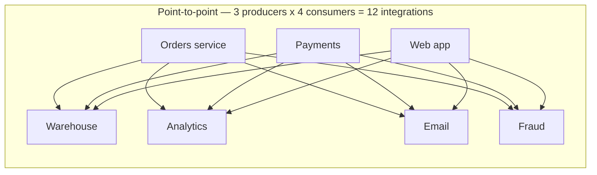
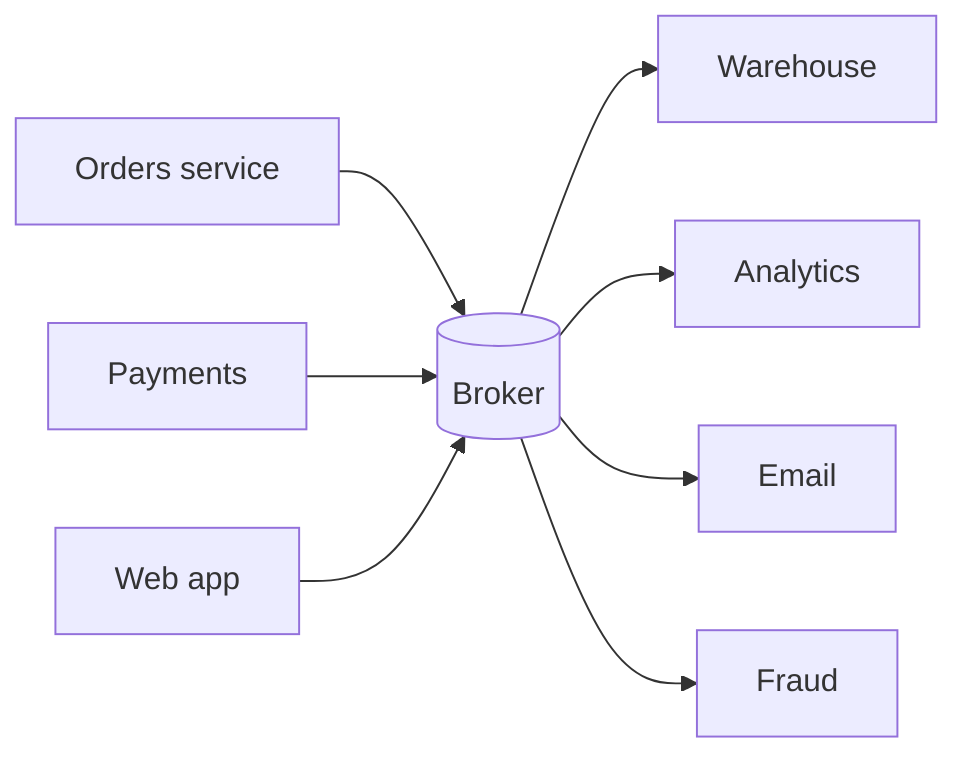
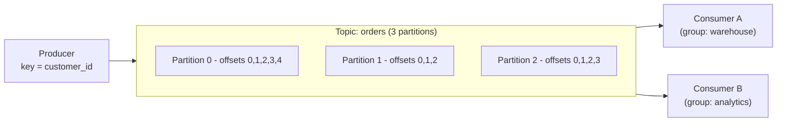
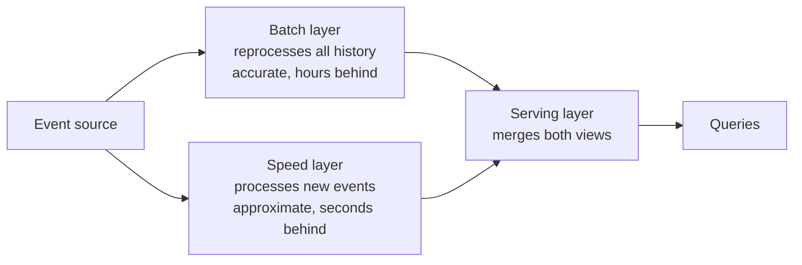
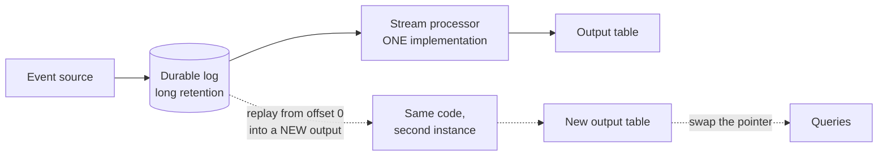

---
tags:
  - DE101
  - domain-5
  - streaming
  - kafka
  - event-time
date: 2026-06-20
status: complete
domain: "5 of 7"
track: data-engineering
---

# D5 — Stream Processing

**Back to:** [[00 - Onboarding Roadmap]]

> [!NOTE] Domain Overview
> This domain covers data that never stops arriving. You will learn what an event broker actually is, why "exactly-once" is a promise about *effects* rather than deliveries, how a stream engine decides a time window is finished, and what makes a stream expensive to operate. Kafka stays conceptual — you will not install a broker — but you will build and run a real incremental streaming pipeline.
>
> > [!TIP] Timing Tip
> > For a Data Analyst background, **streaming is typically a 3–6 month skill** — most intern-level DE roles start with batch pipelines first. Complete D1–D4 solidly before diving deep here. Concepts are important to know; hands-on mastery comes with experience.

> [!IMPORTANT] Read D4 First
> This domain assumes you have built the batch pipeline from [[D4 - Batch Processing & ETL]]. Streaming reuses almost everything from it — idempotency, the medallion layers, dead-letter handling, `run_id` correlation — and changes only *when* the work happens. If those ideas are not solid yet, streaming will feel like magic rather than engineering.

---

## 5.1 — Batch vs Stream: Choosing

> [!NOTE] What You'll Learn
> How to tell whether a requirement genuinely needs streaming, and what you are agreeing to pay when you say yes. This is the most valuable thing in the domain, because the most common streaming mistake is building one at all.

### Bounded vs Unbounded Data

The real dividing line is not speed. It is whether the dataset has an end.

| | **Bounded** | **Unbounded** |
|---|---|---|
| Definition | A finite dataset that is complete when you read it | A dataset that has no defined end — more will always arrive |
| Example | Yesterday's order file; a table snapshot | A clickstream; sensor readings; a payment authorisation feed |
| "Am I done?" | Yes — you read the last row | Never. You can only ask "am I caught up *for now*?" |
| Natural processing | **Batch** — read all of it, compute, stop | **Stream** — process indefinitely, emit as you go |

That single difference — *there is no last row* — is what makes streaming hard. Every convenience batch gives you depends on being able to see the whole input:

- You cannot `ORDER BY` a stream, because the smallest value might arrive tomorrow.
- You cannot compute an exact `COUNT(DISTINCT …)` over all time without remembering every value forever.
- You cannot re-run "the same job" and get the same answer, because the input changed while you were reading it.
- A `JOIN` has no natural end — the matching row may not have arrived yet.

> [!IMPORTANT] Streaming Is a Latency Requirement, Not a Modernness Requirement
> Nothing about a streaming pipeline is more advanced or more correct than a batch one. Streaming buys you exactly one thing: **lower latency between an event happening and that event affecting a decision**. Everything else it does — cost, complexity, on-call burden, difficulty of reasoning about correctness — it makes worse. If nobody is paying for that latency, you have bought the downsides for free.

### The Latency-Budget Test

Before agreeing to build a stream, ask two questions and write down the answers:

1. **What decision does this data drive?**
2. **How quickly is that decision actually made, by whom, and what does a delay cost?**

The answers usually collapse the requirement. Some worked examples:

| Stated requirement | What the decision actually is | Honest latency need |
|---|---|---|
| "Real-time sales dashboard" | A manager glances at it with morning coffee | **Hours.** Batch at 6am. Must be *correct* at 8am, not fresh at 07:59 |
| "Real-time inventory" | Website decides whether to show "in stock" | **Seconds.** Overselling costs real money and refunds |
| "Real-time fraud detection" | Approve or decline a card payment in-flight | **Milliseconds.** The decision cannot wait for a batch job |
| "Real-time data science features" | A model retrains weekly | **Days.** Someone said "real-time" because it sounded ambitious |

> [!TIP] The Question That Ends Most Streaming Projects
> "If this data were 30 minutes old, what specifically would go wrong?" If the answer is a shrug, a hypothetical, or "it would just be nicer" — you need a scheduled batch job, possibly a frequent one. If the answer names a concrete loss (money, safety, a customer-visible error), you have a streaming requirement. Write the answer in the ticket, because you will be asked to justify the cost later.

### Where Streaming Genuinely Earns Its Cost

Four patterns recur, and they share a property: **a human or system acts on the individual event, not on an aggregate of it.**

| Pattern | Example | Why batch fails |
|---|---|---|
| **Blocking decisions** | Fraud scoring, credit checks, ad bidding | The event is *waiting* for your answer |
| **Threshold alerting** | Machine temperature, error-rate spikes, security anomalies | The value of the alert decays to zero within minutes |
| **Operational state** | Inventory levels, ride-share driver positions, seat availability | A stale answer is a wrong answer users see |
| **Event-driven side effects** | Send the confirmation email; start the shipment | The event *is* the trigger for work |

Notice what is missing: reporting, analytics, dashboards, model training, and financial reconciliation. Those are batch problems, and they are the majority of data engineering work.

### What Streaming Actually Costs

[[D4 - Batch Processing & ETL#4.1 — ETL vs ELT|D4 §4.1]] already compared batch, micro-batch, and streaming on latency and cost per record. The costs that surprise people are operational, not computational:

| Cost | Batch | Streaming |
|---|---|---|
| **Compute** | Runs, finishes, releases | Often always-on — you pay for idle |
| **"Just re-run it"** | The standard fix for almost everything | Not available. There is no discrete run to repeat |
| **Debugging a wrong number** | Query the input; it is still sitting there | Reconstruct what the state *was* at the moment it went wrong |
| **Deploying a change** | Next run picks it up | Requires stopping a stateful process and deciding what happens to its accumulated state |
| **On-call** | "The 2am job failed, re-run at 6am" | "Lag is climbing and the alert queue is 40 minutes behind reality" |
| **Correctness** | Deterministic — same input, same output | Depends on arrival order and timing, which vary run to run |

> [!TIP] Micro-Batch Is the Answer More Often Than Either Extreme
> A job that runs every 2 minutes and processes whatever arrived gets you most of streaming's freshness with most of batch's simplicity: it has discrete runs you can re-run, it releases its compute, and it is deterministic given its input. This is exactly what you will build in §5.7 — and on Databricks Free Edition it is the *only* thing you can build, which turns out to be pedagogically useful rather than limiting.

> [!WARNING] Common Anti-Patterns
>
> ❌ **Building a stream because the requirement said "real-time"** — nobody defined it, and the consumer is a dashboard refreshed hourly
> ✅ Run the latency-budget test and write the answer down. "Real-time" is not a specification
>
> ❌ **A streaming pipeline that lands in a table an analyst queries once a day** — you pay always-on compute for a daily read
> ✅ Match the pipeline's cadence to the *slowest* consumer that actually needs it
>
> ❌ **Streaming to avoid the work of thinking about schedules** — "if it's always running, I never have to decide when it runs"
> ✅ Always-on removes the schedule and replaces it with lag monitoring, state management, and restart semantics. That is more work, not less
>
> ❌ **Treating a stream as a faster batch job** — same SQL, same assumptions, no watermark, no state limit
> ✅ Streaming has genuinely different semantics (§5.4, §5.5). Code that ignores them appears to work and produces wrong numbers under load

---

## 5.2 — Message Queues & Event Brokers

> [!NOTE] What You'll Learn
> What sits between the system producing events and the systems consuming them, and why it is a *log* rather than a queue. Kafka is the reference implementation and stays **conceptual here — you will not install it**. The vocabulary matters more than the operations: you will meet these words in every streaming design discussion, and in the Azure managed equivalent you would actually use at work.

### The Problem a Broker Solves

Start with no broker. Three systems produce events; four systems need them. Every producer must know every consumer's address, protocol, and availability:



This is the **N×M integration problem**. Twelve connections, each with its own retry logic and failure mode. Add one consumer and you modify three producers. If Analytics is down, does the Orders service block, buffer, or drop?

A broker collapses it to N+M:



Seven connections. Producers know only the broker. A consumer can be down for an hour and catch up afterwards, and no producer notices. Adding a fifth consumer changes nothing upstream. This decoupling — not throughput — is the main reason brokers exist.

### Queue vs Log — The Distinction That Matters

"Message queue" and "event broker" get used interchangeably. They are not the same thing, and the difference decides what you can build.

| | **Queue** (RabbitMQ, Azure Service Bus) | **Log** (Kafka, Azure Event Hubs) |
|---|---|---|
| On read | Message is **removed** | Message **stays** |
| Who tracks progress | The broker knows what is unread | Each consumer tracks its own position |
| Multiple independent consumers | Hard — they compete for the same messages | Natural — each reads the whole log independently |
| Replay yesterday's data | Impossible; it is gone | Read from an earlier position |
| Natural fit | Task distribution ("one worker should do this job") | Event distribution ("everyone who cares should see this") |

A queue is about **work**: a job must be done once, by someone. A log is about **facts**: something happened, and any number of systems may want to know, now or later.

> [!IMPORTANT] Data Engineering Almost Always Wants a Log
> Because you cannot know today every system that will need this data tomorrow — and because "replay the last three days into my new pipeline" is a request you will make constantly. A queue cannot serve it. This is why Kafka, not RabbitMQ, is the name that dominates data engineering, even though both are excellent at their own job.

### Kafka Anatomy

A **broker** is one Kafka server. A **cluster** is several brokers cooperating. Data lives in **topics**.

A **topic** is a named, append-only log — think "the `orders` feed". Topics are not queues and not tables: writes only ever append to the end, and reads never remove anything.

Each topic is split into **partitions**. A partition is the actual append-only log file; a topic is just a name for a group of them. Within a partition, every record has an **offset** — a monotonically increasing position number, like a line number.



A **record** carries a key, a value, a timestamp, and optional headers. The **key** decides the partition: Kafka hashes it, so every record with the same key lands in the same partition. No key means Kafka spreads records across partitions using **sticky batching** — it fills one partition's batch, then switches — rather than strict round-robin per record.

That leads to the single most important guarantee in Kafka, and the one most often misremembered:

> [!IMPORTANT] Ordering Is Per-Partition, Never Per-Topic
> Kafka guarantees that a consumer of a given topic-partition reads that partition's records in exactly the order they were written. It guarantees **nothing** about ordering across partitions of the same topic.
>
> The practical consequence: if the ordering of events for one entity matters — and it usually does, because "created then cancelled" and "cancelled then created" mean different things — you must give those events **the same key**, so they share a partition. Key `orders` by `order_id` and every event for one order is ordered. Leave the key null and your `cancelled` event can be processed before the `created` event it refers to.

The partition is therefore doing two jobs at once, and they pull against each other:

| Partition as… | Meaning | Consequence |
|---|---|---|
| **Unit of ordering** | Records in one partition are strictly ordered | Fewer partitions = stronger ordering guarantees |
| **Unit of parallelism** | One partition is read by at most one consumer in a group | More partitions = more consumers can work at once |

> [!TIP] Partition Count Is a Capacity Decision You Will Regret Getting Wrong
> Your maximum consumer parallelism equals your partition count — 4 partitions means the 5th consumer sits idle forever. You can *add* partitions later, but doing so changes which partition a key hashes to, which breaks the per-key ordering guarantee for existing keys. Getting this right up front matters more than most initial configuration.

### Consumer Groups

A consumer does not subscribe alone. It joins a **consumer group**, identified by `group.id`.

Within one group, each partition is assigned to exactly one consumer. The group — not the individual consumer — is the unit of consumption, and this is what makes both patterns work at once:

- **Fan-out (pub/sub):** two applications use two different `group.id` values on the same topic. Each group independently receives every record.
- **Scale-out (competing consumers):** three consumers share one `group.id`. The partitions are divided among them, and each record is handled once by the group.

Progress is tracked by **committing offsets** — recording "this group has processed partition 0 up to offset 4,812". Two details matter, and both are commonly stated wrong:

1. A committed offset is not a single number. It is a **map of topic-partition → offset**, because a group's progress differs per partition.
2. Those offsets are stored **broker-side**, in an internal Kafka topic called `__consumer_offsets`, keyed by the group. They are not a file on the consumer's disk. This is why a consumer can be replaced by a fresh process on a new machine and resume exactly where the group left off.

When group membership changes — a consumer joins, crashes, or is deployed — Kafka triggers a **rebalance**: partitions are reassigned across the surviving consumers.

> [!WARNING] Rebalancing Is the Most Common Real Cause of Duplicates
> A consumer reads records 100–200, processes them, and is about to commit offset 200 when a deploy restarts a sibling consumer. A rebalance reassigns that partition to another consumer, which resumes from the last *committed* offset — 100. Records 100–200 are processed a second time.
>
> Nothing failed. No error was logged. The work was simply done twice, because the commit had not happened yet. This is why at-least-once is the realistic default and why §5.3 exists.

### Retention and Compaction

Records do not stay forever by default. Two policies exist, set per topic by `cleanup.policy`:

| `cleanup.policy` | Behaviour | Use it for |
|---|---|---|
| `delete` *(default)* | Discard records older than `retention.ms`, or beyond a size cap | Event feeds — clicks, readings, logs |
| `compact` | Keep **at least the last value for every key**, discarding older values of that key | Current-state feeds — "the latest known address per customer" |
| `delete,compact` | Both — compact, and also drop anything past the retention window | Bounded current-state feeds |

`retention.ms` defaults to 7 days (`604800000`). At the broker level the equivalent is `log.retention.hours`, which defaults to `168`.

Compaction is worth understanding because it changes what a topic *is*. A compacted topic is no longer a history of what happened; it is a **table**, keyed by the record key, that you can replay from the beginning to rebuild current state. Deleting a key is done by writing a **tombstone** — a record with that key and a `null` value. Tombstones are themselves removed after `delete.retention.ms` (default 1 day) — which both gives consumers a window to observe the deletion *and* bounds how long a consumer reading from offset 0 has to finish before those deletion markers vanish from under it.

> [!TIP] Retention Is the Length of Your Undo Button
> Everything you can replay, backfill, or reprocess is bounded by retention. A 7-day retention means a bug discovered on day 9 cannot be fixed by replaying the source — the data is gone. This is precisely why the batch pattern from [[D4 - Batch Processing & ETL#4.3 — Medallion Architecture in Practice|D4 §4.3]] still applies: land raw events in cheap storage as they arrive, so your undo button is measured in years rather than days.

### Kafka Configuration — Recognise, Don't Memorise

You will not run a broker in this vault, and memorising broker tuning for a system you cannot touch is not learning. These are the settings that carry a *concept*; meet them here so the words are not new when you see them at work.

| Setting | Where | Default | The concept it encodes |
|---|---|---|---|
| `group.id` | Consumer | *(none — required)* | Which group's progress am I part of? |
| `auto.offset.reset` | Consumer | `latest` | With no committed offset, do I start at the end (`latest`), the beginning (`earliest`), fail (`none`), or a fixed distance back (`by_duration:<ISO-8601 duration>`, added in Kafka 4.0)? |
| `enable.auto.commit` | Consumer | `true` | Does the client commit my progress on a timer, or do I decide? |
| `cleanup.policy` | Topic | `delete` | Is this topic a history or a table? |
| `retention.ms` | Topic | `604800000` (7 days) | How long is my undo button? |
| `replication.factor` | Topic creation | *(broker default `default.replication.factor` is `1`; 3 is the common production choice)* | How many brokers hold a copy? |
| `min.insync.replicas` | Topic | `1` | How many copies must acknowledge before a write counts as durable? |

> [!WARNING] Two Defaults That Will Surprise You
>
> ❌ **`auto.offset.reset` defaults to `latest`.** A brand-new consumer group attached to a topic with three months of history reads **none of it** — it starts at the end. Interns lose hours to "my pipeline says zero rows" for this reason.
> ✅ Set `earliest` explicitly when you intend to process history.
>
> ❌ **`enable.auto.commit` defaults to `true`.** Your progress is committed on a timer (every 5 seconds), *whether or not your processing succeeded*. A crash 3 seconds after a commit silently loses the records in flight — at-most-once behaviour you did not ask for.
> ✅ For any pipeline where losing records matters, set it to `false` and commit after your write succeeds. §5.3 explains why that order is the whole ballgame.
>
> ❌ **`min.insync.replicas` defaults to `1`** — not 2. A single broker acknowledging is enough, so one disk failure can lose acknowledged writes.
> ✅ The *recommended* durable configuration is replication factor 3, `min.insync.replicas=2`, `acks=all`. None of that is the default; someone has to choose it.

### Kafka 4.x — Why Old Tutorials Mislead You

Until 2025, running Kafka meant running **two** distributed systems: Kafka itself, plus Apache ZooKeeper to store cluster metadata. **Kafka 4.0 (18 March 2025) removed ZooKeeper entirely.** Metadata now lives in Kafka itself via **KRaft** (Kafka Raft), its built-in consensus protocol.

This matters to you as a reader, not an operator: a large fraction of Kafka tutorials, Docker Compose files, and Stack Overflow answers still start by launching a ZooKeeper container. On Kafka 4.x that guidance is simply dead. When you evaluate a Kafka resource, check whether it mentions ZooKeeper — it dates the material precisely.

### Schema Registry

A topic's value is just bytes. If every producer invents its own JSON shape, every consumer becomes a guessing game, and a producer renaming a field breaks consumers silently.

A **schema registry** is a service holding the agreed schema for each topic, versioned. Producers register the schema and write a small schema ID alongside the payload; consumers fetch the schema by ID to decode. The registry enforces **compatibility rules**, rejecting a new version that would break existing readers.

This is the streaming form of the data contract from [[D4 - Batch Processing & ETL#4.6 — Data Quality, Contracts & Observability|D4 §4.6]] — and the reason **Avro** is the traditional carrier for event streams. As [[D3 - Data Storage & Formats#3.4 — File Formats|D3 §3.4]] explains, Avro reconciles reader and writer schemas by field *name* using declared defaults, so a consumer written last year can decode a record written today with an extra field.

### You Will Probably Use a Managed Broker

Operating Kafka is a specialist job. Most teams rent it. Two categories that get muddled in tool lists:

**Brokers and transports** — the log itself:

| Service | Notes |
|---|---|
| **Apache Kafka** | Self-hosted. Maximum control, maximum operational burden |
| **Azure Event Hubs** | Azure-native, exposes a **Kafka-protocol endpoint** — existing Kafka clients connect by changing configuration only. The managed option in this vault's stack |
| **Confluent Cloud** | Managed Kafka from Kafka's original authors |
| **AWS Kinesis Data Streams** / **GCP Pub/Sub** | The equivalents on the other two clouds |
| **Redpanda** | Kafka-API-compatible broker, self-hosted, single binary (no JVM, no ZooKeeper) |
| **Azure Service Bus** | A **queue**, not a log — the competing-consumers pattern. Different tool for a different job |

**Processing engines** — the code that reads the log and does something (covered in §5.6): Spark Structured Streaming, Apache Flink, Kafka Streams, Azure Stream Analytics.

Since Azure is this vault's cloud, Event Hubs is the one to know concretely:

| Kafka concept | Event Hubs equivalent |
|---|---|
| Cluster | Namespace |
| Topic | An event hub |
| Partition | Partition |
| Consumer group | Consumer group |
| Offset | Offset |

> [!IMPORTANT] "Kafka-Compatible" Is Not "Kafka"
> The Event Hubs Kafka endpoint covers the core protocol, but the edges differ — and the edges are where you get hurt:
>
> | Feature | Status on Event Hubs |
> |---|---|
> | Kafka endpoint | **Standard, Premium, Dedicated tiers only** — the Basic tier has none |
> | Kafka transactions | Public **preview**, Premium/Dedicated only |
> | Kafka Streams | Public **preview**, Premium/Dedicated only |
> | Compression | Premium/Dedicated only; `gzip` |
> | **Log compaction** | ✅ Supported (GA) — **Standard, Premium, Dedicated**. Enabled per event hub via its cleanup policy, not Kafka's `cleanup.policy`. Not on Basic |
>
> The pattern across those rows is what to carry away: the gaps are **tier and preview restrictions**, not missing concepts. Log compaction is a good example — it is a genuine, generally-available Event Hubs feature (tombstones work the same way, via a `null` payload on an existing key, and Microsoft names CDC as a primary use case), but it starts at Standard and you enable it on the event hub rather than through Kafka's `cleanup.policy`.
>
> So verify the capability against the specific service **and tier**, and expect the *configuration surface* to differ even where the behaviour matches. "Kafka-compatible" on a marketing page is not a guarantee about the feature you need on the plan you are paying for.

> [!WARNING] Common Anti-Patterns
>
> ❌ **A partition key with almost no distinct values** — keying by `country` when 90% of traffic is one country creates a **hot partition**: one consumer is overwhelmed while the others idle, and adding consumers cannot help because a partition is read by only one of them
> ✅ Key on something high-cardinality and evenly distributed that still groups what must stay ordered — `order_id`, `device_id`, `user_id`
>
> ❌ **No key at all on events whose order matters** — records are spread across partitions and processed out of order
> ✅ Key by the entity whose event sequence must be preserved
>
> ❌ **Treating a topic as a database** — "we'll just query Kafka for a customer's current address". A log has no indexes and no random access; you would scan every record
> ✅ Stream the topic into something built for queries — a Delta table, a key-value store — and query that. Compaction narrows the scan but does not make it a database
>
> ❌ **One giant `events` topic for everything** — every consumer deserialises and discards 95% of the volume, and one schema change affects everyone
> ✅ One topic per event type or bounded context. Topics are cheap; coupling is not
>
> ❌ **Assuming replay is always available** — "we can just reprocess from the beginning"
> ✅ You can replay only within retention. Check the number before promising a backfill

---

## 5.3 — Delivery Guarantees

> [!NOTE] What You'll Learn
> What "at-least-once" and "exactly-once" actually mean, why exactly-once *delivery* is not a thing anyone can sell you, and the one design rule that makes the whole problem tractable. You will run a small local program that loses records, then duplicates them, so the difference stops being vocabulary.

### The Guarantee Lives in One Decision

A consumer does two things with every record: it **processes** it (writes it somewhere, sends it somewhere) and it **records its progress** (commits the offset). The delivery guarantee you get is decided entirely by which of those two you do first.

That is the whole concept. Everything else is mechanism.

```text
  Option A — commit first, then process
  ─────────────────────────────────────
  read record  ──▶  commit offset  ──▶  ✗ CRASH  ──▶  restart
                                                      resumes AFTER the record
                                                      record is never processed
                                                      = AT-MOST-ONCE (data loss)

  Option B — process first, then commit
  ─────────────────────────────────────
  read record  ──▶  write output  ──▶  ✗ CRASH  ──▶  restart
                                        (no commit)   resumes AT the record
                                                      record is processed again
                                                      = AT-LEAST-ONCE (duplicates)
```

There is no third option. Between the write and the commit there is always a window, however small, in which the process can die — and whichever side of that window your commit sits on determines whether you lose records or repeat them.

| Guarantee | How you get it | What you risk | Acceptable when |
|---|---|---|---|
| **At-most-once** | Commit before processing | **Records are silently lost** | Almost never in data engineering. Occasionally for high-volume metrics where a gap is tolerable and latency is king |
| **At-least-once** | Commit after processing | **Records are duplicated** | The realistic default for essentially everything |
| **Exactly-once** | At-least-once **plus** a write that is safe to repeat | Complexity, and a narrower set of supported sinks | Anything where a duplicate is visibly wrong — money, counts, inventory |

> [!IMPORTANT] "Exactly-Once" Always Means Exactly-Once *Effect*, Never Exactly-Once *Delivery*
> No distributed system can guarantee a message is delivered precisely once. The network can always drop the acknowledgement to a write that actually succeeded, and the sender cannot distinguish that from a write that failed — so it must choose between retrying (risking a duplicate) and not retrying (risking a loss).
>
> What "exactly-once" genuinely means in every real system that advertises it: **the record may be delivered many times, and the observable end state is as if it arrived once.** The delivery is at-least-once; the *effect* is once. This is sometimes called **effectively-once**, which is the more honest name.
>
> The practical consequence is the single most useful rule in streaming: **stop trying to prevent duplicates, and make duplicates harmless instead.**

### Idempotency vs Deduplication — Two Different Tools

Both make repeats harmless. They are not the same, and confusing them causes real outages.

| | **Idempotency** | **Deduplication** |
|---|---|---|
| The idea | The write is safe to repeat — doing it twice equals doing it once | Detect that you have seen this record before, and discard it |
| Mechanism | `MERGE`/upsert on a key; delete-then-rewrite a partition; keyed overwrite | A remembered set of seen IDs, usually in stream state |
| State required | **None** — the target table's key constraint does the work | **Grows with the number of distinct IDs you must remember** |
| How far back does it protect? | Forever. A duplicate arriving next year still collapses | Only as far back as your retained state (§5.5) |
| Failure mode | Needs a genuinely stable business key | Silently stops working once old IDs are evicted from state |
| Cost | Essentially free | Memory, checkpoint size, and a watermark to bound it |

> [!TIP] Prefer Idempotency; Reach for Deduplication Only When You Must
> Idempotency is stateless and unbounded — strictly better whenever the target supports a keyed write. Deduplication is the fallback for sinks that only append, or when you must drop duplicates *before* an aggregation (because `SUM()` over a duplicate is wrong no matter how idempotently you wrote it). Knowing which one you are relying on tells you what happens the day it fails.

### Kafka's Mechanisms — Recognise, Don't Memorise

Kafka provides two features you will hear named. You are unlikely to configure them at intern level; know what problem each solves.

**Idempotent producer.** A producer retrying an unacknowledged send could append the same record twice. Kafka gives each producer an ID and a per-partition sequence number, so the broker recognises and discards a resent duplicate. `enable.idempotence` defaults to `true`, and requires `acks=all` — which is itself the default since Kafka 3.0.

**Transactions.** A producer writing to several partitions can wrap them in a transaction (`transactional.id`) so consumers see either all of the writes or none. Combined with committing the consumer's offsets inside the same transaction, this gives the **read-process-write** pattern: consume, transform, produce, and commit progress atomically. Consumers only see committed data if they set `isolation.level=read_committed` — the default is `read_uncommitted`, meaning **by default you see records from transactions that later abort**.

> [!WARNING] Idempotence Can Be Silently Switched Off
> The `enable.idempotence` default is `true`, but conflicting settings change the outcome in two different ways depending on how you wrote your config:
>
> ❌ **You set a conflicting option (for example `acks=1`) and leave `enable.idempotence` unset** → idempotence is **silently disabled**. No error, no warning; you simply do not have the guarantee you assumed
> ✅ **You set `enable.idempotence=true` explicitly** → a conflicting option raises a `ConfigException` and the producer refuses to start
>
> Be explicit about guarantees you depend on. A config that fails loudly is worth more than a config that quietly downgrades.

### Spark's Contract

Spark Structured Streaming (§5.7) states its guarantee as a contract with three parts. All three must hold:

| Requirement | Meaning | Example |
|---|---|---|
| **Replayable source** | The source can re-deliver records from a saved position | Files, Kafka, Auto Loader ✅ · a raw network socket ❌ |
| **Checkpoint** | The engine durably records offsets and state before advancing | `.option("checkpointLocation", …)` |
| **Idempotent sink** | Re-writing the same batch does not duplicate | Delta table ✅ · blind `INSERT` into an append-only table ❌ |

Miss any one and you have at-least-once, regardless of what the engine could offer.

> [!IMPORTANT] `foreachBatch` Is At-Least-Once Unless You Make It Otherwise
> `foreachBatch` hands you each micro-batch as an ordinary DataFrame so you can use any batch operation — the standard escape hatch for sinks Spark has no native writer for. But it gives **at-least-once**: on failure the same batch can be re-executed, and whatever you did inside runs again.
>
> It also gives you the tool to fix it: the `batchId` argument is stable across retries. Either write idempotently (a `MERGE` keyed on a business key) or use `batchId` to detect that this batch already landed. A plain `df.write.mode("append")` inside `foreachBatch` will duplicate on retry.

### Where Exactly-Once Always Breaks

The contract above covers writes to systems that participate in the checkpoint. It cannot cover **side effects outside it**:

- Sending an email or SMS
- Calling a third-party payment API
- Publishing to a webhook
- Writing to a system with no keyed write and no transaction

If your stream sends a confirmation email and the batch retries, the customer gets two emails. No streaming engine can prevent this, because the email provider has no idea your checkpoint rolled back. The only fix is at the boundary: make the *external* call idempotent, usually by passing an **idempotency key** the receiving system deduplicates on — which is exactly what payment APIs provide for this reason.

> [!TIP] Ask "What Is My Sink?" Before Believing Any Guarantee
> Vendor documentation says "exactly-once" about the engine. Your pipeline's guarantee is the weakest link across source, engine, *and* sink. An exactly-once engine writing into a non-idempotent sink gives you at-least-once with extra steps.

### Hands-On: Seeing Both Failure Modes

This runs locally with nothing but Python and a text editor. It is deliberately small: one reader, one file of events, one progress file.

> [!WARNING] This Is a Teaching Model, Not a Model of Kafka
> The program below borrows the *shape* of consumer progress tracking to make the commit-ordering lesson visible. Four things about it are **not** how Kafka works, and you should not carry them away:
>
> | In this exercise | In real Kafka |
> |---|---|
> | Progress is one integer | A **map of topic-partition → offset**, one entry per partition |
> | Progress lives in a local file | Stored **broker-side** in `__consumer_offsets`, keyed by `group.id` — which is why a replacement process resumes correctly |
> | One reader, so no rebalance is possible | A **rebalance** is the most common real trigger of the duplicate path (§5.2) |
> | The file replays from position 0 forever | Replay is bounded by **retention** — typically 7 days |
>
> The single-file-progress model here is closest to Spark's `checkpointLocation`, not to Kafka's offset storage. What transfers exactly is the commit-ordering lesson; nothing else does.

Create the event log — 10 events, one JSON object per line:

```python
# make_events.py
import json
from pathlib import Path

events = [
    {"event_id": f"e{i:02d}", "user": f"u{i % 3}", "amount": 10 + i}
    for i in range(10)
]
Path("events.jsonl").write_text("\n".join(json.dumps(e) for e in events) + "\n")
print(f"wrote {len(events)} events")
```

Now a reader that crashes partway. Two flags control it: which order it commits in, and whether this run crashes at all — because the second run has to *not* crash in order to finish the job.

```python
# reader.py — usage: python3 reader.py <commit-first|process-first> [crash]
import json
import sys
from pathlib import Path

COMMIT_FIRST = sys.argv[1] == "commit-first"    # True = at-most-once
WILL_CRASH   = "crash" in sys.argv[2:]          # only the first run crashes
CRASH_AT     = 4                                # position to die on

progress = Path("progress.txt")
start = int(progress.read_text()) if progress.exists() else 0
lines = Path("events.jsonl").read_text().splitlines()
print(f"run start: position {start} ({sys.argv[1]}, crash={WILL_CRASH})")

def commit(pos):
    progress.write_text(str(pos + 1))

def process(event):
    with open("output.jsonl", "a") as sink:
        sink.write(json.dumps(event) + "\n")
    print(f"  processed {event['event_id']}")

for position in range(start, len(lines)):
    event = json.loads(lines[position])
    crash_now = WILL_CRASH and position == CRASH_AT

    if COMMIT_FIRST:
        commit(position)                        # progress saved FIRST
        if crash_now:
            sys.exit(f"  *** CRASH: committed {event['event_id']}, never processed it ***")
        process(event)
    else:
        process(event)                          # work done FIRST
        if crash_now:
            sys.exit(f"  *** CRASH: processed {event['event_id']}, never committed it ***")
        commit(position)

print("run finished cleanly")
```

> [!IMPORTANT] The Crash Must Land *Between* the Write and the Commit
> Note exactly where `sys.exit` sits in each branch — after one operation and before the other. That gap is the entire subject of this section. A crash placed after *both* operations proves nothing: the record was written and its progress recorded, so the restart behaves identically either way. The failure only becomes visible in the window between them.

Run each scenario from a clean slate — first run crashes, second run completes — and count what landed:

```bash
rm -f progress.txt output.jsonl && python3 make_events.py
python3 reader.py process-first crash    # dies at position 4
python3 reader.py process-first          # resumes and finishes
wc -l < output.jsonl
```

```bash
rm -f progress.txt output.jsonl && python3 make_events.py
python3 reader.py commit-first crash     # dies at position 4
python3 reader.py commit-first           # resumes and finishes
wc -l < output.jsonl
```

Verified output — 10 events in, and neither run produces 10:

| Run | Records written | What happened |
|---|---|---|
| `process-first` | **11** — `e04` appears twice | `e04` was written, then the crash prevented its commit. The restart resumed *at* `e04` and wrote it again. **At-least-once** |
| `commit-first` | **9** — `e04` is absent | `e04`'s position was committed, then the crash prevented its write. The restart resumed *past* `e04`. **At-most-once** |

Confirm the diagnosis rather than trusting the count:

```bash
python3 - << 'PY'
import json, collections
ids = [json.loads(l)["event_id"] for l in open("output.jsonl")]
counts = collections.Counter(ids)
print("duplicated:", [k for k, v in sorted(counts.items()) if v > 1])
print("missing:   ", sorted({f"e{i:02d}" for i in range(10)} - set(ids)))
PY
```

Neither run is broken code. Both are correct implementations of a different guarantee, and the only difference between them is **which side of the write the commit sits on**. That is the entire delivery-semantics problem, and it is a question worth asking of every pipeline you inherit.

To make the at-least-once run *effectively-once*, you do not fix the reader — you fix the **write**, exactly as [[D2 - SQL & Data Modeling#2.2 — SQL for Data Engineering|D2 §2.2]] and [[D4 - Batch Processing & ETL#4.5 — Batch Pipeline Design Patterns|D4 §4.5]] established: make the sink a keyed upsert instead of an append.

The `commit-first` run above overwrote `output.jsonl` with its 9-record result, so regenerate the at-least-once one first — otherwise the sink below reads 9 records and the lesson disappears:

```bash
rm -f progress.txt output.jsonl sink.duckdb && python3 make_events.py
python3 reader.py process-first crash
python3 reader.py process-first
wc -l < output.jsonl        # 11 — e04 twice
```

```python
# sink.py — replay the at-least-once output through an idempotent sink
import duckdb, json

con = duckdb.connect("sink.duckdb")
con.execute("""CREATE TABLE IF NOT EXISTS handled (
                   event_id VARCHAR PRIMARY KEY, user VARCHAR, amount INT)""")

for line in open("output.jsonl"):            # the 11-record at-least-once output
    e = json.loads(line)
    con.execute("""INSERT INTO handled VALUES (?, ?, ?)
                   ON CONFLICT (event_id) DO UPDATE
                       SET user = excluded.user, amount = excluded.amount""",
                [e["event_id"], e["user"], e["amount"]])

print("input lines: ", sum(1 for _ in open("output.jsonl")))
print("rows in sink:", con.execute("SELECT COUNT(*) FROM handled").fetchone()[0])
```

```text
input lines:  11
rows in sink: 10
```

Eleven records in, ten rows out. The duplicate still **arrives** — nothing stopped it — it simply stops mattering, because the second write of `e04` overwrites the first instead of adding a row. That is effectively-once, and it required no change whatsoever to the consumer.

> [!WARNING] Common Anti-Patterns
>
> ❌ **Committing progress before the write succeeds** — including by accident, via `enable.auto.commit=true` on a timer
> ✅ Commit after the write is durable. Accept duplicates and make the sink idempotent
>
> ❌ **Believing a vendor's "exactly-once" covers your pipeline** — it covers their engine
> ✅ Trace source → engine → sink and find the weakest link. That is your real guarantee
>
> ❌ **Retrying a non-idempotent write** — a blind `INSERT` inside `foreachBatch`, retried, duplicates the batch
> ✅ `MERGE` on a business key, or gate on `batchId`
>
> ❌ **Sending an email or calling a payment API directly from a stream with no idempotency key** — a retry charges the customer twice
> ✅ Pass an idempotency key the receiving system deduplicates on, or write the intent to a table and let a separate, guarded process perform the side effect

---

## 5.4 — Event Time, Windows & Watermarks

> [!NOTE] What You'll Learn
> Why a stream needs its own notion of time, how it decides that "the 10:00–10:05 window is finished" when a late record could always still arrive, and the trade-off you are making every time you set that threshold. This is the concept that separates people who have used a stream engine from people who understand one.

> [!IMPORTANT] Same Word, Different Concept From D4
> [[D4 - Batch Processing & ETL#4.5 — Batch Pipeline Design Patterns|D4 §4.5]] used **watermark** to mean a *high-water mark*: a stored maximum timestamp recording how far a batch job has processed. In stream processing a watermark is something else entirely — a **tolerance for late data that decides when a time window can be closed**. Same word, unrelated mechanism. If you are holding D4's meaning in your head, put it down for this section.

### Three Kinds of Time

Every event has at least two timestamps, and confusing them is the most common source of quietly wrong streaming numbers.

| | Definition | Where it comes from |
|---|---|---|
| **Event time** | When the thing actually happened | Inside the record — set by the device or application that created it |
| **Ingestion time** | When it arrived at your broker | Assigned by the broker on write |
| **Processing time** | When your code got to it | Your machine's clock, at that moment |

A concrete case. Someone uses your mobile app on the underground at **09:58**, taps "add to basket", and has no signal. The phone queues the event. They surface at **10:07** and the app flushes its queue.

- Event time: **09:58**
- Ingestion time: **10:07**
- Processing time: **10:07**, or later if your consumer is behind

Now: which five-minute bucket does that basket-add belong to?

If you aggregate on processing time, it lands in `10:05–10:10`. Your 09:55–10:00 total was already published and was wrong, and will *stay* wrong. Worse, the same input replayed tomorrow lands in a different bucket entirely — your pipeline is non-deterministic, so "the numbers changed and nothing was deployed" becomes a recurring conversation.

> [!IMPORTANT] Aggregate on Event Time — Almost Always
> Processing time is a property of your infrastructure: how fast your consumers ran, whether a deploy paused them, whether the network hiccuped. Aggregating on it means your business metrics move when your infrastructure moves, which makes them useless for anything but monitoring the infrastructure itself.
>
> Event time makes results **reproducible**: replay the same events in any order and the same buckets get the same totals. The price is that you must decide how long to wait for stragglers — and that decision is the watermark.

### Out-of-Order Arrival Is Normal

Given that events carry their own time and travel independently, records simply do not arrive in event-time order. Causes are mundane and permanent: mobile clients buffering offline, retries after a failure, one partition's consumer lagging behind another's, a client with a wrong clock, a batch of IoT readings uploaded when a device reconnects.

So a stream engine faces a question with no perfect answer: **when is the 10:00–10:05 window done?** Waiting forever gives perfect completeness and never emits a result. Emitting immediately gives fast, wrong answers. Every stream engine resolves this the same way — with a watermark.

### Windows

You cannot aggregate "all of an unbounded stream", so you aggregate slices of it. Four shapes cover almost everything:

| Window | Shape | Can one event be in two windows? | Use for |
|---|---|---|---|
| **Tumbling** | Fixed size, no gaps, no overlap | No | "Revenue per 5 minutes" — the default |
| **Sliding** *(Spark)* | Fixed size, emitted every *slide* interval, overlapping | Yes | "Rolling 1-hour average, updated every 5 minutes" |
| **Session** | Dynamic — grows while events keep arriving, closes after a gap of inactivity | No | "How long was this user active?" |
| **Snapshot** | Groups events sharing the exact same timestamp | No | Point-in-time reconciliation |

In Spark, tumbling and sliding are the same function — supply a slide interval and it overlaps, omit it and it tumbles:

```python
from pyspark.sql.functions import window, col

# Tumbling: 5-minute buckets, no overlap
.groupBy(window(col("event_ts"), "5 minutes"), col("product_id"))

# Sliding: 1-hour window, recomputed every 5 minutes (overlapping)
.groupBy(window(col("event_ts"), "1 hour", "5 minutes"), col("product_id"))
```

> [!WARNING] "Sliding Window" Means Two Different Things — A Real Trap
> Spark and Azure Stream Analytics use the same word for different shapes, and this vault's stack includes both.
>
> | You want | Spark | Azure Stream Analytics |
> |---|---|---|
> | Fixed, non-overlapping | `window(col, "10 minutes")` | `TumblingWindow(minute, 10)` |
> | Fixed size, overlapping on a fixed step | `window(col, "10 minutes", "5 minutes")` — Spark calls this **sliding** | `HoppingWindow(minute, 10, 5)` — ASA calls this **hopping** |
> | Emit only when the window's contents change | *(no equivalent)* | `SlidingWindow(minute, 10)` |
>
> So **Spark's "sliding" is ASA's "hopping"**, and **ASA's `SlidingWindow` has no Spark equivalent** — it emits only at the instants an event enters or leaves the window, so every output window contains at least one event. Read the platform's own definition rather than the word.

The same tumbling aggregate in Azure Stream Analytics, to show the concept is portable even when the syntax is not:

```sql
SELECT System.Timestamp() AS window_end,
       product_id,
       COUNT(*) AS events
FROM   ClickStream TIMESTAMP BY event_ts
GROUP BY product_id, TumblingWindow(minute, 5)
```

`TIMESTAMP BY event_ts` is ASA's way of saying "use this column as event time" — the equivalent of Spark's `withWatermark` column choice. Without it, ASA uses arrival time, and you are back to non-reproducible numbers.

### Watermarks

A **watermark** is the engine's moving estimate of "how far along in event time we are, allowing for lateness". You declare a tolerance; the engine tracks the rest.

```python
events.withWatermark("event_ts", "10 minutes")
```

Read that as: *"I accept records up to 10 minutes late. Beyond that, I would rather drop them than hold state open forever."*

The mechanism is simple arithmetic — the watermark is the **maximum event time seen so far, minus the threshold** — with two refinements that cause most of the confusion:

1. **It lags by one trigger.** The watermark is computed at the end of a micro-batch and applied to the *next* one. So a record that advances the maximum does not immediately close anything; the effect appears on the following batch.
2. **With multiple input streams there is one global watermark**, and by default it is the **minimum** across the streams. One lagging input therefore holds back window closure for everything — which is usually what you want for correctness, and occasionally a baffling performance mystery.

Here is a five-minute tumbling window with a 10-minute watermark, showing what survives:

```text
threshold = 10 min          window under construction: [10:00 – 10:05)

arrival   event_ts   max seen   watermark    outcome
─────────────────────────────────────────────────────────────────────────
10:02     10:01      10:01      09:51        counted  (10:00–10:05)
10:04     10:03      10:03      09:53        counted  (10:00–10:05)
10:06     09:59      10:03      09:53        counted  (09:55–10:00) — late
                                             but 09:59 > watermark 09:53
10:12     10:11      10:11      10:01        counted  (10:10–10:15)
                                             watermark 10:01 > 10:05?  no
                                             → [10:00–10:05) still open
10:19     10:18      10:18      10:08        counted  (10:15–10:20)
                                             watermark 10:08 > 10:05  YES
                                             → [10:00–10:05) EMITTED and
                                               its state is freed
10:20     10:02      10:18      10:08        DROPPED — 10:02 < watermark
                                             its window is already closed
```

*(Simplified: the table advances the watermark per record so the arithmetic is visible. In a real engine it advances at batch boundaries and applies on the next batch — refinement 1 above.)*

The last row is the point of the whole mechanism. That record is real data, it is correct, and it is thrown away — because the alternative is keeping every window in memory forever on the chance that something old shows up.

> [!IMPORTANT] A Watermark Is a Promise About Lateness, Not a Guarantee of Correctness
> The guarantee is strict in **one direction only**: records later than the threshold are *not guaranteed to be dropped* — depending on batch boundaries they may still be included. What is guaranteed is the opposite: records within the threshold will not be dropped.
>
> So a watermark is not a filter you can reason about record-by-record. It is a **bound on how much state the engine must retain**, and dropping late data is the price. Choosing "10 minutes" is choosing how much completeness to trade for bounded memory.

### The Trade-off You Are Actually Making

| Watermark threshold | Completeness | Latency to a final answer | State held |
|---|---|---|---|
| Short (30 seconds) | Lowest — genuinely late data is dropped | Lowest — windows close fast | Smallest |
| Long (24 hours) | Highest — almost nothing is dropped | Highest — a window's final value is only known a day later | Largest |

There is no correct setting; there is only a setting that matches how late your data actually arrives. Measure it before guessing: run a batch query over a week of raw events comparing `ingestion_ts - event_ts`, look at the 99th percentile, and set the threshold above it. Guessing produces either silent data loss or a stream that runs out of memory in production.

### Conditions for a Watermark to Actually Free State

A watermark only bounds state if the query is shaped so the engine can use it. Four conditions, all required:

1. **Output mode must be `append` or `update`.** `complete` mode must keep every aggregate forever by definition, so it can never evict.
2. The aggregation must group on the event-time column, or on `window()` of it.
3. `withWatermark` must name **the same column** the aggregation groups on.
4. `withWatermark` must be called **before** the aggregation.

```python
# ✅ correct — watermark first, same column, then aggregate
events.withWatermark("event_ts", "10 minutes") \
      .groupBy(window(col("event_ts"), "5 minutes")).count()

# ❌ watermark after the aggregation — too late to bound anything
events.groupBy(window(col("event_ts"), "5 minutes")).count() \
      .withWatermark("event_ts", "10 minutes")

# ❌ watermark on a different column than the aggregation uses
events.withWatermark("ingested_ts", "10 minutes") \
      .groupBy(window(col("event_ts"), "5 minutes")).count()
```

The failure mode of getting this wrong is the dangerous kind: the query **runs**. It produces plausible output for hours, while state grows without limit, until the job dies in production under a volume your test data never reached.

### What to Do With Late Data

In Spark you have exactly two options:

| Option | How | Trade-off |
|---|---|---|
| **Drop it** | Set the watermark and accept the loss | Simple. Your streaming numbers are slightly incomplete, permanently |
| **Reprocess in batch** | Keep raw events in Bronze; recompute affected windows in a scheduled batch job | Correct *and* bounded — the streaming result is provisional, the batch result is authoritative |

The second is the pattern most mature pipelines use, and it is why §5.6's architecture discussion matters: a stream gives you a fast provisional answer, and a batch job over the same retained raw data gives you the correct final one.

> [!TIP] Spark Has No "Side Output" for Late Records
> If you have read Flink or Apache Beam material, you will have met **side outputs** (and Beam's `allowedLateness`) — routing dropped-late records to a separate stream for inspection. **Spark has no equivalent.** Late records past the watermark are simply not aggregated. In Spark, the way to see what you dropped is to keep raw events in Bronze and compare against them in batch.

> [!WARNING] Common Anti-Patterns
>
> ❌ **Aggregating on processing time** — then wondering why yesterday's totals changed after a replay, or why a deploy moved the numbers
> ✅ Aggregate on event time. Reserve processing time for monitoring the pipeline itself
>
> ❌ **No watermark on a windowed aggregation** — state grows forever; the job dies weeks later, in production, under real volume
> ✅ Every stateful streaming query needs a watermark. Treat its absence as a bug even when the query runs fine
>
> ❌ **`withWatermark` on a different column than the aggregation** — silently no state eviction, because condition 3 is violated
> ✅ Same column, before the aggregation. Re-read the four conditions when a stream's memory climbs
>
> ❌ **Picking the threshold by intuition** — "10 minutes sounds sensible" with no idea of the actual arrival distribution
> ✅ Measure `ingestion_ts - event_ts` over real history and set it above the 99th percentile
>
> ❌ **Assuming a watermark filters late records deterministically** — it does not; the guarantee runs one way only
> ✅ Treat it as a bound on state. If you need exact late-data handling, reprocess in batch

---

## 5.5 — Stateful vs Stateless Processing

> [!NOTE] What You'll Learn
> The difference between a streaming job you can restart anywhere and one that carries memory, why that memory is the leading cause of streaming outages, and how the watermark from §5.4 becomes the tool that keeps it bounded.

### The Dividing Question

Ask one thing about your transformation: **does this record's output depend on any other record?**

| | **Stateless** | **Stateful** |
|---|---|---|
| Operations | `filter`, `select`, `withColumn`, parse, mask, route, flatten | `count`, `sum`, `avg`, windowed aggregates, joins, deduplication, sessionization |
| Memory between records | None | Accumulated results the engine must retain |
| Restart from scratch | Harmless — reprocess and get the same answer | Loses accumulated memory; results are wrong until it rebuilds |
| Scaling | Add machines freely | Adding machines redistributes state — more involved |
| Failure blast radius | Small | Large: a corrupt or lost state store can mean recomputing from source |

Stateless streaming is genuinely easy, and a surprising amount of production streaming is stateless: parse the JSON, mask the PII, drop the heartbeats, write to Bronze. If you can keep a pipeline stateless, do.

### State Stores and Checkpointing

A **state store** is where the engine keeps its accumulated memory — the running count per key, the windows still open, the set of IDs seen recently. A **checkpoint** is the durable record of two things written together: *where I am in the source* (offsets) and *what I remember* (state).

Engines differ in the algorithm — Spark writes offsets and state at micro-batch boundaries; Flink flows barriers through the running dataflow to snapshot operators consistently — but the idea is identical in every one: periodically persist position plus memory, so a restart resumes instead of restarting.

> [!IMPORTANT] The Checkpoint Is Production Data
> A streaming checkpoint is not a cache and not a temp directory. It holds the only record of what your job has consumed and what it remembers. Delete it and you have told the job it has never run: it re-reads from the source's default starting position and rebuilds state from nothing.
>
> This is the single most common self-inflicted streaming incident — someone deletes a checkpoint to "clear a stuck stream" and either reprocesses months of data or silently skips everything that arrived while it was gone. Back it up. Treat its path as part of your deployment, and never point two queries at the same one.

### State Is Keyed

State is partitioned by the grouping key: the running total for `user_42` lives on whichever machine owns `user_42`. That is what allows state updates to be local — no coordination between machines to increment one counter.

It also makes key choice a capacity decision, exactly as partition choice was in §5.2. The number of **distinct keys** is the number of state entries the engine must hold. Grouping by `country` gives you a couple of hundred entries. Grouping by `session_id` gives you one per session, forever, unless something evicts them.

### State Growth Is the Leading Streaming Failure

Batch jobs fail loudly and immediately. Stateful streaming jobs fail *slowly*: they work perfectly in testing, work in production for a week, and then die — because state grew every day and nothing was ever removed.

Three mechanisms bound it:

| Mechanism | How | When to use |
|---|---|---|
| **Watermark eviction** | Windows and dedup state older than the watermark are dropped (§5.4) | The default for anything time-based |
| **State TTL** | An explicit expiry on entries in custom state | Custom stateful logic with no natural time bound |
| **Restructure to stateless** | Move the aggregation downstream into a batch job over the raw data | When the state requirement is genuinely unbounded |

> [!TIP] The Question That Predicts Streaming Outages
> "What removes entries from this state, and when?" If you cannot answer for every stateful operation in your query, you have an unbounded-state bug that has not surfaced yet. Ask it in code review; it costs one sentence and saves a 3am page.

### Deduplication

Removing duplicates in a stream is stateful — you must remember what you have seen. Spark gives two operators, and the difference is not cosmetic:

```python
# Unbounded — remembers EVERY guid forever. A bug waiting to happen.
events.dropDuplicates(["guid"])

# Bounded, but the event-time column must be part of the key
events.withWatermark("event_ts", "10 minutes") \
      .dropDuplicates(["guid", "event_ts"])

# Bounded, dedup on guid ALONE  (Spark 3.5+)
events.withWatermark("event_ts", "10 minutes") \
      .dropDuplicatesWithinWatermark(["guid"])
```

The middle form has a subtle hole, and it is the reason the third exists. Because `event_ts` is part of the dedup key, two copies of the *same logical record* that carry slightly different timestamps — a retry that re-stamped the event, a producer that regenerated it — are treated as two distinct records and both survive. `dropDuplicatesWithinWatermark` removes the requirement that event time be in the key, so it catches those while still bounding state by the watermark.

> [!TIP] Prefer an Idempotent Sink to Streaming Deduplication
> Per §5.3: dedup state is bounded, so it silently stops protecting you once entries are evicted — a duplicate arriving 11 minutes late with a 10-minute watermark sails through. A `MERGE` on a business key has no such window. Use streaming dedup when you must remove duplicates *before* an aggregation, and an idempotent sink for everything else.

### Joins

**Stream-to-table (enrichment)** is the common and easy case: each event looks up a relatively static dimension — order events joined to a product catalogue. The dimension is small, so it is broadcast to every machine and no state accumulates. This is the streaming form of the fact-to-dimension join from [[D2 - SQL & Data Modeling#2.5 — Dimensional Modeling|D2 §2.5]].

**Stream-to-stream** is genuinely hard, because a match may not have arrived yet. When an impression arrives, its click might come 20 minutes later — so the engine must retain unmatched records, and something must eventually let them go.

```python
# each side is an ordinary streaming DataFrame with a watermark declared
impressions = impressions_stream.withWatermark("impression_ts", "2 hours")
clicks      = clicks_stream.withWatermark("click_ts", "3 hours")

impressions.join(
    clicks,
    expr("""
        click_ad_id = impression_ad_id AND
        click_ts >= impression_ts AND
        click_ts <= impression_ts + interval 1 hour
    """),
    "leftOuter",
)
```

Two things bound the state: the **watermarks** and the **event-time range condition** in the join predicate. Without the range condition, the engine has no basis for concluding a match will never arrive.

The watermark requirements are precise, and easy to get backwards:

| Join type | Watermark requirement |
|---|---|
| **Inner** | **Optional** — the join is correct without one, but state grows unbounded until you add it |
| **Left outer** | **Required on the right** side (optional on the left) |
| **Right outer** | **Required on the left** side |
| **Full outer** | Required on **one** side |
| **Left semi** | **Required on the right** side |

> [!IMPORTANT] Outer Joins Need the Watermark on the *Opposite* Side
> The rule follows from what an outer join has to decide. To emit `(impression, NULL)` the engine must conclude *no click will ever match* — and it can only know that from the **clicks** watermark. So a left outer join needs the watermark on the right-hand stream. Requiring it on the left instead does nothing for the NULL decision.
>
> A consequence worth planning for: those NULL rows are **delayed** by the watermark plus the range condition. With the code above, an impression that never gets clicked is not emitted for roughly three hours. That is not a bug, and stakeholders will report it as one.

### Sessionization

The canonical stateful problem, and the one with no batch equivalent that is remotely as clean: group a user's events into sessions, where a session ends after a gap of inactivity.

```python
from pyspark.sql.functions import session_window, col

events.withWatermark("event_ts", "10 minutes") \
      .groupBy(session_window(col("event_ts"), "5 minutes"), col("user_id")) \
      .count()
```

The window has no fixed length — it grows while events keep arriving within 5 minutes of each other, and closes when they stop. State is held per active user, which is why the watermark matters: without it, every user who ever visited stays in memory.

> [!EXAMPLE] Real-World — Why a Streaming Dashboard Disagreed With Finance
> A retail team ran a Kafka → Spark → dashboard pipeline reporting revenue per 5-minute window, watermark set to 1 minute. It matched the finance batch report for two weeks, then drifted low by 1–3% every day and worse at month end.
>
> The cause was two-part. Their mobile client buffered events when offline and flushed on reconnect, so a long tail of events arrived 5–40 minutes late — well past a 1-minute watermark, and silently dropped. Month end was worse because a promotion drove traffic in areas with poor coverage.
>
> Diagnosis was a single batch query over retained Bronze events: `ingestion_ts - event_ts` had a p99 of **31 minutes**. The 1-minute watermark had been a guess, and it was dropping roughly 2% of records.
>
> Two things changed. The watermark went to 45 minutes, which fixed the drift and cost 45 minutes of latency before a window's value was final. And the dashboard was relabelled: the streaming number became "provisional", with a nightly batch job over Bronze producing the authoritative figure. **The fix was as much organisational as technical** — the streaming number was never going to be the final one, and pretending otherwise was the actual defect.

> [!WARNING] Common Anti-Patterns
>
> ❌ **`dropDuplicates` with no watermark** — remembers every ID for the life of the job; works in testing, dies in production
> ✅ Always pair streaming dedup with a watermark, or use an idempotent sink instead
>
> ❌ **Deleting a checkpoint to fix a stuck stream** — you lose offsets *and* state, so you either reprocess everything or skip everything
> ✅ Diagnose first. If you must reset, decide deliberately where the source should restart from and what the state rebuild costs
>
> ❌ **Changing the query's shape and reusing the checkpoint** — adding a grouping column or changing a window size makes the stored state incompatible; the query fails to start, or worse, restarts with meaningless state
> ✅ Treat a stateful query change as a migration: new checkpoint, planned rebuild, deliberate handling of the gap
>
> ❌ **Two streaming queries sharing one `checkpointLocation`** — they overwrite each other's offsets
> ✅ One checkpoint path per query, always
>
> ❌ **Assuming an inner stream-stream join is safe because it "works"** — it is correct without a watermark, and its state grows forever
> ✅ Add watermarks and an event-time range condition to every stream-stream join

---

## 5.6 — Streaming Pipeline Architecture

> [!NOTE] What You'll Learn
> The two named architectures you will hear in design discussions, what most companies actually run in 2026, and how change data capture turns a database into a stream. The real question underneath all of it is: **how many code paths do you maintain?**

### Lambda Architecture

Around 2011, the problem was concrete: stream processors of the day were fast but unreliable and approximate, while batch processing was accurate but slow. **Lambda architecture**, originated by Nathan Marz — described in his 2011 post *How to beat the CAP theorem* and named in *Big Data* (Manning, 2015) — resolved it by running both.



Every event goes to both layers. The batch layer recomputes authoritative results from all history on a schedule. The speed layer covers only the recent window the batch layer has not reached. The serving layer merges them, and each batch run replaces the corresponding speed-layer results.

It works, and its cost is brutal: **the same business logic is implemented twice, in two systems, in two languages, and the two implementations must agree**. Every rule change is two changes. Every discrepancy is a debugging session across two stacks to determine which one is lying.

### Kappa Architecture

By 2014 stream processors had become reliable enough to ask the obvious question. Jay Kreps — a co-creator of Kafka — argued in *Questioning the Lambda Architecture* (O'Reilly Radar, 2 July 2014) that if the streaming engine is accurate, the batch layer is redundant: keep the log, and **reprocess by replaying it through the same streaming code**.



To fix a bug or change logic, you do not build a batch job. You start a second instance of the *same* code reading the log from the beginning, write to a new output table, and when it catches up, swap consumers over and delete the old table. One codebase, one framework, one operational model.

Kreps was notably tentative about the name — he suggested it "may be too simple of an idea to merit a Greek letter." The label hardened through community use rather than through him defining it, which is worth knowing when someone treats "Kappa" as a formal specification. It is a design instinct: *one code path, replay to reprocess.*

The catch is the one from §5.2: **replay is bounded by retention.** Kappa's undo button only reaches as far back as your log keeps data, which is why serious Kappa implementations pair the log with long-term storage.

### What Most Companies Actually Run

Neither, exactly. The lakehouse from [[D3 - Data Storage & Formats#3.3 — Data Warehouse vs Data Lake vs Lakehouse|D3 §3.3]] largely dissolved the dilemma, because one engine now reads both bounded and unbounded sources and writes to the same tables.

| | Lambda | Kappa | Streaming lakehouse *(common today)* |
|---|---|---|---|
| Code paths | **Two** | One | **One** — same transformations, different trigger |
| Reprocessing | Re-run the batch layer | Replay the log | Re-run the same code over retained raw data |
| History limit | Whatever storage holds | **Log retention** | Storage — years |
| Where raw lands | Both layers separately | The log | **Bronze**, once |

In practice: events land in Bronze as they arrive, the same Silver and Gold transformations from [[D4 - Batch Processing & ETL#4.3 — Medallion Architecture in Practice|D4 §4.3]] run over them, and *how often* is a trigger setting rather than an architecture. Streaming becomes a scheduling decision instead of a parallel universe — which is the outcome Kappa was arguing for, achieved through cheap storage rather than through log replay.

> [!IMPORTANT] The Real Question Is Never "Lambda or Kappa"
> It is **how many implementations of this business rule will exist?** Every additional one is a place for the two to disagree, and they will. If you find yourself writing the same revenue definition in PySpark and in SQL for two different latency tiers, you have built Lambda regardless of what you call it — and you have signed up for reconciling them forever.

### Change Data Capture — A Database as a Stream

Most valuable data starts in an operational database, not an event stream. **Change data capture (CDC)** turns that database into one by reading its transaction log — the internal record every database keeps of every row change — and emitting one event per `INSERT`, `UPDATE`, and `DELETE`.

This is what [[D3 - Data Storage & Formats#3.1 — OLTP vs OLAP|D3 §3.1]] pointed forward to, and why it beats the alternatives: no query load on the source (contrast [[D4 - Batch Processing & ETL#4.1 — ETL vs ELT|D4 §4.1]]'s warning about querying a production primary), no `updated_at` column required, and **deletes are captured** — which a timestamp-based incremental extract can never see.

| Tool | Notes |
|---|---|
| **Debezium** | The open-source standard. Reads Postgres/MySQL/SQL Server logs, publishes to Kafka |
| **Lakeflow Connect** | Databricks' managed connectors, including SQL Server and PostgreSQL CDC |
| **Azure Data Factory** | Has CDC capability for supported sources — the orchestration path in [[D6 - Cloud & Orchestration]] |

> [!WARNING] A CDC Feed Will Silently Corrupt Any Aggregate You Build Naively
> This is the part that catches everyone, and it is worth working through concretely.
>
> A customer places an order for **$100**. Later it is corrected to **$150**. Later still it is cancelled, and the row is deleted. Your CDC feed lands three events in Bronze:
>
> | `op` | `order_id` | `amount` |
> |---|---|---|
> | `INSERT` | 1001 | 100 |
> | `UPDATE` | 1001 | 150 |
> | `DELETE` | 1001 | *(150)* |
>
> Now `SELECT SUM(amount) FROM bronze_orders` returns **400**. The true answer is **0** — the order does not exist. The append-only Bronze layer is faithfully correct as a *history of changes*, and catastrophically wrong as a *set of orders*.
>
> ❌ **Aggregating directly over an append-only CDC feed** — every update double-counts and every delete is invisible
> ✅ **Apply the change feed before aggregating.** In Silver, `MERGE` each change onto the primary key — updates overwrite, deletes remove (or set a soft-delete flag) — so Silver holds *current state*, one row per order. Aggregate that.
>
> If you need history as well as current state, this is exactly the SCD Type 2 problem from [[D2 - SQL & Data Modeling#2.5 — Dimensional Modeling|D2 §2.5]] — and dbt snapshots ([[D4 - Batch Processing & ETL#4.2 — dbt (Data Build Tool)|D4 §4.2]]) are the batch tool for it. Keep the raw change feed in Bronze either way; it is the only place the full history exists.

### Streaming Into a Table Format

[[D4 - Batch Processing & ETL#4.4 — Table Formats in Production (Apache Iceberg & Delta Lake)|D4 §4.4]] explained why a folder of Parquet files is not a table. Streaming makes that argument sharper: a stream commits continuously, so without atomic commits a reader would routinely observe a half-written batch. Delta and Iceberg make each micro-batch an atomic metadata commit, which is what makes them safe streaming sinks at all.

The unavoidable consequence: a stream committing every minute writes a small file every minute. As [[D3 - Data Storage & Formats#3.6 — Partitioning, Indexing & Query Optimization|D3 §3.6]] covers, thousands of small files degrade read performance badly.

> [!IMPORTANT] Every Streaming Sink Needs a Compaction Job
> This is not optional tuning; it is part of the pipeline. Delta's `OPTIMIZE` (or Iceberg's `rewrite_data_files`) must run on a schedule against any table a stream writes to. A streaming pipeline shipped without one performs beautifully for a week and then gets progressively slower for reasons that look mysterious if you have not met the small-file problem.

### The Tool Landscape

These get listed together and are two different categories. Confusing them makes design conversations incoherent.

**Brokers and transports** — hold the log (§5.2): Apache Kafka, Azure Event Hubs, AWS Kinesis, GCP Pub/Sub, Confluent Cloud, Redpanda.

**Processing engines** — read the log and compute:

| Engine | Model | Language | Best fit |
|---|---|---|---|
| **Spark Structured Streaming** | Micro-batch by default | Python, SQL, Scala, Java | Teams already using Spark for batch — same API, same code |
| **Apache Flink** | Record-at-a-time by default | Java, Python, SQL | Lowest latency; the most sophisticated state and event-time handling |
| **Kafka Streams** | Record-at-a-time, **a library** — no cluster to operate | Java | JVM applications that need stream processing embedded in the app |
| **Azure Stream Analytics** | Managed, SQL-only | SQL | Azure-native, minimal operations, windowed aggregation over Event Hubs |

> [!TIP] "Micro-Batch vs Record-at-a-Time" Is About Defaults, Not Capability
> The contrast is real but softer than the slogans suggest, and both leak:
>
> - **Flink** buffers records for network transfer — `execution.buffer-timeout.interval` defaults to 100 ms, and setting it to 0 minimises latency at a throughput cost. It also has a batch runtime mode.
> - **Spark** has an experimental continuous processing mode reaching ~1 ms latency, but only with **at-least-once** guarantees rather than exactly-once.
>
> The honest summary: Flink's default is per-record and Spark's default is micro-batch, and for the latency ranges an intern-level project cares about, the difference will not be the deciding factor. Team skills and existing platform almost always dominate.

Also worth recognising: **Azure Data Explorer** and **Microsoft Fabric Eventstream** appear in Azure streaming discussions. Eventstream shares Stream Analytics' windowing surface; Data Explorer is a real-time analytics *database* — a place streams land to be queried, not an engine that processes them.

> [!EXAMPLE] Real-World — Retiring a Speed Layer
> A logistics company ran textbook Lambda: Spark batch jobs computing daily delivery SLA metrics, and a separate Flink job computing the same metrics for a live operations screen. Two teams, two languages, one definition of "on time" — implemented twice.
>
> It failed the way Lambda always fails. The definition changed ("on time" began excluding customer-caused delays), the batch job was updated, and the Flink job was updated three weeks later by a different team with a slightly different interpretation of a null. For three weeks the live screen and the daily report disagreed, and every discrepancy was investigated as a data bug rather than the process bug it was.
>
> The fix was not adopting Kappa. They moved both onto one Delta lakehouse: raw scan events land in Bronze, **one** set of Silver and Gold transformations, run every 2 minutes for the operations screen and re-run nightly over the full day for the authoritative report. Same code, two schedules.
>
> Latency went from seconds to about two minutes — which nobody minded, because the screen was watched by humans making decisions over minutes. **They traded latency nobody needed for consistency everybody needed**, and deleted an entire codebase.

> [!WARNING] Common Anti-Patterns
>
> ❌ **Building Lambda by default** because a blog post presented it as the architecture for real-time data
> ✅ Start with one code path. Add a second only when a measured latency requirement genuinely cannot be met by the first
>
> ❌ **A speed layer whose numbers never reconcile with batch** — and a standing agreement to ignore the difference
> ✅ Either make them agree, or label one provisional and one authoritative, publicly, as in §5.5's case study
>
> ❌ **Aggregating over an append-only CDC feed** — the CDC `SUM` that returns 400 when the answer is 0
> ✅ `MERGE` the change feed into current state in Silver first, then aggregate
>
> ❌ **Streaming into a lake with no compaction job scheduled** — a small file per commit, forever
> ✅ Schedule `OPTIMIZE` against every streaming sink from day one
>
> ❌ **Choosing an engine on latency benchmarks** when your requirement is minutes
> ✅ Choose on what your team can operate and what your platform already runs

---

## 5.7 — Hands-On & Operations: Structured Streaming

> [!NOTE] What You'll Learn
> You will build and run a real incremental streaming pipeline: files land, a stream picks up only what is new, results go into a Delta table, and a checkpoint makes reruns safe. Then you will break it on purpose — late data, a schema change — and read the metrics that tell you what happened. Part B covers what Free Edition cannot run but you will meet at work.

### The Mental Model

Structured Streaming's core idea is that **a stream is a table that keeps growing**, and a streaming query is an ordinary batch query re-run against it as it grows — with the engine tracking what it has already processed.

That is why the API is the same API. `select`, `filter`, `groupBy`, `join` all mean what they mean in batch. Only three things are new, and you have already met all three:

| New concept | Covered in |
|---|---|
| **Trigger** — when to look for new data | Below |
| **Checkpoint** — what has been consumed and remembered | §5.5 |
| **Watermark** — how long to wait for late data | §5.4 |

> [!IMPORTANT] Free Edition Runs Only Triggered Streams — Read This Before Writing Any Code
> Databricks Free Edition is **serverless-only**, and serverless notebooks and jobs accept only two Structured Streaming triggers:
>
> | Trigger | Status on serverless |
> |---|---|
> | `Trigger.AvailableNow()` — process everything available, then stop *(Spark 3.3+)* | ✅ Supported, **recommended** |
> | `Trigger.Once()` — one micro-batch, then stop | ⚠️ Supported but **deprecated** (since Spark 3.4 / DBR 11.3 LTS) |
> | `Trigger.ProcessingTime(interval)` — every N seconds, forever | ❌ Not supported |
> | `Trigger.Continuous(interval)` | ❌ Not supported |
>
> The trap: Spark's **default** when you specify no trigger is `Trigger.ProcessingTime("0 seconds")`. So a streaming query with no explicit trigger fails on serverless with `INFINITE_STREAMING_TRIGGER_NOT_SUPPORTED`. **You must set `availableNow=True` on every streaming query you write here.**
>
> This restriction applies to serverless **notebooks and jobs**. Lakeflow pipelines are exempt and do support continuous mode — see Part B.
>
> What this costs pedagogically: nothing important. You cannot demonstrate sub-second latency, but every concept that matters — incremental processing, checkpoints, watermarks, state, output modes, schema evolution — works identically. A scheduled `AvailableNow` job is also the most cost-efficient streaming pattern on serverless, so this is what a real cost-conscious pipeline often looks like anyway.

> [!NOTE] Verification Status
> This section is written against official Databricks and Spark documentation. Unlike this vault's DuckDB and dbt material, the code below has **not been execution-verified** — no Databricks workspace was available while writing it. Expect to adjust catalog and schema names for your workspace, and report anything that does not behave as described.

---

### Part A — Runnable on Databricks Free Edition

#### Setup

Create a schema and a **volume** — a Unity Catalog-governed storage location for files. Volumes are required because Free Edition disables the DBFS root, so paths like `/tmp/…` fail.

```sql
CREATE SCHEMA IF NOT EXISTS workspace.streaming_demo;
CREATE VOLUME IF NOT EXISTS workspace.streaming_demo.landing;
```

```python
BASE       = "/Volumes/workspace/streaming_demo/landing"
SOURCE     = f"{BASE}/events"          # where "the stream" arrives
CHECKPOINT = f"{BASE}/_checkpoint"     # offsets + state
SCHEMA_LOC = f"{BASE}/_schema"         # Auto Loader's inferred schema

dbutils.fs.mkdirs(SOURCE)
```

#### Step 1 — Produce Events

Each call writes one JSON file, simulating a batch of events landing. Note `event_ts` values are set explicitly rather than from the clock — that is what makes the windowing results below reproducible.

```python
import json

def drop_file(name, events):
    """Write one JSON-lines file. Single sequential write — volumes do not
    support append or random writes."""
    body = "\n".join(json.dumps(e) for e in events) + "\n"
    with open(f"{SOURCE}/{name}", "w") as f:
        f.write(body)
    print(f"wrote {name}: {len(events)} events")

drop_file("batch01.json", [
    {"event_id": "e1", "product_id": "P1", "amount": 10, "event_ts": "2026-08-19T10:01:00"},
    {"event_id": "e2", "product_id": "P1", "amount": 20, "event_ts": "2026-08-19T10:03:00"},
    {"event_id": "e3", "product_id": "P2", "amount": 30, "event_ts": "2026-08-19T10:04:00"},
])
```

#### Step 2 — Read the Stream Incrementally

**Auto Loader** (`cloudFiles`) is Databricks' file-source reader. It tracks which files it has already seen, so it never re-reads one — the file-based equivalent of a Kafka offset.

```python
raw = (spark.readStream
       .format("cloudFiles")
       .option("cloudFiles.format", "json")
       .option("cloudFiles.schemaLocation", SCHEMA_LOC)
       .option("cloudFiles.schemaHints", "event_ts TIMESTAMP, amount INT")
       .option("cloudFiles.maxFilesPerTrigger", 100)
       .load(SOURCE))

query = (raw.writeStream
         .trigger(availableNow=True)
         .option("checkpointLocation", CHECKPOINT)
         .toTable("workspace.streaming_demo.bronze_events"))

query.awaitTermination()
```

Four options carry the weight, and three of them are the ones people omit and then debug for an hour:

| Option | Why it is not optional |
|---|---|
| `cloudFiles.schemaLocation` | **Enables schema inference at all.** Without it Auto Loader has nowhere to persist the inferred schema and will not infer one |
| `cloudFiles.schemaHints` | JSON encodes no types, so Auto Loader infers **every column as `String`**. Without a hint pinning `event_ts TIMESTAMP`, the windowing in Step 4 fails on a string column |
| `checkpointLocation` | The offsets. Without it there is no "already processed". **Not** the same thing as `DataFrame.checkpoint()`, which is unsupported on serverless — streaming checkpoints are fine |
| `trigger(availableNow=True)` | Mandatory on serverless, per the callout above |

```sql
SELECT * FROM workspace.streaming_demo.bronze_events ORDER BY event_ts;
```

You should see three rows — plus a `_rescued_data` column, which Auto Loader adds automatically whenever it infers a schema. It captures values that did not fit the schema, so data is never silently dropped. It should be `NULL` for all three rows now; Step 6 makes it earn its place.

#### Step 3 — Prove the Checkpoint Works

Re-run the Step 2 cell without adding any files:

```python
# same query, run again with no new files
```

```sql
SELECT COUNT(*) FROM workspace.streaming_demo.bronze_events;
```

Still **3**. The checkpoint recorded that `batch01.json` was consumed, so the second run had nothing to do.

This is the same idempotency property you verified in [[D4 - Batch Processing & ETL#4.5 — Batch Pipeline Design Patterns|D4 §4.5]] — running twice equals running once — achieved by a different mechanism. In D4 the *write* was idempotent (`MERGE` on a key). Here the *read* is: the source refuses to hand you the same file twice.

Now add a second file and re-run:

```python
drop_file("batch02.json", [
    {"event_id": "e4", "product_id": "P2", "amount": 40, "event_ts": "2026-08-19T10:06:00"},
    {"event_id": "e5", "product_id": "P1", "amount": 50, "event_ts": "2026-08-19T10:12:00"},
])
```

Count becomes **5** — only the two new records were processed. That is incremental processing, and it is the whole point.

> [!IMPORTANT] Now Break It Deliberately
> Delete the checkpoint directory and re-run:
>
> ```python
> dbutils.fs.rm(CHECKPOINT, recurse=True)
> ```
>
> The stream has no memory that it consumed anything, so it re-reads **both** files and appends all five records again — the table now holds **10 rows, every one duplicated**.
>
> Nothing errored. This is §5.5's warning made concrete, and it is worth doing once with your own hands so that "just delete the checkpoint" never sounds like a harmless fix. Recreate the table before continuing:
>
> ```sql
> DROP TABLE workspace.streaming_demo.bronze_events;
> ```
>
> Then re-run Step 2 to rebuild it. It lands 5 rows again — the checkpoint went with the table, so both files are re-read exactly once.

#### Step 4 — Windowed Aggregation With a Watermark

Now the event-time machinery from §5.4, on real data. Five-minute tumbling windows, 10-minute watermark:

```python
from pyspark.sql.functions import window, col, sum as _sum, count

windowed = (spark.readStream
            .table("workspace.streaming_demo.bronze_events")
            .withWatermark("event_ts", "10 minutes")
            .groupBy(window(col("event_ts"), "5 minutes"), col("product_id"))
            .agg(_sum("amount").alias("revenue"), count("*").alias("events")))

(windowed.writeStream
 .trigger(availableNow=True)
 .option("checkpointLocation", f"{BASE}/_checkpoint_windowed")
 .outputMode("append")
 .toTable("workspace.streaming_demo.gold_revenue_5min")
 .awaitTermination())
```

Note the ordering, which is condition 4 from §5.4: `withWatermark` comes **before** `groupBy`, and names the same column the window uses.

```sql
SELECT window.start, window.end, product_id, revenue, events
FROM   workspace.streaming_demo.gold_revenue_5min
ORDER BY window.start, product_id;
```

In `append` mode a window is written only once it is **final** — once the watermark has passed its end. With a 10-minute watermark and a maximum event time of 10:12 the watermark sits at 10:02, and the earliest window `[10:00, 10:05)` ends at 10:05 — later than 10:02. So **this query returns zero rows.**

Nothing is broken. Every window is still open and holding state, waiting for evidence that no more data is coming for it.

To close them, land an event far enough in the future to advance the watermark:

```python
drop_file("batch03.json", [
    {"event_id": "e6", "product_id": "P1", "amount": 60, "event_ts": "2026-08-19T10:40:00"},
])
```

Re-run Step 2, then Step 4 — and **still nothing appears.** This is §5.4's "it lags by one trigger" in the flesh: the batch that consumes the 10:40 event is evaluated against the *old* watermark (10:02) and emits nothing, only raising the watermark to 10:30 at the end of that batch. Because `Trigger.AvailableNow()` stops as soon as the source is drained, there is no following batch left to act on the new value.

Land one more file, then re-run Step 2 and Step 4 again, and the earlier windows finally close and their rows appear.

**This is the completeness-versus-latency trade-off from §5.4, visible in a table** — the results were correct all along; they were simply not final yet. And a triggered stream needs one more trigger than you expect in order to say so, which is worth remembering the first time a windowed query looks empty.

#### Step 5 — Output Modes

```python
# ✅ append — only finalised rows. Requires a watermark on an aggregation.
.outputMode("append")

# ✅ complete — rewrites the entire result every batch. Keeps ALL state forever.
.outputMode("complete")
```

> [!WARNING] The Delta Sink Does Not Support `update` Mode
> Writing a streaming aggregation to a Delta table supports `append` and `complete` only. `update` — emitting rows whose value changed since the last batch — is a genuinely useful mode, but the way to get upsert-style streaming writes into Delta is `foreachBatch` plus `MERGE`, not `outputMode("update")`.
>
> To *see* `update` mode without a Delta sink, use the in-memory sink:
>
> ```python
> (windowed.writeStream
>  .format("memory").queryName("live_revenue")
>  .outputMode("update")
>  .trigger(availableNow=True)
>  .start().awaitTermination())
>
> spark.sql("SELECT * FROM live_revenue ORDER BY window.start").show(truncate=False)
> ```
>
> Also note `complete` mode **cannot evict state** — it must retain every aggregate to rewrite the full result. A watermark has no effect on state size in `complete` mode, which is condition 1 from §5.4.

#### Step 6 — A Schema Change Mid-Stream

> [!TIP] Run This Step Last
> This step adds a `channel` column to `bronze_events`, which is the **streaming source** for Step 4. Once it has run, Step 4's next execution sees a source schema change of its own. Do Step 6 after you are finished experimenting with Steps 4 and 5.

The most common real streaming incident: an upstream team adds a field. Land a file with a new column:

```python
drop_file("batch04.json", [
    {"event_id": "e7", "product_id": "P3", "amount": 70,
     "event_ts": "2026-08-19T10:45:00", "channel": "mobile"},
])
```

Re-run Step 2. The stream **fails** with `UnknownFieldException`.

That is not a bug — it is Auto Loader's default `schemaEvolutionMode` of `addNewColumns`: on detecting an unknown column it records the new schema and stops, so nothing is silently lost. **Re-run the same cell without changing anything** and it succeeds, now with a `channel` column.

```sql
SELECT event_id, product_id, channel, _rescued_data
FROM   workspace.streaming_demo.bronze_events ORDER BY event_id;
```

Earlier rows show `channel` as `NULL`; the new row is populated.

| `schemaEvolutionMode` | Behaviour on a new column |
|---|---|
| `addNewColumns` *(default when no schema is supplied)* | Stream fails; new schema recorded; succeeds on restart |
| `addNewColumnsWithTypeWidening` | As above, and widens an existing column's type where it can |
| `rescue` | Stream continues; unknown fields land in `_rescued_data` |
| `failOnNewColumns` | Stream fails and does **not** update the schema — human must intervene |
| `none` *(default when you supply a schema)* | New columns ignored entirely |

> [!IMPORTANT] A Stream That Stops on Schema Change Is a Feature
> "Fail and require a restart" looks hostile until you compare it to the alternative: a stream that silently discards a new field for six weeks, after which someone asks why `channel` is empty for all historical data that can no longer be recovered from an expired source.
>
> The operational implication is real, though: **any stream can be stopped by an upstream schema change**, so a production streaming job needs automatic restart, and its alerting must distinguish "stopped because schema evolved" (self-healing) from "stopped because it is broken" (page someone). This is the streaming form of the schema-drift handling in [[D4 - Batch Processing & ETL#4.5 — Batch Pipeline Design Patterns|D4 §4.5]].

#### Step 7 — Observing the Stream Without a Spark UI

Free Edition has **no Spark UI**. Your window into a running query is its progress object:

```python
import json
q = (raw.writeStream
     .trigger(availableNow=True)
     .option("checkpointLocation", CHECKPOINT)
     .toTable("workspace.streaming_demo.bronze_events"))
q.awaitTermination()

print(json.dumps(q.lastProgress, indent=2))
```

The fields worth knowing:

| Field | Tells you |
|---|---|
| `numInputRows` | Records in this batch. Zero means the source had nothing new |
| `inputRowsPerSecond` / `processedRowsPerSecond` | **Processing slower than arrival means you are falling behind** — the core health signal |
| `durationMs.triggerExecution` | How long the batch took end to end |
| `sources[0].numFilesOutstanding` / `numBytesOutstanding` | Auto Loader's **backlog** — the observable stand-in for consumer lag (Part B) |
| `stateOperators[].numRowsTotal` | **State size.** Watch this climb if you have an unbounded-state bug |
| `eventTime.watermark` | Where the watermark currently sits — the fastest way to explain "why is my window not emitting?" |

> [!TIP] `numRowsTotal` Is Your Unbounded-State Alarm
> Run a stateful query several times and watch `stateOperators[0].numRowsTotal`. In a healthy watermarked query it rises and then **falls** as windows close and their state is freed. If it only ever rises, your watermark is not evicting anything — go back to §5.4's four conditions. This single number would prevent most streaming out-of-memory incidents.

#### Testing a Streaming Pipeline

Streaming code is widely under-tested because "how do you unit-test something that never finishes?" The answer is that you do not test the stream — you test the transformation, and separately test that the wiring works on fixed input.

**1 — Extract the transformation into a pure function.** A function from DataFrame to DataFrame is testable with an ordinary static DataFrame, no streaming involved:

```python
def to_gold(df):
    """Pure transformation — no readStream, no writeStream."""
    return (df.withWatermark("event_ts", "10 minutes")
              .groupBy(window(col("event_ts"), "5 minutes"), col("product_id"))
              .agg(_sum("amount").alias("revenue")))
```

```python
# test — a plain batch DataFrame with EXPLICIT event times
fixture = spark.createDataFrame([
    ("e1", "P1", 10, "2026-08-19T10:01:00"),
    ("e2", "P1", 20, "2026-08-19T10:03:00"),
], "event_id string, product_id string, amount int, event_ts string") \
  .withColumn("event_ts", col("event_ts").cast("timestamp"))

result = to_gold(fixture).collect()
assert len(result) == 1, "both events belong to one 5-minute window"
assert result[0]["revenue"] == 30
```

**2 — Test the wiring by replaying a fixture directory.** Because `Trigger.AvailableNow()` terminates, a streaming test is an ordinary finite test: point the source at a directory of fixture files, use a fresh checkpoint, run to completion, assert on the output table.

```python
# integration test — fresh checkpoint, fixture files, assert, clean up
dbutils.fs.rm(f"{BASE}/_test_ckpt", recurse=True)
# … run the pipeline against a fixture directory …
assert spark.table("workspace.streaming_demo.test_out").count() == 5
```

> [!IMPORTANT] Never Let a Streaming Test Depend on the Clock
> Two rules make streaming tests deterministic, and breaking either produces a suite that passes locally and fails in CI at 23:58:
>
> ✅ **Set every `event_ts` explicitly** in fixtures. Never `current_timestamp()` — a window boundary will eventually fall mid-test
> ✅ **Use a fresh checkpoint per test run.** A leftover checkpoint means the second run reads nothing and your assertions pass on stale output

Three cases worth a test on any real pipeline: a **late record** past the watermark (assert it is excluded), a **duplicate** (assert the sink collapses it), and a **malformed record** (assert it lands in `_rescued_data` rather than killing the job).

---

### Part B — Conceptual: Operating a Real Stream

Part A's triggered model covers the semantics. Four operational realities only appear with always-on streams, and you will meet all four at work. This is not filler — it is the vocabulary of every streaming incident review.

#### The Always-On Ceiling

Free Edition's trigger restriction applies to notebooks and jobs. The always-on path on Databricks is a different product:

| Approach | What it is | Free Edition |
|---|---|---|
| **Lakeflow pipelines, continuous mode** | Declarative pipelines that stay running and process records as they arrive; managed state and automatic recovery | Available, but **one active pipeline per type** |
| **Streaming tables** (`CREATE OR REFRESH STREAMING TABLE`) | SQL-native incremental processing; a serverless pipeline is created and managed for you | Same limit applies |
| **Serverless job + `Trigger.AvailableNow()` on a schedule** | What you built in Part A | The practical choice here |

Worth knowing rather than doing at intern level: on a real platform, `Trigger.ProcessingTime("30 seconds")` in a long-running job is the familiar always-on shape, and the concepts below are what you monitor.

#### Consumer Lag

**Lag** is how far behind the end of the stream you are — with a broker, the difference between the latest offset written and the latest offset your group has committed. It is the single most important streaming metric, because it is the only one that directly answers "is my output currently trustworthy?"

Lag has three causes and they need different fixes:

| Cause | Signature | Fix |
|---|---|---|
| **Consumer too slow** | Lag climbs steadily under normal traffic | Optimise the transformation, or add consumers — up to the partition count |
| **Traffic spike** | Lag jumps, then drains once the spike passes | Usually nothing. Alert on *sustained* lag, not a spike |
| **Hot partition** | Total lag climbs while most consumers are idle | Fix the partition key (§5.2). Adding consumers cannot help |

> [!IMPORTANT] Alert on the Trend, Not the Value
> "Lag > 10,000 records" is a bad alert: it fires on every harmless traffic spike and stays silent during a slow bleed on a low-volume topic. What matters is **whether lag is being worked off**. Alert on lag increasing steadily over N consecutive intervals, or on estimated time-to-drain exceeding your latency budget from §5.1. A lag of 50,000 that is falling is healthy; a lag of 500 that has risen every minute for an hour is an incident.

You cannot observe broker lag in this vault — there is no broker. The observable equivalent in Part A is Auto Loader's backlog: `numFilesOutstanding` and `numBytesOutstanding`, plus `inputRowsPerSecond` versus `processedRowsPerSecond`. Same question, same interpretation, different source.

#### Backpressure and Rate Limiting

When a stream restarts after downtime, or starts against a topic with history, the first batch can try to process everything at once and exhaust memory. **Rate limiting** caps how much a single trigger consumes.

These options are commonly listed together and belong to **different sources** — using the wrong one is silently ineffective:

| Option | Source it belongs to |
|---|---|
| `cloudFiles.maxFilesPerTrigger` | Auto Loader |
| `cloudFiles.maxBytesPerTrigger` | Auto Loader |
| `maxFilesPerTrigger` | Spark's plain file source |
| `maxBytesPerTrigger` | Spark's plain file source *(Spark 4.0+)* |
| `maxOffsetsPerTrigger` | **Kafka source only** |

Setting `maxOffsetsPerTrigger` on a file source does nothing at all — no error, no warning, no effect.

The two file limits also behave **oppositely on the two file sources**, which is a genuine trap:

| Source | Can you set both file and byte limits? |
|---|---|
| Spark's plain file source | ❌ **No** — `maxFilesPerTrigger` and `maxBytesPerTrigger` cannot both be set; choose one |
| Auto Loader | ✅ **Yes** — it consumes up to whichever of `cloudFiles.maxFilesPerTrigger` / `cloudFiles.maxBytesPerTrigger` is reached first |

`cloudFiles.maxFilesPerTrigger` defaults to **1000**; `cloudFiles.maxBytesPerTrigger` has no default.

> [!TIP] Set a Rate Limit Before the First Production Run, Not After
> The first run of a stream against a source with history is the most dangerous moment in its life: it is the largest batch it will ever process. `Trigger.AvailableNow()` respects rate limits by splitting the backlog into multiple batches, which is exactly why Databricks recommends it over the deprecated `Trigger.Once()` — `Once` attempts the whole backlog in one batch.

#### The Poison Message

A record that cannot be processed — malformed, wrong type, a value that trips a bug — is a **poison message**. In batch you fix it and re-run. In a stream it is worse, because the record sits at the head of a partition and blocks everything behind it.

> [!IMPORTANT] You Cannot Skip a Poison Message Without Committing Past It — and Committing Past It *Is* the Skip
> There is no "process later" option. The only ways forward are:
>
> 1. **Commit past it** — the record is permanently skipped and, unless you captured it first, permanently lost
> 2. **Capture then commit past it** — write the raw record plus the failure reason to a **quarantine table**, then advance. The stream continues and nothing is lost
> 3. **Stop the stream** and fix the code — correct for a systematic bug, unacceptable for one bad record among millions
>
> Option 2 is the dead-letter pattern from [[D4 - Batch Processing & ETL#4.8 — Error Handling & Monitoring|D4 §4.8]], and everything there applies unchanged — capture the raw record, the reason, and the `run_id`, and **alert on the quarantine table's row count**. A dead-letter table nobody looks at is a data-loss mechanism with extra steps.
>
> Auto Loader's `_rescued_data` is a built-in partial version of this for schema mismatches only. It does not cover records your own logic rejects.

#### Replay Is Bounded

Everything you might want to reprocess is limited by source retention (§5.2) — 7 days by default on Kafka. A bug found on day 9 cannot be fixed from the broker.

This is the argument for the streaming lakehouse shape in §5.6, stated as an operational rule:

> [!TIP] Land Raw Events in Bronze Before Anything Else Touches Them
> Write every event to cheap storage on arrival, untransformed. That way your replay window is measured in years rather than in your broker's retention, and every fix becomes "re-run the transformation over Bronze" instead of "the data is gone". This is the same conclusion as [[D4 - Batch Processing & ETL#4.1 — ETL vs ELT|D4 §4.1]]'s "your raw layer is your undo button" — streaming just makes the deadline harder.

#### What to Monitor

| Signal | Why | Investigate when |
|---|---|---|
| **Lag / backlog** | Is output current? | Rising over consecutive intervals |
| **Batch duration vs trigger interval** | Can it keep up? | Duration approaches the interval |
| **State size** (`numRowsTotal`) | Unbounded-state bug? | Rises monotonically, never falls |
| **Input vs output row counts** | Silent drops? | Ratio changes without a deploy |
| **Watermark position** | Why is nothing emitting? | Far behind wall clock |
| **Quarantine row count** | Records being lost? | Any increase |
| **Restart count** | Instability or schema churn? | More than expected |

For the alerting discipline around these — severity tiers, who gets paged, what an actionable alert looks like — see [[D4 - Batch Processing & ETL#4.8 — Error Handling & Monitoring|D4 §4.8]]; the broader platform observability picture is [[D6 - Cloud & Orchestration]] §6.5.

#### Cost

| Pattern | Cost shape |
|---|---|
| Always-on continuous pipeline | Pay continuously, including overnight when nothing arrives |
| Scheduled `AvailableNow` job | Pay per run. Compute starts in seconds, works, exits |

A stream triggered every 5 minutes against a source that is quiet 12 hours a day can cost a fraction of an always-on equivalent for the same practical freshness.

> [!WARNING] Free Edition Quota — Do Not Leave Jobs Running
> Exceeding the Free Edition compute quota shuts down compute **for the rest of the day**. Since `Trigger.AvailableNow()` terminates on its own, you are mostly protected here — but do not schedule a continuous pipeline and walk away, and stop any long-running query before ending a session.

> [!WARNING] Common Anti-Patterns
>
> ❌ **No explicit trigger on serverless** — `INFINITE_STREAMING_TRIGGER_NOT_SUPPORTED`, and the message does not obviously say "add a trigger"
> ✅ `trigger(availableNow=True)` on every streaming query
>
> ❌ **Omitting `cloudFiles.schemaLocation`** — schema inference never happens, and the failure is confusing
> ✅ Always provide it; pin types you depend on with `schemaHints`
>
> ❌ **Windowing on a column Auto Loader inferred as `String`** — JSON encodes no types, so this is the default outcome
> ✅ `schemaHints` with `event_ts TIMESTAMP`, or `inferColumnTypes`
>
> ❌ **Deleting a checkpoint to unstick a stream** — you saw the duplicated table in Step 3
> ✅ Diagnose with `lastProgress` first. Resetting is a deliberate migration, not a quick fix
>
> ❌ **No rate limit on the first production run** — the largest batch of the job's life, unbounded
> ✅ Set `cloudFiles.maxFilesPerTrigger` before it ever runs against real history
>
> ❌ **Testing with `current_timestamp()`** — passes all day, fails when a window boundary lands mid-test
> ✅ Explicit event times in every fixture, fresh checkpoint per run
>
> ❌ **Alerting on absolute lag** — noisy during spikes, silent during a slow bleed
> ✅ Alert on the trend and on estimated time-to-drain

---

## ✅ Practice Checklist

- [ ] Take a "real-time" requirement — real or invented — and run the latency-budget test: write down the decision the data drives, how fast that decision is actually made, and what a 30-minute delay would concretely cost. State whether it justifies streaming
- [ ] Draw a Kafka topic with 3 partitions, a keyed producer, and two consumer groups of different sizes; label the offsets and mark exactly which ordering guarantees hold and which do not
- [ ] Run the `commit-first` / `process-first` exercise from §5.3 and record the row counts from both runs; explain in one sentence why one produced 11 records and the other 9
- [ ] Modify that exercise so the at-least-once run becomes effectively-once, by making the sink a keyed upsert instead of an append; confirm the duplicate no longer changes the output
- [ ] Given `event_ts` = 09:58 and arrival = 10:07 with a 5-minute tumbling window, state which window the record lands in under event-time and under processing-time aggregation, and which of the two is reproducible on replay
- [ ] Write a Spark windowed aggregation that violates one of §5.4's four watermark conditions, and explain what fails — and specifically why the failure is *not* an error message
- [ ] For a left outer stream-stream join, state which side needs the watermark and why the other side's watermark cannot answer the question
- [ ] Create a Unity Catalog volume, land a JSON file, and stream it into a Delta table with Auto Loader using `schemaLocation`, `schemaHints`, a checkpoint, and `trigger(availableNow=True)`; confirm the row count
- [ ] Re-run that stream with no new files and confirm the row count is **unchanged**; then delete the checkpoint, re-run, and confirm every row is now duplicated
- [ ] Land a file with a late event and one far in the future; confirm from `gold_revenue_5min` that an earlier window only appears once the watermark passes its end
- [ ] Land a file containing a new column; confirm the stream fails with `UnknownFieldException`, restart it unchanged, confirm it succeeds, and inspect `_rescued_data`
- [ ] Print `lastProgress` from a stateful query across three runs and record `stateOperators[0].numRowsTotal` each time; state whether it rises and falls (healthy) or only rises (unbounded-state bug)
- [ ] Extract a streaming transformation into a pure DataFrame-to-DataFrame function and unit-test it with a static fixture using explicit event times; add one test asserting a past-watermark record is excluded
- [ ] Write the `SUM(amount)` that goes wrong over an append-only CDC feed containing an insert, an update, and a delete for one order; state the number it returns, the correct number, and the `MERGE` that fixes it

---

## 📚 Domain References

| Resource | Use For |
|----------|---------|
| [Apache Kafka — Introduction & Key Concepts](https://kafka.apache.org/43/getting-started/introduction/) | Events, topics, partitions, the per-partition ordering guarantee |
| [Apache Kafka — Design](https://kafka.apache.org/43/design/design/) | Message delivery semantics, replication, consumer group model |
| [Apache Kafka — Topic Configs](https://kafka.apache.org/43/configuration/topic-configs/) | `cleanup.policy`, `retention.ms`, `min.insync.replicas`, `delete.retention.ms` |
| [Apache Kafka — Consumer Configs](https://kafka.apache.org/43/configuration/consumer-configs/) | `group.id`, `auto.offset.reset`, `enable.auto.commit`, `isolation.level` |
| [Apache Kafka — Producer Configs](https://kafka.apache.org/43/configuration/producer-configs/) | `enable.idempotence` and its silent-disable behaviour, `acks` |
| [Apache Kafka 4.0 Release Announcement](https://kafka.apache.org/blog/2025/03/18/apache-kafka-4.0.0-release-announcement/) | ZooKeeper removal and the move to KRaft — dates any tutorial you read |
| [Confluent — Log Compaction](https://docs.confluent.io/kafka/design/log_compaction.html) | Tombstones, compaction guarantees, when a topic becomes a table |
| [Confluent — Delivery Semantics](https://docs.confluent.io/kafka/design/delivery-semantics.html) | At-most/at-least/exactly-once, idempotent and transactional producers |
| [Spark — Structured Streaming Getting Started](https://spark.apache.org/docs/latest/streaming/getting-started.html) | The unbounded-table model and fault-tolerance semantics |
| [Spark — Structured Streaming APIs on DataFrames](https://spark.apache.org/docs/latest/streaming/apis-on-dataframes-and-datasets.html) | Watermarks, windows, output modes, the join support matrix, `foreachBatch` |
| [Spark — Structured Streaming Performance Tips](https://spark.apache.org/docs/latest/streaming/performance-tips.html) | Continuous processing mode and its at-least-once trade-off |
| [Spark — Kafka Integration](https://spark.apache.org/docs/latest/streaming/structured-streaming-kafka-integration.html) | `maxOffsetsPerTrigger` and Kafka source/sink options |
| [Databricks — Streaming on Serverless Compute](https://learn.microsoft.com/en-us/azure/databricks/compute/serverless/streaming) | Which serverless product fits which streaming pattern |
| [Databricks — Serverless Limitations](https://learn.microsoft.com/en-us/azure/databricks/compute/serverless/limitations) | The supported trigger list — read before debugging a stream that will not start |
| [Databricks — Structured Streaming Triggers](https://learn.microsoft.com/en-us/azure/databricks/structured-streaming/triggers) | `Trigger.AvailableNow()` semantics and why `Once` is deprecated |
| [Databricks — Auto Loader Schema Inference & Evolution](https://learn.microsoft.com/en-us/azure/databricks/ingestion/cloud-object-storage/auto-loader/schema) | `schemaLocation`, `schemaHints`, `schemaEvolutionMode`, `_rescued_data` |
| [Databricks — Auto Loader Observability](https://learn.microsoft.com/en-us/azure/databricks/ingestion/cloud-object-storage/auto-loader/observability) | `numFilesOutstanding` / `numBytesOutstanding` — the observable backlog |
| [Databricks — Unity Catalog Volumes](https://learn.microsoft.com/en-us/azure/databricks/volumes/) | Volume paths, and why append/random writes are unsupported |
| [Azure Event Hubs — Apache Kafka Protocol Support](https://learn.microsoft.com/en-us/azure/event-hubs/azure-event-hubs-kafka-overview) | Kafka↔Event Hubs concept mapping, tier limits, what does not carry over |
| [Azure Stream Analytics — Windowing Functions](https://learn.microsoft.com/en-us/azure/stream-analytics/stream-analytics-window-functions) | Tumbling, hopping, sliding, session, snapshot — and the naming trap |
| [Apache Flink — Stateful Stream Processing](https://nightlies.apache.org/flink/flink-docs-stable/docs/concepts/stateful-stream-processing/) | Keyed state, barriers and snapshots, event time in a per-record engine |
| [Delta Lake — Table Streaming Reads and Writes](https://docs.delta.io/delta-streaming/) | Delta as a streaming source and sink; supported output modes |
| [Jay Kreps — Questioning the Lambda Architecture](https://www.oreilly.com/radar/questioning-the-lambda-architecture/) | The Kappa argument in the author's own words (O'Reilly Radar, 2014) |
| [Nathan Marz — How to Beat the CAP Theorem](https://nathanmarz.com/blog/how-to-beat-the-cap-theorem.html) | The original Lambda architecture description (2011) |
| [Debezium Documentation](https://debezium.io/documentation/) | Change data capture connectors and the shape of a CDC event |
| [Cookbook — Stream Processing](https://github.com/andkret/Cookbook/blob/master/sections/03-AdvancedSkills.md#stream-processing) | Stream processing patterns overview |
| [Cookbook — Buffer / Message Queues](https://github.com/andkret/Cookbook/blob/master/sections/03-AdvancedSkills.md#buffer) | Message queue tooling landscape |

---

## 🃏 Quick-Reference Flash Cards

**Q:** What actually distinguishes a stream from a batch, and why does it make streaming hard?
**A:** Not speed — **boundedness**. A batch input is finite and complete when you read it; a stream is unbounded and has no last row. Every batch convenience depends on seeing all the input, so on a stream you cannot sort, cannot compute an exact `COUNT(DISTINCT)` over all time without infinite memory, cannot re-run and get the same input, and a join has no natural end.

---

**Q:** What single question should you ask before agreeing to build a streaming pipeline?
**A:** "If this data were 30 minutes old, what specifically would go wrong?" If the answer is a shrug or "it would be nicer", you need a scheduled batch job. If it names a concrete loss — money, safety, a customer-visible error — you have a real streaming requirement. Streaming buys exactly one thing, lower latency, and makes cost, complexity, and on-call burden worse.

---

**Q:** What is the difference between a queue and a log, and which does data engineering want?
**A:** A queue **removes** a message on read and the broker tracks what is unread — good for distributing work. A log **retains** records and each consumer tracks its own position — good for distributing facts. Data engineering wants a log, because you cannot know today which systems will need this data tomorrow, and "replay the last three days into my new pipeline" is impossible against a queue.

---

**Q:** What ordering does Kafka guarantee, and what must you do to get it?
**A:** Ordering is guaranteed **per partition, never per topic**. Records in one partition are read in write order; nothing is guaranteed across partitions. To get ordering for an entity you must give its events **the same key**, because the key hashes to the partition. With no key, records round-robin and a `cancelled` event can be processed before the `created` event it refers to.

---

**Q:** Why is partition count a decision you cannot easily undo?
**A:** It sets two things at once. Maximum consumer parallelism equals partition count — a 5th consumer on 4 partitions idles forever. And you can add partitions later, but doing so changes which partition existing keys hash to, breaking the per-key ordering guarantee for data already written. Ordering and parallelism pull in opposite directions and the choice is made up front.

---

**Q:** Where are Kafka consumer offsets stored, and in what shape?
**A:** **Broker-side**, in an internal topic called `__consumer_offsets`, keyed by the consumer group — not in a file on the consumer. And a committed offset is not one number: it is a **map of topic-partition → offset**, since progress differs per partition. This is why a crashed consumer can be replaced by a fresh process on a new machine and resume exactly where the group left off.

---

**Q:** What is a rebalance and why is it the most common cause of duplicates?
**A:** When group membership changes — a consumer joins, crashes, or is deployed — Kafka reassigns partitions across the survivors. If a consumer processed records 100–200 but had not yet committed offset 200, the new owner resumes from the last committed offset, 100, and reprocesses them. Nothing failed and nothing was logged; the work was simply done twice.

---

**Q:** What does log compaction do, and what does it turn a topic into?
**A:** `cleanup.policy=compact` retains at least the **last value for every key**, discarding older values of that key instead of deleting by age. That turns a topic from a history of what happened into a **table** you can replay from offset 0 to rebuild current state. Deletion is a **tombstone** — a record with a null value — itself removed after `delete.retention.ms` (default 1 day).

---

**Q:** Which two Kafka consumer defaults most often surprise people?
**A:** `auto.offset.reset` defaults to **`latest`**, so a brand-new consumer group on a topic with months of history reads **none of it** — a common "my pipeline returns zero rows". And `enable.auto.commit` defaults to **`true`**, committing progress on a 5-second timer whether or not your processing succeeded — silent at-most-once behaviour you did not ask for.

---

**Q:** What decides whether you get at-most-once or at-least-once?
**A:** Only one thing: whether you commit your offset **before** or **after** processing. Commit first and a crash means the record is skipped forever — at-most-once, data loss. Process first and a crash means the record is handled again on restart — at-least-once, duplicates. There is no third option, because the window between write and commit can always contain a crash.

---

**Q:** Why can nobody sell you exactly-once *delivery*?
**A:** Because the network can drop the acknowledgement to a write that actually succeeded, and the sender cannot distinguish that from a failed write — so it must choose between retrying (duplicate) and not retrying (loss). Every real "exactly-once" means exactly-once **effect**: delivery is at-least-once and the observable end state is as if it arrived once. The rule that follows is to stop preventing duplicates and make them harmless.

---

**Q:** How do idempotency and deduplication differ, and which should you prefer?
**A:** Idempotency makes the **write** safe to repeat (`MERGE` on a key) — stateless, protects forever, needs a stable business key. Deduplication **detects and discards** repeats — needs state that grows with distinct IDs, and silently stops protecting once state is evicted. Prefer idempotency; use dedup only when you must remove duplicates *before* an aggregation, since `SUM()` over a duplicate is wrong however idempotently you wrote it.

---

**Q:** What three things must all be true for Spark to give end-to-end exactly-once?
**A:** A **replayable source** (files, Kafka, Auto Loader — not a raw socket), a **checkpoint** durably recording offsets and state, and an **idempotent sink** (a Delta table, not a blind append). Miss any one and you have at-least-once regardless of what the engine advertises. Your pipeline's guarantee is the weakest link across source, engine, and sink.

---

**Q:** What guarantee does `foreachBatch` give, and how do you strengthen it?
**A:** **At-least-once** — on failure the same micro-batch can re-execute and whatever you did inside runs again. It also hands you the fix: the `batchId` argument is stable across retries, so either write idempotently with a `MERGE` on a business key, or use `batchId` to detect that this batch already landed. A plain `df.write.mode("append")` inside it will duplicate.

---

**Q:** What are the three kinds of time in a stream, and which should you aggregate on?
**A:** **Event time** (when it happened, carried in the record), **ingestion time** (when it reached the broker), and **processing time** (when your code got to it). Aggregate on **event time**: processing time makes your business metrics move whenever your infrastructure moves, and makes the same input land in different buckets on replay. Event time is reproducible; the price is deciding how long to wait for stragglers.

---

**Q:** What is a watermark, and what is its formula?
**A:** A declared tolerance for lateness that lets the engine decide a window is finished and free its state — `withWatermark("event_ts", "10 minutes")`. It equals the **maximum event time seen so far minus the threshold**, with two refinements: it is computed at the end of a micro-batch and applied to the *next* one, so it lags a trigger; and with several input streams there is one **global** watermark, by default the **minimum** across them.

---

**Q:** Is a watermark a guarantee that late data is dropped?
**A:** No — the guarantee runs one way only. Records within the threshold will **not** be dropped; records beyond it are **not guaranteed** to be dropped and may still be included depending on batch boundaries. A watermark is therefore not a per-record filter you can reason about, but a **bound on retained state**, and dropping late data is what you pay for that bound.

---

**Q:** What are the four conditions for a watermark to actually free state, and what happens if you break one?
**A:** Output mode must be **`append` or `update`** (`complete` must keep everything by definition); the aggregation must group on the event-time column or `window()` of it; `withWatermark` must name **the same column**; and it must be called **before** the aggregation. Break one and the query still **runs** — producing plausible output while state grows unbounded until the job dies in production.

---

**Q:** In Spark, what are your options for late data — and what option do you *not* have?
**A:** Two options: **drop it** (accept permanently slightly incomplete streaming numbers), or **reprocess in batch** over retained Bronze so the streaming result is provisional and the batch result authoritative. What you do **not** have is a **side output** — that is a Flink and Beam feature. In Spark, late records past the watermark are simply not aggregated, and the way to see them is to compare against Bronze.

---

**Q:** Which side of a left outer stream-stream join needs the watermark, and why?
**A:** The **right** side. To emit `(left, NULL)` the engine must conclude no right-side record will ever match, and only the right stream's watermark can establish that. Inner joins need no watermark for correctness (only to bound state). A consequence worth planning for: those NULL rows are delayed by the watermark plus the range condition, so an unmatched record may not appear for hours.

---

**Q:** Why does `dropDuplicatesWithinWatermark` exist when `dropDuplicates` already does?
**A:** Plain `dropDuplicates` with a watermark requires the event-time column to be **part of the dedup key** — so two copies of the same logical record carrying slightly different timestamps count as distinct and both survive. `dropDuplicatesWithinWatermark` (Spark 3.5+) removes that requirement, deduplicating on the business key alone while still bounding state by the watermark.

---

**Q:** Why is a streaming checkpoint production data?
**A:** It holds the only record of what the job has consumed and what it remembers. Deleting it tells the job it has never run: it re-reads from the source's default position and rebuilds state from nothing — so you either reprocess everything (duplicates) or skip everything that arrived while it was gone. It is the most common self-inflicted streaming incident, usually committed while trying to "clear a stuck stream".

---

**Q:** What question predicts most stateful streaming outages?
**A:** "What removes entries from this state, and when?" Stateful jobs fail slowly — perfectly in testing, fine for a week, then dead because state grew daily and nothing evicted it. The observable version is `stateOperators[].numRowsTotal` in `lastProgress`: healthy watermarked state rises **and falls** as windows close; state that only rises is an unbounded-state bug that has not surfaced yet.

---

**Q:** What is the real cost of Lambda architecture, and what does Kappa propose instead?
**A:** Lambda (Nathan Marz — described 2011, named in *Big Data*, 2015) runs a batch layer and a speed layer over the same events, so **the same business logic is implemented twice and the two must agree** — every rule change is two changes, and every discrepancy is a two-stack investigation. Kappa (Jay Kreps, 2014) says keep the log and reprocess by **replaying it through the same streaming code** into a new output table, then swap. One codebase, but the undo button is bounded by retention.

---

**Q:** Why does a `SUM()` over an append-only CDC feed give the wrong answer?
**A:** Because a CDC feed is a history of changes, not a set of rows. An order inserted at $100, updated to $150, then deleted lands three records, and summing them gives **400** when the true answer is **0** — updates double-count and deletes never decrement. Fix it by applying the change feed with a `MERGE` on the primary key in Silver so it holds current state, then aggregating that.

---

**Q:** Why does every streaming sink need a scheduled compaction job?
**A:** Because a stream commits continuously, and each commit writes a file — a stream committing every minute writes a small file every minute. Thousands of small files degrade read performance badly. `OPTIMIZE` (Delta) or `rewrite_data_files` (Iceberg) must run on a schedule against any table a stream writes to; without one the pipeline performs well for a week and then gets mysteriously slower.

---

**Q:** Why does a streaming query fail on Databricks serverless when you do not set a trigger?
**A:** Because Spark's default is `Trigger.ProcessingTime("0 seconds")` — an infinite trigger — and serverless notebooks and jobs accept only `Trigger.AvailableNow()` (recommended) and the deprecated `Trigger.Once()`. An unset trigger therefore raises `INFINITE_STREAMING_TRIGGER_NOT_SUPPORTED`. Lakeflow pipelines are exempt and do support continuous mode.

---

**Q:** Why must Auto Loader be given both `schemaLocation` and `schemaHints` for a windowed aggregation?
**A:** `cloudFiles.schemaLocation` is what **enables schema inference at all** — without somewhere to persist the inferred schema, Auto Loader does not infer one. And because JSON encodes no types, Auto Loader infers **every column as `String`**, so `withWatermark`/`window` on a timestamp column fails until `schemaHints` pins it as `TIMESTAMP` (or `inferColumnTypes` is enabled).

---

**Q:** Why is a stream that stops on a schema change a feature rather than a bug?
**A:** Because the alternative is silently discarding a new field for six weeks until someone asks why it is empty for unrecoverable historical data. Auto Loader's default `addNewColumns` mode records the new schema and stops; **re-running unchanged succeeds**. The operational implication is real: any stream can be halted by upstream schema change, so production streams need auto-restart and alerting that distinguishes self-healing stops from genuine breakage.

---

**Q:** Why should you alert on lag trend rather than absolute lag?
**A:** Because an absolute threshold fires on every harmless traffic spike and stays silent during a slow bleed on a low-volume topic. What matters is whether lag is being **worked off**: a lag of 50,000 that is falling is healthy, while a lag of 500 that has risen every minute for an hour is an incident. Alert on sustained increase, or on estimated time-to-drain exceeding your latency budget.

---

**Q:** Why can you not simply skip a poison message?
**A:** Because skipping it *is* committing past it, and once you commit past it the record is gone unless you captured it first. The record also blocks its partition until you do. The correct move is the dead-letter pattern: write the raw record plus the failure reason and `run_id` to a quarantine table, then advance — and **alert on the quarantine row count**, since a dead-letter table nobody reads is a data-loss mechanism with extra steps.

---

**Q:** Why land raw events in Bronze when the broker already retains them?
**A:** Because broker retention is short — 7 days by default — and it is the hard limit on everything you can replay, backfill, or reprocess. A bug found on day 9 cannot be fixed from the broker. Writing every event untransformed to cheap storage on arrival makes the replay window years rather than days, and turns every fix into "re-run the transformation over Bronze".

---

*Checkpoint: [[Checkpoints/CP5 - Stream Pipeline|CP5 - Stream Pipeline]]*

---

*Previous: [[D4 - Batch Processing & ETL]] | Next: [[D6 - Cloud & Orchestration]]*
