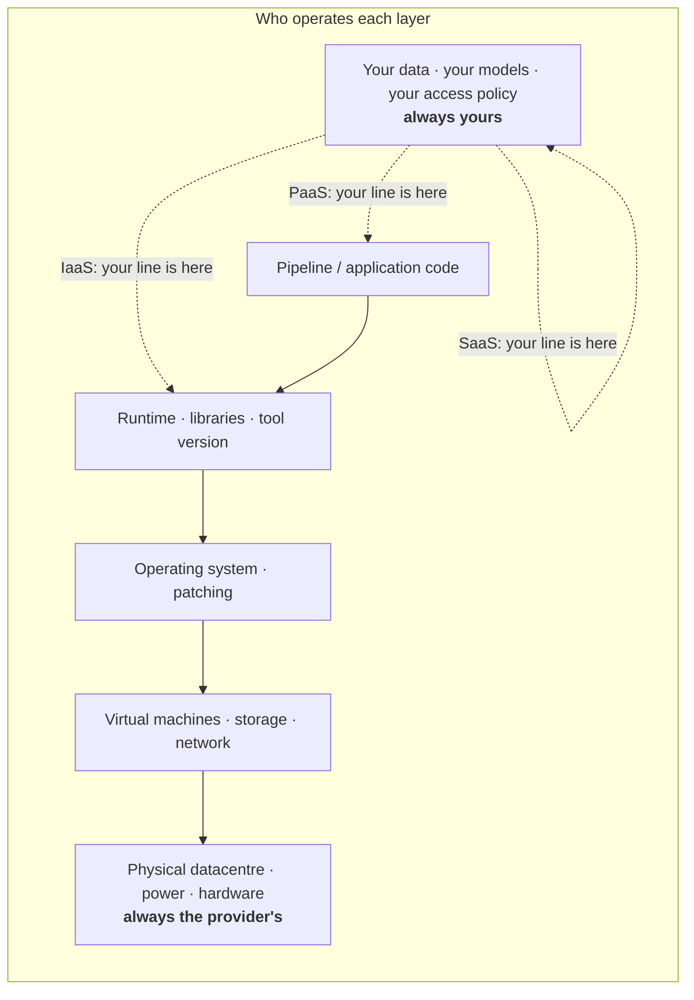
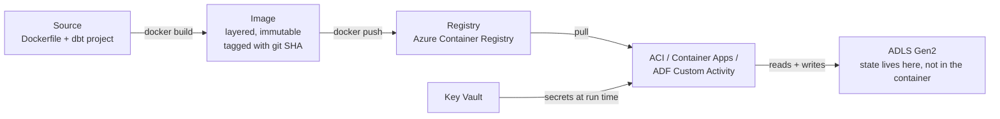
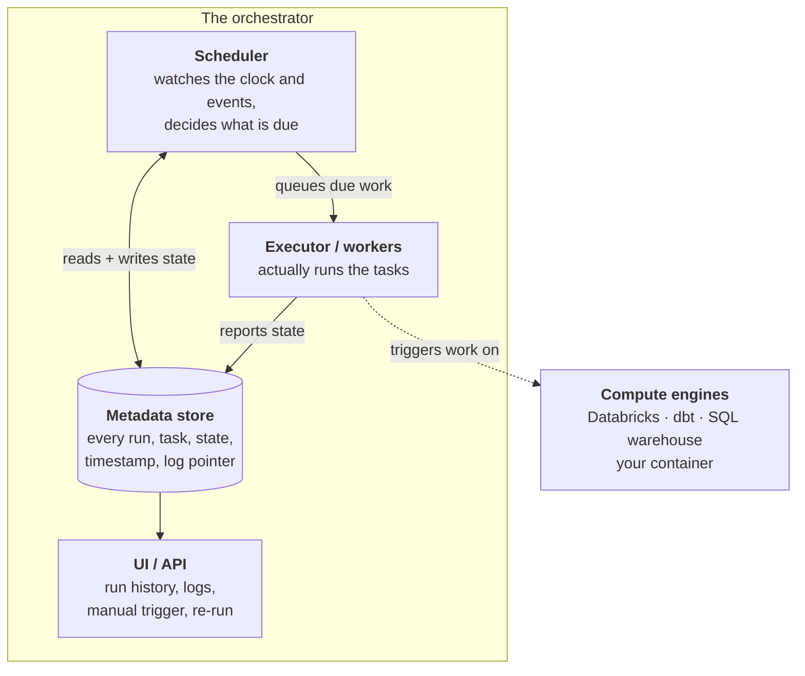
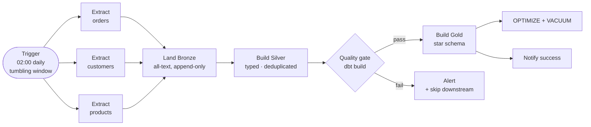
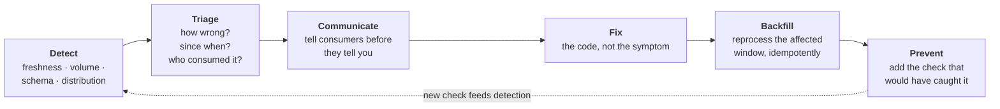

---
tags:
  - DE101
  - domain-6
  - cloud
  - orchestration
  - observability
date: 2026-06-20
status: complete
domain: "6 of 7"
track: data-engineering
---

# D6 — Cloud & Orchestration

**Back to:** [[00 - Onboarding Roadmap]]

> [!NOTE] Domain Overview
> Everything so far has been about making a pipeline *correct*. This domain is about making it *run* — on someone else's computers, on a schedule, without you watching. You will learn what you are actually renting when you rent a cloud, how to package a pipeline so it runs the same everywhere, how an orchestrator expresses "do this, then that, and tell me if it breaks", and how teams keep a platform trustworthy and affordable once nobody remembers who built what.
>
> This is the last mandatory domain. It is also the one that turns the code you wrote in D4 and D5 into something a company can depend on.

> [!IMPORTANT] Read D4 and D5 First
> This domain schedules and operates the pipelines those two built. It assumes you already have: an idempotent batch job with a `run_date` parameter ([[D4 - Batch Processing & ETL#4.5 — Batch Pipeline Design Patterns|D4 §4.5]]), a dbt project with tests ([[D4 - Batch Processing & ETL#4.2 — dbt (Data Build Tool)|D4 §4.2]]), retries and a dead-letter table ([[D4 - Batch Processing & ETL#4.8 — Error Handling & Monitoring|D4 §4.8]]), and the vocabulary for event-driven data ([[D5 - Stream Processing#5.2 — Message Queues & Event Brokers|D5 §5.2]]).
>
> D6 deliberately does **not** re-teach any of that. Where a topic here has a foundation there, you will get a link rather than a repeat — and you should follow it.

> [!IMPORTANT] What You Need to Do the Hands-On Work
> Two of this domain's exercises want a real cloud. Read this before you start, because your options depend on what your account can do.
>
> | Path | What you need | Covers |
> |---|---|---|
> | **Azure Data Factory** *(primary)* | An Azure **subscription** with rights to create resources in a resource group | The visual orchestrator this track's stack is built on, and what you will most likely meet on an Azure team |
> | **Databricks Free Edition** *(fallback)* | Nothing but a browser — a free account, which is the workspace [[D4 - Batch Processing & ETL#4.7 — Apache Spark & Distributed Processing\|D4 §4.7]] assumes | Real multi-task dependencies and a real cron schedule, free |
> | **GitHub Actions** *(fallback)* | The GitHub account from [[D1 - Foundations & Tooling#1.4 — Git & Version Control\|D1 §1.4]] | A scheduled run of your dbt project, free |
>
> If you are on a corporate tenant, resource creation is often blocked outright — that is normal and not your fault. Every ADF exercise below is paired with a **Without an Azure subscription** box that reaches the same learning outcome on the fallback path. Do one path properly rather than both badly.
>
> If you *do* have a subscription: Azure Data Factory's always-free allowance is the **first 5 low-frequency activities per month**, which is enough for a demo and not enough to learn iteratively. It also bills a small monthly charge for an **inactive pipeline** — one with no activity runs for a month — so a factory you abandon keeps costing money. **Delete your resource group when you finish the domain.**

---

## 6.1 — Cloud Fundamentals

> [!NOTE] What You'll Learn
> What the cloud actually sells, who is responsible when something breaks, how a program proves who it is without you typing a password, and where the money goes. [[D3 - Data Storage & Formats#3.3 — Data Warehouse vs Data Lake vs Lakehouse|D3 §3.3]] promised that account setup, authentication, and networking were D6's job. This is that section.

### The Argument for Renting

A nightly pipeline is a strange workload. It needs eight machines for forty minutes, then nothing for twenty-three hours and twenty minutes.

Buying eight machines to satisfy that means paying for them 24/7 and using them 3% of the time. Buying two machines instead means the job takes four hours. Neither is good. This shape — brief, intense, periodic — is what makes data engineering a natural cloud workload, and it is why the field moved almost entirely to rented infrastructure over about a decade.

The technical enabler was covered in [[D3 - Data Storage & Formats#3.3 — Data Warehouse vs Data Lake vs Lakehouse|D3 §3.3]]: separating storage from compute. Once your data lives in object storage rather than on a machine's disks, compute becomes disposable. You rent eight machines, they read from storage, they finish, you stop paying. The data does not care that they are gone.

> [!TIP] "Elastic" Means You Can Give It Back
> Interns often read *elastic* as "it can get bigger". The valuable half is that it can get **smaller**, down to zero. A warehouse that costs a fortune from 9am to 6pm and almost nothing overnight is not a billing quirk — it is the entire economic case. [[D5 - Stream Processing#5.7 — Hands-On & Operations: Structured Streaming|D5 §5.7]] made the same point in its cost table: an always-on stream pays continuously, a scheduled batch pays per run. Same code, very different bill.

### IaaS, PaaS, SaaS — Who Operates What

These three words describe *how much of the stack somebody else runs for you*. They are not marketing tiers; they are a statement about whose job it is when something needs patching at 2am.

| | **IaaS** — Infrastructure as a Service | **PaaS** — Platform as a Service | **SaaS** — Software as a Service |
|---|---|---|---|
| You rent | A machine (or a disk, or a network) | A managed capability | A finished product |
| You install and patch | OS, runtime, the tool itself | Nothing — you configure and use it | Nothing |
| You scale | Manually, or by writing the automation | Usually a setting, often automatic | Not your concern |
| **DE example** | An **Azure VM** you install Airflow on | **Azure Data Factory**, **Databricks**, **Azure SQL Database** | **dbt Cloud**, **Fivetran**, **Snowflake** |
| Control | Total | Bounded by what the service exposes | Whatever the vendor's settings page offers |
| Effort | Highest | Middle | Lowest |
| Cost shape | Cheapest per unit, most expensive in salary | Middle | Most expensive per unit, cheapest in salary |

The trade is always the same: **control against operational burden**. Nothing else changes.

> [!IMPORTANT] The Shared Responsibility Model
> This is the single most useful mental model in cloud work, and the one interns most often lack. For any cloud service, draw a line through the stack. **Above the line is yours. Below the line is the provider's.** Moving from IaaS to SaaS moves the line down.
>
> What never crosses the line, at any tier:
>
> - **Your data.** The provider keeps it durable; whether it is *correct* is your problem. Every lesson in [[D4 - Batch Processing & ETL#4.6 — Data Quality, Contracts & Observability|D4 §4.6]] still applies on the most managed platform in the world.
> - **Your access control.** Azure will happily let you make a container public. That is a configuration you chose.
> - **Your costs.** Nobody stops you spending money.
>
> Read it the other way too, because this is where interns waste days: on a PaaS service, *you cannot fix* what is below the line. When a managed service is slow for reasons you cannot see, the correct action is to open a support ticket, not to keep tuning. Knowing which side of the line a problem sits on is a real engineering skill.



### Regions, Zones, and Where Data Is Allowed to Be

A **region** is a geographic area containing datacentres — `East US`, `West Europe`, `Southeast Asia`. An **availability zone** is an independently powered datacentre *within* a region, so a service spread across zones survives one building's failure.

Three consequences you will actually hit:

1. **Latency and cost follow distance.** Compute in one region reading storage in another is slower *and* billed as cross-region transfer. Co-locate them. This is not a micro-optimisation; it is the difference between a pipeline that costs $40 a month and one that costs $400.
2. **Data residency is a legal constraint, not a preference.** "Customer data for EU residents must remain in the EU" is a contractual or regulatory requirement at many companies, and it decides your region for you. Note that this reappears in §6.6 as a governance question, because the technical setting and the policy that forces it are owned by different people.
3. **Region availability is uneven.** Newer services do not launch everywhere at once. Check before designing.

> [!WARNING] Cross-Region Reads Are the Quietest Expensive Mistake
> ❌ A Databricks workspace in `West Europe` reading a storage account in `East US` — it works, every query is slower than it should be, and you pay egress on every single read
> ✅ Compute and storage in the same region, always, unless a documented requirement forces otherwise
>
> This one is nasty because nothing fails. There is no error to notice. You find out from the bill, or from a colleague wondering why a small query takes ninety seconds.

### The Four Things You Pay For

Cloud bills for data platforms are made of four line items. Learn the shapes now; §6.6 does the arithmetic.

| You pay for | Billed as | What drives it |
|---|---|---|
| **Compute** | Per second/minute/hour of a machine or per "unit" of a managed service | How long your jobs run × how big they are |
| **Storage** | Per GB per month, priced by access tier | How much you keep, and how hot you keep it |
| **Operations** | Per 10,000 requests | How many files you touch — this is why the small-file problem from [[D3 - Data Storage & Formats#3.6 — Partitioning, Indexing & Query Optimization\|D3 §3.6]] is a *billing* problem too |
| **Egress** | Per GB leaving the region | Data going out |

> [!WARNING] Egress Is Asymmetric, and That Is Deliberate
> Getting data **into** a cloud is free. Getting it **out** is billed per gigabyte. Every provider prices it this way.
>
> ❌ A dashboard tool outside Azure querying ADLS directly, pulling 200 GB a day across the boundary
> ✅ Aggregate inside the cloud and export the small result — or run the consumer in the same region
>
> Two things follow. First, "just move it to the other cloud" is never as cheap as it sounds; egress is what makes migrations expensive and is a large part of why multi-cloud is harder in practice than in slide decks. Second, the columnar formats and partition pruning from [[D3 - Data Storage & Formats#3.4 — File Formats|D3 §3.4]] and [[D3 - Data Storage & Formats#3.6 — Partitioning, Indexing & Query Optimization|D3 §3.6]] pay you back here as well — reading fewer bytes is cheaper on three of these four lines at once.

### Storage Tiers Are a Cost Lever You Set Once

[[D3 - Data Storage & Formats#3.3 — Data Warehouse vs Data Lake vs Lakehouse|D3 §3.3]] mentioned tiers exist. Here are the numbers, because the retention minimums are what catch people.

| Tier | Latency | Minimum retention | Use for |
|---|---|---|---|
| **Hot** | Milliseconds | — | Data in active use; anything a pipeline reads daily |
| **Cool** | Milliseconds | **30 days** | Last quarter's Bronze; short-term backup |
| **Cold** | Milliseconds | **90 days** | Older Bronze you must keep but rarely read |
| **Archive** | **Hours** — must be rehydrated first | **180 days** | Compliance copies; raw data you keep on principle |

Two facts that turn into incidents:

- **Archive is offline.** A blob in archive cannot be read at all. You must *rehydrate* it to an online tier first, which can take **up to 15 hours**. A pipeline that tries to read archived data does not run slowly; it fails.
- **Early deletion is charged, prorated.** Delete or re-tier a blob before its minimum and you pay the remainder. Move something to archive and delete it after 45 days, and you are billed as though it sat there for 180.

**Lifecycle management** rules automate the transitions — "move Bronze to cool after 30 days, cold after 90, archive after a year" — and are the correct way to do this. Set them once per container rather than tiering by hand. Azure also offers a **Smart tier** that moves blobs between hot, cool, and cold based on observed access, though it requires a zone-redundant account (ZRS/GZRS) and does not cover archive, so treat it as a convenience rather than a replacement for a deliberate policy.

> [!WARNING] Don't Tier Data Your Pipeline Still Reads
> ❌ A lifecycle rule archiving anything older than 90 days, on a table whose incremental model uses a 3-day lookback but whose quarterly backfill reads a year
> ✅ Set the tiering boundary beyond your longest *routine* read, and know which reads are non-routine before you automate
>
> The lookback window from [[D4 - Batch Processing & ETL#4.5 — Batch Pipeline Design Patterns|D4 §4.5]] is the number to check this against.

### Identity: How a Program Proves Who It Is

This is the part of cloud work that most often defeats interns, because the vocabulary is unfamiliar and the failure messages are unhelpful. Start with plain language:

- A **service principal** is a username and password for a *program* rather than a person. You create it, you hold its secret, and you are responsible for rotating it.
- A **managed identity** is the same idea, except **Azure holds the secret for you**. You attach an identity to a resource — a Data Factory, a VM — and that resource can then request tokens without any credential existing in your code or config.
- A **storage account key** is a single master password granting full access to everything in the account. It is the oldest mechanism and the one to avoid.

The preference order is not subtle:

| Mechanism | Use when | Why not more often |
|---|---|---|
| **Managed identity** | The thing needing access *is* an Azure resource | Nothing to leak, nothing to rotate — always first choice |
| **Service principal** | The caller lives outside Azure: GitHub Actions, a CI runner, an on-prem job | You now own a secret and its rotation |
| **Developer identity** (`az login`) | You, on your laptop, during development | Tied to a human; useless for automation |
| **Account key**, or a **SAS** (*shared access signature* — a signed, expiring URL) | Legacy systems that support nothing else | Full-account access, easy to leak, painful to rotate |

> [!IMPORTANT] There Is No Managed Identity on Your Laptop
> Interns read "always prefer managed identity" and then try to use one from a local script, which cannot work — your laptop is not an Azure resource. Locally you authenticate as **yourself** with `az login`, and the SDK picks that up.
>
> The tool that makes this painless is `DefaultAzureCredential`. It tries a chain of sources in order — environment variables, then a managed identity, then your `az login` session, and a few others — and uses the first that works. The point is that *the same line of code* authenticates as you locally and as a managed identity in production, with no branching.
>
> Its weakness is the failure mode: when no link in the chain works, the error is long and lists everything it tried. Read the *first* failure in that list, not the last.

```python
# The same three lines work on your laptop (via `az login`) and in production
# (via a managed identity). Nothing here is environment-specific.
from azure.identity import DefaultAzureCredential
from azure.storage.blob import BlobServiceClient

credential = DefaultAzureCredential()
client = BlobServiceClient(
    account_url="https://mycompany.dfs.core.windows.net",
    credential=credential,
)
```

For the secrets that genuinely must exist — a third-party API token, a database password for a system that has no Azure identity — the destination is **Azure Key Vault**: a managed store with access control and an audit trail. Your code holds the *name* of a secret, never its value.

```python
from azure.identity import DefaultAzureCredential
from azure.keyvault.secrets import SecretClient

vault = SecretClient(
    vault_url="https://mycompany-kv.vault.azure.net",
    credential=DefaultAzureCredential(),
)
api_token = vault.get_secret("salesforce-api-token").value   # the name is the only thing in git
```

> [!WARNING] The Credential Anti-Patterns, in Order of How Often They Happen
>
> ❌ **A connection string or account key pasted into code** — it is now in git history forever, and rotating it means finding every copy
> ✅ Managed identity where possible; Key Vault for the rest. Nothing secret in the repository, ever
>
> ❌ **Granting `Owner` because the specific role did not work first try** — the fix for a permissions error is the *right* role, not a bigger one
> ✅ Least privilege: if a job reads, give it read
>
> ❌ **A `.env` file with real production credentials, committed because `.gitignore` missed it** — check `git status` before your first commit, not after
> ✅ `.env` in `.gitignore` from the start; production secrets never on a laptop at all
>
> ❌ **One service principal shared by every pipeline** — when it leaks, everything is exposed, and the audit log cannot tell you which job did what
> ✅ One identity per workload

### Reading the Real Lake From Your Laptop

[[D3 - Data Storage & Formats#3.7 — DuckDB for Local Analytics|D3 §3.7]] promised that credentials and secrets management for DuckDB's `azure` and `httpfs` extensions were D6's subject. Here it is — and it is the most useful thing in this section, because it means the tool you already know can query production storage directly.

```sql
INSTALL azure;  LOAD azure;

-- Authenticate as yourself, using the `az login` session you already have.
-- No key, no connection string, nothing to leak.
CREATE SECRET lake (
    TYPE azure,
    PROVIDER credential_chain,
    ACCOUNT_NAME 'mycompany'
);

-- Now the lake is just a path. Same SQL you have written since D2.
SELECT count(*) FROM 'abfss://lake/bronze/salesforce/orders/y=2026/m=03/*.parquet';
```

The `httpfs` extension works the same way for S3-compatible storage — `CREATE SECRET (TYPE s3, PROVIDER credential_chain)`, then read an `s3://` path — so the pattern transfers if you ever land on AWS.

> [!TIP] This Is the Debugging Tool You Will Reach For Most
> When a cloud pipeline produces a wrong number, the fastest way to find out why is usually to point DuckDB at the *actual files* and look. No cluster to start, no notebook to attach, no waiting. Partition pruning still works, so a well-partitioned table stays cheap to poke at.
>
> One caution: you are reading production data on your laptop. That is a governance event (§6.6), not just a technical convenience — know your organisation's rules before you do it with anything sensitive.

### Networking, the Minimum You Need

Two words, then move on. A **public endpoint** means a service is reachable over the internet and protected by identity and firewall rules — the default, and fine for most work. A **private endpoint** gives the service an address inside your own virtual network so traffic never traverses the public internet, which is what regulated environments require.

The one place this becomes your problem is when a data source lives somewhere Azure cannot reach — an on-premises SQL Server behind a corporate firewall. That is what ADF's **self-hosted integration runtime** exists for, and §6.3 covers it in context.

### The Azure Data Engineering Service Map

You will meet these names constantly. Recognition is enough for now.

| Job to be done | Azure service | Met in |
|---|---|---|
| Store files cheaply and openly | **ADLS Gen2 / Blob Storage** | [[D3 - Data Storage & Formats#3.3 — Data Warehouse vs Data Lake vs Lakehouse\|D3 §3.3]] |
| Distributed processing, notebooks, ML | **Azure Databricks** | [[D4 - Batch Processing & ETL#4.7 — Apache Spark & Distributed Processing\|D4 §4.7]] |
| Orchestrate and move data | **Azure Data Factory** | §6.3 |
| Relational OLTP database | **Azure SQL Database** | Reference only |
| Ingest event streams | **Azure Event Hubs** | [[D5 - Stream Processing#5.2 — Message Queues & Event Brokers\|D5 §5.2]] |
| Hold secrets | **Azure Key Vault** | §6.1 |
| Logs, metrics, alerts | **Azure Monitor / Log Analytics** | §6.4 |
| Catalog, lineage, classification | **Microsoft Purview** | §6.6 |
| Track and cap spend | **Azure Cost Management** | §6.6 |

> [!WARNING] Common Anti-Patterns
>
> ❌ **Lifting a VM into the cloud unchanged and calling it a cloud migration** — you now pay cloud prices for a machine you still patch yourself, and you get none of the elasticity
> ✅ Move to managed services where you can; IaaS is for when you genuinely need the control
>
> ❌ **Compute in one region, storage in another** — silently slow, silently billed as egress, no error to alert on
> ✅ Co-locate, and verify it rather than assuming the default was right
>
> ❌ **Credentials in code or config** — the leak is permanent because git remembers
> ✅ Managed identity, then Key Vault
>
> ❌ **No budget alert** — the cloud's failure mode is not an outage, it is an invoice
> ✅ A budget with an alert at 50/80/100% before you deploy anything (§6.6)
>
> ❌ **Treating "managed" as "someone else's problem"** — a managed warehouse will happily run your terrible query for an hour and bill you
> ✅ Know where the responsibility line sits, and own everything above it

---

## 6.2 — Containerization

> [!NOTE] What You'll Learn
> Why "it works on my machine" is a genuine engineering problem rather than a joke, and how to package the dbt project from [[D4 - Batch Processing & ETL#4.2 — dbt (Data Build Tool)|D4 §4.2]] so it runs identically on your laptop, on a colleague's, and on a machine in Azure you have never logged into.

> [!TIP] You Already Installed This
> [[D1 - Foundations & Tooling#1.6 — Dev Environment Setup|D1 §1.6]] had you install **Docker Desktop or Podman**. Everything below works with either — Podman is deliberately command-compatible, so `podman build` and `podman run` accept the same arguments. Where the two genuinely differ, this section says so. Examples use `docker`; substitute `podman` throughout if that is what you installed.

### The Problem, Stated Precisely

Your D4 project works. It depends on a particular Python, a particular `dbt-core`, a particular `dbt-duckdb`, a particular DuckDB, and a handful of transitive packages you never chose — and [[D4 - Batch Processing & ETL#4.2 — dbt (Data Build Tool)|D4 §4.2]] deliberately pinned **none** of them, because `pip install dbt-duckdb` simply resolves the newest versions your Python allows. It also depends on things you never wrote down: which Python is first on your `PATH`, which system libraries your OS ships, your timezone, your locale.

Hand it to a colleague and any of those can differ. Hand it to a scheduled job on a cloud machine and *all* of them can. The classic outcome is a pipeline that produces subtly different numbers in production than in development — a locale that parses dates differently, or a library version whose rounding changed.

A **container** solves this by shipping the dependencies *with* the code as one immutable artifact.

> [!IMPORTANT] Container vs Virtual Machine vs Virtual Environment
> Three levels of isolation that interns routinely conflate. The distinction is what each one isolates.
>
> | | **Virtual environment** | **Container** | **Virtual machine** |
> |---|---|---|---|
> | Isolates | Python packages | Filesystem, processes, network, and the OS userland | An entire machine including its kernel |
> | Contains an OS? | No | Userland only — shares the host kernel | Yes, a full guest OS |
> | Size | Megabytes | Tens to hundreds of MB | Gigabytes |
> | Start time | Instant | Under a second | Tens of seconds |
> | Solves | "Two projects need different `pandas`" | "This needs Python 3.12, `libpq`, and a specific locale" | "This needs a different kernel entirely" |
>
> A `.venv` pins your Python packages and nothing else. That is why it is not enough: your D4 project's behaviour also depends on the system underneath it.

### Vocabulary

| Term | What it is |
|---|---|
| **Image** | An immutable, layered filesystem plus a default command. The build output; the thing you ship |
| **Layer** | One filesystem change from one build instruction. Cached and shared between images |
| **Container** | A running (or stopped) instance of an image. Disposable — its writable layer dies with it |
| **Volume** | Storage that outlives the container, mounted into it. Where anything you must keep goes |
| **Registry** | A server that stores images. Docker Hub publicly; **Azure Container Registry (ACR)** privately |
| **Tag** | A human label for an image version — `myimage:1.4.2`. Mutable: it can be moved to a different image |
| **Digest** | A content hash — `myimage@sha256:9f2c...`. Immutable: it always names exactly one image |

> [!IMPORTANT] A Container Has No Memory
> Everything written inside a running container is gone when it exits, unless it went to a volume or to external storage. This is a feature — it is what makes containers reproducible — but it means **a pipeline must never keep state in its container**. Your DuckDB file, your logs, your outputs: all of them belong in a mounted volume or in object storage.
>
> This is also the answer to "where does my `.duckdb` file live in production?" On a container it does not, really. Cloud pipelines write to ADLS; DuckDB-in-a-container is for transformation, not for storage.

### A Dockerfile for the D4 Project

Read this top to bottom; every line is doing something deliberate.

```dockerfile
# Pin the minor version. `python:3` would silently become 3.14 one day and break you.
# This need not match the Python on your laptop — pinning the runtime *inside*
# the image, independently of the host, is the entire point of doing this.
FROM python:3.12-slim

# A predictable working directory inside the image.
WORKDIR /app

# Don't write .pyc files, and don't buffer stdout — otherwise logs appear
# only when the container exits, which makes debugging a scheduled job miserable.
ENV PYTHONDONTWRITEBYTECODE=1 \
    PYTHONUNBUFFERED=1

# Copy ONLY the dependency list first, then install. This is the whole trick —
# see the note below on why the order matters.
COPY requirements.txt .
RUN pip install --no-cache-dir -r requirements.txt

# Now copy the project. Changes here don't invalidate the install above.
COPY . .

# Run as a non-root user. If the container is ever compromised, the attacker
# is not root on a process with access to your storage credentials.
RUN useradd --create-home --shell /bin/bash pipeline \
    && chown -R pipeline:pipeline /app
USER pipeline

# The default command. Overridable at run time, which is how the orchestrator
# will pass a different run_date.
CMD ["dbt", "build", "--target", "prod"]
```

Writing that `requirements.txt` with every version pinned is the first thing a container forces you to do that D4 let you skip. Take the numbers from `pip freeze` on the machine where the project currently works; the versions below are the ones this track was verified against:

```text
dbt-core==1.10.23
dbt-duckdb==1.10.0
duckdb==1.4.5
```

Build it and run it:

```bash
docker build -t dbt-pipeline:0.1.0 .
docker run --rm dbt-pipeline:0.1.0
```

`--rm` deletes the container when it exits. Use it habitually; without it you accumulate hundreds of stopped containers.

> [!IMPORTANT] Why `COPY requirements.txt` Comes Before `COPY . .`
> This is the most valuable single thing in this section, and it is pure layer caching.
>
> Docker caches each instruction's layer and reuses it if that instruction and everything before it are unchanged. Installing dependencies is slow (tens of seconds to minutes); copying your SQL files is instant.
>
> Put the install **after** copying everything, and editing one line of one model invalidates the copy layer — and therefore the install layer beneath it — so every rebuild reinstalls dbt from scratch.
>
> ```dockerfile
> # ❌ Every source edit reinstalls every dependency. Rebuilds take minutes.
> COPY . .
> RUN pip install --no-cache-dir -r requirements.txt
> ```
>
> ```dockerfile
> # ✅ Dependencies re-install only when requirements.txt itself changes.
> COPY requirements.txt .
> RUN pip install --no-cache-dir -r requirements.txt
> COPY . .
> ```
>
> The general rule: **order instructions from least-frequently-changed to most-frequently-changed.** You will feel this every time you rebuild.

A `.dockerignore` keeps junk out of the build and out of the image:

```text
.git
.venv
__pycache__/
*.duckdb
target/
dbt_packages/
.env
```

> [!TIP] `.dockerignore` Is a Security Control, Not Just a Speed One
> `COPY . .` copies everything not excluded — including `.env` if you forgot it, and `.git` with its entire history. An image is often pushed to a registry other people can pull. Excluding `.env` here is the same class of decision as excluding it from git.

### Production Hygiene, Briefly

Four practices worth recognising. At your current scale only the first two change your day, but you will see all four in real repositories.

| Practice | What it buys |
|---|---|
| **Non-root `USER`** | Limits damage if the container is compromised. Already in the Dockerfile above |
| **Pinned base image** | `python:3.12-slim`, not `python:3`. Reproducible builds |
| **Digest pinning** | `FROM python:3.12-slim@sha256:...` — guarantees byte-identical base image forever. Used where supply-chain integrity is audited |
| **Multi-stage build** | A `builder` stage compiles and installs; the final stage copies only the results, leaving compilers out of the shipped image. Matters most when your dependencies need a C toolchain |

A multi-stage build in its simplest useful form:

```dockerfile
FROM python:3.12-slim AS builder
WORKDIR /app
COPY requirements.txt .
RUN pip install --no-cache-dir --prefix=/install -r requirements.txt

FROM python:3.12-slim
WORKDIR /app
# Only the installed packages come across — no pip cache, no compilers.
COPY --from=builder /install /usr/local
COPY . .
RUN useradd --create-home --shell /bin/bash pipeline \
    && chown -R pipeline:pipeline /app
USER pipeline
CMD ["dbt", "build", "--target", "prod"]
```

> [!WARNING] A `#` Mid-Line Is Not a Comment in a `Dockerfile`
> Docker only treats `#` as a comment when it is the **first** character on the line. Anywhere else it is just another argument, so `COPY --from=builder /install /usr/local  # only the packages` is parsed as a `COPY` with seven sources and a destination called `packages`. Comments go on their own line. (YAML and Python, which you have been writing since D1, both allow trailing comments — this is the one place that habit breaks.)

> [!WARNING] Never Put a Secret in a Build Argument or an `ENV`
> ❌ `ARG API_TOKEN` or `ENV API_TOKEN=abc123` — the value is baked into a layer, and anyone who pulls the image can read it with `docker history`. Deleting it in a later instruction does **not** remove it; layers are additive
> ✅ Pass secrets at **run** time — `docker run -e API_TOKEN="$TOKEN"` — or better, give the container a managed identity in Azure and let it fetch from Key Vault (§6.1)
>
> This is not theoretical. Scanning public registries for credentials baked into layers is a routine attack.

### Multiple Containers

`docker compose` (or `podman compose`) describes several containers and their relationships in one YAML file, started together with one command. It earns its place when a stack has genuinely separate services.

Your D4 project does not need it — one container, one embedded database. You will meet compose in [[Backend/B7 - Microservices & Containers|B7]] on the Backend track, where a service plus PostgreSQL plus Redis is exactly the case it exists for. For now, recognise the shape and move on.

> [!TIP] Podman's Compose Support Is the One Real Difference
> `podman build` and `podman run` are drop-in replacements for their Docker equivalents. `podman compose` is less mature and delegates to an external implementation. If you are on Podman and a compose file misbehaves, that is where to look first — it is not you.

### Where a Container Actually Runs in Azure

You have an image. Something has to execute it on a schedule.

| Service | Shape | Reach for it when |
|---|---|---|
| **Azure Container Instances (ACI)** | One container, starts, runs, exits, bills per second | A scheduled batch job — the natural fit for a pipeline |
| **Azure Container Apps** | Managed, scales to zero, handles HTTP and jobs | A container that must respond to requests or events |
| **Azure Kubernetes Service (AKS)** | A full Kubernetes cluster | Many services, a platform team to run it. Out of scope here |
| **ADF Custom Activity** (via Azure Batch) | ADF runs your container as a pipeline step | You want your container to be one activity inside a larger orchestrated pipeline |

That last row is the one that connects this section to the next: a containerized pipeline becomes a *task* an orchestrator can schedule, retry, and monitor alongside everything else.

Private images live in **Azure Container Registry**, and the tag you push matters:

```bash
docker build -t mycompany.azurecr.io/dbt-pipeline:$(git rev-parse --short HEAD) .
docker push mycompany.azurecr.io/dbt-pipeline:$(git rev-parse --short HEAD)
```

> [!IMPORTANT] Tag With the Commit SHA, Never Bare `latest` in Production
> `latest` is just a tag with a conventional name, and it is **mutable** — it points at whatever was pushed most recently. So "which code is running in production?" becomes unanswerable, and two machines pulling `latest` an hour apart can run different code.
>
> Tag with the git commit SHA and every deployed image traces to an exact line of source. Roll back by deploying the previous SHA. This is the containerized equivalent of the determinism argument in [[D4 - Batch Processing & ETL#4.5 — Batch Pipeline Design Patterns|D4 §4.5]]: a pipeline you cannot reproduce is a pipeline you cannot debug.



### Command Reference

| Command | Does |
|---|---|
| `docker build -t name:tag .` | Build an image from the `Dockerfile` in `.` |
| `docker run --rm name:tag` | Run it and delete the container on exit |
| `docker run --rm -v "$PWD/data:/app/data" name:tag` | Run with a host directory mounted |
| `docker run --rm -e KEY="$VALUE" name:tag` | Run with an environment variable |
| `docker run --rm name:tag dbt test` | Override the default `CMD` |
| `docker ps -a` | List containers, including stopped ones |
| `docker logs <container>` | Print a container's output |
| `docker exec -it <container> bash` | Open a shell inside a *running* container |
| `docker image ls` | List images and their sizes |
| `docker system prune -a` | Reclaim disk from unused images and containers |

> [!WARNING] Common Anti-Patterns
>
> ❌ **`:latest` in production** — nobody can say what is deployed, and rollback is guesswork
> ✅ Tag with the git commit SHA
>
> ❌ **Secrets in `ENV`, `ARG`, or a copied `.env`** — permanently readable in the image layers
> ✅ Inject at run time, or use a managed identity plus Key Vault
>
> ❌ **Running as root** — the default, and the wrong default
> ✅ A non-root `USER` in every image
>
> ❌ **`docker exec` into a running container to `pip install` a fix** — the fix vanishes on the next restart and now the running container differs from its image
> ✅ Change the Dockerfile, rebuild, redeploy. Containers are immutable by design; fighting that is how you get a machine nobody can reproduce
>
> ❌ **Writing results inside the container** — they disappear when it exits
> ✅ Volumes for local work, object storage in the cloud
>
> ❌ **`COPY . .` before installing dependencies** — every source edit triggers a full reinstall
> ✅ Dependency file first, source last
>
> ❌ **A 2 GB image because the base was `python:3.12` rather than `-slim`** — slower pulls, slower cold starts, larger attack surface
> ✅ Start slim; add only what you need

---

## 6.3 — Pipeline Orchestration Concepts

> [!NOTE] What You'll Learn
> What an orchestrator does that a scheduled script cannot, the vocabulary every orchestrator shares, and how to build a real multi-step pipeline in Azure Data Factory. [[D4 - Batch Processing & ETL#4.1 — ETL vs ELT|D4 §4.1]] promised you would use ADF here; this is that promise.

### Why Not Just cron

You have a working pipeline and a Linux machine. `crontab -e`, one line, done:

```bash
0 2 * * * cd /opt/pipeline && ./run.sh >> /var/log/pipeline.log 2>&1
```

This runs. For one job with no dependencies it is genuinely fine, and reaching for a heavyweight orchestrator to replace it is its own mistake. But add a second job that must run *after* the first, and cron's limits arrive all at once.

> [!IMPORTANT] The Four Things cron Cannot Do
> Each of these is why orchestrators exist. Notice that each has a tempting bad workaround, and that the workaround is what you will be maintaining at 3am.
>
> | Missing | The bad workaround | What breaks |
> |---|---|---|
> | **Dependencies** — "run B only if A succeeded" | Schedule B for 03:00 and hope A finished by then | A takes 70 minutes one day. B runs on yesterday's data and reports success |
> | **Retries with backoff** | `\|\| ./run.sh` — try again immediately | A rate-limited API returns `429` twice more instantly. See [[D4 - Batch Processing & ETL#4.8 — Error Handling & Monitoring\|D4 §4.8]] on why jitter matters |
> | **Visibility** | `grep` the log file | "Did Tuesday's run succeed?" needs archaeology. "Is this slower than usual?" is unanswerable |
> | **Backfill** | A hand-written loop, run in a `screen` session | No record of what was reprocessed, no way to resume, and it competes with the live schedule |
>
> The unifying point: cron can *start* a process. It has no concept of a **pipeline** — a set of steps with an order, a state, and a history.

### DAG — Directed Acyclic Graph

Every orchestrator represents a pipeline as a **DAG** — the *directed acyclic graph* [[D4 - Batch Processing & ETL#4.2 — dbt (Data Build Tool)|D4 §4.2]] introduced for dbt's model graph: tasks as nodes, dependencies as one-way edges (`extract → transform` means transform waits for extract, not the reverse), and no route that leads back to where it started. What D4 did not spell out is why that third word is the one carrying the weight.

> [!IMPORTANT] Acyclic Is the Load-Bearing Word
> A cycle makes a pipeline unrunnable, and not for a subtle reason: if A waits for B and B waits for A, **neither can ever start**. There is no valid order.
>
> The acyclic constraint is what lets the orchestrator compute a valid execution order at all, and it is what makes three other things possible for free:
>
> - **Parallelism.** Tasks with no path between them are independent, so they can run simultaneously. The orchestrator derives this from the graph rather than you specifying it.
> - **Correct skipping.** When a task fails, everything downstream of it is skipped and everything unrelated continues. This is exactly the `dbt build` circuit-breaker behaviour from [[D4 - Batch Processing & ETL#4.2 — dbt (Data Build Tool)|D4 §4.2]], generalised to any kind of task.
> - **Lineage.** The graph *is* a dependency map, which is what §6.5 uses to answer "what breaks if I change this?"
>
> Tools enforce this. A cycle in an Airflow DAG is an import-time error; in ADF the UI will not let you draw one.

### The Anatomy of an Orchestrator

Every orchestrator — Airflow, ADF, Prefect, Dagster — is built from the same four parts. Recognising them makes any new tool legible in an afternoon.



The **metadata store** is the part interns underestimate. It is what makes "did Tuesday's run succeed?", "how long has this been getting slower?", and "which runs used the old code?" answerable. It is the same idea as the `pipeline_runs` audit table you built in [[D4 - Batch Processing & ETL#4.8 — Error Handling & Monitoring|D4 §4.8]] — an orchestrator simply gives you one for free, for every task.

> [!TIP] Orchestrate, Don't Compute
> The most common architectural mistake in this domain: doing the actual data work *inside* the orchestrator.
>
> ❌ A task that loads 10 GB into pandas, transforms it, and writes it back — on the orchestrator's worker
> ✅ A task that tells Databricks, dbt, or a SQL warehouse to do that, and waits for the answer
>
> An orchestrator's workers are sized for coordination, not computation. Move data through them and you get memory errors, a scheduler starved of resources, and a bill for the wrong kind of machine. The orchestrator is a conductor, not the orchestra.

### Logical Time vs Wall-Clock Time

Every orchestrator distinguishes *the time a run represents* from *the time it actually executed*. This trips up everyone once.

A pipeline processing Monday's data might run at 02:00 on Tuesday. If it fails and you re-run it on Wednesday, it is still processing **Monday's** data. The date the run *represents* is a parameter; the moment it happened is incidental.

Airflow calls the first the **logical date** (`execution_date` before version 2.2) and, in its own words, it *"denotes the start of the data interval, not when the Dag is actually executed."* Tasks also receive `data_interval_start` and `data_interval_end` bounding the window being processed. ADF's tumbling window trigger exposes the same idea as `windowStartTime` and `windowEndTime`.

> [!IMPORTANT] This Is the Determinism Rule From D4, Enforced by the Platform
> [[D4 - Batch Processing & ETL#4.5 — Batch Pipeline Design Patterns|D4 §4.5]] told you never to filter on `CURRENT_DATE` and always to take the date as a parameter. The orchestrator is *why that pays off*: it hands you the logical date on every run, so today's scheduled run and a re-run of last March take the identical code path.
>
> A pipeline that reads the wall clock cannot be backfilled, cannot be re-run safely, and cannot be tested. One that takes a date parameter can do all three, and the orchestrator supplies the parameter.
>
> One caution for manual runs: Airflow's docs advise that if your logic needs the user-specified date, use `logical_date` explicitly rather than assuming it equals `data_interval_start` or `data_interval_end` — for manually triggered runs they do not always agree.

**Backfilling** — reprocessing a historical range — is covered thoroughly in [[D4 - Batch Processing & ETL#4.5 — Batch Pipeline Design Patterns|D4 §4.5]], including chunking and `--full-refresh`. The orchestration-specific addition is just this: orchestrators can generate the historical runs for you, one per interval, which is far better than a hand-written loop because each gets its own retry, state, and log. The catch is that they will happily generate *hundreds* of them at once — see the anti-patterns.

### Azure Data Factory

ADF is the orchestrator in this track's stack: Azure-native, visually authored, serverless, and the one you are most likely to meet on an Azure data team. Its vocabulary maps cleanly onto the concepts above.

| ADF concept | What it is |
|---|---|
| **Pipeline** | The DAG. A set of activities with dependencies |
| **Activity** | A task. Copy data, run a Databricks notebook, execute a stored procedure, call a web endpoint, run your container |
| **Linked service** | A connection to something external — a storage account, a Databricks workspace, a database. Holds the *how to connect*, including which identity to use |
| **Dataset** | A named shape of data *within* a linked service — this container, this folder, this file format. Reused across activities |
| **Integration runtime (IR)** | The compute that performs or dispatches the activity. The bridge between an activity and a linked service |
| **Trigger** | What causes a pipeline to run |

> [!TIP] Datasets Are the One Concept With No Airflow Equivalent
> Airflow tasks open connections and read paths directly in code, so there is nothing to name. ADF separates *where to connect* (linked service) from *what to read there* (dataset) so both can be reused and parameterised across many pipelines. It feels like extra ceremony until you have thirty pipelines reading the same lake, at which point changing one dataset definition beats editing thirty pipelines.

**Building the pipeline.** In the Data Factory Studio you create a pipeline, drag activities onto the canvas, and connect them by dragging from an activity's output handle to the next activity's input. That connector *is* the dependency, and it carries a condition — **on success**, **on failure**, **on completion**, or **on skip**. The default is on success, which is what you want for a medallion chain.

A minimal pipeline mirroring your D4 work, with a maintenance step nobody usually shows you:

1. **Copy activity** — land today's source files into Bronze in ADLS.
2. **Databricks notebook activity** *(on success)* — run the Silver transformation.
3. **Databricks notebook activity** *(on success)* — build Gold.
4. **Databricks notebook activity** *(on success)* — run `OPTIMIZE` and `VACUUM` on the tables just written.

> [!IMPORTANT] Table Maintenance Is a Scheduled Job, and This Is Where It Lives
> [[D3 - Data Storage & Formats#3.6 — Partitioning, Indexing & Query Optimization|D3 §3.6]], [[D4 - Batch Processing & ETL#4.4 — Table Formats in Production (Apache Iceberg & Delta Lake)|D4 §4.4]], and [[D5 - Stream Processing#5.6 — Streaming Pipeline Architecture|D5 §5.6]] all told you to *schedule* `OPTIMIZE` to fix the small-file problem, and D3 and D4 added `VACUUM` to expire the old files it leaves behind. None of them showed you where that schedule lives, because the answer is here: **it is an activity in your orchestrated pipeline, or a pipeline of its own.**
>
> Put it downstream of the writes it cleans up. Run it daily or weekly, not per-batch — compaction is itself expensive. And note the tension D4 §4.4 sets up: `VACUUM` is what eventually makes old versions unqueryable, so its retention window (7 days by default) is also the depth of your time travel.
>
> Unmaintained tables are the most common cause of a pipeline that was fast in month one and unusable in month six.

**Triggers.** ADF's concept documentation describes **three** trigger types, the third of which has two flavours (so the portal's *New trigger* dropdown lists four options):

| Trigger | Fires | Use for |
|---|---|---|
| **Schedule** | On a wall-clock recurrence — daily at 02:00, weekdays at 17:15 | Ordinary periodic pipelines |
| **Tumbling window** | On fixed-size, non-overlapping, contiguous intervals, **retaining state** | Anything time-partitioned, and anything you may need to backfill |
| **Event-based — storage event** | When a blob is created or deleted in a storage account | File-arrival-driven ingestion |
| **Event-based — custom event** | On a custom topic in **Azure Event Grid**, Azure's event-routing service | Another system announcing that something happened |

A schedule trigger in JSON, since you will read these in source control even when you author them in the UI:

```json
{
  "properties": {
    "name": "DailyOrdersTrigger",
    "type": "ScheduleTrigger",
    "typeProperties": {
      "recurrence": {
        "frequency": "Day",
        "interval": 1,
        "startTime": "2026-09-01T02:00:00Z",
        "timeZone": "UTC",
        "schedule": { "hours": [2], "minutes": [0] }
      }
    },
    "pipelines": [
      {
        "pipelineReference": { "type": "PipelineReference", "referenceName": "LoadOrders" },
        "parameters": { "runDate": "@trigger().scheduledTime" }
      }
    ]
  }
}
```

Note `"parameters"`: the trigger passes its scheduled time into the pipeline, which passes it to your code. That is the logical-date discipline, wired up. The `parameters` property is mandatory even when a pipeline takes none — pass `{}`.

> [!IMPORTANT] Schedule Trigger vs Tumbling Window Trigger
> This is the ADF distinction most often got wrong, in interviews and in production, and the differences are not cosmetic.
>
> | | **Schedule trigger** | **Tumbling window trigger** |
> |---|---|---|
> | **Backfill** | ❌ Not supported — future and present only | ✅ Supported — can run windows in the past |
> | **Waits for the run?** | ❌ Fire-and-forget. Marked successful once a run *starts* | ✅ Waits. Its state reflects the pipeline run's actual outcome |
> | **Retry** | ❌ Not supported | ✅ Configurable retry policy |
> | **Concurrency control** | ❌ Not supported | ✅ 1–50 concurrent runs, explicitly set |
> | **Dependencies on other windows** | ❌ | ✅ Can depend on other tumbling window triggers |
> | **Pipeline relationship** | Many-to-many | **One-to-one** — one trigger, one pipeline |
> | **Window variables** | `@trigger().scheduledTime` and `@trigger().startTime` only | Those, plus `windowStartTime` / `windowEndTime` |
>
> Read the "fire-and-forget" row twice. A schedule trigger reports success **because it managed to start a pipeline**, not because the pipeline worked. If you monitor trigger runs rather than pipeline runs, you will see green while your data is broken.
>
> The practical rule: **if the data is time-partitioned, or you might ever need to reprocess history, use a tumbling window trigger.** That is most data pipelines.

**Integration runtimes.** The IR is where an activity's work physically happens. Three types:

| IR type | Runs where | Use when |
|---|---|---|
| **Azure IR** | Fully managed, serverless, in a region you choose (or auto-resolved) | Both endpoints are reachable over the public internet. The default |
| **Self-hosted IR** | On a Windows machine *you* run, on-prem or in a VNet | A data source has no public endpoint — an on-prem SQL Server behind a firewall. It makes only outbound connections, so no inbound firewall holes |
| **Azure-SSIS IR** | Managed cluster of VMs running SSIS packages | Lifting existing SQL Server Integration Services work into Azure |

> [!TIP] Set the IR Region Deliberately If Residency Matters
> By default the Azure IR *auto-resolves*, making a best effort to run near your sink. If you have a data-residency requirement (§6.1), that best-effort behaviour is not a guarantee — create an IR pinned to the required region and point your linked services at it explicitly. Microsoft's docs call this out for exactly this reason.

> [!NOTE] Where ADF Is Heading — Fabric, and a Retirement
> Two facts worth knowing so that neither surprises you.
>
> **Microsoft now positions Data Factory in Microsoft Fabric as the next generation of Azure Data Factory**, and every ADF documentation page carries a banner recommending Fabric for new users, plus a migration assistant for existing workloads. But there is **no announced end date for ADF**: the two run side by side, new ADF pipelines are fully supported, and the concepts transfer almost directly — pipelines, activities, and triggers work the same way. Learning ADF is not learning a dead tool.
>
> **Managed Airflow inside ADF is closed to new instances.** *Workflow Orchestration Manager* offered hosted Airflow environments in ADF; its documentation is now archived, and per Microsoft's notice, as of **1 January 2026 you can no longer create new Airflow instances** in it, with existing users told to migrate by 31 December 2025 — Airflow workloads are directed to **Apache Airflow jobs in Microsoft Fabric** instead. So if you find a 2024 tutorial about running Airflow inside Data Factory, you cannot follow it. This is the same lesson [[D5 - Stream Processing#5.2 — Message Queues & Event Brokers|D5 §5.2]] taught about Kafka and ZooKeeper: check the date on the tutorial.


### Airflow — The One You Will Read

**Apache Airflow** is the open-source orchestrator the industry standardised on, and it is code-first: DAGs are Python files. This track does not have you run it — ADF is the stack's orchestrator, and a local Airflow install is a scheduler, a metadata database, and a web server to babysit before you have learned anything about orchestration. But you will meet Airflow in job postings, in interviews, and in every second blog post, so you need to *read* it fluently.

> [!EXAMPLE] Read This, Don't Run It
> A three-task Airflow DAG equivalent to the ADF pipeline above, using the modern TaskFlow style (Airflow **3.3**, current as of August 2026 — note the `airflow.sdk` import path, which changed in Airflow 3.0; older tutorials import from `airflow.decorators` or `airflow.operators`).
>
> ```python
> import datetime
>
> from airflow.sdk import dag, task
>
>
> @dag(
>     start_date=datetime.datetime(2026, 9, 1),
>     schedule="0 2 * * *",        # 02:00 daily — the parameter is `schedule`, not `schedule_interval`
>     catchup=False,               # don't generate every run since start_date. Set it explicitly — the default comes from a deployment config setting
>     tags=["orders", "medallion"],
> )
> def load_orders():
>     @task
>     def land_bronze(run_date: str) -> int:
>         """Copy source files into Bronze. Returns rows landed."""
>         ...
>
>     @task
>     def build_silver(rows_landed: int) -> None:
>         """Typed, deduplicated Silver. Depends on land_bronze by taking its return value."""
>         ...
>
>     @task
>     def build_gold() -> None:
>         ...
>
>     # Dependencies are expressed two ways, both shown here:
>     landed = land_bronze("{{ ds }}")   # `ds` is the logical date as YYYY-MM-DD
>     silver = build_silver(landed)      # data dependency — passing a value creates the edge
>     silver >> build_gold()             # explicit dependency — `>>` means "then"
>
>
> load_orders()   # the DAG object must exist at module level or Airflow will not find it
> ```
>
> The two things worth taking away: **dependencies are just Python** (pass a return value, or use `>>`), and **`{{ ds }}`** is Jinja for the logical date — the same parameterisation discipline as ADF's `@trigger().scheduledTime`, and as `{{ var('run_date') }}` in your dbt models from [[D4 - Batch Processing & ETL#4.5 — Batch Pipeline Design Patterns|D4 §4.5]].

Mapping the vocabulary, so either tool's documentation makes sense to you:

| Concept | Airflow | Azure Data Factory |
|---|---|---|
| The pipeline | DAG | Pipeline |
| A step | Task / Operator | Activity |
| Connection details | Connection | Linked service |
| Named data location | *(no equivalent — read in code)* | Dataset |
| What runs the work | Executor + workers | Integration runtime |
| What starts it | Schedule / Asset / Sensor | Trigger |
| Time being processed | `logical_date`, `data_interval_start/end` | `@trigger().scheduledTime`, `windowStartTime/EndTime` |
| Authoring | Python | Visual canvas, stored as JSON |

> [!TIP] Data-Aware Scheduling Is the Direction Everything Is Moving
> Newer orchestrators can trigger on **data arriving** rather than on a clock. Airflow calls these **Assets**: a producing task declares it updates an asset, and a consuming DAG sets `schedule=[that_asset]`, so the consumer runs when the data is actually ready instead of at a time you guessed. Dagster builds its whole model on this idea.
>
> ADF's concrete version is the **storage event trigger** — a pipeline that fires when a file lands, routed by Event Grid — the same publish-and-subscribe shape as the brokers in [[D5 - Stream Processing#5.2 — Message Queues & Event Brokers|D5 §5.2]], but carrying infrastructure events rather than a data stream. You do not need the Airflow API; you need the concept, because it removes the guessing that "schedule B for 03:00 and hope A finished" depends on.

### Choosing an Orchestrator

| Tool | Authoring | Shape | Reach for it when |
|---|---|---|---|
| **Azure Data Factory** | Visual (JSON underneath) | Managed, serverless, Azure-native | You are on Azure and want managed connectors and no infrastructure. **This track's default** |
| **Apache Airflow** | Python | Self-hosted or managed (MWAA, Composer, Astronomer, Fabric) | You need maximum flexibility and have a platform team. The industry default |
| **Dagster** | Python | Asset-centric | You are building a new platform and want data assets, not tasks, as the primary abstraction |
| **Prefect** | Python | Lightweight | You want the shortest path from a Python script to a scheduled pipeline |
| **dbt Cloud** | dbt project | Managed dbt only | Your pipeline *is* dbt and nothing else |
| **GitHub Actions** | YAML | CI runner with a `schedule:` | A genuinely simple periodic job, and you already live in GitHub |
| **Databricks Jobs** | UI or JSON | Multi-task DAGs on Databricks | Your work is already Databricks notebooks — and it is free on Free Edition |

> [!IMPORTANT] The Boring Answer Is Usually Right
> Teams adopt Airflow because it is what serious companies use, then spend a quarter operating it for four pipelines. If your work is entirely dbt, use dbt Cloud or a scheduled `dbt build`. If it is entirely Databricks, use Databricks Jobs. If you are on Azure with mixed sources, use ADF. Reach for a general-purpose orchestrator when you genuinely have heterogeneous work to coordinate — that is when it starts paying for itself.

> [!EXAMPLE] Without an Azure Subscription — Two Free Paths
> Both give you real dependencies and a real schedule, using accounts you already have.
>
> **Databricks Free Edition multi-task Job** — the closest equivalent to building a DAG:
>
> 1. In your workspace, create three small notebooks: `bronze`, `silver`, `gold`.
> 2. **Jobs & Pipelines → Create job**. Add a task per notebook.
> 3. On `silver`, set **Depends on** → `bronze`. On `gold`, set **Depends on** → `silver`. That is your DAG, and the job page draws it.
> 4. Add a schedule: **Add trigger → Scheduled**, set **Schedule type** to **Advanced**, then tick **Show Cron Syntax**. Databricks uses **Quartz** cron, which puts **seconds first** — so 02:00 daily is `0 0 2 * * ?`, not the five-field `0 2 * * *` you will meet in §6.4. Pasting a five-field expression here is the first thing that goes wrong. Databricks also enforces a minimum of 10 seconds between scheduled runs whatever the expression says.
> 5. Run it, then break it: make `silver` raise an exception and confirm `gold` is **skipped**, not run.
>
> Free Edition allows a **maximum of 5 concurrent job tasks per account**, which is plenty for this — keep your job to three or four tasks. Scheduling itself is not restricted.
>
> **GitHub Actions cron** — the smallest real scheduler:
>
> ```yaml
> name: nightly-dbt
> on:
>   schedule:
>     - cron: "0 2 * * *"     # 02:00 UTC daily — Actions cron is always UTC
>   workflow_dispatch: {}      # also allow a manual run, which you will want constantly
> jobs:
>   build:
>     runs-on: ubuntu-latest
>     steps:
>       - uses: actions/checkout@v4
>       - uses: actions/setup-python@v5
>         with:
>           python-version: "3.12"
>       - run: pip install -r requirements.txt
>       - run: dbt build --target ci
> ```
>
> Two honest caveats: Actions has no dependency graph across *workflows* (only steps and jobs within one), and scheduled workflows on public repos are disabled after 60 days of repository inactivity. It is a scheduler, not an orchestrator — which is exactly the lesson at the top of this section.

### The Shape of a Real Pipeline

Putting the concepts together. Note the fan-out (three independent extracts running in parallel), the join (Silver waits for all three), and the maintenance task at the end.



The three extracts have no path between them, so the orchestrator runs them concurrently without being told to. `Build Silver` has three upstream edges, so it waits for all three. The quality gate is the circuit breaker from [[D4 - Batch Processing & ETL#4.6 — Data Quality, Contracts & Observability|D4 §4.6]] — when it fails, Gold is skipped rather than built from bad data.

### Environments and Getting a Pipeline Deployed

You have a pipeline that works. How does it reach production without you clicking through a portal?

**Three environments, not one.** The minimum viable separation is `dev`, `test`, and `prod`, each in its **own Azure resource group** with its own storage account and its own factory. This matters more in data than in ordinary software, because the failure mode is not a crash — it is a development query silently overwriting a production table that a dashboard is reading.

In dbt, the same separation is three targets in one `profiles.yml` — the single `dev` target from [[D4 - Batch Processing & ETL#4.2 — dbt (Data Build Tool)|D4 §4.2]] with two siblings added:

```yaml
my_project:
  target: dev
  outputs:
    dev:  { type: duckdb, path: dev.duckdb,  schema: dbt_yourname }
    ci:   { type: duckdb, path: ci.duckdb,   schema: ci }
    prod: { type: duckdb, path: prod.duckdb, schema: analytics }
```

One codebase, three destinations, selected by `--target`. Nothing about the models changes between environments — which is only true because they take their dates as parameters rather than reading the clock.

**How ADF deploys.** This surprises people, so it is worth stating plainly. When you connect a factory to Git, you get **two** branches with different jobs:

- A **collaboration branch** (usually `main`) holding the pipeline JSON you author and review.
- An **`adf_publish` branch** that ADF generates when you click **Publish**, containing **ARM templates** — infrastructure-as-code descriptions of the whole factory.

Deployment to test and prod means applying those ARM templates to the other resource groups, with a parameter file swapping the environment-specific values (storage account names, workspace URLs, key vault references). The pipeline *definitions* are identical across environments; only the parameters differ.

This is also the mechanism behind the rule everyone states and few explain:

> [!IMPORTANT] Never Author Directly in the Production Factory
> ADF Studio lets you edit a live production pipeline and publish it in two clicks. Then: there is no review, no diff, no record of what changed, and no way back except remembering what you did.
>
> Author in dev, commit to the collaboration branch, review the diff like any other code, publish, and promote via templates. The Git skills from [[D1 - Foundations & Tooling#1.4 — Git & Version Control|D1 §1.4]] are the deployment mechanism here, not an unrelated discipline.

**Testing in CI.** The GitHub Actions workflow above becomes a pull-request gate by changing the trigger:

```yaml
on:
  pull_request:
    branches: [main]
```

…and pointing dbt at the `ci` target so it builds into a throwaway schema. A failing test now blocks the merge, which is the earliest possible place to catch a broken model.

> [!IMPORTANT] Production-Shaped Data, Never Production Credentials
> CI needs data that looks like production — same schema, same edge cases, enough rows for the tests to be meaningful. It does **not** need production *access*. Give CI its own service principal (§6.1) scoped to non-production storage.
>
> Use dbt seeds, or an anonymised sample, or a synthetic generator. What you must not do is hand your CI runner a production credential because it was the quickest way to get the tests green — a CI system runs code from every branch, including one someone opened by mistake.

> [!WARNING] Common Anti-Patterns
>
> ❌ **Doing the data work inside the orchestrator** — a task that loads a large dataset into pandas on the scheduler's worker
> ✅ The orchestrator triggers Databricks, dbt, or a warehouse and waits. Conduct, don't play
>
> ❌ **`time.sleep(600)` as a dependency** — "wait ten minutes, the upstream job is probably done"
> ✅ A real dependency edge, a sensor, or an event trigger. If you cannot express it, you do not have a pipeline
>
> ❌ **One giant task that does everything** — it fails at 80% and re-runs from 0%, and the log is one undifferentiated wall
> ✅ One task per meaningful step, each independently retryable. This is what makes the skip-downstream behaviour useful
>
> ❌ **Retries on a task that is not idempotent** — the retry succeeds and you now have the rows twice
> ✅ Idempotency first ([[D4 - Batch Processing & ETL#4.5 — Batch Pipeline Design Patterns\|D4 §4.5]]), retries second. Retries multiply whatever the task does
>
> ❌ **Turning on catchup/backfill over a long history without thinking** — hundreds of runs launch at once, hammering a rate-limited source API and racing each other for the same partitions
> ✅ Backfill in bounded chunks, with concurrency capped (§6.4), and confirm the writes are idempotent before you start
>
> ❌ **Monitoring trigger runs instead of pipeline runs on a schedule trigger** — it reports success for having *started* something
> ✅ Alert on the pipeline run's status, or use a tumbling window trigger, which reflects the real outcome
>
> ❌ **Secrets in pipeline definitions or DAG code** — the definition is in git and the UI shows it to everyone
> ✅ Key Vault references in linked services; managed identity where possible
>
> ❌ **Editing pipelines in the production factory** — no review, no diff, no rollback
> ✅ Author in dev, promote through Git and templates

---

## 6.4 — Scheduling, Monitoring & Alerting

> [!NOTE] What You'll Learn
> How to express *when* a pipeline runs, the four settings that stop a pipeline hurting you, and how a failure at 03:00 becomes a human being finding out. [[D4 - Batch Processing & ETL#4.8 — Error Handling & Monitoring|D4 §4.8]] covered retries, logging, and alert severity from inside your code; this section is the platform layer around it.

### cron, in Sixty Seconds

Five fields, space-separated, each answering "when".

```text
┌───────── minute        (0–59)
│ ┌─────── hour          (0–23)
│ │ ┌───── day of month  (1–31)
│ │ │ ┌─── month         (1–12)
│ │ │ │ ┌─ day of week   (0–6, Sunday = 0)
│ │ │ │ │
* * * * *
```

| Expression | Means |
|---|---|
| `0 2 * * *` | 02:00 every day |
| `*/15 * * * *` | Every 15 minutes |
| `0 * * * *` | Every hour, on the hour |
| `0 2 * * 1-5` | 02:00, Monday to Friday |
| `0 6 1 * *` | 06:00 on the 1st of each month |
| `30 3 * * 0` | 03:30 on Sundays |

Most tools also accept presets — `@hourly`, `@daily`, `@weekly`, `@monthly` — which are more readable and worth preferring when they fit. Watch for dialects, though: **Quartz** cron, which Databricks Jobs uses, adds a leading **seconds** field, so the same daily job is `0 0 2 * * ?` there rather than `0 2 * * *`.

> [!TIP] Don't Schedule Everything on the Hour
> `0 * * * *` across twenty pipelines means twenty jobs starting simultaneously, competing for the same warehouse and the same source API. Stagger them — `7 * * * *`, `17 * * * *` — and the same work finishes sooner. This is the same reasoning as jitter in [[D4 - Batch Processing & ETL#4.8 — Error Handling & Monitoring|D4 §4.8]]: synchronised load is worse than spread load.

> [!WARNING] Schedules Are UTC Until Proven Otherwise, and DST Will Bite You
> ❌ A schedule set in a timezone that observes daylight saving, running at 02:30 — a time that occurs **twice** on one night each year and **not at all** on another
> ✅ Schedule in **UTC**, and convert for humans in the display layer
>
> Two specifics worth carrying:
>
> - **GitHub Actions cron is always UTC**, with no timezone option at all.
> - **ADF schedule triggers accept a `timeZone`**, and Microsoft's documentation notes that for zones observing DST, the trigger auto-adjusts *only* when the recurrence is set to **Days or above** — an hourly or minute-level trigger keeps firing at its regular interval through the change.
>
> The failure this causes is the worst kind: a job that ran twice on one date, or skipped one, six months ago, and a total that has been quietly wrong ever since.

### Three Ways to Start a Pipeline

| Driven by | Fires when | Good for | Weakness |
|---|---|---|---|
| **Schedule** | The clock says so | Predictable periodic loads | Runs whether or not the data arrived |
| **Event** | Something happened — a file landed, a message published | Ingestion where arrival time is unpredictable | Needs an event source; harder to reason about "did today happen?" |
| **Dependency** | An upstream task or dataset completed | Multi-stage pipelines | Only expresses what the orchestrator knows about |

Most real platforms use all three: a schedule for the daily backbone, events for file arrival, dependencies inside each pipeline.

> [!TIP] Sensors Poll; Event Triggers Push
> When pipeline B needs to wait for something outside its own DAG, there are two mechanisms and they cost very differently.
>
> A **sensor** is a task that checks repeatedly — "is the file there yet?" — and it **occupies a worker slot the entire time it waits**. Ten sensors waiting four hours each can starve an orchestrator of capacity to run actual work. (Airflow mitigates this with deferrable sensors that release the slot while waiting; use them if you use sensors at all.)
>
> An **event trigger** costs nothing while waiting because nothing is running: the storage event or the asset update starts the pipeline. Prefer push over poll whenever the source can emit an event. [[D5 - Stream Processing#5.6 — Streaming Pipeline Architecture|D5 §5.6]] made the deeper version of this point — how often something runs is a trigger setting, not an architecture.

### The Four Guardrails

These four settings are the difference between a pipeline that fails safely and one that takes the platform down with it.

| Guardrail | Set it to | Without it |
|---|---|---|
| **Retries** | 2–3 attempts, exponential backoff with jitter, transient errors only | Either no resilience, or a permanent error retried pointlessly |
| **Timeout** | Slightly above the worst legitimate run time | A hung task occupies a worker forever and nothing downstream ever resolves |
| **Concurrency** | Usually 1 concurrent run per pipeline | Two runs write the same partition simultaneously |
| **SLA / alert threshold** | The time by which the data must be ready | "Late" has no definition, so every alert is a judgement call |

Retry classification — which errors are transient, why jitter matters — is [[D4 - Batch Processing & ETL#4.8 — Error Handling & Monitoring|D4 §4.8]]'s subject and is not repeated here. What the orchestrator adds is that you configure it once per task instead of writing it into every script.

In Airflow those settings live on the task or DAG:

```python
@task(retries=3, retry_delay=datetime.timedelta(minutes=5),
      retry_exponential_backoff=True, execution_timeout=datetime.timedelta(hours=2))
def build_silver() -> None:
    ...
```

In ADF each activity has a **Retry**, **Retry interval**, and **Timeout** setting on its General tab, and a pipeline has a **Concurrency** property; a tumbling window trigger sets its own retry policy and concurrency limit.

> [!IMPORTANT] A Task With No Timeout Is an Outage Waiting to Happen
> The default timeout in many tools is generous or effectively infinite, and that is the wrong default for anything that touches a network.
>
> The failure looks like this. A source database accepts your connection and then stops responding — not refused, not reset, just silent. Your task waits. TCP will not time out for a long while. The task is neither succeeding nor failing, so it never retries, never alerts, and never releases its worker. Downstream tasks wait on a dependency that will never resolve. By morning the queue is full of tasks waiting behind one that has done nothing for nine hours.
>
> A timeout converts this into an ordinary, visible failure: the task dies, retries, alerts, and something happens. **Set a timeout on every task that talks to anything.** Slightly above the worst legitimate duration — if a normal run takes 20 minutes, 60 is reasonable; 24 hours is not a timeout.

> [!IMPORTANT] Concurrency Is Where D4's Idempotency Lesson Gets Tested
> [[D4 - Batch Processing & ETL#4.5 — Batch Pipeline Design Patterns|D4 §4.5]] taught idempotent writes. Orchestration introduces the failure modes that *require* them:
>
> - A scheduled run starts while yesterday's retry is still going.
> - Someone triggers a manual re-run to "check something" while the schedule fires.
> - A backfill of 90 days launches, and runs 12 and 13 both delete-and-rewrite an overlapping window.
>
> Two runs writing the same partition concurrently is not a rare edge case; it is Tuesday. Capping concurrency at 1 per pipeline prevents most of it, and idempotent writes make the rest harmless. You need both — concurrency limits stop the collision, idempotency stops the damage when a limit is raised or a manual run slips through.

### What to Monitor, and Who Owns It

Monitoring splits into three layers, and confusing them is why some teams have dashboards and still get surprised.

| Layer | Question | Signals | Usually owned by |
|---|---|---|---|
| **Infrastructure** | Is the platform healthy? | Cluster/warehouse availability, quota, node failures | Platform or cloud team |
| **Pipeline** | Did the job run and finish? | Run status, duration, retry count, queue time | **You, the data engineer** |
| **Data** | Should anyone trust the output? | Freshness, volume, schema, distribution | **You**, with the data owner (§6.5) |

> [!IMPORTANT] Green Pipelines Do Not Mean Good Data
> This is the reason §6.5 exists as a separate section. A pipeline can succeed perfectly while loading 1% of the rows it should have, because an upstream paginator broke and returned one page. Status is green. Duration is normal. Every row that arrived is valid.
>
> Pipeline monitoring answers *"did it run?"*. Only data monitoring answers *"is it right?"*. Teams that instrument only the first layer learn about the second from a stakeholder.

### Azure Monitor: From a Failed Run to a Human

ADF shows recent runs in its own monitoring tab, which is fine for looking. It is not enough for alerting or for history, because that view is not queryable and does not retain runs indefinitely. The pipeline is:

1. **Diagnostic settings** on the factory → send logs to a **Log Analytics workspace**.
2. Query them with **KQL** (Kusto Query Language), Azure's log query language.
3. Create an **alert rule** on a query or a metric.
4. Point the alert at an **action group**, which is the thing that actually contacts a human.

> [!WARNING] Choose "Resource specific" Destination Mode
> When you configure diagnostic settings there is a destination-table choice, and it decides what your queries look like forever.
>
> ❌ **Azure diagnostics** — everything lands in one wide `AzureDiagnostics` table shared with every other service, and you extract fields from a JSON blob
> ✅ **Resource specific** — you get dedicated tables: `ADFPipelineRun`, `ADFActivityRun`, `ADFTriggerRun`, with real typed columns
>
> Every KQL example you will find online assumes the resource-specific tables. Getting this wrong means none of them work and you will not immediately understand why.

KQL is new here, so read it as a pipeline rather than as SQL: a table name, then a chain of `|` steps, each one transforming the rows the previous step produced. Five operators cover almost everything — `where` is `WHERE`, `summarize ... by` is an aggregate with `GROUP BY`, `extend` adds a computed column, `project` is `SELECT`, and `order by` is `ORDER BY`. Of the functions below, `ago(14d)` means "14 days ago", `bin(TimeGenerated, 1d)` truncates a timestamp to the day (DuckDB's `date_trunc('day', ...)`), and `countif(x)` is `count(*) FILTER (WHERE x)`.

Two queries worth having. Note that in Log Analytics the first letter of each column name is capitalised — `RunId`, not `runId`. There is also **no duration column**: you compute it from `Start` and `End`, and `datetime_diff` subtracts its *second* argument from its first, so the later timestamp goes first.

```kusto
// Failure rate per pipeline, per day, over the last two weeks.
// "Is this pipeline reliable?" — not "did the last run work?"
ADFPipelineRun
| where TimeGenerated > ago(14d)
| where Status in ("Succeeded", "Failed")
| summarize runs = count(),
            failures = countif(Status == "Failed")
        by PipelineName, day = bin(TimeGenerated, 1d)
| extend failure_pct = round(100.0 * failures / runs, 1)
| order by day desc, failure_pct desc
```

```kusto
// Duration trend for one pipeline. "Is today slow, or is today broken?"
ADFPipelineRun
| where TimeGenerated > ago(30d)
| where PipelineName == "LoadOrders" and Status == "Succeeded"
| extend duration_min = datetime_diff('second', End, Start) / 60.0
| project day = bin(TimeGenerated, 1d), RunId, duration_min
| order by day desc
```

That second query answers the question every team eventually gets asked, and it is the same reasoning as the volume-comparison SQL you wrote against `pipeline_runs` in [[D4 - Batch Processing & ETL#4.8 — Error Handling & Monitoring|D4 §4.8]] — compare today against recent history rather than against a fixed number. A pipeline that has crept from 8 minutes to 40 over a month has a problem, and no single run's status will ever tell you.

> [!IMPORTANT] An Alert Needs a Delivery Mechanism, Not Just a Rule
> [[D4 - Batch Processing & ETL#4.8 — Error Handling & Monitoring|D4 §4.8]] gave you the severity tiers — page a human, file a ticket, log only. Azure's mechanism for the first two is an **action group**: a named set of destinations (email, SMS, a Teams or Slack webhook, a PagerDuty integration, an Azure Function) that one or many alert rules point at.
>
> Create the action group **once** per severity tier, not once per alert. Then "who gets told about critical data failures?" has exactly one answer you can change in one place, and a new pipeline inherits the right routing by pointing at the existing group.
>
> An alert with no action group is a row in a table nobody reads.

Also worth knowing: for alerting discipline in a streaming context — where a lag figure that is *falling* is healthy and one that is *rising* is an incident — [[D5 - Stream Processing#5.7 — Hands-On & Operations: Structured Streaming|D5 §5.7]] makes the argument better than a batch example can, and it applies here too. Alert on the direction of travel, not on a threshold crossing.

### When It Fails at 03:00

The re-run decision tree, which is most of on-call for a data engineer:

1. **Is it a transient failure?** Retries already handled it, or a manual re-run will. Do that, note it, move on.
2. **Is the source late rather than broken?** Wait, or re-run when it lands. Do not "fix" your pipeline to accommodate a one-off.
3. **Is the data wrong rather than absent?** Stop. Do not re-run — you will overwrite good data with bad, or hide the evidence. This becomes an incident (§6.5).
4. **Did the code change?** Roll back to the previous image tag or pipeline version (§6.3), then investigate in daylight.

> [!TIP] A Runbook Is Five Lines, Not a Document
> Written for the person woken up, who may not be you. Keep it next to the pipeline.
>
> ```text
> Pipeline:   LoadOrders
> Owner:      data-platform-team  (Teams: #data-oncall)
> SLA:        Gold tables current as of 06:00 UTC
> Safe to re-run?  Yes — idempotent, delete-and-rewrite per run_date
> Common cause:    Salesforce API 429 during their maintenance window (Sun 01:00–03:00)
> Escalate if:     Two consecutive scheduled runs fail, or it is past 05:00 UTC
> ```
>
> The "safe to re-run?" line is the one that matters most at 03:00, and it is the line that only exists because someone made the pipeline idempotent on purpose.

> [!WARNING] Common Anti-Patterns
>
> ❌ **Schedules in local time** — DST makes one night have two 02:30s and another have none
> ✅ UTC everywhere; convert for display only
>
> ❌ **No timeout** — a hung task blocks a worker and its whole downstream branch indefinitely, with no alert because nothing failed
> ✅ A timeout on every task that touches a network
>
> ❌ **Email on every run, success included** — a filter rule appears within a week and nobody reads the folder again
> ✅ Alert on failure and on SLA breach. Success is what the run history is for
>
> ❌ **Alerts into a channel with no owner** — everyone assumes someone else is handling it
> ✅ One named owner per pipeline, one action group per severity tier
>
> ❌ **Manual re-runs with no record** — the audit table says failed, the data says fine, and nobody knows why
> ✅ Re-run through the orchestrator so it is logged, and note the reason
>
> ❌ **Monitoring only status, never duration** — a pipeline creeping from 8 to 40 minutes is invisible until it misses its SLA
> ✅ Track duration as a trend, and alert on the trend
>
> ❌ **Re-running a pipeline that produced *wrong* data** — you destroy the evidence and overwrite the good copy
> ✅ Stop, investigate, then backfill deliberately

---

## 6.5 — Data Observability

> [!IMPORTANT] Modern Must-Know
> Data observability — monitoring **data quality** in production, not just pipeline health — is now a standard expectation for a data engineer, and it is a common interview topic. The tools you will hear named are Monte Carlo, Soda, Elementary, Great Expectations, Microsoft Purview, and plain dbt tests. The tools are the easy part; knowing *what* to watch and *what to do when it moves* is the skill.

> [!NOTE] What You'll Learn
> [[D4 - Batch Processing & ETL#4.6 — Data Quality, Contracts & Observability|D4 §4.6]] defined the five pillars of observability — freshness, volume, schema, distribution, lineage — and taught you to write tests. [[D5 - Stream Processing#5.7 — Hands-On & Operations: Structured Streaming|D5 §5.7]] forward-referenced this section for "the broader platform observability picture." That is what this is: not the pillars again, but how you **operate** them — scheduling the checks, deciding what counts as abnormal, and running the incident when something does.

### Testing and Observability Are Different Activities

They are easy to conflate because both produce pass/fail signals.

| | **Testing** (D4) | **Observability** (here) |
|---|---|---|
| Asks | Does this data meet a rule I wrote? | Is this data behaving like it normally does? |
| Compares against | A fixed expectation — `not_null`, `unique`, `accepted_values` | **History** — what this table usually looks like |
| Catches | Violations you anticipated | Changes you did not anticipate |
| Runs | In the build, as a gate | On a schedule, as a watch |
| When it fires | Stop the pipeline | Investigate — it may be a real change |

The second column is why tests alone are not enough: every row can pass every test while the *set* is wrong. That is the broken-paginator case — [[D4 - Batch Processing & ETL#4.6 — Data Quality, Contracts & Observability|D4 §4.6]] and §6.4 above both use it, because nothing else illustrates the gap so cleanly.

> [!TIP] Where the Checks Should Run
> A check that runs *inside* the pipeline it is checking dies with it. If the pipeline fails before reaching its freshness check, nothing reports that the data is stale — the very situation you needed to detect.
>
> Freshness and volume checks belong in a **separate, independently scheduled** job that reads the audit table and the data. It runs whether or not the pipeline did, which is the entire point.

### Implementing the Pillars as Scheduled Checks

All four of these run against the `pipeline_runs` audit table and the tables themselves — no new tooling.

**Freshness** — is data still arriving? The check that catches a pipeline that silently stopped:

```sql
-- Run hourly. One row per source; anything with a breach is an alert.
SELECT
    pipeline_name,
    max(finished_at)                                          AS last_success,
    date_diff('hour', max(finished_at), now())                AS hours_stale,
    CASE
        WHEN date_diff('hour', max(finished_at), now()) > 30 THEN 'BREACH'
        WHEN date_diff('hour', max(finished_at), now()) > 26 THEN 'WARN'
        ELSE 'OK'
    END                                                        AS freshness_state
FROM pipeline_runs
WHERE status = 'success'
GROUP BY pipeline_name
ORDER BY hours_stale DESC;
```

The thresholds encode the SLA. A daily pipeline should be under 24 hours stale; 26 gives it a retry window, and 30 means something is genuinely wrong. Setting these numbers *before* the first alert is what makes "late" mean something — an argument [[D4 - Batch Processing & ETL#4.8 — Error Handling & Monitoring|D4 §4.8]] makes in full.

**Volume** — you already wrote this query. [[D4 - Batch Processing & ETL#4.8 — Error Handling & Monitoring|D4 §4.8]] has the SQL comparing each run's `rows_out` against a trailing 7-day average using the window functions from [[D2 - SQL & Data Modeling#2.1 — Window Functions & CTEs|D2 §2.1]]. The observability step is not inventing it again — it is wrapping that same window in a **verdict**, then scheduling it:

```sql
-- Wrap D4's comparison in a verdict. ±40% is a starting point, not a law.
WITH v AS (
    SELECT run_date, rows_out,
           avg(rows_out) OVER (ORDER BY run_date ROWS BETWEEN 7 PRECEDING AND 1 PRECEDING) AS prev_7d_avg
    FROM pipeline_runs
    WHERE pipeline_name = 'orders' AND status = 'success'
)
SELECT run_date, rows_out, round(prev_7d_avg, 0) AS expected,
       round(100.0 * (rows_out - prev_7d_avg) / nullif(prev_7d_avg, 0), 1) AS pct_change
FROM v
WHERE prev_7d_avg IS NOT NULL
  AND abs(rows_out - prev_7d_avg) > 0.4 * prev_7d_avg
ORDER BY run_date DESC;
```

**Schema drift** — did the shape change? Snapshot the schema, then diff it:

```sql
-- Once, to establish the baseline. Exclude the snapshot table itself,
-- or it shows up as four new columns the first time you run the diff.
CREATE TABLE schema_snapshot AS
SELECT table_name, column_name, data_type, current_date AS captured_on
FROM information_schema.columns
WHERE table_schema = 'main' AND table_name <> 'schema_snapshot';

-- On a schedule: what differs from the last snapshot?
WITH current_cols AS (
    SELECT table_name, column_name, data_type
    FROM information_schema.columns
    WHERE table_schema = 'main' AND table_name <> 'schema_snapshot'
)
SELECT
    coalesce(c.table_name, s.table_name)   AS table_name,
    coalesce(c.column_name, s.column_name) AS column_name,
    s.data_type                            AS was,
    c.data_type                            AS now,
    CASE
        WHEN s.column_name IS NULL THEN 'ADDED'
        WHEN c.column_name IS NULL THEN 'REMOVED'
        ELSE 'TYPE CHANGED'
    END                                    AS change
FROM current_cols c
FULL OUTER JOIN schema_snapshot s
  ON c.table_name = s.table_name AND c.column_name = s.column_name
WHERE s.column_name IS NULL
   OR c.column_name IS NULL
   OR c.data_type <> s.data_type;
```

> [!WARNING] The Filter Has to Go in the CTE, Not the Outer `WHERE`
> Writing `FROM information_schema.columns c FULL OUTER JOIN ... WHERE c.table_schema = 'main'` looks equivalent and is not. On a `FULL OUTER JOIN`, a **dropped** column has no `c` row at all, so `c.table_schema` is `NULL`, the predicate is neither true nor false, and the row is discarded. The query then reports `ADDED` and `TYPE CHANGED` perfectly and can *never* report `REMOVED` — a drift check that is silently blind to exactly the change most likely to break a downstream model. The general rule is worth keeping: **filtering an outer join's nullable side in the outer `WHERE` quietly turns it back into an inner join.**

`ADDED` is usually benign. `REMOVED` and `TYPE CHANGED` are the ones that break downstream models — and they are exactly what the enforced contracts in [[D4 - Batch Processing & ETL#4.6 — Data Quality, Contracts & Observability|D4 §4.6]] prevent reaching consumers in the first place. A drift check catches what arrives from sources you do not control.

**Distribution** — do the values still look normal? Track a few summary statistics per day and watch them move:

```sql
-- Null rate per column is the cheapest distribution check there is.
-- `order_date` is the grain column on D4's silver_orders; `run_date` lives on pipeline_runs.
SELECT
    order_date,
    count(*)                                                        AS rows_total,
    round(100.0 * count(*) FILTER (WHERE amount IS NULL) / count(*), 2) AS pct_null_amount,
    round(avg(amount), 2)                                           AS avg_amount,
    round(max(amount), 2)                                           AS max_amount
FROM silver_orders
GROUP BY order_date
ORDER BY order_date DESC
LIMIT 30;
```

A null rate jumping from 0.1% to 30% means an upstream field was renamed and your cast is now producing nulls — the silent failure from [[D4 - Batch Processing & ETL#4.6 — Data Quality, Contracts & Observability|D4 §4.6]], caught by watching rather than by testing.

### Deciding What "Abnormal" Means

Anomaly detection sounds like machine learning. In practice there is a ladder, and almost everyone should stay on the first two rungs.

| Rung | Method | Good | Bad |
|---|---|---|---|
| 1 | **Static threshold** — "fewer than 1,000 rows is wrong" | Trivial, explainable, catches catastrophes | Needs hand-tuning per table; misses proportional drift |
| 2 | **Comparison to recent history** — "±40% of the trailing 7-day average" | Adapts as the business grows; one rule fits many tables | Naive averages have a specific, predictable failure — see below |
| 3 | **Seasonal baseline** — "compare Monday to previous Mondays" | Handles weekly and monthly cycles | More state to keep; needs several cycles of history |
| 4 | **Learned models** | Catches subtle multivariate drift | Opaque, needs tuning, and its false positives destroy trust fastest |

> [!IMPORTANT] Seasonality Breaks Naive Averages First, and Predictably
> This is the single most common reason volume alerts get switched off.
>
> An e-commerce order table does maybe 20,000 rows on a weekday and 6,000 on a Sunday. A trailing 7-day average on Sunday is dominated by weekdays, so Sunday's legitimate 6,000 looks like a 65% collapse. **Every Sunday.** Within three weeks the team has muted the alert, and the mute is still there when a real failure happens on a Tuesday.
>
> Two fixes, in order of effort:
>
> - **Compare like to like** — Sunday against the last four Sundays. In SQL that is a `PARTITION BY dayofweek(run_date)` on the window from [[D2 - SQL & Data Modeling#2.1 — Window Functions & CTEs|D2 §2.1]]. Cheap, and it fixes the great majority of cases.
> - **Widen the band and alert on consecutive breaches** — one day outside the band is noise; three in a row is a trend.
>
> Month-end, quarter-end, and marketing campaigns produce the same effect. Any alert that fires on a schedule the business recognises will be ignored.

> [!TIP] Three Checks on Your Most Important Table Beats a Platform
> The temptation is to buy an observability product. Start instead with freshness, volume, and a null-rate check on the one table your most-viewed dashboard reads. That is perhaps an hour of SQL and it will catch most of what actually goes wrong.
>
> [[D4 - Batch Processing & ETL#4.6 — Data Quality, Contracts & Observability|D4 §4.6]] lists the tool landscape — dbt tests, Elementary, Soda, Great Expectations, Monte Carlo — and argues for exhausting tests before buying anything. The only Azure-specific addition is **Microsoft Purview**, which bundles cataloguing, lineage, classification, and data-quality scanning across an estate; §6.6 covers it as a governance tool, which is the role it actually plays.

### Lineage Is an Operating Tool, Not Documentation

**Lineage** is the map of what feeds what. Its value is entirely operational, in two directions:

- **Downstream, before a change: blast radius.** "I want to change this column's type. What breaks?" Without lineage this is a `grep` and a hope. With it, it is a list — and that list is who you have to tell.
- **Upstream, during an incident: root cause.** "This dashboard number is wrong. What produced it?" Walk backwards through the graph until you find the layer where the number stopped being right.

Where it comes from, in this stack:

| Source | Gives you |
|---|---|
| **dbt** (`dbt docs generate`) | Model-level lineage of everything inside your project — free, and you already have it from [[D4 - Batch Processing & ETL#4.2 — dbt (Data Build Tool)\|D4 §4.2]] |
| **Unity Catalog** | Table and **column**-level lineage for anything read or written through Databricks |
| **Microsoft Purview** | Estate-wide lineage across ADF, Databricks, storage, and BI tools — the only one that spans systems |
| **The orchestrator's DAG** | Task-level lineage, which is coarser but always current |

> [!WARNING] Lineage You Maintain by Hand Is Worse Than None
> ❌ A lineage diagram in Confluence, accurate on the day it was drawn, consulted eighteen months later during an incident
> ✅ Lineage generated from the code — dbt's DAG, Unity Catalog, or a Purview scan
>
> Stale lineage is actively dangerous: it gives false confidence during exactly the moment when someone is deciding whether a change is safe.

### Running a Data Incident

Data incidents differ from software incidents in one crucial way: **the damage is usually already downstream before you detect it.** A crashed service stops serving. A wrong number gets copied into a report, a board deck, and someone's decision.



The two steps teams skip are **Communicate** and **Prevent**, and they are the two that determine whether anyone trusts the platform afterwards.

> [!IMPORTANT] Circulate the Impact, Not the Incident
> "The orders pipeline failed" is not useful to a stakeholder. What they need is:
>
> - **What was wrong** — revenue was understated
> - **Which window** — 14–17 March
> - **Who touched it** — the finance dashboard and the weekly exec report both read this table in that period
> - **What is true now** — corrected as of 09:00 on the 18th
> - **What changed** — a volume check now runs hourly and would have caught this within one hour
>
> That fourth line is why lineage matters, and the fifth is what converts an embarrassing incident into visible improvement. Trust is not lost by having an incident; it is lost by someone discovering a wrong number themselves, weeks later.

> [!EXAMPLE] A Freshness Incident, End to End
> **Monday 02:00.** The nightly orders pipeline runs. The source SFTP server has rotated its host key, so the extract step fails. Retries fire three times and fail identically — this is a permanent error being retried, which [[D4 - Batch Processing & ETL#4.8 — Error Handling & Monitoring|D4 §4.8]] warned about. The pipeline is marked failed. An alert goes to a Teams channel created eight months ago for a project that ended.
>
> **Monday–Wednesday.** Nobody looks. The Gold tables still hold Sunday's data, so every dashboard renders fine — just with numbers that stop moving. Every dbt test passes, because the data that *is* there is perfectly valid.
>
> **Wednesday 16:00.** The head of sales asks why Monday and Tuesday show zero orders.
>
> **What would have caught it, and when.** The freshness query at the top of this section, run hourly:
>
> ```sql
> -- 04:00 Monday, two hours after the failure:
> -- pipeline_name | last_success        | hours_stale | freshness_state
> -- orders        | 2026-03-15 02:41:07 |          26 | WARN
> -- 08:00 Monday: hours_stale = 30 → BREACH → action group → someone is told
> ```
>
> Six hours instead of sixty. And the fix is not clever code — it is a scheduled query, a threshold set in advance, and an alert routed to a channel with an owner (§6.4).
>
> Three lessons, in order of importance. **A failed pipeline that nobody hears about is the same as a silent one.** **Green tests do not mean fresh data** — every test passed for three days. **An alert channel with no owner is not an alert.**

> [!WARNING] Common Anti-Patterns
>
> ❌ **A quality dashboard nobody opens** — detection that depends on a human choosing to look is not detection
> ✅ Checks that push: a scheduled query and an alert with a named owner
>
> ❌ **Checks that run inside the pipeline they monitor** — the pipeline dies before its freshness check, so nothing reports the staleness
> ✅ An independently scheduled watcher that runs whether or not the pipeline did
>
> ❌ **Monitoring only Gold** — the bug is in staging, and you find it as six broken marts
> ✅ Test staging hardest, not just Gold, per [[D4 - Batch Processing & ETL#4.6 — Data Quality, Contracts & Observability\|D4 §4.6]]
>
> ❌ **Ignoring seasonality** — Sunday's legitimate dip alerts every week until someone mutes it permanently
> ✅ Compare like to like, or require consecutive breaches
>
> ❌ **Muting a noisy alert instead of fixing the check** — the mute outlives the reason and is still there during the real failure
> ✅ A noisy alert is a broken check. Fix the threshold or delete the check
>
> ❌ **Hand-maintained lineage** — confidently wrong at the worst possible moment
> ✅ Generated from code
>
> ❌ **Fixing the data and not the pipeline** — a manual `UPDATE` makes the dashboard right and guarantees a recurrence
> ✅ Fix the code, backfill the window, add the check that would have caught it

---

## 6.6 — Data Governance & Cost Basics

> [!NOTE] What You'll Learn
> Who is allowed to read what and how that is enforced, how people find data they did not create, what obligations attach to personal data, and where the money actually goes. Both halves of this section are about the same thing: a platform that stays usable once it outgrows the people who built it.

> [!IMPORTANT] This Section Is Deliberately Conceptual
> Governance is administered at the account level — creating groups, assigning roles across an estate, running a catalog scan. Databricks Free Edition has **no account console and no account-level APIs**, and most corporate Azure tenants will not grant an intern identity-administration rights. That is correct and expected.
>
> So the SQL and role assignments below are **illustrations to read**, showing what you will run on a real workspace. What is genuinely portable — and what CP6 asks you to explain — is the *model*: which layer enforces what, and why the three layers exist.

### What Governance Is Actually For

Strip away the committees and it answers three questions:

1. **Can I find it?** Discovery — a catalog, so people stop rebuilding tables that already exist.
2. **Can I trust it?** Ownership, documentation, quality signals — the [[D4 - Batch Processing & ETL#4.6 — Data Quality, Contracts & Observability|D4 §4.6]] material, made visible to people who did not write it.
3. **Am I allowed to use it?** Access control, classification, retention.

Governance fails when it is a document. It works when it is enforced by the platform — a permission that is actually denied, a contract that actually fails a build.

### Access Control Has Three Layers

The most common Azure permission confusion is not knowing that these are separate systems, granted separately.

| Layer | Mechanism | Controls | Example grant |
|---|---|---|---|
| **Control plane** | **Azure RBAC** roles on a resource | Managing the *resource* — seeing it, changing its settings, deleting it | `Reader` on a storage account |
| **Data plane** | **Azure RBAC data roles** and **ADLS POSIX ACLs** | Reading and writing the *bytes* inside | `Storage Blob Data Reader` on a container |
| **Table plane** | **Unity Catalog** `GRANT` (or a warehouse's own permissions) | Querying a *table*, sometimes a column or row | `GRANT SELECT ON TABLE ... TO ...` |

> [!IMPORTANT] `Reader` Is Not `Storage Blob Data Reader`
> This single distinction accounts for an enormous share of "why can't I read this file?" tickets, and the reason is that **the control plane and the data plane are different authorisation systems**.
>
> - **`Reader`** lets you see that a storage account exists, view its configuration in the portal, and browse its properties. It grants **no access to any blob's contents**. You can see the container. You cannot read the file.
> - **`Storage Blob Data Reader`** grants read access to the data itself. It is what a pipeline needs.
>
> The symptom is distinctive: the portal shows you the container and the file listing, and then every read returns `403`. Interns conclude the role "isn't working" and ask for `Owner` — which does happen to work, because it includes the data roles, and which is why over-privileged identities proliferate.
>
> **The fix for a permissions error is the right role, not a bigger one.** Roles containing `Data` in the name are the data-plane ones. That is the whole tell.

Within ADLS Gen2, **POSIX-style ACLs** give finer control than a container-wide role — read/write/execute on individual directories, which is what makes the path convention from [[D3 - Data Storage & Formats#3.3 — Data Warehouse vs Data Lake vs Lakehouse|D3 §3.3]] pay off:

```text
abfss://lake@mycompany.dfs.core.windows.net/bronze/salesforce/orders/y=2026/m=03/
                                            └─ layer ┘└─ source ─┘└table┘└partition┘
```

That `layer/source/table` contract is an **access-control boundary**, not just tidiness. "Analysts may read `gold/` and nothing else" is one ACL on one directory. Without the convention it is a per-table argument forever.

> [!TIP] Grant to Groups, Never to People
> Every role and every `GRANT` should target a group — `data-engineers`, `analysts-emea`, `svc-adf-prod` — not an individual and not a personal account.
>
> The reason is joiners and leavers. Grant to a person and their access is invisible until they leave and something breaks, or until they leave and it *doesn't* break because nobody removed it. Grant to a group and onboarding is one membership change and offboarding is one removal.
>
> This is also why one identity per workload matters (§6.1): when the audit log shows a table was read at 02:00, you want to know *which pipeline*, not that "the shared service principal" did it.

> [!EXAMPLE] Table-Plane Grants — Read This, Don't Run It
> On a real Databricks workspace with Unity Catalog, table permissions look like this. Free Edition cannot create the group, so this is illustrative:
>
> ```sql
> -- Analysts get Gold, and only Gold.
> GRANT USE CATALOG ON CATALOG mycompany                 TO `analysts`;
> GRANT USE SCHEMA  ON SCHEMA  mycompany.gold            TO `analysts`;
> GRANT SELECT      ON TABLE   mycompany.gold.fct_orders TO `analysts`;
>
> -- Engineers own Silver and below.
> GRANT ALL PRIVILEGES ON SCHEMA mycompany.silver TO `data-engineers`;
>
> -- Inspect what has been granted.
> SHOW GRANTS ON TABLE mycompany.gold.fct_orders;
> ```
>
> Note the two `USE` grants. Permission on the table is not enough: Databricks' own reference states that reading a table requires `SELECT` on the table, `USE CATALOG` on the parent catalog, **and** `USE SCHEMA` on the parent schema. Forgetting either produces another confusing permission error, and it is the table-plane equivalent of the `Reader` trap above: access is layered, and every layer must permit. (If you meet `GRANT USAGE` in an older tutorial, that is the legacy Hive metastore privilege — Unity Catalog does not have it.)

### Cataloguing and Discovery

A **data catalog** is the searchable inventory: what tables exist, what each column means, who owns it, where it came from, how fresh it is, and whether it contains anything sensitive.

The problem it solves is mundane and expensive. Without one, five people build five nearly-identical `customer_revenue` tables because nobody could find the first, and an analyst picks one at random.

| Tool | Scope | Note |
|---|---|---|
| **dbt docs** | Your dbt project | Free, generated from code, already yours. Start here |
| **Unity Catalog** | Everything in Databricks | Table and column lineage; the governance layer for the lakehouse |
| **Microsoft Purview** | The whole estate — ADF, Databricks, storage, SQL, Power BI | Scans and classifies across systems; the **Unified Catalog** is its current discovery experience |

> [!IMPORTANT] A Catalog With Empty Descriptions Is a Table Listing
> The technology is not the hard part. Populating and maintaining the metadata is, because it needs the people who own each dataset to write things down and keep them true.
>
> The version that actually works: **ownership is mandatory, descriptions are required for anything promoted to Gold, and quality signals are automatic.** The medallion layers from [[D3 - Data Storage & Formats#3.5 — Medallion Architecture|D3 §3.5]] are already the crudest possible catalog — the layer name tells you the trust level before you query. Make the rest as automatic as that, or it will rot.

### Personal Data

Three ideas, in the order they bite.

**Classification** — knowing which columns are personal or sensitive. It is the prerequisite for everything else: you cannot protect, mask, or delete what you have not identified. Purview scans for patterns like national IDs and card numbers and applies **sensitivity labels**.

**Minimisation** — not collecting or copying it in the first place.

> [!IMPORTANT] Don't Land PII in Bronze If You Don't Need It
> Bronze is append-only and keeps everything forever ([[D3 - Data Storage & Formats#3.5 — Medallion Architecture|D3 §3.5]]). That is exactly the property you want for raw data and exactly the property that makes personal data a long-term liability.
>
> If a column is never used downstream, the cheapest governance decision available is to **not ingest it**. Every alternative — masking, tokenising, access-controlling, deleting on request — is more work than the column not being there.
>
> When you do need it: **mask** in Silver (`****1234`), **tokenise** if you need to join on it without storing it (replace the value with a stable meaningless token, keeping the mapping in a separate, tightly-controlled place), and restrict the raw column to a group that genuinely requires it.

**Retention and erasure** — and this is where data engineering gets structurally awkward:

> [!WARNING] "Delete My Data" Versus an Append-Only Bronze Layer
> [[D3 - Data Storage & Formats#3.5 — Medallion Architecture|D3 §3.5]] already set this collision up and gave you half the answer: Bronze is immutable by design, object storage replaces whole objects rather than editing them, and a table format's row-level `DELETE` makes a targeted erasure a commit rather than a rewrite of two years of Parquet. D3 handed the *policy* half here. It is genuinely awkward, and three things make it tractable:
>
> - **`VACUUM` afterwards.** A Delta `DELETE` writes new files; the old ones remain for time travel. Until you `VACUUM`, **the data is still on disk and still reachable by a time-travel query** — which means the deletion is not complete. And the retention window you shorten to finish the erasure is the same window that bounds how far back you can recover from your own mistakes ([[D4 - Batch Processing & ETL#4.4 — Table Formats in Production (Apache Iceberg & Delta Lake)|D4 §4.4]]). Erasure obligations and recoverability pull in opposite directions, and someone has to decide the number.
> - **Retention policies, so the problem shrinks.** Data you deleted on a schedule is data you do not have to search.
> - **Knowing where it is** — lineage and classification again.
>
> Do not design a platform on the assumption that data is never deleted. Design for deletion being occasionally necessary, and it becomes a scheduled job rather than an emergency.

**Audit** — who read what, and when. Storage and warehouse access logs are what let you answer "was this exposed?" after an incident, and they are also how you discover that a table you were about to drop is read nightly by someone you have never met.

### Where the Money Goes

§6.1 named the four billed units. Here is what actually shows up on a data platform's bill, roughly in order:

| Rank | Driver | Why it dominates |
|---|---|---|
| 1 | **Compute** | Warehouses and clusters cost dollars per hour; storage costs cents per GB per month. Idle compute and oversized clusters are almost always the top line |
| 2 | **Bytes scanned** | On per-query-priced engines this *is* the bill. Unpartitioned tables and `SELECT *` scan everything |
| 3 | **Storage volume** | Grows monotonically. Cheap per GB but never decreases without a policy |
| 4 | **Operations** | Per-request charges. The small-file problem from [[D3 - Data Storage & Formats#3.6 — Partitioning, Indexing & Query Optimization\|D3 §3.6]] is a cost problem, not only a performance one |
| 5 | **Egress** | Small until someone points an external tool at the lake |

> [!EXAMPLE] A Daily Pipeline, Costed
> A pipeline landing 50 GB/day, transforming it, and serving dashboards. **The rates below are illustrative orders of magnitude, not quotes** — real prices vary by region, tier, and commitment, and you must check the Azure pricing calculator. The point is the *shape*, which is stable.
>
> | Line item | Assumption | Illustrative monthly |
> |---|---|---|
> | Bronze storage, hot | 1.5 TB accumulated @ ~$0.018/GB | ~$27 |
> | Bronze storage, cool (>30 days) | 4 TB @ ~$0.010/GB | ~$40 |
> | Silver + Gold, hot | 600 GB @ ~$0.018/GB | ~$11 |
> | **Transform compute** | 40 min/day on a modest cluster | **~$180** |
> | **Dashboard warehouse** | 8 h/day, small, business hours only | **~$300** |
> | Operations | ~20M requests | ~$10 |
> | Egress | 20 GB/month leaving the region | ~$2 |
> | **Total** | | **~$570** |
>
> Two things to read off this. **Compute is 84% of the bill** — so an hour spent making a query read fewer bytes is worth more than a week spent tiering storage. And the *dashboard warehouse* costs more than the pipeline, which is the usual surprise: the thing that runs eight hours a day beats the thing that runs forty minutes.
>
> Now the failure mode. Leave that warehouse on 24/7 instead of business hours and it becomes ~$900, taking the total to ~$1,170 — **double the bill, for zero additional work done.** Auto-terminate is the highest-value setting in this table.

**The levers**, and note that almost every one is something an earlier domain already taught you for performance reasons:

| Lever | Mechanism | From |
|---|---|---|
| **Auto-terminate idle compute** | Warehouses and clusters shut down when unused | §6.1 |
| **Partition pruning** | Read only the partitions you need | [[D3 - Data Storage & Formats#3.6 — Partitioning, Indexing & Query Optimization\|D3 §3.6]] |
| **Columnar formats + compression** | `zstd` Parquet measured **17× smaller than the same data as CSV** in D3 | [[D3 - Data Storage & Formats#3.4 — File Formats\|D3 §3.4]] |
| **File compaction** | Fewer, larger files: fewer operations, faster scans | [[D3 - Data Storage & Formats#3.6 — Partitioning, Indexing & Query Optimization\|D3 §3.6]], scheduled per §6.3 |
| **Incremental models** | Process new data, not all history | [[D4 - Batch Processing & ETL#4.5 — Batch Pipeline Design Patterns\|D4 §4.5]] |
| **Lifecycle tiering** | Cool and cold tiers for data nothing queries | §6.1 |
| **Right-sized compute** | The smallest cluster that meets the SLA | §6.1 |
| **Co-location** | No cross-region reads | §6.1 |

> [!TIP] The Cheapest Query Is the One That Reads Fewer Bytes
> This is the single sentence that connects D2, D3, D4, and this domain. Columnar layout, partitioning, compaction, predicate pushdown, incremental models — every one of them reduces bytes read. That makes queries faster *and* cheaper *and* reduces the operation count, on the same change.
>
> When someone asks you to reduce cloud spend, this is where you look first. It is almost never "buy a smaller machine".

**Tagging and accountability.** Azure resource **tags** are key-value labels — `owner`, `environment`, `cost-center`, `project` — that flow into Cost Management, letting you split a single bill by team or pipeline.

> [!IMPORTANT] Tag From Day One, Because You Cannot Tag Retroactively Into History
> Tags apply to cost data from the moment they exist. Add them in month six and you cannot attribute months one to five. Six months later somebody asks which team is responsible for a quarter of the bill, and the answer is unavailable.
>
> Require `owner` and `environment` on every resource at creation. An untagged resource has no owner, and a resource with no owner is one nobody will ever dare delete.

**Budgets.** Set a budget on the subscription or resource group with alerts at 50%, 80%, and 100% of expected spend, plus an anomaly alert. The cloud's characteristic failure is not an outage — it is an invoice, arriving weeks after the mistake.

> [!EXAMPLE] The Expensive Weekend
> A recognisable class of incident. An engineer sets up a tumbling window trigger on a new pipeline with a `startTime` a year in the past, to backfill history. The trigger does exactly what it is designed to do and generates ~365 windows. Concurrency is left at the default, so dozens run at once. Each reads a year-old partition that a lifecycle rule moved to the **cool** tier, which bills a per-GB retrieval charge on every read. Each spins up compute.
>
> It is Friday evening. The runs are still going on Monday, several have failed and retried, and because the writes are not idempotent, some partitions now hold duplicated rows. Nobody noticed, because the pipeline was new and no alert had been configured yet.
>
> Three controls, any *one* of which would have contained it:
>
> - **A budget alert** at 80% of the monthly expectation — someone gets told on Friday night rather than Monday.
> - **A concurrency cap** on the trigger — 365 windows still run, but a few at a time, over days, at a rate somebody can notice and stop.
> - **Idempotent writes** ([[D4 - Batch Processing & ETL#4.5 — Batch Pipeline Design Patterns|D4 §4.5]]) — the cost still happens, but the data is correct and no cleanup is needed.
>
> The general lesson: **backfills are the most expensive thing you will routinely do**, because they multiply every per-unit cost by the number of historical periods. Bound them deliberately — chunk the range, cap concurrency, check the storage tier of what you are about to read, and run them on a Monday morning.

> [!WARNING] Common Anti-Patterns
>
> ❌ **Permissions granted to individuals** — invisible access, broken offboarding
> ✅ Groups, always
>
> ❌ **Escalating to `Owner` because the specific role returned `403`** — the data-plane role was missing; a bigger role hid the misunderstanding
> ✅ Find the right role. `Data` in the name means data plane
>
> ❌ **PII copied into every layer by default** — every copy is a liability and an erasure obligation
> ✅ Minimise at ingestion, mask in Silver, restrict the raw column
>
> ❌ **Governance as a document** — a policy nobody can enforce is a policy nobody follows
> ✅ Enforce in the platform: denied permissions, failing contracts, required tags
>
> ❌ **Optimising storage while ignoring compute** — a week of tiering saves $40 while an idle warehouse burns $600
> ✅ Find the largest line item first, then optimise that
>
> ❌ **Untagged resources** — cost cannot be attributed, and nothing can be safely deleted
> ✅ `owner` and `environment` mandatory at creation
>
> ❌ **No budget alert** — you discover the mistake on the invoice
> ✅ Budget alerts at 50/80/100% before deploying anything
>
> ❌ **An unbounded backfill** — the most reliable way to produce a shocking bill
> ✅ Chunk it, cap concurrency, and check what tier you are reading from

---

## ✅ Practice Checklist

Work through these in order — several build on the one before. Where an item needs a cloud subscription, the free alternative is given in the same line.

- [ ] Write down one DE tool you would call IaaS, one PaaS, and one SaaS, and for each write one sentence naming **who patches the operating system**. If you cannot answer that question for a tool, you have not classified it — you have guessed
- [ ] Install DuckDB's `azure` extension, create a `credential_chain` secret, and confirm it exists with `SELECT name, type, provider FROM duckdb_secrets();` — then, if you have storage access, run a `count(*)` against an `abfss://` path and confirm it returns without any key in your SQL
- [ ] Write a `Dockerfile` for your D4 dbt-duckdb project, `docker build` it, and `docker run` it so that `dbt build` executes inside the container and prints its `PASS=... WARN=... ERROR=...` summary line
- [ ] **Prove layer caching works:** edit one line in one dbt model, rebuild, and confirm the `pip install` step reports `CACHED` (or `Using cache`) rather than reinstalling. Then move `COPY . .` above the install, rebuild, and confirm it now reinstalls every time
- [ ] Convert that image to a multi-stage build and compare both with `docker image ls`; write down the two sizes and the difference
- [ ] **Break it on purpose:** add `ENV FAKE_TOKEN=supersecret` to a Dockerfile, build it, then run `docker history --no-trunc <image>` and find the value. Delete the `ENV` line in a *later* instruction, rebuild, and confirm the secret is *still* recoverable from the earlier layer
- [ ] Build a pipeline with **at least two dependent steps** where the second runs only on the first's success — an **Azure Data Factory** pipeline with two chained activities, or a **Databricks Free Edition** multi-task Job using **Depends on** — and show the successful run in the tool's monitoring view
- [ ] **Make the dependency prove itself:** force the first step to fail, re-run, and confirm the second step is reported as **skipped** rather than failed or succeeded
- [ ] Attach a schedule to that pipeline — an ADF **schedule trigger**, a Databricks **Scheduled** trigger with cron, or a GitHub Actions `schedule:` — and confirm from the run history that it executed **automatically**, with nobody pressing a button
- [ ] **Break idempotency on purpose:** in whichever tool you chose above (an ADF activity's **Retry** setting, or a Databricks task's **Retries**), give a task 2 retries and a write that appends without a delete-first or a merge key, force a failure *after* the write, and count the rows. Explain in one sentence why retries and non-idempotent writes must never be combined
- [ ] Set a deliberately short timeout (say 30 seconds) on a task that sleeps for two minutes, run it, and confirm it **fails** rather than hanging. Then remove the timeout and observe the difference in the run history
- [ ] Write the freshness query from §6.5 against your `pipeline_runs` table, run it, and state the exact `hours_stale` value at which you would page someone — and why that number and not one two hours earlier
- [ ] Run §6.5's volume query and its null-rate query against your own `pipeline_runs` and `silver_orders` tables. Then write one sentence per pillar — freshness, volume, distribution — naming the specific change in the data that would make that check fire
- [ ] Snapshot your schema into `schema_snapshot`, add a column to a source table, re-run the drift query, and confirm it reports `ADDED`. Then change a column's type (`TYPE CHANGED`) and drop a column (`REMOVED`). If `REMOVED` never appears, you have put the `table_schema` filter in the outer `WHERE` — see the warning in §6.5
- [ ] Price your own D4 pipeline using the Azure pricing calculator: storage, compute, and operations. Name the **largest** line item, then name the one change that would reduce it most
- [ ] Explain, in writing, why an identity with `Reader` on a storage account still gets `403` reading a blob — and name the role that fixes it. This is the most common Azure permission question you will be asked

---

## 📚 Domain References

| Resource | Use For |
|----------|---------|
| [Azure Data Factory documentation](https://learn.microsoft.com/en-us/azure/data-factory/) | ADF overall — start here |
| [ADF — Pipeline execution and triggers](https://learn.microsoft.com/en-us/azure/data-factory/concepts-pipeline-execution-triggers) | Trigger types, and the schedule vs tumbling window comparison table |
| [ADF — Tumbling window triggers](https://learn.microsoft.com/en-us/azure/data-factory/how-to-create-tumbling-window-trigger) | Backfill, retry policy, concurrency, window dependencies |
| [ADF — Integration runtime](https://learn.microsoft.com/en-us/azure/data-factory/concepts-integration-runtime) | Azure vs self-hosted vs SSIS IR, and IR region behaviour |
| [ADF — Monitoring data reference](https://learn.microsoft.com/en-us/azure/data-factory/monitor-data-factory-reference) | The `ADFPipelineRun` / `ADFActivityRun` / `ADFTriggerRun` log schemas |
| [ADF — Source control and CI/CD](https://learn.microsoft.com/en-us/azure/data-factory/continuous-integration-delivery) | Collaboration branch, `adf_publish`, ARM template promotion |
| [ADF — Data pipeline pricing](https://azure.microsoft.com/en-us/pricing/details/data-factory/data-pipeline/) | Activity runs, DIU-hours, and the inactive-pipeline charge |
| [Fabric vs Azure Data Factory](https://learn.microsoft.com/en-us/fabric/data-factory/compare-fabric-data-factory-and-azure-data-factory) | What transfers to Fabric and what differs |
| [Apache Airflow documentation](https://airflow.apache.org/docs/) | Airflow concepts — read Core Concepts, then Timetables |
| [Airflow — DAGs](https://airflow.apache.org/docs/apache-airflow/stable/core-concepts/dags.html) | `@dag`, `@task`, dependency syntax, the `airflow.sdk` import path |
| [Airflow — Timetables and scheduling](https://airflow.apache.org/docs/apache-airflow/stable/authoring-and-scheduling/timetable.html) | Data intervals, logical date, catchup semantics |
| [Prefect documentation](https://docs.prefect.io) | Prefect orchestration — the lightweight Python alternative |
| [Dagster documentation](https://docs.dagster.io) | Asset-centric orchestration |
| [Docker — Dockerfile best practices](https://docs.docker.com/build/building/best-practices/) | Layer caching, multi-stage, non-root, digest pinning |
| [Docker — Get started](https://docs.docker.com/get-started/) | Docker official getting started guide |
| [Azure — Blob access tiers](https://learn.microsoft.com/en-us/azure/storage/blobs/access-tiers-overview) | Hot/cool/cold/archive, retention minimums, rehydration |
| [Azure — Blob lifecycle management](https://learn.microsoft.com/en-us/azure/storage/blobs/lifecycle-management-overview) | Automating tier transitions and expiry |
| [Azure — Managed identity best practices](https://learn.microsoft.com/en-us/entra/identity/managed-identities-azure-resources/managed-identity-best-practice-recommendations) | When to use managed identity vs service principal |
| [Azure — RBAC built-in roles](https://learn.microsoft.com/en-us/azure/role-based-access-control/built-in-roles) | Why `Reader` and `Storage Blob Data Reader` differ |
| [Azure Monitor — Alerts and action groups](https://learn.microsoft.com/en-us/azure/azure-monitor/alerts/action-groups) | How an alert actually reaches a human |
| [Kusto Query Language (KQL) tutorial](https://learn.microsoft.com/en-us/kusto/query/tutorials/learn-common-operators) | Enough KQL to query pipeline run logs |
| [Microsoft Purview — Unified Catalog](https://learn.microsoft.com/en-us/purview/unified-catalog) | Estate-wide cataloguing, classification, lineage |
| [Databricks — Run jobs on a schedule](https://learn.microsoft.com/en-us/azure/databricks/jobs/scheduled) | Cron scheduling for the free fallback path |
| [Databricks — Free Edition limitations](https://learn.microsoft.com/en-us/azure/databricks/getting-started/free-edition-limitations) | The 5-concurrent-task cap and what else is restricted |
| [DuckDB — Azure extension](https://duckdb.org/docs/stable/core_extensions/azure) | `CREATE SECRET`, `credential_chain`, `abfss://` paths |
| [Cookbook — Docker](https://github.com/andkret/Cookbook/blob/master/sections/02-BasicSkills.md#docker) | Docker basics from the Cookbook |
| [Cookbook — The Cloud](https://github.com/andkret/Cookbook/blob/master/sections/02-BasicSkills.md#the-cloud) | Cloud fundamentals from the Cookbook |
| [Monte Carlo — What is data observability](https://www.montecarlodata.com/blog-what-is-data-observability/) | Data observability explainer |

---

## 🃏 Quick-Reference Flash Cards

**Q:** What is the actual difference between IaaS, PaaS, and SaaS?
**A:** How much of the stack somebody else operates. IaaS rents you a machine and you install and patch everything above the hypervisor (an Azure VM running your own Airflow). PaaS gives you a managed capability you configure but do not maintain (ADF, Databricks, Azure SQL). SaaS is a finished product (dbt Cloud, Fivetran, Snowflake). The trade is always control against operational burden.

---

**Q:** What does the shared responsibility model say never crosses the line to the provider?
**A:** Your **data's correctness**, your **access control configuration**, and your **costs**. The provider keeps data durable and the platform running; whether the numbers are right, who can read them, and what you spend are always yours. The practical corollary: on a PaaS service you *cannot* fix what is below the line, so recognising which side a problem sits on tells you whether to debug or open a support ticket.

---

**Q:** Why is cross-region compute-to-storage such an expensive mistake?
**A:** Because nothing fails. Every read is slower *and* billed as cross-region egress, but there is no error to alert on — you find out from the invoice or from someone wondering why a small query takes ninety seconds. Co-locate compute and storage in the same region unless a documented requirement forces otherwise.

---

**Q:** Why is cloud egress billed but ingress free?
**A:** Every provider prices it this way, and the effect is that data is cheap to put in and expensive to take out. It is why "just move it to another cloud" is never as cheap as it sounds, and why an external BI tool querying your lake directly can quietly become a large line item. Aggregate inside the cloud and export the small result.

---

**Q:** What happens if a pipeline tries to read a blob in the archive tier?
**A:** It fails. Archive is an **offline** tier — the blob cannot be read at all until it is *rehydrated* to an online tier, which can take **up to 15 hours**. Archive also has a 180-day minimum retention with a prorated early-deletion charge, so tiering something down and pulling it back costs twice.

---

**Q:** Why can't you use a managed identity from your laptop, and what do you use instead?
**A:** A managed identity is attached to an *Azure resource*, and your laptop is not one. Locally you authenticate as yourself with `az login`. `DefaultAzureCredential` makes this seamless: it tries a chain of sources and uses the first that works, so the same line of code authenticates as you in development and as a managed identity in production. When it fails, read the **first** error in the chain, not the last.

---

**Q:** Order these by preference and say why: account key, managed identity, service principal.
**A:** **Managed identity** first — nothing to leak, nothing to rotate, because Azure holds the credential. **Service principal** when the caller lives outside Azure (GitHub Actions, on-prem), accepting that you now own a secret and its rotation. **Account key** last and ideally never: it is a single master password for the whole storage account, easy to leak and painful to rotate.

---

**Q:** Name the four things cron cannot do that an orchestrator can.
**A:** Express **dependencies** ("run B only if A succeeded"), **retry with backoff** on transient failures, provide **visibility** into run history and duration, and **backfill** a historical range with per-run state. cron can start a process; it has no concept of a pipeline with an order, a state, and a history.

---

**Q:** Why does the "acyclic" in DAG matter, and what does it buy you?
**A:** A cycle makes the pipeline unrunnable — if A waits for B and B waits for A, neither can ever start, so there is no valid order. The acyclic constraint is what lets the orchestrator derive an execution order, and it gives you three things free: **parallelism** (unconnected tasks run concurrently), **correct skipping** (a failure skips only its downstream), and **lineage** (the graph *is* the dependency map).

---

**Q:** What is the logical date, and why must a pipeline take it as a parameter?
**A:** The date a run *represents*, as opposed to when it executed — Monday's data might be processed at 02:00 Tuesday, and re-processed Wednesday, while still being Monday's data. Taking it as a parameter (rather than reading `CURRENT_DATE`) is what makes a pipeline backfillable, re-runnable, and testable, because today's run and a reprocess of last March take the identical code path.

---

**Q:** When should you use an ADF tumbling window trigger instead of a schedule trigger?
**A:** Whenever the data is time-partitioned or you might ever reprocess history — which is most pipelines. Only tumbling window supports **backfill**, **retries**, and **concurrency limits**, and only it **waits for the pipeline run to finish** so its state reflects the real outcome. A schedule trigger is fire-and-forget: it reports success for having *started* a run, so monitoring triggers instead of pipeline runs shows green while data is broken.

---

**Q:** What is an integration runtime, and when do you need a self-hosted one?
**A:** The compute that performs or dispatches an ADF activity — the bridge between an activity and a linked service. You need a **self-hosted** IR when a data source has no public endpoint, typically an on-premises database behind a firewall. It runs on a machine you manage and makes only *outbound* connections, so no inbound firewall holes are required.

---

**Q:** What does "orchestrate, don't compute" mean in practice?
**A:** The orchestrator should *trigger* work on a real engine (Databricks, dbt, a SQL warehouse) and wait, not perform the work itself. Its workers are sized for coordination; loading a large dataset into pandas on a scheduler worker produces memory errors, starves the scheduler, and bills the wrong kind of machine. Conductor, not orchestra.

---

**Q:** Why does `COPY requirements.txt` come before `COPY . .` in a Dockerfile?
**A:** Layer caching. Docker reuses a layer if that instruction and everything before it are unchanged. Installing dependencies is slow; copying source is instant. Copy source first and every one-line edit invalidates the install layer beneath it, so every rebuild reinstalls everything. General rule: order instructions from least-frequently-changed to most.

---

**Q:** Why is a secret in a Dockerfile `ENV` or `ARG` unsafe even if you delete it later?
**A:** Layers are **additive**. The value is baked into the layer where it appeared and remains readable via `docker history` by anyone who can pull the image; a later instruction removing it does not remove the earlier layer. Pass secrets at run time (`docker run -e`), or give the container a managed identity and fetch from Key Vault.

---

**Q:** Why tag images with a git commit SHA instead of `latest`?
**A:** `latest` is an ordinary, **mutable** tag pointing at whatever was pushed most recently, so "which code is in production?" becomes unanswerable and two machines pulling an hour apart can run different code. A commit SHA traces every deployed image to an exact line of source, and rollback is deploying the previous SHA.

---

**Q:** Why must every task that touches a network have a timeout?
**A:** Because the dangerous failure is not a crash, it is a hang. A source that accepts your connection and then goes silent leaves the task neither succeeding nor failing — so it never retries, never alerts, and never releases its worker, while everything downstream waits on a dependency that will never resolve. A timeout converts that into an ordinary visible failure.

---

**Q:** Why do concurrency limits and idempotency have to be used together?
**A:** They solve two halves of one problem. Concurrency limits stop two runs writing the same partition simultaneously — a scheduled run overlapping a retry, or a backfill's windows overlapping each other. Idempotent writes make it harmless when a limit is raised or a manual run slips past. Retries *multiply* whatever a task does, so a non-idempotent task with retries produces duplicates by design.

---

**Q:** What is the difference between testing data and observing it?
**A:** Testing compares data against a **fixed rule you wrote** (`not_null`, `unique`) and catches violations you anticipated. Observability compares it against its **own history** and catches changes you did not anticipate. A broken paginator returning 1% of the rows passes every test — each row is valid, there are just far too few — and only a volume check against history catches it.

---

**Q:** Why should freshness and volume checks run outside the pipeline they monitor?
**A:** Because a check inside the pipeline dies with it. If the pipeline fails before reaching its freshness check, nothing reports that the data is stale — which is exactly the case you needed to detect. An independently scheduled watcher runs whether or not the pipeline did.

---

**Q:** What is the predictable way a naive volume alert fails?
**A:** Seasonality. A trailing 7-day average on a Sunday is dominated by weekdays, so a legitimate weekend dip looks like a collapse — **every week**. The team mutes the alert within a month, and the mute is still there when a real failure happens on a Tuesday. Fix by comparing like to like (`PARTITION BY` day of week) or by requiring consecutive breaches.

---

**Q:** Why is hand-maintained lineage worse than no lineage?
**A:** Because it is confidently wrong at the worst moment. A diagram accurate on the day it was drawn gets consulted eighteen months later by someone deciding whether a schema change is safe. Generate lineage from code — dbt's DAG, Unity Catalog, or a Purview scan — so it cannot drift from reality.

---

**Q:** An identity has `Reader` on a storage account and gets `403` reading a blob. Why?
**A:** `Reader` is a **control-plane** role: it lets you see the resource and its configuration, not the bytes inside. Reading data needs a **data-plane** role such as `Storage Blob Data Reader`. The distinctive symptom is that the portal shows the container and file listing while every read fails. The fix is the correct role, never a bigger one — roles with `Data` in the name are the data-plane ones.

---

**Q:** Why does GDPR-style erasure conflict with a medallion architecture, and what makes it tractable?
**A:** Bronze is append-only and immutable by design, and object storage replaces whole objects rather than editing them — so "delete this person" means finding and rewriting every copy across all layers, snapshots, and backups. A **table format** (Delta/Iceberg) makes it possible via `DELETE FROM`, but the data remains reachable by time travel until you **`VACUUM`** — and shortening `VACUUM` retention to complete the deletion also shortens your recovery window. Minimising what you ingest is by far the cheapest control.

---

**Q:** Which line item usually dominates a data platform bill, and what is the highest-value lever?
**A:** **Compute** — warehouses and clusters cost dollars per hour while storage costs cents per GB per month, so idle or oversized compute is almost always the top line. The highest-value single setting is **auto-terminate** on idle compute; a warehouse left on 24/7 instead of business hours can double a total bill for zero extra work. The general principle: the cheapest query is the one that reads fewer bytes.

---

**Q:** Why must resource tags be applied from day one?
**A:** Tags only apply to cost data from the moment they exist — you cannot tag retroactively into billing history. Add them in month six and months one to five can never be attributed. Require `owner` and `environment` at creation, because a resource with no owner is one nobody will dare delete.

---

**Q:** Why are backfills the most expensive routine operation, and how do you bound one?
**A:** Because they multiply every per-unit cost by the number of historical periods — and the historical partitions they read have often been tiered to cool or cold, which bills a per-GB retrieval charge. Bound them by chunking the range, capping trigger concurrency, checking the storage tier of what you are about to read, and confirming the writes are idempotent before starting.

---

*Checkpoint: [[Checkpoints/CP6 - Cloud Deployment|CP6 - Cloud Deployment]]*

---

*Previous: [[D5 - Stream Processing]] | Next (optional): [[D7 - AI-Ready Data Engineering]]*
